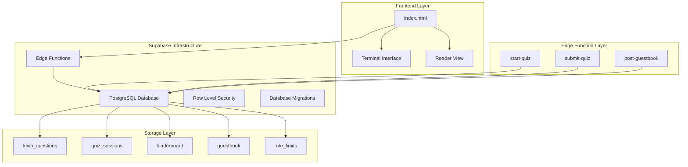
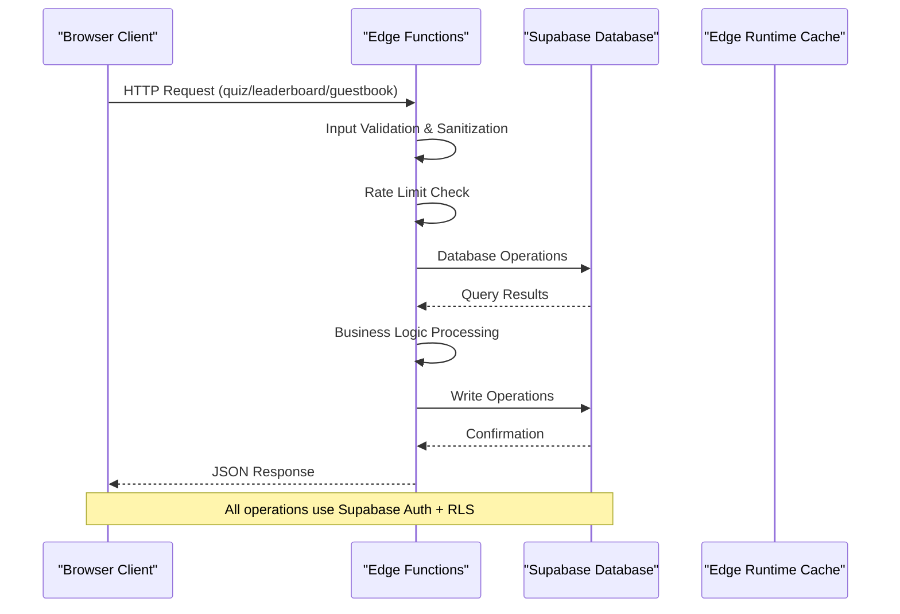
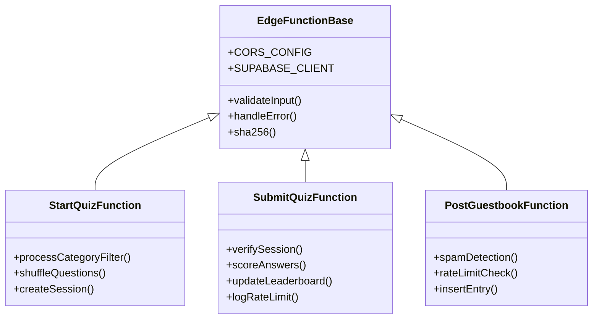
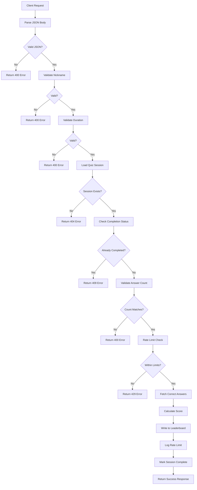
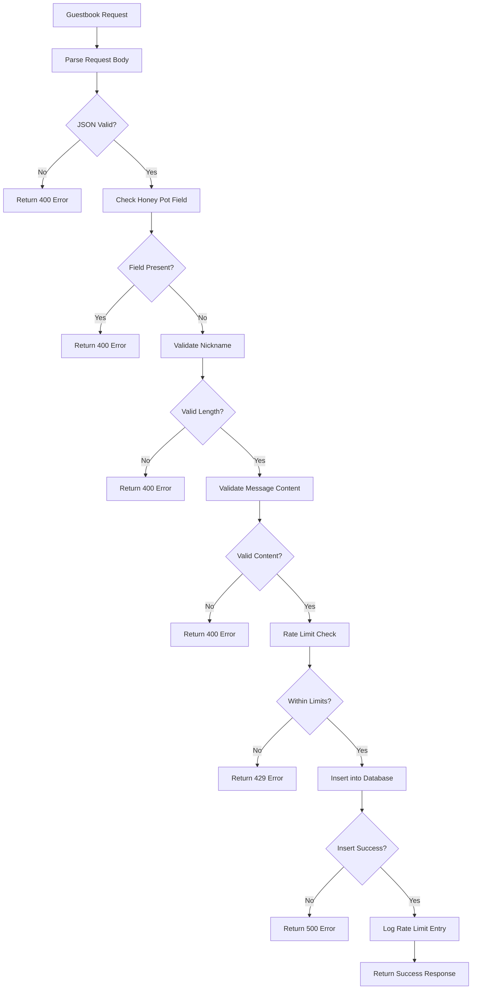
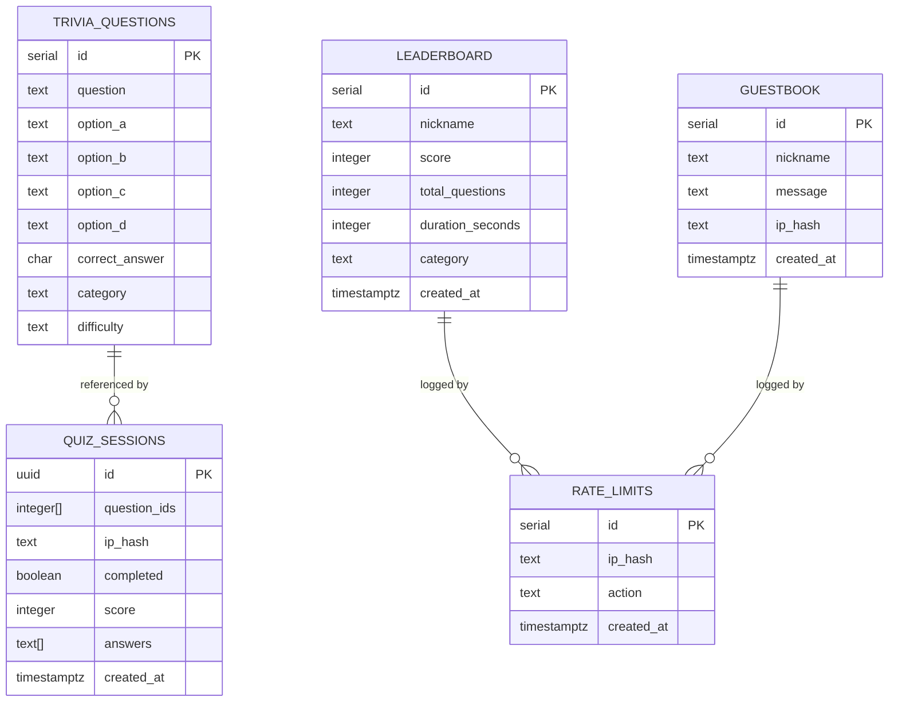
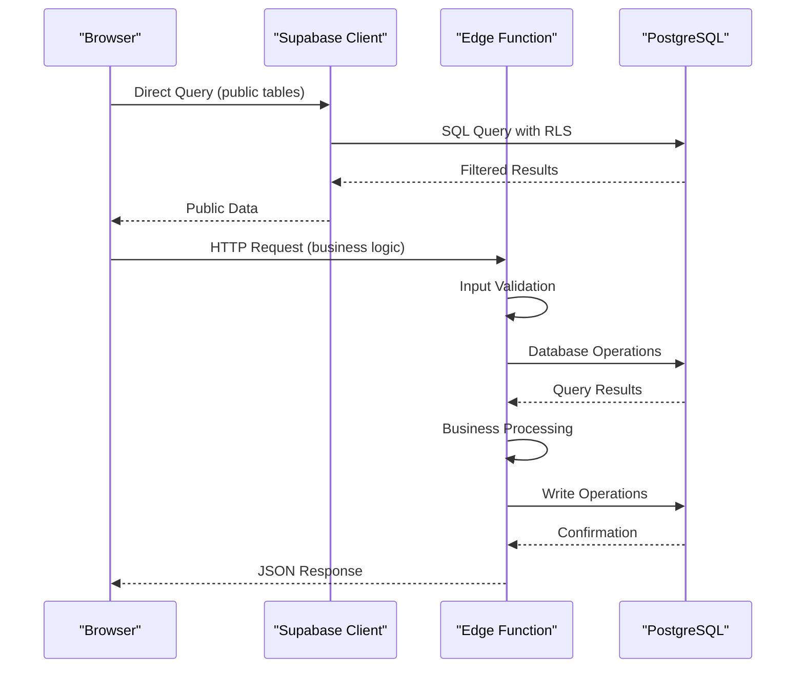

# Backend Infrastructure

<cite>
**Referenced Files in This Document**
- [index.html](file://index.html)
- [post-guestbook/index.ts](file://supabase/functions/post-guestbook/index.ts)
- [start-quiz/index.ts](file://supabase/functions/start-quiz/index.ts)
- [submit-quiz/index.ts](file://supabase/functions/submit-quiz/index.ts)
- [init.sql](file://supabase/migrations/20240101000000_init.sql)
- [seed_questions.sql](file://supabase/migrations/20240101000001_seed_questions.sql)
</cite>

## Table of Contents
1. [Introduction](#introduction)
2. [Project Structure](#project-structure)
3. [Core Components](#core-components)
4. [Architecture Overview](#architecture-overview)
5. [Detailed Component Analysis](#detailed-component-analysis)
6. [Database Schema Design](#database-schema-design)
7. [Edge Function Implementation Patterns](#edge-function-implementation-patterns)
8. [Security Model](#security-model)
9. [Data Flow Architecture](#data-flow-architecture)
10. [Performance Considerations](#performance-considerations)
11. [Scalability Analysis](#scalability-analysis)
12. [Deployment Procedures](#deployment-procedures)
13. [Monitoring and Maintenance](#monitoring-and-maintenance)
14. [Troubleshooting Guide](#troubleshooting-guide)
15. [Conclusion](#conclusion)

## Introduction

This document provides comprehensive architectural documentation for a Supabase-based serverless backend infrastructure. The system combines Supabase's managed Postgres database with Edge Functions (built on Deno) to deliver a modern, scalable backend solution for interactive portfolio features including a trivia quiz, guestbook, and leaderboard functionality.

The architecture follows serverless principles with automatic scaling, built-in security through Row Level Security (RLS), and efficient edge computing for business logic processing. The system demonstrates best practices for modern backend development including input validation, rate limiting, and secure API design.

## Project Structure

The project follows a clear separation of concerns with Supabase-specific components organized in dedicated directories:

**Diagram sources**
- [index.html:514-520](file://index.html#L514-L520)
- [init.sql:4-54](file://supabase/migrations/20240101000000_init.sql#L4-L54)

**Section sources**
- [index.html:1-50](file://index.html#L1-L50)
- [init.sql:1-10](file://supabase/migrations/20240101000000_init.sql#L1-L10)

## Core Components

The backend infrastructure consists of four primary components working together:

### Frontend Integration Layer
The main HTML file serves as the client interface that communicates with Supabase services through both direct database queries and Edge Function invocations. It implements a dual-view system (terminal and reader modes) while maintaining consistent data access patterns.

### Edge Function Services
Three specialized Edge Functions handle business logic:
- **start-quiz**: Creates quiz sessions and manages question distribution
- **submit-quiz**: Processes quiz submissions, performs scoring, and updates leaderboards
- **post-guestbook**: Handles guestbook entries with spam protection and rate limiting

### Database Schema
A normalized relational schema supporting all interactive features with appropriate constraints and indexing strategies for optimal performance.

### Security Framework
Integrated Row Level Security policies combined with input validation and rate limiting provide comprehensive protection against abuse and unauthorized access.

**Section sources**
- [index.html:530-544](file://index.html#L530-L544)
- [post-guestbook/index.ts:17-82](file://supabase/functions/post-guestbook/index.ts#L17-L82)
- [start-quiz/index.ts:15-66](file://supabase/functions/start-quiz/index.ts#L15-L66)
- [submit-quiz/index.ts:18-113](file://supabase/functions/submit-quiz/index.ts#L18-L113)

## Architecture Overview

The system implements a hybrid architecture combining client-side rendering with serverless backend services:

**Diagram sources**
- [index.html:538-544](file://index.html#L538-L544)
- [post-guestbook/index.ts:17-82](file://supabase/functions/post-guestbook/index.ts#L17-L82)
- [start-quiz/index.ts:15-66](file://supabase/functions/start-quiz/index.ts#L15-L66)
- [submit-quiz/index.ts:18-113](file://supabase/functions/submit-quiz/index.ts#L18-L113)

The architecture leverages Supabase's managed infrastructure while maintaining full control over business logic through Edge Functions. This approach provides the benefits of serverless scaling with the flexibility of custom business logic.

## Detailed Component Analysis

### Edge Function Implementation Patterns

#### Shared Infrastructure Pattern
All Edge Functions share common infrastructure including CORS configuration, environment variable access, and standardized error handling:

**Diagram sources**
- [post-guestbook/index.ts:7-10](file://supabase/functions/post-guestbook/index.ts#L7-L10)
- [start-quiz/index.ts:10-13](file://supabase/functions/start-quiz/index.ts#L10-L13)
- [submit-quiz/index.ts:10-13](file://supabase/functions/submit-quiz/index.ts#L10-L13)

#### Input Validation Strategies
Each function implements layered validation:

1. **Basic Request Validation**: JSON parsing and required field checking
2. **Format Validation**: Regular expressions for structured data
3. **Content Validation**: Spam detection and length restrictions
4. **Business Logic Validation**: Session verification and constraint checking

**Section sources**
- [post-guestbook/index.ts:25-49](file://supabase/functions/post-guestbook/index.ts#L25-L49)
- [submit-quiz/index.ts:26-57](file://supabase/functions/submit-quiz/index.ts#L26-L57)
- [start-quiz/index.ts:23-43](file://supabase/functions/start-quiz/index.ts#L23-L43)

### Data Flow Architecture

#### Quiz Submission Workflow
The quiz submission process demonstrates complex data flow with multiple validation stages:

**Diagram sources**
- [submit-quiz/index.ts:18-113](file://supabase/functions/submit-quiz/index.ts#L18-L113)

#### Guestbook Entry Processing
The guestbook system implements comprehensive spam protection and rate limiting:

**Diagram sources**
- [post-guestbook/index.ts:17-82](file://supabase/functions/post-guestbook/index.ts#L17-L82)

**Section sources**
- [submit-quiz/index.ts:44-109](file://supabase/functions/submit-quiz/index.ts#L44-L109)
- [post-guestbook/index.ts:30-77](file://supabase/functions/post-guestbook/index.ts#L30-L77)

## Database Schema Design

### Entity Relationship Model

The database schema implements a normalized design optimized for the interactive features:

**Diagram sources**
- [init.sql:4-54](file://supabase/migrations/20240101000000_init.sql#L4-L54)

### Table Relationships and Constraints

#### Primary Keys and Identity
- **trivia_questions**: Auto-incrementing serial primary key
- **quiz_sessions**: UUID primary key with generated default
- **leaderboard**: Auto-incrementing serial primary key
- **guestbook**: Auto-incrementing serial primary key
- **rate_limits**: Auto-incrementing serial primary key

#### Foreign Key Relationships
The schema maintains referential integrity through explicit foreign key constraints:
- `quiz_sessions.question_ids` references `trivia_questions.id` (array of integers)
- `leaderboard` and `guestbook` tables have no foreign keys, maintaining independence

#### Data Integrity Constraints
- **Correct Answer Validation**: `correct_answer` constrained to ('a','b','c','d')
- **Difficulty Levels**: `difficulty` constrained to ('easy','medium','hard')
- **Category Defaults**: All tables have sensible default values
- **Timestamp Precision**: All timestamps use `TIMESTAMPTZ` for timezone consistency

### Indexing Strategy

The indexing strategy optimizes for the most common query patterns:

#### Primary Indexes
- **idx_rate_limits_lookup**: Composite index on `(ip_hash, action, created_at)` for rate limiting queries
- **idx_leaderboard_ranking**: Composite index on `(score DESC, duration_seconds ASC)` for leaderboard sorting
- **idx_guestbook_recent**: Index on `(created_at DESC)` for recent entries display

#### Performance Considerations
- **Rate Limiting**: Efficient hourly/daily rate limit checks using composite indexing
- **Leaderboard Queries**: Optimized ranking queries with multi-column sorting
- **Recent Activity**: Fast retrieval of recent guestbook entries and quiz sessions

**Section sources**
- [init.sql:56-66](file://supabase/migrations/20240101000000_init.sql#L56-L66)
- [init.sql:12-14](file://supabase/migrations/20240101000000_init.sql#L12-L14)

## Edge Function Implementation Patterns

### Common Infrastructure Components

#### Environment Configuration
All Edge Functions access Supabase credentials through environment variables:
- `SUPABASE_URL`: Database connection endpoint
- `SUPABASE_SERVICE_ROLE_KEY`: Service role authentication

#### CORS Management
Standardized Cross-Origin Resource Sharing configuration allows flexible client integration:
- Wildcard origin for development
- Specific headers for Supabase authentication
- Preflight request handling for complex requests

#### Cryptographic Utilities
Shared SHA-256 hashing implementation for IP address anonymization:
- Consistent hashing across all functions
- Secure anonymization of user identifiers
- Efficient rate limiting using hashed IPs

### Function-Specific Patterns

#### Quiz Session Management
The `start-quiz` function implements sophisticated session creation:
- Dynamic category filtering with optional parameters
- Randomized question selection with oversampling
- IP-based session isolation through hashing
- Comprehensive error handling for database operations

#### Submission Processing
The `submit-quiz` function coordinates multiple operations:
- Session validation and completion status checking
- Real-time answer verification against stored correct answers
- Multi-dimensional scoring with category determination
- Leaderboard insertion with performance metrics

#### Content Moderation
The `post-guestbook` function implements comprehensive spam protection:
- Regex-based spam detection for common patterns
- URL link counting to prevent link spam
- Honey pot field detection for automated submissions
- Rate limiting with configurable thresholds

**Section sources**
- [post-guestbook/index.ts:4-23](file://supabase/functions/post-guestbook/index.ts#L4-L23)
- [start-quiz/index.ts:7-21](file://supabase/functions/start-quiz/index.ts#L7-L21)
- [submit-quiz/index.ts:7-24](file://supabase/functions/submit-quiz/index.ts#L7-L24)

## Security Model

### Row Level Security (RLS) Implementation

The security model leverages Supabase's built-in RLS capabilities:

#### Public Access Policies
- **trivia_questions**: Full public read access for question browsing
- **leaderboard**: Public read access for score display
- **guestbook**: Public read access for message display

#### Restricted Access Policies
- **quiz_sessions**: Service role only access for session management
- **rate_limits**: Service role only access for rate limiting operations

#### Policy Enforcement
RLS policies are enforced automatically by the Supabase client library, ensuring that:
- Client-side queries respect user permissions
- Service role functions bypass user-level restrictions
- Data isolation between different user contexts

### Input Validation and Sanitization

#### Client-Side Validation
The frontend implements immediate feedback for user input:
- Real-time nickname validation (3-20 characters, alphanumeric, spaces, underscores, hyphens)
- Message length validation (2-300 characters)
- Quiz answer format validation (a/b/c/d only)

#### Server-Side Validation
Edge Functions implement comprehensive server-side validation:
- JSON request parsing with error handling
- Regular expression-based content filtering
- Spam detection using multiple criteria
- Rate limiting enforcement with database-backed counters

### Authentication and Authorization

#### Supabase Authentication
The system integrates with Supabase's authentication system:
- Anonymous user access for public features
- Service role authentication for privileged operations
- JWT token handling for authorized requests

#### Edge Function Security
Edge Functions operate with elevated privileges:
- Service role access to database operations
- Environment variable isolation for secrets
- Request header validation for IP tracking

**Section sources**
- [init.sql:61-86](file://supabase/migrations/20240101000000_init.sql#L61-L86)
- [index.html:530-536](file://index.html#L530-L536)

## Data Flow Architecture

### Frontend-to-Backend Communication

The frontend communicates with backend services through two primary channels:

#### Direct Database Access
Publicly accessible tables (`leaderboard`, `guestbook`) are queried directly:
- Supabase client initialization with anonymous key
- Standard SQL queries with ordering and limits
- Automatic RLS enforcement

#### Edge Function Invocation
Business logic operations use RESTful Edge Function endpoints:
- HTTP POST requests to `/functions/v1/{function-name}`
- JSON payload containing operation parameters
- Standardized response format with error handling

### Request Processing Pipeline

**Diagram sources**
- [index.html:538-544](file://index.html#L538-L544)
- [post-guestbook/index.ts:17-82](file://supabase/functions/post-guestbook/index.ts#L17-L82)

### Error Handling and Retry Strategies

#### Client-Side Error Handling
The frontend implements robust error handling:
- Graceful degradation for offline scenarios
- User-friendly error messages with actionable guidance
- Automatic retry mechanisms for transient failures
- Loading states and progress indicators

#### Server-Side Error Management
Edge Functions implement comprehensive error handling:
- Structured error responses with appropriate HTTP status codes
- Detailed error logging for debugging and monitoring
- Graceful fallbacks for database connectivity issues
- Idempotent operations where possible

**Section sources**
- [index.html:841-843](file://index.html#L841-L843)
- [submit-quiz/index.ts:57-61](file://supabase/functions/submit-quiz/index.ts#L57-L61)

## Performance Considerations

### Database Optimization

#### Query Performance
- **Index Utilization**: Strategic indexing for common query patterns
- **Query Planning**: Efficient use of WHERE clauses and LIMIT statements
- **Join Optimization**: Minimal joins for read-heavy operations
- **Pagination**: Implemented for large dataset retrieval

#### Connection Management
- **Connection Pooling**: Supabase-managed connection pooling
- **Query Timeout**: Reasonable timeouts for responsive user experience
- **Batch Operations**: Minimized round trips through batch queries

### Edge Function Performance

#### Cold Start Mitigation
- **Function Reuse**: Long-lived Edge Function instances
- **Initialization Optimization**: Efficient module loading
- **Resource Management**: Proper cleanup of external resources

#### Memory and CPU Efficiency
- **Streaming Responses**: Large responses handled efficiently
- **Compression**: Automatic compression for JSON responses
- **Caching**: Edge runtime caching for frequently accessed data

### Network Optimization

#### CDN Integration
- **Static Assets**: External CDN for JavaScript libraries
- **Edge Locations**: Global edge locations for reduced latency
- **Compression**: Transparent compression for all responses

**Section sources**
- [init.sql:56-58](file://supabase/migrations/20240101000000_init.sql#L56-L58)

## Scalability Analysis

### Horizontal Scaling

#### Database Scaling
- **Automatic Scaling**: Supabase provides automatic database scaling
- **Read Replicas**: Built-in read replica support for high availability
- **Connection Limits**: Configurable connection limits based on workload

#### Edge Function Scaling
- **Automatic Provisioning**: Edge Functions scale automatically with demand
- **Concurrency Limits**: Configurable concurrency for resource management
- **Regional Deployment**: Edge Functions deployed globally for low latency

### Load Distribution

#### Traffic Shaping
- **Rate Limiting**: Prevents abuse and ensures fair resource allocation
- **Queue Management**: Natural queuing through database constraints
- **Graceful Degradation**: Maintains basic functionality under load

#### Resource Allocation
- **CPU Resources**: Dynamic CPU allocation based on function complexity
- **Memory Resources**: Sufficient memory for concurrent function execution
- **Storage**: Managed storage with automatic backup and recovery

### Monitoring and Metrics

#### Built-in Monitoring
- **Database Metrics**: Query performance, connection usage, storage metrics
- **Edge Function Metrics**: Execution time, error rates, cold start frequency
- **Application Metrics**: User engagement, feature adoption, error rates

**Section sources**
- [post-guestbook/index.ts:15-15](file://supabase/functions/post-guestbook/index.ts#L15-L15)
- [submit-quiz/index.ts:16-16](file://supabase/functions/submit-quiz/index.ts#L16-L16)

## Deployment Procedures

### Database Migration Process

#### Initial Setup
1. **Schema Creation**: Execute the initialization script to create all tables
2. **Seed Data**: Load the trivia question database
3. **Policy Application**: Enable Row Level Security on all tables
4. **Index Creation**: Apply all database indexes for optimal performance

#### Migration Strategy
- **Atomic Operations**: All schema changes are atomic transactions
- **Backward Compatibility**: New features designed to coexist with existing data
- **Rollback Capability**: Migration scripts designed for easy rollback

### Edge Function Deployment

#### Function Packaging
- **Source Organization**: Each function in separate directory
- **Dependency Management**: Minimal external dependencies
- **Environment Configuration**: Clear environment variable requirements

#### Deployment Process
1. **Build Verification**: Local testing of all functions
2. **Environment Setup**: Configure production environment variables
3. **Deployment**: Deploy functions using Supabase CLI
4. **Validation**: Test all endpoints with comprehensive test suite

### Environment Configuration

#### Production Settings
- **Database URL**: Secure connection to production database
- **Service Role Key**: High-privilege key for Edge Function operations
- **CORS Configuration**: Production-ready CORS settings
- **Rate Limit Thresholds**: Appropriate limits for production traffic

**Section sources**
- [init.sql:1-3](file://supabase/migrations/20240101000000_init.sql#L1-L3)
- [seed_questions.sql:1-3](file://supabase/migrations/20240101000001_seed_questions.sql#L1-L3)

## Monitoring and Maintenance

### Operational Monitoring

#### Database Health
- **Query Performance**: Monitor slow queries and optimize accordingly
- **Connection Usage**: Track connection pool utilization
- **Storage Growth**: Monitor database size and growth trends
- **Backup Verification**: Regular backup verification and restore testing

#### Edge Function Monitoring
- **Execution Metrics**: Track function execution time and error rates
- **Resource Usage**: Monitor CPU and memory utilization
- **Cold Start Frequency**: Optimize function startup performance
- **External Dependencies**: Monitor third-party service availability

### Maintenance Procedures

#### Routine Maintenance
- **Database Vacuuming**: Regular maintenance for optimal performance
- **Index Rebuild**: Periodic index optimization
- **Function Updates**: Regular security updates and bug fixes
- **Data Archiving**: Automated archiving of old records

#### Incident Response
- **Alerting System**: Configured alerts for critical issues
- **Response Procedures**: Defined escalation procedures
- **Post-Incident Review**: Analysis of incidents and improvement actions
- **Communication Plan**: Stakeholder communication during incidents

### Backup and Recovery

#### Data Protection
- **Automated Backups**: Daily automated backups with retention policy
- **Point-in-Time Recovery**: Continuous archiving for granular recovery
- **Cross-Region Replication**: Geographic redundancy for disaster recovery
- **Test Restoration**: Regular testing of backup restoration procedures

**Section sources**
- [index.html:514-520](file://index.html#L514-L520)

## Troubleshooting Guide

### Common Issues and Solutions

#### Database Connectivity Problems
- **Symptoms**: Functions failing with database errors
- **Causes**: Network issues, connection limits exceeded
- **Solutions**: Check database status, review connection logs, adjust limits

#### Edge Function Failures
- **Symptoms**: HTTP 500 errors from Edge Functions
- **Causes**: Code errors, missing environment variables, resource limits
- **Solutions**: Review function logs, validate environment configuration, optimize code

#### Performance Issues
- **Symptoms**: Slow response times, timeout errors
- **Causes**: Inefficient queries, insufficient indexing, high traffic
- **Solutions**: Analyze query performance, add appropriate indexes, implement caching

### Debugging Techniques

#### Logging and Diagnostics
- **Structured Logging**: Consistent logging format across all functions
- **Error Tracking**: Centralized error tracking and alerting
- **Performance Profiling**: Regular performance profiling and optimization
- **User Impact Analysis**: Understanding impact of issues on end users

#### Testing Strategies
- **Unit Testing**: Individual function testing with comprehensive coverage
- **Integration Testing**: End-to-end testing of complete workflows
- **Load Testing**: Performance testing under expected and peak loads
- **Regression Testing**: Automated testing to prevent feature regressions

**Section sources**
- [post-guestbook/index.ts:84-87](file://supabase/functions/post-guestbook/index.ts#L84-L87)
- [submit-quiz/index.ts:116-120](file://supabase/functions/submit-quiz/index.ts#L116-L120)

## Conclusion

The Supabase-based serverless architecture demonstrates a modern approach to backend development that balances simplicity with powerful capabilities. The system successfully combines managed infrastructure with custom business logic through Edge Functions, providing:

### Key Strengths
- **Developer Experience**: Minimal operational overhead with managed infrastructure
- **Scalability**: Automatic scaling with predictable performance characteristics
- **Security**: Built-in security features with comprehensive access controls
- **Cost Effectiveness**: Pay-as-you-go pricing with minimal maintenance costs

### Architectural Benefits
- **Separation of Concerns**: Clear division between frontend, Edge Functions, and database
- **Resilience**: Built-in fault tolerance and automatic recovery mechanisms
- **Observability**: Comprehensive monitoring and logging capabilities
- **Maintainability**: Clean code organization with clear responsibilities

### Future Considerations
- **Advanced Analytics**: Integration with analytics platforms for usage insights
- **Enhanced Security**: Additional security measures for sensitive operations
- **Performance Optimization**: Continued optimization based on usage patterns
- **Feature Expansion**: Scalable architecture for adding new interactive features

This architecture serves as an excellent foundation for interactive web applications requiring real-time data access, user-generated content moderation, and scalable backend services with minimal operational complexity.