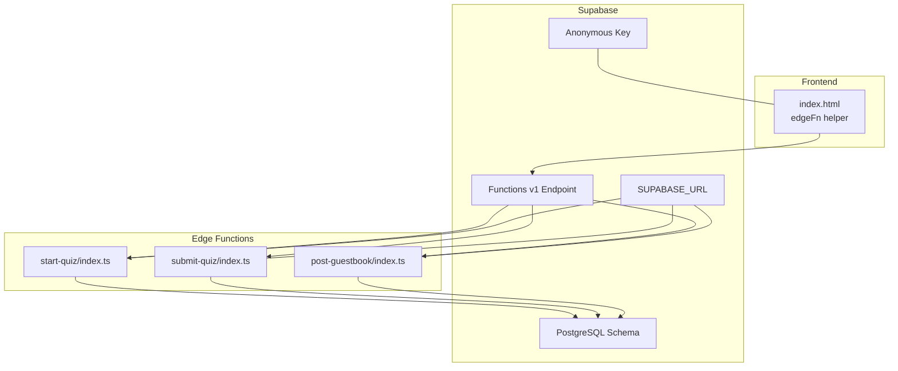
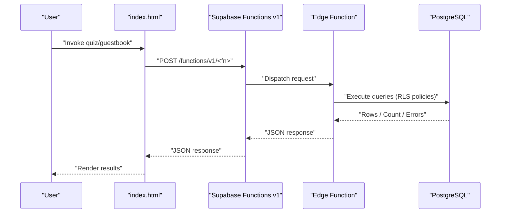
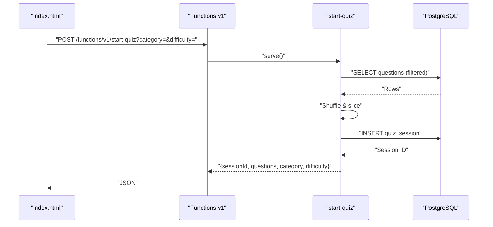
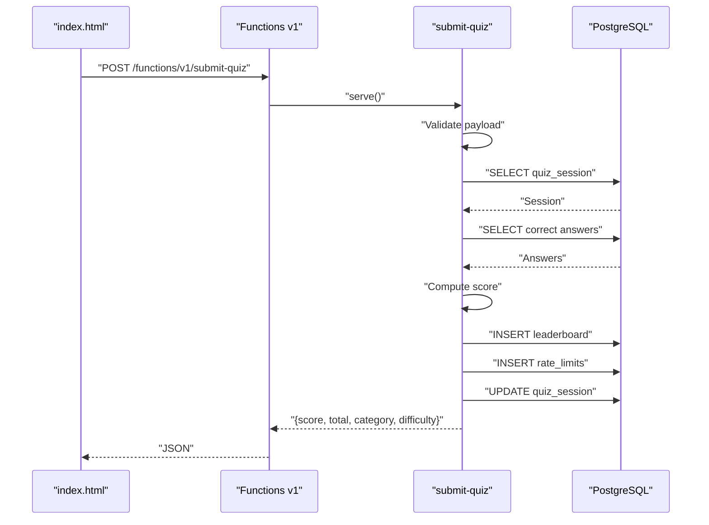
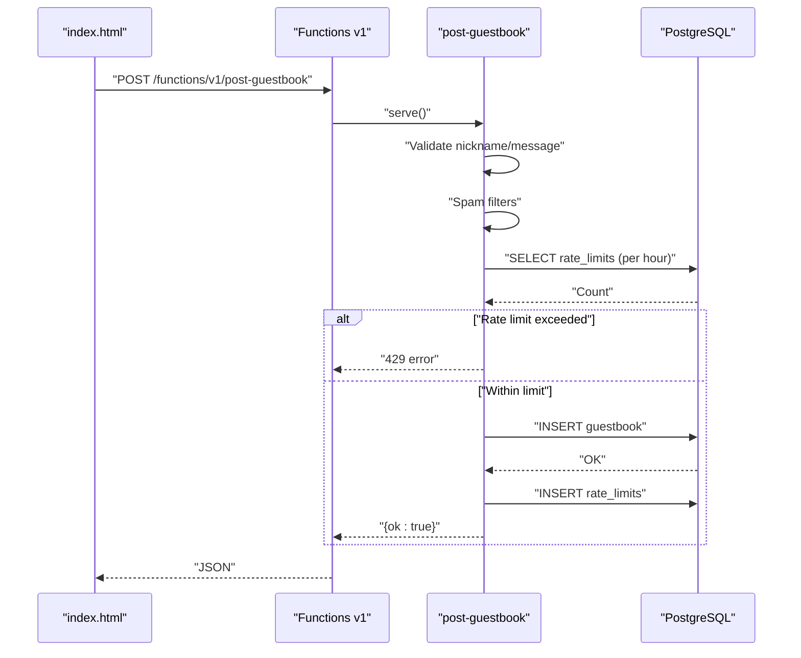
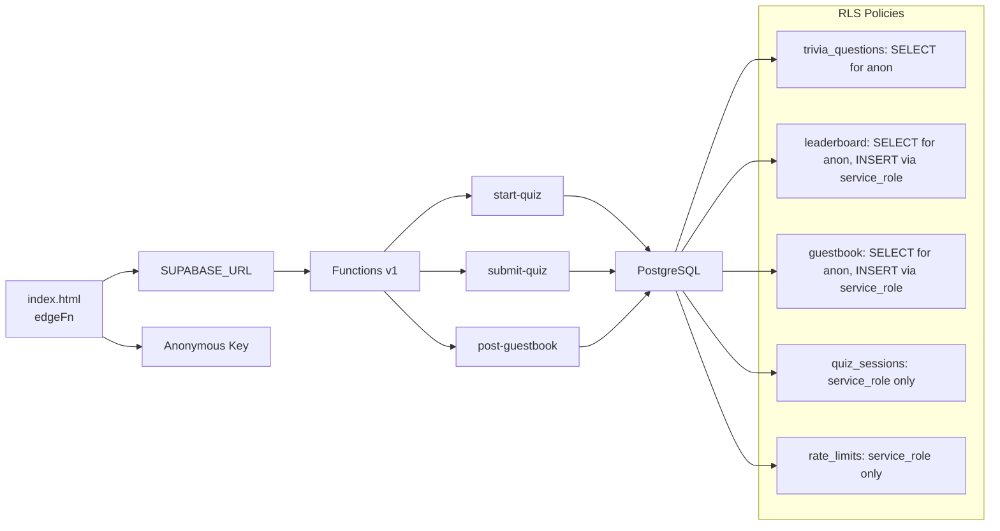
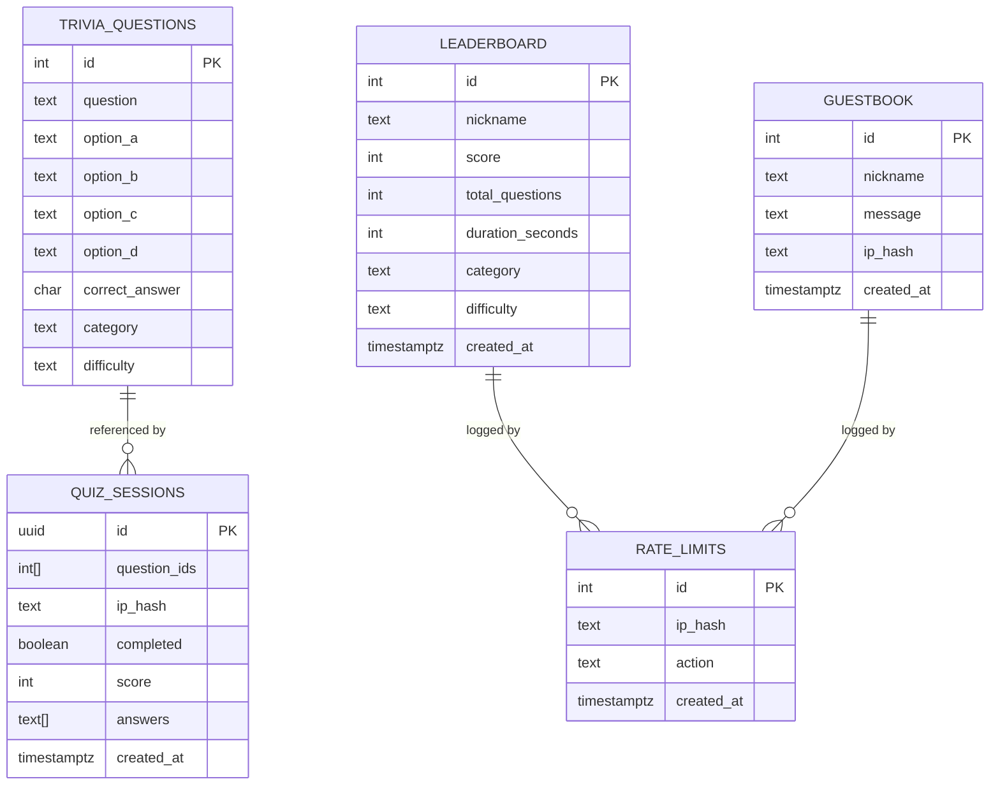

# Edge Functions

<cite>
**Referenced Files in This Document**
- [index.html](file://index.html)
- [start-quiz/index.ts](file://supabase/functions/start-quiz/index.ts)
- [submit-quiz/index.ts](file://supabase/functions/submit-quiz/index.ts)
- [post-guestbook/index.ts](file://supabase/functions/post-guestbook/index.ts)
- [init.sql](file://supabase/migrations/20240101000000_init.sql)
- [seed_questions.sql](file://supabase/migrations/20240101000001_seed_questions.sql)
- [add_difficulty.sql](file://supabase/migrations/20240101000002_add_difficulty.sql)
</cite>

## Table of Contents
1. [Introduction](#introduction)
2. [Project Structure](#project-structure)
3. [Core Components](#core-components)
4. [Architecture Overview](#architecture-overview)
5. [Detailed Component Analysis](#detailed-component-analysis)
6. [Dependency Analysis](#dependency-analysis)
7. [Performance Considerations](#performance-considerations)
8. [Troubleshooting Guide](#troubleshooting-guide)
9. [Conclusion](#conclusion)
10. [Appendices](#appendices)

## Introduction
This document describes the Supabase Edge Functions architecture powering interactive features in the portfolio site. It focuses on three Edge Functions:
- start-quiz: initializes a quiz session and returns randomized questions without exposing correct answers.
- submit-quiz: validates answers server-side, computes a score, enforces rate limits, and writes to the leaderboard.
- post-guestbook: validates and rate-limits guestbook posts, filters spam, and persists entries.

Each function is implemented in TypeScript, runs on the Deno runtime, and interacts with Supabase Postgres via the Supabase client. The frontend invokes these functions via a helper that targets the Supabase Functions v1 endpoint using the project’s Supabase URL and anonymous key.

## Project Structure
The Edge Functions live under supabase/functions/<function-name>/index.ts. The Supabase schema is defined in supabase/migrations/*.sql, including tables for trivia questions, quiz sessions, leaderboard, guestbook, and a shared rate limits log. The frontend helper for invoking Edge Functions is located in index.html.

**Diagram sources**
- [index.html](file://index.html)
- [start-quiz/index.ts](file://supabase/functions/start-quiz/index.ts)
- [submit-quiz/index.ts](file://supabase/functions/submit-quiz/index.ts)
- [post-guestbook/index.ts](file://supabase/functions/post-guestbook/index.ts)
- [init.sql](file://supabase/migrations/20240101000000_init.sql)

**Section sources**
- [index.html](file://index.html)
- [start-quiz/index.ts](file://supabase/functions/start-quiz/index.ts)
- [submit-quiz/index.ts](file://supabase/functions/submit-quiz/index.ts)
- [post-guestbook/index.ts](file://supabase/functions/post-guestbook/index.ts)
- [init.sql](file://supabase/migrations/20240101000000_init.sql)

## Core Components
- start-quiz: Creates a quiz session, selects randomized questions filtered by optional category and difficulty, hashes the client IP for session attribution, inserts a record into quiz_sessions, and returns the session identifier and questions to the client.
- submit-quiz: Validates incoming payload, performs anti-spam checks, rate-limit enforcement, loads correct answers, computes score, writes to leaderboard, logs rate limit, marks session complete, and returns scoring results.
- post-guestbook: Validates nickname and message, applies spam filters, rate-limits posts per IP per hour, inserts into guestbook, logs rate limit, and returns success.

All functions:
- Enable CORS for preflight and responses.
- Use Supabase client initialized with SUPABASE_URL and SUPABASE_SERVICE_ROLE_KEY.
- Compute SHA-256 hashes of client IPs for privacy-preserving rate limiting and session attribution.
- Return JSON responses with appropriate HTTP status codes.

**Section sources**
- [start-quiz/index.ts](file://supabase/functions/start-quiz/index.ts)
- [submit-quiz/index.ts](file://supabase/functions/submit-quiz/index.ts)
- [post-guestbook/index.ts](file://supabase/functions/post-guestbook/index.ts)

## Architecture Overview
The frontend invokes Edge Functions via a helper that constructs the Functions v1 URL using the Supabase project URL and passes the anonymous key in the Authorization header. Edge Functions connect to Supabase Postgres using the service role key and perform database operations while enforcing validation and rate limits.

**Diagram sources**
- [index.html](file://index.html)
- [start-quiz/index.ts](file://supabase/functions/start-quiz/index.ts)
- [submit-quiz/index.ts](file://supabase/functions/submit-quiz/index.ts)
- [post-guestbook/index.ts](file://supabase/functions/post-guestbook/index.ts)
- [init.sql](file://supabase/migrations/20240101000000_init.sql)

## Detailed Component Analysis

### start-quiz
- Endpoint: POST /functions/v1/start-quiz
- Query parameters:
  - category: optional; filters questions by category.
  - difficulty: optional; filters questions by difficulty.
- Request: None (uses query parameters).
- Response:
  - sessionId: UUID string identifying the quiz session.
  - questions: array of question objects (correct answers excluded).
  - category/difficulty: original filters or defaults.
- Validation:
  - Uses Supabase client with service role credentials.
  - Applies RLS policy allowing public select on trivia_questions.
- Error handling:
  - Returns 500 with JSON error if question retrieval fails.
- Processing workflow:
  - Build query with optional filters and fetch extra rows to randomize.
  - Shuffle and slice to fixed count, extract question IDs.
  - Hash client IP and insert quiz session with question IDs and IP hash.
  - Return session metadata and questions.

**Diagram sources**
- [start-quiz/index.ts](file://supabase/functions/start-quiz/index.ts)
- [init.sql](file://supabase/migrations/20240101000000_init.sql)

**Section sources**
- [start-quiz/index.ts](file://supabase/functions/start-quiz/index.ts)
- [init.sql](file://supabase/migrations/20240101000000_init.sql)

### submit-quiz
- Endpoint: POST /functions/v1/submit-quiz
- Request body:
  - sessionId: UUID string from start-quiz.
  - answers: array of answer identifiers matching question order.
  - nickname: validated string.
  - duration: number in seconds.
  - honeypot: optional; if present, submission is rejected.
- Response:
  - score: integer correct answers.
  - total: total questions.
  - category: single category or mixed.
  - difficulty: single difficulty or mixed.
- Validation and rate limiting:
  - Validates nickname against a strict pattern.
  - Validates duration range.
  - Checks session existence and completion status.
  - Enforces 20 submissions per day per hashed IP.
  - Anti-spam via honeypot field.
- Processing workflow:
  - Load session and question IDs.
  - Fetch correct answers for session questions.
  - Compute score and derive category/difficulty labels.
  - Insert leaderboard entry and log rate limit.
  - Mark session as completed with score and answers.

**Diagram sources**
- [submit-quiz/index.ts](file://supabase/functions/submit-quiz/index.ts)
- [init.sql](file://supabase/migrations/20240101000000_init.sql)
- [add_difficulty.sql](file://supabase/migrations/20240101000002_add_difficulty.sql)

**Section sources**
- [submit-quiz/index.ts](file://supabase/functions/submit-quiz/index.ts)
- [init.sql](file://supabase/migrations/20240101000000_init.sql)
- [add_difficulty.sql](file://supabase/migrations/20240101000002_add_difficulty.sql)

### post-guestbook
- Endpoint: POST /functions/v1/post-guestbook
- Request body:
  - nickname: validated string.
  - message: non-empty trimmed string.
  - honeypot: optional; if present, submission is rejected.
- Response:
  - ok: boolean true on success.
- Validation and rate limiting:
  - Validates nickname pattern and length.
  - Enforces minimum and maximum message length.
  - Limits URLs to two or fewer.
  - Filters spam keywords.
  - Enforces 5 posts per hour per hashed IP.
- Processing workflow:
  - Apply spam checks and rate limit.
  - Insert guestbook entry with nickname, trimmed message, and IP hash.
  - Log rate limit entry.
  - Return success.

**Diagram sources**
- [post-guestbook/index.ts](file://supabase/functions/post-guestbook/index.ts)
- [init.sql](file://supabase/migrations/20240101000000_init.sql)

**Section sources**
- [post-guestbook/index.ts](file://supabase/functions/post-guestbook/index.ts)
- [init.sql](file://supabase/migrations/20240101000000_init.sql)

## Dependency Analysis
- Frontend-to-Function:
  - The helper constructs the Functions v1 URL from the Supabase project URL and appends the function name. It sets Content-Type and Authorization headers using the anonymous key.
- Function-to-Database:
  - Each function uses the Supabase client initialized with SUPABASE_URL and SUPABASE_SERVICE_ROLE_KEY to perform reads/writes.
  - Supabase Row Level Security (RLS) policies define access controls:
    - trivia_questions: public select (correct_answer excluded by design).
    - leaderboard: public select; inserts via service role.
    - guestbook: public select; inserts via service role.
    - quiz_sessions and rate_limits: service role only.
- Database Schema:
  - Tables: trivia_questions, quiz_sessions, leaderboard, guestbook, rate_limits.
  - Indexes: composite indexes for rate limits, leaderboard ranking, and recent guestbook.
  - Additional difficulty column added to leaderboard with supporting index.

**Diagram sources**
- [index.html](file://index.html)
- [start-quiz/index.ts](file://supabase/functions/start-quiz/index.ts)
- [submit-quiz/index.ts](file://supabase/functions/submit-quiz/index.ts)
- [post-guestbook/index.ts](file://supabase/functions/post-guestbook/index.ts)
- [init.sql](file://supabase/migrations/20240101000000_init.sql)

**Section sources**
- [index.html](file://index.html)
- [init.sql](file://supabase/migrations/20240101000000_init.sql)
- [seed_questions.sql](file://supabase/migrations/20240101000001_seed_questions.sql)
- [add_difficulty.sql](file://supabase/migrations/20240101000002_add_difficulty.sql)

## Performance Considerations
- Cold starts:
  - Edge Functions run on the Deno runtime; expect initial latency on first request. Keep functions small and avoid heavy initialization.
- Network and DB:
  - Minimize round-trips by batching reads/writes where possible. The functions already batch operations efficiently.
- Rate limiting:
  - Rate limit queries use indexed lookups on ip_hash and action with time bounds, reducing DB load.
- Caching:
  - Consider caching frequently accessed question categories or popular filters at the application level if traffic warrants it.
- Monitoring:
  - Use Supabase Dashboard metrics and logs for function invocations and DB performance.
  - Track latency and error rates for each function endpoint.

[No sources needed since this section provides general guidance]

## Troubleshooting Guide
Common deployment and runtime issues:
- Environment variables missing:
  - Ensure SUPABASE_URL and SUPABASE_SERVICE_ROLE_KEY are set in the Supabase project settings. Functions depend on these to connect to Postgres.
- CORS errors:
  - All functions return Access-Control-Allow-Origin and Access-Control-Allow-Headers headers. Verify the frontend Authorization header and Content-Type are set when calling the Functions v1 endpoint.
- Rate limit exceeded:
  - For submit-quiz: 20 per day per IP; for post-guestbook: 5 per hour per IP. Exceeding these thresholds returns 429.
- Session not found or already submitted:
  - submit-quiz requires a valid, uncompleted session ID. Ensure the session was created by start-quiz and has not been marked completed.
- Spam or invalid input:
  - post-guestbook rejects messages with too many URLs, spam keywords, or invalid lengths. submit-quiz rejects invalid durations or nicknames.
- Database connectivity:
  - Verify RLS policies and indexes exist. The migrations define required tables, indexes, and policies.

**Section sources**
- [start-quiz/index.ts](file://supabase/functions/start-quiz/index.ts)
- [submit-quiz/index.ts](file://supabase/functions/submit-quiz/index.ts)
- [post-guestbook/index.ts](file://supabase/functions/post-guestbook/index.ts)
- [init.sql](file://supabase/migrations/20240101000000_init.sql)

## Conclusion
The Edge Functions architecture cleanly separates frontend UX from backend data processing and validation. By leveraging Supabase’s managed Edge Functions, RLS, and Postgres, the system ensures secure, scalable, and maintainable features for quizzes and guestbook interactions. Proper configuration of environment variables, adherence to validation and rate-limiting logic, and attention to cold start and monitoring practices will keep the system responsive and reliable.

[No sources needed since this section summarizes without analyzing specific files]

## Appendices

### Deployment and Configuration
- Deploy a function:
  - Use the Supabase CLI to deploy each function individually:
    - supabase functions deploy start-quiz
    - supabase functions deploy submit-quiz
    - supabase functions deploy post-guestbook
- Environment variables:
  - SUPABASE_URL: Supabase project URL.
  - SUPABASE_SERVICE_ROLE_KEY: Service role key for privileged database access.
- Supabase configuration:
  - The frontend helper constructs the Functions v1 endpoint using the Supabase URL and passes the anonymous key for Authorization.

**Section sources**
- [index.html](file://index.html)
- [start-quiz/index.ts](file://supabase/functions/start-quiz/index.ts)
- [submit-quiz/index.ts](file://supabase/functions/submit-quiz/index.ts)
- [post-guestbook/index.ts](file://supabase/functions/post-guestbook/index.ts)

### Data Model Overview

**Diagram sources**
- [init.sql](file://supabase/migrations/20240101000000_init.sql)
- [add_difficulty.sql](file://supabase/migrations/20240101000002_add_difficulty.sql)