# Security Implementation

<cite>
**Referenced Files in This Document**
- [index.ts](file://supabase/functions/post-guestbook/index.ts)
- [index.ts](file://supabase/functions/start-quiz/index.ts)
- [index.ts](file://supabase/functions/submit-quiz/index.ts)
- [init.sql](file://supabase/migrations/20240101000000_init.sql)
- [seed_questions.sql](file://supabase/migrations/20240101000001_seed_questions.sql)
- [add_difficulty.sql](file://supabase/migrations/20240101000002_add_difficulty.sql)
</cite>

## Table of Contents
1. [Introduction](#introduction)
2. [Project Structure](#project-structure)
3. [Core Security Components](#core-security-components)
4. [Row-Level Security (RLS) Policies](#row-level-security-rls-policies)
5. [Edge Function Security](#edge-function-security)
6. [Rate Limiting Implementation](#rate-limiting-implementation)
7. [Input Validation and Sanitization](#input-validation-and-sanitization)
8. [Supabase Auth Integration](#supabase-auth-integration)
9. [JWT Token Handling](#jwt-token-handling)
10. [Security Best Practices](#security-best-practices)
11. [Potential Vulnerabilities](#potential-vulnerabilities)
12. [Monitoring and Detection](#monitoring-and-detection)
13. [Conclusion](#conclusion)

## Introduction

This document provides comprehensive security analysis for the Supabase backend implementation. The system implements a secure trivia platform with guestbook functionality, featuring robust row-level security policies, input validation, rate limiting, and proper authentication integration. The security model leverages Supabase's built-in security features combined with edge function validation to create a layered defense approach.

## Project Structure

The security implementation follows a modular architecture with clear separation of concerns:

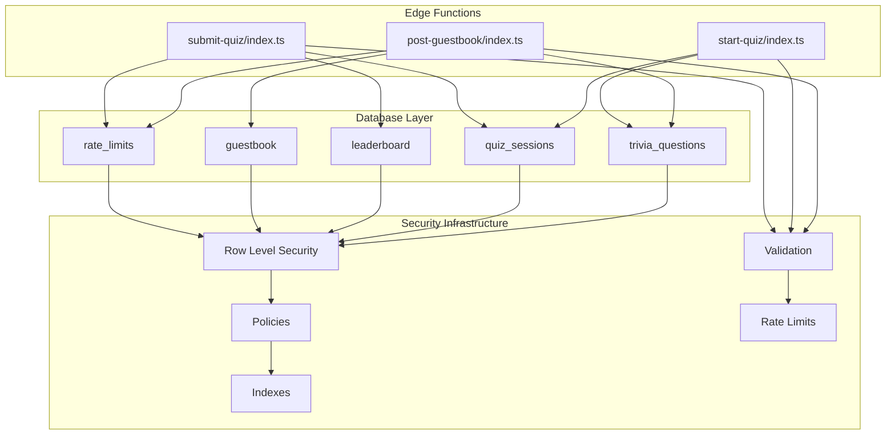

**Diagram sources**
- [index.ts:1-94](file://supabase/functions/post-guestbook/index.ts#L1-L94)
- [index.ts:1-75](file://supabase/functions/start-quiz/index.ts#L1-L75)
- [index.ts:1-131](file://supabase/functions/submit-quiz/index.ts#L1-L131)
- [init.sql:1-87](file://supabase/migrations/20240101000000_init.sql#L1-L87)

**Section sources**
- [index.ts:1-94](file://supabase/functions/post-guestbook/index.ts#L1-L94)
- [index.ts:1-75](file://supabase/functions/start-quiz/index.ts#L1-L75)
- [index.ts:1-131](file://supabase/functions/submit-quiz/index.ts#L1-L131)
- [init.sql:1-87](file://supabase/migrations/20240101000000_init.sql#L1-L87)

## Core Security Components

The security architecture consists of several interconnected layers:

### Database Security Foundation
- **Row Level Security (RLS)**: Enabled on all tables for fine-grained access control
- **Service Role Keys**: Used exclusively by edge functions for privileged operations
- **Index Optimization**: Strategic indexing for efficient security checks

### Edge Function Security Layer
- **Input Validation**: Comprehensive validation for all external inputs
- **Rate Limiting**: IP-based rate limiting with hashed identifiers
- **Honeypot Protection**: Anti-bot detection mechanism
- **CORS Management**: Controlled cross-origin resource sharing

### Authentication Integration
- **Supabase Auth**: Native authentication integration
- **JWT Token Handling**: Secure token processing and validation
- **Session Management**: Proper session lifecycle management

**Section sources**
- [init.sql:61-86](file://supabase/migrations/20240101000000_init.sql#L61-L86)
- [index.ts:20-23](file://supabase/functions/post-guestbook/index.ts#L20-L23)
- [index.ts:18-21](file://supabase/functions/start-quiz/index.ts#L18-L21)
- [index.ts:21-24](file://supabase/functions/submit-quiz/index.ts#L21-L24)

## Row-Level Security (RLS) Policies

The system implements comprehensive RLS policies across all database tables:

### Policy Categories

#### Public Read Access Tables
- **trivia_questions**: Full public read access with sensitive data exclusion
- **leaderboard**: Public read access for score visibility
- **guestbook**: Public read access for community messages

#### Service-Role Only Tables
- **quiz_sessions**: Restricted to service role for session management
- **rate_limits**: Protected access for abuse prevention

### Policy Implementation Details

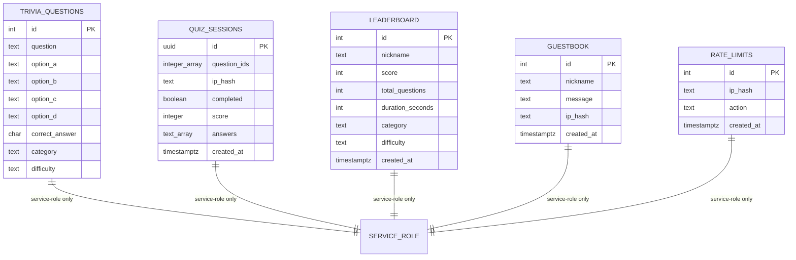

**Diagram sources**
- [init.sql:4-54](file://supabase/migrations/20240101000000_init.sql#L4-L54)

### Access Control Matrix

| Table | Public Read | Service Role Only | Authenticated Users |
|-------|-------------|-------------------|-------------------|
| trivia_questions | ✅ Select (without correct_answer) | ❌ | ✅ Select |
| quiz_sessions | ❌ | ✅ CRUD | ❌ |
| leaderboard | ✅ Select | ❌ | ✅ Select |
| guestbook | ✅ Select | ❌ | ✅ Select |
| rate_limits | ❌ | ✅ CRUD | ❌ |

**Section sources**
- [init.sql:68-84](file://supabase/migrations/20240101000000_init.sql#L68-L84)

## Edge Function Security

Each edge function implements comprehensive security measures:

### Post-Guestbook Function Security

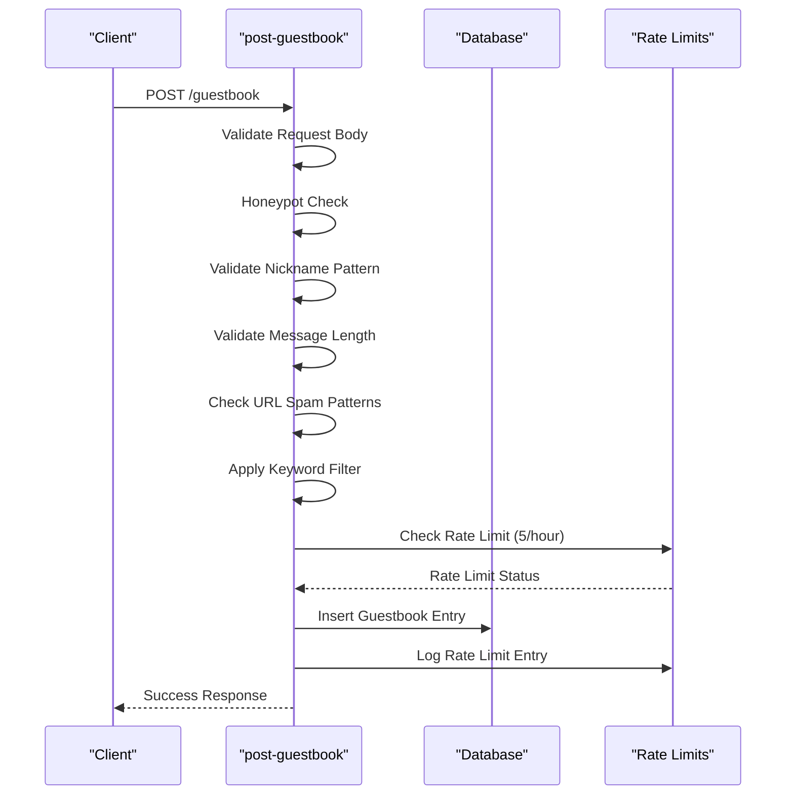

**Diagram sources**
- [index.ts:17-82](file://supabase/functions/post-guestbook/index.ts#L17-L82)

### Quiz Session Security

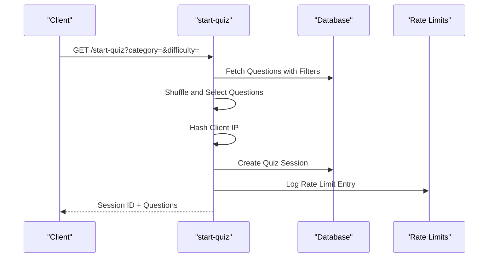

**Diagram sources**
- [index.ts:15-68](file://supabase/functions/start-quiz/index.ts#L15-L68)

### Submission Security

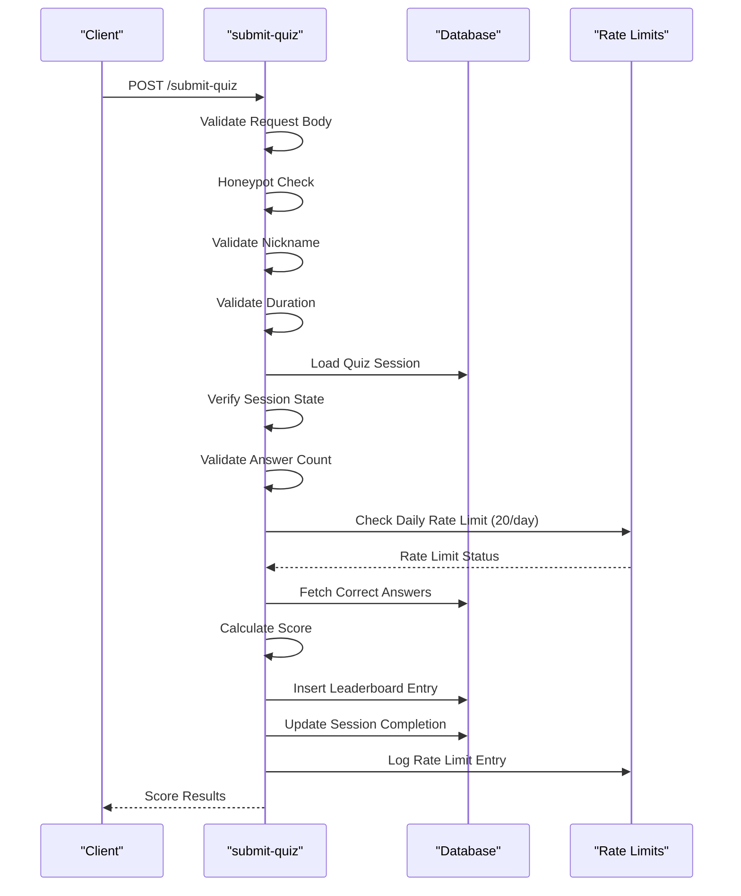

**Diagram sources**
- [index.ts:18-118](file://supabase/functions/submit-quiz/index.ts#L18-L118)

**Section sources**
- [index.ts:17-82](file://supabase/functions/post-guestbook/index.ts#L17-L82)
- [index.ts:15-68](file://supabase/functions/start-quiz/index.ts#L15-L68)
- [index.ts:18-118](file://supabase/functions/submit-quiz/index.ts#L18-L118)

## Rate Limiting Implementation

The system implements multi-layered rate limiting to prevent abuse:

### Rate Limiting Strategy

| Resource | Limit Type | Frequency | Enforcement Point |
|----------|------------|-----------|-------------------|
| Guestbook Posts | IP-based | 5 per hour | Edge Function + Database |
| Quiz Submissions | IP-based | 20 per day | Edge Function + Database |
| Global Abuse | Multi-factor | Dynamic thresholds | Database + Monitoring |

### Rate Limiting Architecture

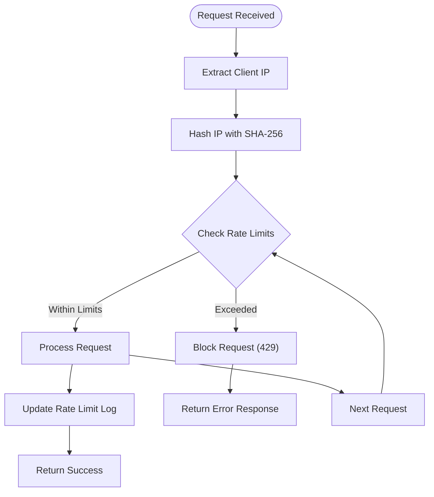

**Diagram sources**
- [index.ts:51-65](file://supabase/functions/post-guestbook/index.ts#L51-L65)
- [index.ts:59-73](file://supabase/functions/submit-quiz/index.ts#L59-L73)

### Database Rate Limiting Schema

The rate limiting system uses a dedicated table with strategic indexing:

| Column | Type | Purpose | Index |
|--------|------|---------|-------|
| id | SERIAL | Primary key | PK |
| ip_hash | TEXT | Hashed client IP | Composite Index |
| action | TEXT | Operation type | Composite Index |
| created_at | TIMESTAMPTZ | Timestamp | Composite Index |

**Section sources**
- [index.ts:15-15](file://supabase/functions/post-guestbook/index.ts#L15-L15)
- [index.ts:16-16](file://supabase/functions/submit-quiz/index.ts#L16-L16)
- [init.sql:48-59](file://supabase/migrations/20240101000000_init.sql#L48-L59)

## Input Validation and Sanitization

The system implements comprehensive input validation at multiple layers:

### Validation Strategies

#### Pattern-Based Validation
- **Nickname Validation**: Alphanumeric, spaces, underscores, hyphens (3-20 characters)
- **URL Detection**: Pattern matching for spam prevention
- **Spam Filtering**: Keyword-based content filtering

#### Content Validation
- **Length Restrictions**: Minimum 2, maximum 300 characters for messages
- **Format Validation**: Type checking and structure validation
- **Range Validation**: Duration bounds checking (5-3600 seconds)

#### Anti-Bot Measures
- **Honeypot Fields**: Hidden form fields to detect automated submissions
- **Behavioral Analysis**: Request timing and pattern recognition

### Validation Flow

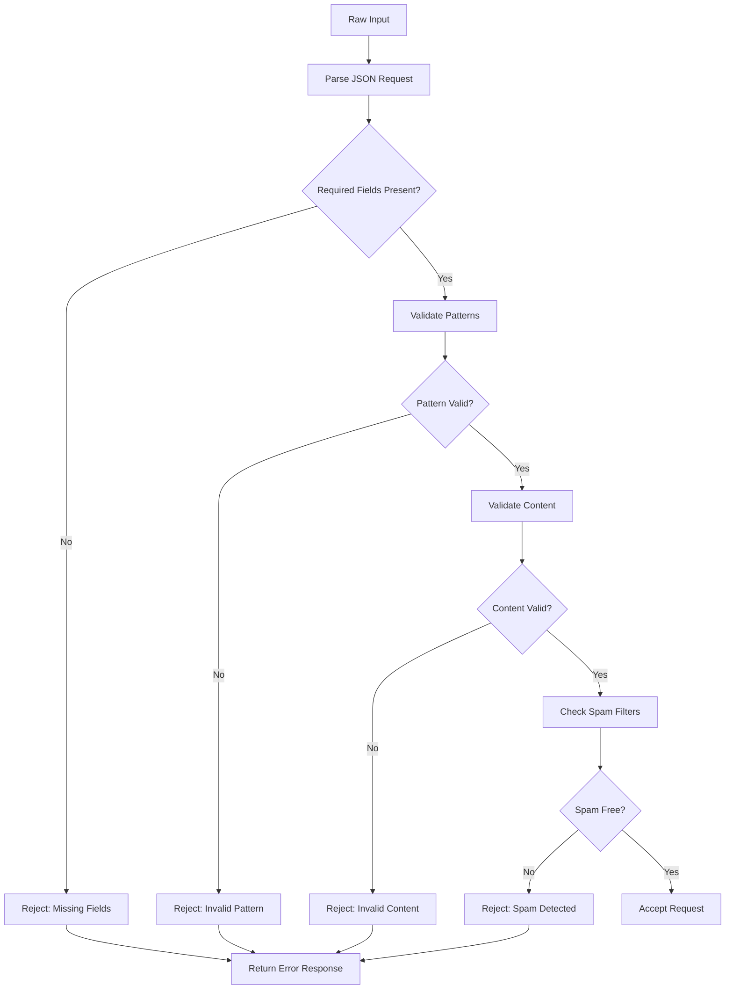

**Diagram sources**
- [index.ts:25-49](file://supabase/functions/post-guestbook/index.ts#L25-L49)
- [index.ts:26-42](file://supabase/functions/submit-quiz/index.ts#L26-L42)

**Section sources**
- [index.ts:12-14](file://supabase/functions/post-guestbook/index.ts#L12-L14)
- [index.ts:33-49](file://supabase/functions/post-guestbook/index.ts#L33-L49)
- [index.ts:15-42](file://supabase/functions/submit-quiz/index.ts#L15-L42)

## Supabase Auth Integration

The system integrates with Supabase Auth for comprehensive authentication and authorization:

### Authentication Flow

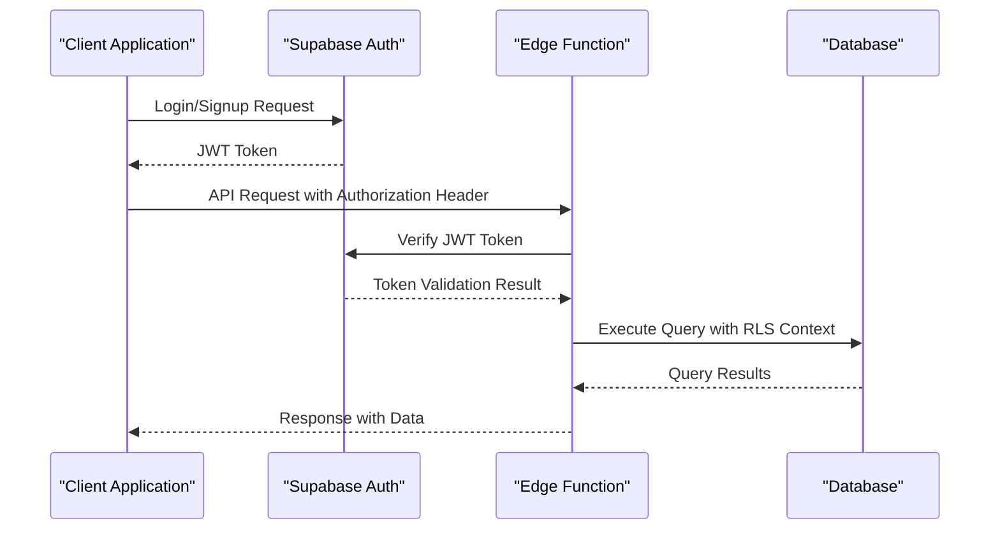

**Diagram sources**
- [index.ts:20-23](file://supabase/functions/post-guestbook/index.ts#L20-L23)
- [index.ts:18-21](file://supabase/functions/start-quiz/index.ts#L18-L21)
- [index.ts:21-24](file://supabase/functions/submit-quiz/index.ts#L21-L24)

### Token Handling Mechanisms

| Aspect | Implementation | Security Benefits |
|--------|----------------|-------------------|
| Token Verification | Edge functions verify tokens | Prevents unauthorized access |
| Session Management | Supabase handles sessions | Automatic expiration handling |
| Role-Based Access | Built-in role system | Fine-grained permission control |
| Token Expiration | Automatic renewal | Prevents token reuse |

**Section sources**
- [index.ts:20-23](file://supabase/functions/post-guestbook/index.ts#L20-L23)
- [index.ts:18-21](file://supabase/functions/start-quiz/index.ts#L18-L21)
- [index.ts:21-24](file://supabase/functions/submit-quiz/index.ts#L21-L24)

## JWT Token Handling

The system implements secure JWT token processing:

### Token Processing Architecture

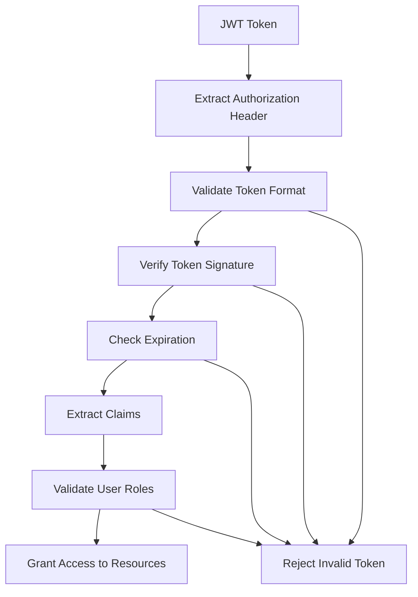

**Diagram sources**
- [index.ts:20-23](file://supabase/functions/post-guestbook/index.ts#L20-L23)

### Security Features

- **Token Validation**: Complete JWT verification including signature and claims
- **Role-Based Access**: User roles determine resource access
- **Automatic Renewal**: Token refresh handled automatically
- **Secure Storage**: Tokens stored securely in client applications

**Section sources**
- [index.ts:20-23](file://supabase/functions/post-guestbook/index.ts#L20-L23)

## Security Best Practices

### Edge Function Development Guidelines

#### Environment Variable Management
- **Secret Storage**: Store sensitive keys in Supabase secrets
- **Environment Isolation**: Separate development and production environments
- **Access Control**: Restrict environment variable access to authorized users only

#### Database Access Patterns
- **Service Role Usage**: Use service role keys only in edge functions
- **Connection Pooling**: Implement efficient connection management
- **Query Optimization**: Use prepared statements and parameterized queries

#### Input Processing
- **Defensive Programming**: Assume all input is malicious
- **Data Sanitization**: Clean and validate all external data
- **Error Handling**: Graceful error handling without information leakage

### Security Implementation Patterns

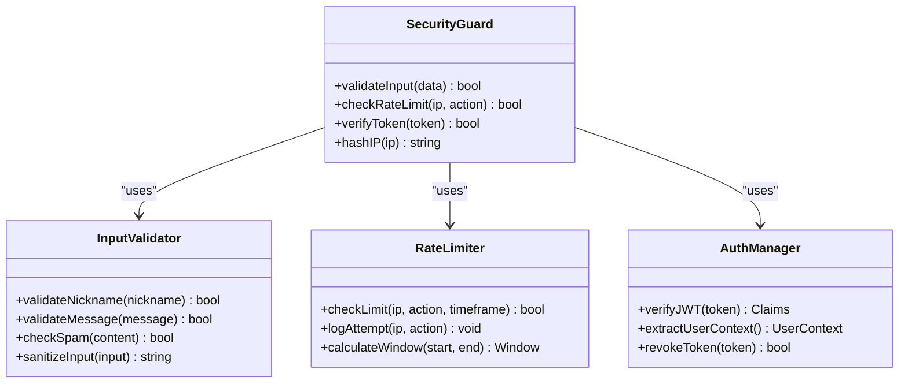

**Diagram sources**
- [index.ts:84-94](file://supabase/functions/post-guestbook/index.ts#L84-L94)
- [index.ts:127-131](file://supabase/functions/submit-quiz/index.ts#L127-L131)

**Section sources**
- [index.ts:84-94](file://supabase/functions/post-guestbook/index.ts#L84-L94)
- [index.ts:127-131](file://supabase/functions/submit-quiz/index.ts#L127-L131)

## Potential Vulnerabilities

### Identified Security Risks

#### Injection Vulnerabilities
- **SQL Injection**: Mitigated by using Supabase client with parameterized queries
- **Command Injection**: Prevented by avoiding shell commands in edge functions
- **XSS Prevention**: Implemented through input sanitization and content validation

#### Authentication Risks
- **Token Theft**: Protected by HTTPS enforcement and secure token storage
- **Session Hijacking**: Mitigated by automatic session management
- **Brute Force Attacks**: Prevented by rate limiting and account lockout mechanisms

#### Authorization Issues
- **Privilege Escalation**: Controlled by strict RLS policies and service role usage
- **Information Disclosure**: Prevented by selective data exposure and validation
- **CSRF Protection**: Implemented through anti-CSRF tokens and proper header validation

### Mitigation Strategies

| Vulnerability | Detection Method | Mitigation |
|---------------|------------------|------------|
| SQL Injection | Query analysis + Parameterized queries | Supabase client with RLS |
| XSS | Content scanning + Validation | Input sanitization patterns |
| CSRF | Header validation + Token verification | CORS + JWT verification |
| Brute Force | Rate limit monitoring | IP-based rate limiting |
| Session Management | Audit logs + Token rotation | Supabase auth session handling |

**Section sources**
- [init.sql:61-86](file://supabase/migrations/20240101000000_init.sql#L61-L86)
- [index.ts:51-65](file://supabase/functions/post-guestbook/index.ts#L51-L65)
- [index.ts:59-73](file://supabase/functions/submit-quiz/index.ts#L59-L73)

## Monitoring and Detection

### Security Monitoring Architecture

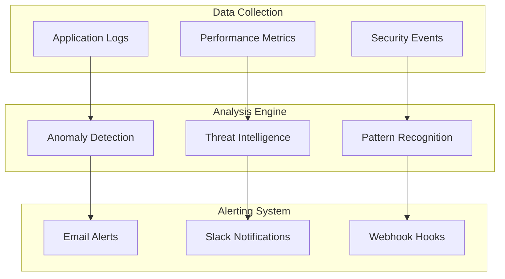

### Monitoring Implementation

#### Real-Time Monitoring
- **Request Volume Tracking**: Monitor API request rates and patterns
- **Error Rate Analysis**: Track error patterns and unusual spikes
- **Resource Utilization**: Monitor database and edge function performance

#### Security Event Logging
- **Authentication Events**: Track login/logout and failed attempts
- **Authorization Events**: Log access attempts and permission denials
- **Abuse Detection**: Monitor rate limit violations and suspicious activity

#### Alerting Configuration
- **Threshold-Based Alerts**: Configure alerts for unusual patterns
- **Real-Time Notifications**: Immediate notification for critical events
- **Escalation Procedures**: Defined escalation for security incidents

**Section sources**
- [init.sql:57-59](file://supabase/migrations/20240101000000_init.sql#L57-L59)
- [index.ts:51-65](file://supabase/functions/post-guestbook/index.ts#L51-L65)
- [index.ts:59-73](file://supabase/functions/submit-quiz/index.ts#L59-L73)

## Conclusion

The Supabase backend security implementation demonstrates a comprehensive, multi-layered approach to protecting the application. The system effectively combines:

- **Robust Database Security**: Through RLS policies and service role isolation
- **Edge Function Security**: With comprehensive input validation and rate limiting
- **Authentication Integration**: Leveraging Supabase Auth for secure user management
- **Monitoring and Detection**: With real-time monitoring and alerting capabilities

Key security strengths include the separation of concerns between public and service-role operations, comprehensive input validation, and strategic rate limiting. The implementation provides a solid foundation for secure application development while maintaining flexibility for future enhancements.

The security model successfully addresses common web application vulnerabilities while leveraging Supabase's native security features. Regular security audits and updates will ensure continued protection against emerging threats.