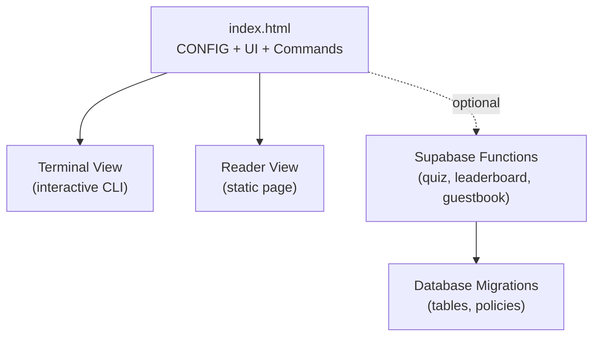
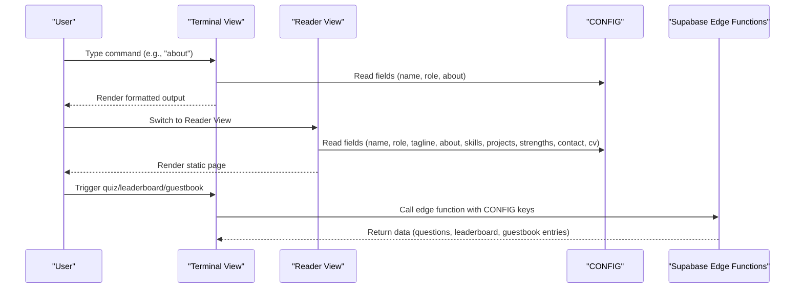
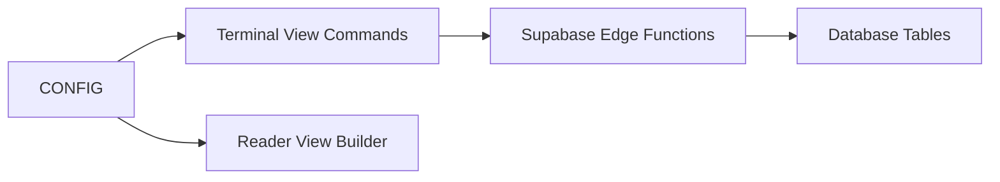

# Configuration Guide

<cite>
**Referenced Files in This Document**
- [README.md](file://README.md)
- [index.html](file://index.html)
- [post-guestbook/index.ts](file://supabase/functions/post-guestbook/index.ts)
- [start-quiz/index.ts](file://supabase/functions/start-quiz/index.ts)
- [submit-quiz/index.ts](file://supabase/functions/submit-quiz/index.ts)
- [init.sql](file://supabase/migrations/20240101000000_init.sql)
- [seed_questions.sql](file://supabase/migrations/20240101000001_seed_questions.sql)
</cite>

## Table of Contents
1. [Introduction](#introduction)
2. [Project Structure](#project-structure)
3. [Core Components](#core-components)
4. [Architecture Overview](#architecture-overview)
5. [Detailed Component Analysis](#detailed-component-analysis)
6. [Dependency Analysis](#dependency-analysis)
7. [Performance Considerations](#performance-considerations)
8. [Troubleshooting Guide](#troubleshooting-guide)
9. [Conclusion](#conclusion)
10. [Appendices](#appendices)

## Introduction
This guide documents the configuration system centered around the CONFIG object and personalization options. It explains the CONFIG structure, required and optional fields, nested data shapes for skills and projects, and how configuration drives both terminal and reader views. It also covers configuration persistence, validation requirements, and best practices for clean, maintainable configuration that supports both command-line parsing and visual rendering.

## Project Structure
The configuration lives in a single HTML file within a script tag. The terminal and reader views render identical content from CONFIG, while the terminal view adds interactive commands and a command-line interface. Optional Supabase-backed features (quiz, leaderboard, guestbook) require additional setup and are governed by separate backend functions and database migrations.

**Diagram sources**
- [index.html](file://index.html)
- [post-guestbook/index.ts](file://supabase/functions/post-guestbook/index.ts)
- [start-quiz/index.ts](file://supabase/functions/start-quiz/index.ts)
- [submit-quiz/index.ts](file://supabase/functions/submit-quiz/index.ts)
- [init.sql](file://supabase/migrations/20240101000000_init.sql)

**Section sources**
- [README.md:24-36](file://README.md#L24-L36)
- [index.html:448-521](file://index.html#L448-L521)

## Core Components
The CONFIG object is the single source of truth for personalization. It is consumed by both the terminal and reader views. The terminal reads CONFIG to render prompts, help, and command outputs. The reader view renders CONFIG into a clean, accessible layout.

Key responsibilities:
- Provide identity and branding (name, role, tagline)
- Deliver biographical content (about paragraphs)
- Define skills taxonomy (categories and descriptions)
- Present projects portfolio (title, stack, description, URL)
- Expose contact links and CV
- Enable Supabase integration for optional features

**Section sources**
- [README.md:26-36](file://README.md#L26-L36)
- [index.html:448-521](file://index.html#L448-L521)
- [index.html:588-647](file://index.html#L588-L647)
- [index.html:699-742](file://index.html#L699-L742)

## Architecture Overview
The CONFIG object is embedded in the HTML and is read by both the terminal and reader view builders. The terminal view also registers commands that reference CONFIG fields. Optional Supabase features are accessed via edge functions and rely on CONFIG’s Supabase keys.

**Diagram sources**
- [index.html:588-647](file://index.html#L588-L647)
- [index.html:684-762](file://index.html#L684-L762)
- [index.html:530-544](file://index.html#L530-L544)
- [post-guestbook/index.ts:17-82](file://supabase/functions/post-guestbook/index.ts#L17-L82)
- [start-quiz/index.ts:15-67](file://supabase/functions/start-quiz/index.ts#L15-L67)
- [submit-quiz/index.ts:18-114](file://supabase/functions/submit-quiz/index.ts#L18-L114)

## Detailed Component Analysis

### CONFIG Object Structure
The CONFIG object contains the following top-level fields:

- user: string (used in prompts)
- host: string (used in prompts)
- name: string (displayed prominently)
- role: string (professional title)
- tagline: string (brief descriptor)
- about: string[] (biography paragraphs)
- skills: [string, string][][] (nested array of [Category, Description])
- strengths: object with:
  - source: string (attribution for strengths)
  - themes: [string, string][][] (list of [Theme, Description])
- projects: object[] with:
  - title: string
  - stack: string
  - desc: string
  - url: string
  - label: string
- cv: string (URL to CV)
- email: string
- linkedin: string
- github: string
- readme: string
- supabase: object with:
  - url: string
  - anonKey: string

Notes:
- Fields marked as required are those used by the terminal and reader views.
- Optional fields include Supabase configuration and the strengths section.

Validation and formatting expectations:
- Skills and strengths are arrays of two-element arrays: [label, description].
- Projects are objects with required fields title, stack, desc, and optional url and label.
- Supabase keys are required only if enabling quiz/leaderboard/guestbook features.

**Section sources**
- [README.md:26-36](file://README.md#L26-L36)
- [index.html:448-521](file://index.html#L448-L521)

### Terminal View Rendering
The terminal view consumes CONFIG to:
- Print prompts and command outputs
- Render “about”, “skills”, “projects”, “strengths”, and “contact” sections
- Provide “neofetch” output combining ASCII art and CONFIG fields

Rendering logic:
- About: prints name, role, tagline, and each paragraph from about[]
- Skills: prints each [Category, Description] pair
- Projects: prints each project with title, stack, desc, and link if present
- Strengths: prints attribution and each [Theme, Description] pair
- Contact: prints links for email, LinkedIn, GitHub, README, and CV
- Neofetch: combines avatar and CONFIG-derived metadata

**Section sources**
- [index.html:699-742](file://index.html#L699-L742)
- [index.html:763-811](file://index.html#L763-L811)

### Reader View Rendering
The reader view builds a static page from CONFIG:
- Header with name, role, tagline
- Sections for About, Skills, Projects, Strengths, Contact, and CV
- Uses CONFIG fields to populate headings, lists, and links

Rendering logic:
- About: renders paragraphs from about[]
- Skills: renders [Category, Description] pairs as list items
- Projects: renders each project with title, stack, desc, and link if available
- Strengths: renders attribution and numbered list of themes
- Contact: renders links for email, LinkedIn, GitHub, README, and CV
- CV: renders a link to the CV URL

**Section sources**
- [index.html:588-647](file://index.html#L588-L647)

### Supabase Integration (Optional)
When CONFIG includes supabase.url and supabase.anonKey, the terminal can enable interactive features:
- Quiz: starts a session, loads questions, and submits answers to compute a score
- Leaderboard: displays top scores
- Guestbook: allows visitors to sign with nickname and message

Backend functions and validations:
- post-guestbook: validates nickname length and message constraints, applies rate limits, and inserts entries
- start-quiz: selects randomized questions and creates a session ID
- submit-quiz: validates nickname, duration, answer count, and writes leaderboard entries

Database schema expectations:
- Tables: trivia_questions, quiz_sessions, leaderboard, guestbook, rate_limits
- Row-level security policies permit public reads for selected tables

**Section sources**
- [index.html:530-544](file://index.html#L530-L544)
- [post-guestbook/index.ts:17-82](file://supabase/functions/post-guestbook/index.ts#L17-L82)
- [start-quiz/index.ts:15-67](file://supabase/functions/start-quiz/index.ts#L15-L67)
- [submit-quiz/index.ts:18-114](file://supabase/functions/submit-quiz/index.ts#L18-L114)
- [init.sql:4-87](file://supabase/migrations/20240101000000_init.sql#L4-L87)

### Relationship Between CONFIG and View Modes
- Terminal view: CONFIG feeds prompts, command outputs, and “neofetch” metadata. It also toggles between terminal and reader views.
- Reader view: CONFIG is rendered into a static, accessible layout without interactivity.
- Persistence: view mode and theme preferences are persisted in localStorage and restored on load.

**Section sources**
- [index.html:649-662](file://index.html#L649-L662)
- [index.html:573-586](file://index.html#L573-L586)

### Data Types and Formatting Guidelines
- Strings: name, role, tagline, cv, email, linkedin, github, readme, user, host, skill and strength labels, project title, stack, desc, url, label
- Arrays:
  - about: string[]
  - skills: [string, string][]
  - strengths.themes: [string, string][]
  - projects: object[] with required fields title, stack, desc and optional url, label
- Objects:
  - strengths: { source: string, themes: [string, string][] }
  - supabase: { url: string, anonKey: string }
- URLs: ensure http/https scheme for links; avoid placeholder values where possible

Formatting tips:
- Keep skill and strength descriptions concise and scannable.
- Use consistent capitalization and punctuation in project stacks and descriptions.
- Ensure project URLs are valid and accessible.

**Section sources**
- [index.html:448-521](file://index.html#L448-L521)
- [index.html:588-647](file://index.html#L588-L647)

### Validation Requirements
- Terminal view:
  - Commands assume CONFIG fields exist and are strings or arrays as applicable.
  - “neofetch” expects avatar image path to be valid.
- Reader view:
  - Uses CONFIG fields directly; missing fields may produce empty or partial sections.
- Supabase features:
  - post-guestbook: nickname length 3–20, message length 2–300, limited URL occurrences, spam filtering, rate limiting
  - start-quiz: selects randomized questions and creates sessions
  - submit-quiz: validates nickname, duration bounds, answer count, and writes leaderboard

Common validation pitfalls:
- Omitting required CONFIG fields leads to missing content in terminal or reader views.
- Leaving placeholder Supabase keys disables interactive features.
- Using invalid URLs or malformed project objects affects link rendering.

**Section sources**
- [index.html:699-742](file://index.html#L699-L742)
- [index.html:763-811](file://index.html#L763-L811)
- [post-guestbook/index.ts:33-49](file://supabase/functions/post-guestbook/index.ts#L33-L49)
- [submit-quiz/index.ts:39-57](file://supabase/functions/submit-quiz/index.ts#L39-L57)

### Best Practices for Clean Configuration
- Keep CONFIG self-contained and minimal; only include fields you intend to render.
- Use consistent casing and spacing in labels and descriptions.
- Prefer absolute URLs for external links; avoid placeholders like TODO_URL unless intentionally deferred.
- Group related fields logically (identity, about, skills, projects, contact).
- Test both terminal and reader views after changes to ensure parity.
- If enabling Supabase features, configure supabase.url and supabase.anonKey and deploy backend functions and migrations.

**Section sources**
- [README.md:24-36](file://README.md#L24-L36)
- [index.html:448-521](file://index.html#L448-L521)

## Dependency Analysis
The configuration system depends on:
- CONFIG object for content
- Terminal commands that read CONFIG fields
- Reader view builder that renders CONFIG
- Optional Supabase functions and database for interactive features

**Diagram sources**
- [index.html:684-762](file://index.html#L684-L762)
- [index.html:588-647](file://index.html#L588-L647)
- [index.html:530-544](file://index.html#L530-L544)
- [init.sql:4-87](file://supabase/migrations/20240101000000_init.sql#L4-L87)

**Section sources**
- [index.html:684-762](file://index.html#L684-L762)
- [index.html:588-647](file://index.html#L588-L647)
- [index.html:530-544](file://index.html#L530-L544)
- [init.sql:4-87](file://supabase/migrations/20240101000000_init.sql#L4-L87)

## Performance Considerations
- Keep CONFIG compact to minimize DOM updates in the reader view.
- Avoid excessively long strings in skills, projects, and about to prevent layout issues.
- Use lazy initialization for optional Supabase features to reduce overhead when disabled.

## Troubleshooting Guide
Common issues and resolutions:
- Terminal view shows missing content:
  - Verify CONFIG fields exist and are populated.
  - Confirm the reader view renders correctly to isolate whether the issue is terminal-specific.
- Reader view looks incomplete:
  - Check for missing or empty CONFIG sections (skills, projects, strengths).
- Supabase features disabled:
  - Ensure CONFIG.supabase.url and CONFIG.supabase.anonKey are set and valid.
  - Confirm backend functions are deployed and reachable.
- Guestbook or quiz errors:
  - Review function logs for validation failures (nickname/message length, rate limits).
  - Verify database tables and policies exist.

**Section sources**
- [index.html:530-544](file://index.html#L530-L544)
- [post-guestbook/index.ts:17-82](file://supabase/functions/post-guestbook/index.ts#L17-L82)
- [submit-quiz/index.ts:18-114](file://supabase/functions/submit-quiz/index.ts#L18-L114)
- [init.sql:4-87](file://supabase/migrations/20240101000000_init.sql#L4-L87)

## Conclusion
The CONFIG object is the central hub for personalization across both terminal and reader views. By structuring CONFIG carefully, validating inputs, and following best practices, you can maintain a clean, robust configuration that supports both command-line parsing and visual rendering. Optional Supabase features enhance interactivity but require proper setup and validation.

## Appendices

### Example Modification Paths
- Identity and branding: [index.html:456-458](file://index.html#L456-L458)
- About paragraphs: [index.html:459-463](file://index.html#L459-L463)
- Skills matrix: [index.html:464-471](file://index.html#L464-L471)
- Strengths: [index.html:472-481](file://index.html#L472-L481)
- Projects: [index.html:485-507](file://index.html#L485-L507)
- Contact and CV: [index.html:508-512](file://index.html#L508-L512)
- Supabase configuration: [index.html:516-519](file://index.html#L516-L519)

### Validation Rules Summary
- Guestbook: nickname 3–20 chars, message 2–300 chars, limited URLs, spam filtering, rate limit
- Quiz submission: nickname 3–20 chars, duration reasonable, answer count matches session, rate limit

**Section sources**
- [post-guestbook/index.ts:12-49](file://supabase/functions/post-guestbook/index.ts#L12-L49)
- [submit-quiz/index.ts:15-57](file://supabase/functions/submit-quiz/index.ts#L15-L57)