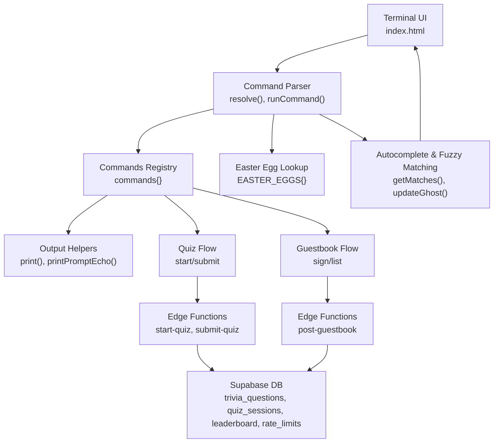
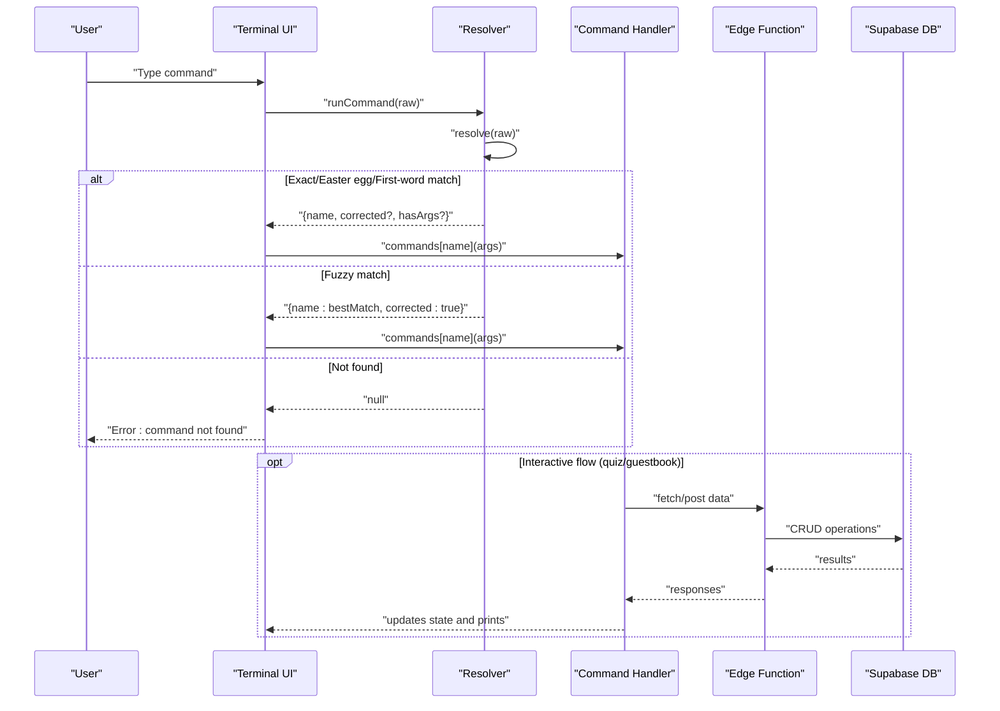
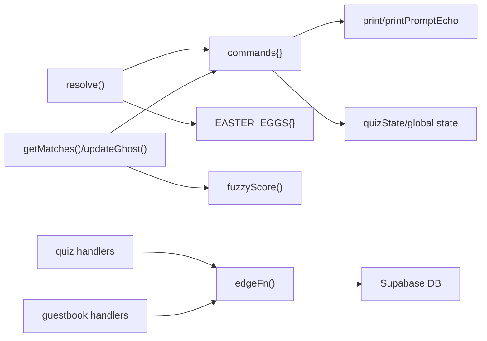

# Command System Modification

<cite>
**Referenced Files in This Document**
- [index.html](file://index.html)
- [start-quiz/index.ts](file://supabase/functions/start-quiz/index.ts)
- [submit-quiz/index.ts](file://supabase/functions/submit-quiz/index.ts)
- [post-guestbook/index.ts](file://supabase/functions/post-guestbook/index.ts)
- [20240101000000_init.sql](file://supabase/migrations/20240101000000_init.sql)
- [20240101000001_seed_questions.sql](file://supabase/migrations/20240101000001_seed_questions.sql)
</cite>

## Table of Contents
1. [Introduction](#introduction)
2. [Project Structure](#project-structure)
3. [Core Components](#core-components)
4. [Architecture Overview](#architecture-overview)
5. [Detailed Component Analysis](#detailed-component-analysis)
6. [Dependency Analysis](#dependency-analysis)
7. [Performance Considerations](#performance-considerations)
8. [Troubleshooting Guide](#troubleshooting-guide)
9. [Conclusion](#conclusion)
10. [Appendices](#appendices)

## Introduction
This document explains how to modify and extend the command system in the portfolio’s interactive terminal. It focuses on:
- The command registration process in the commands object
- Command parsing, parameter handling, and output formatting
- Implementing new commands modeled after existing ones
- Integrating new commands into auto-completion and fuzzy matching
- Validation, error handling, and user feedback mechanisms

## Project Structure
The terminal is implemented in a single HTML file with embedded JavaScript. The command system resides in the script section and includes:
- A commands registry object containing all command handlers
- Auto-completion and fuzzy matching logic
- Easter egg multi-word command resolution
- Interactive flows for quiz and guestbook
- Backend integration via Supabase edge functions

**Diagram sources**
- [index.html:688-1181](file://index.html#L688-L1181)
- [index.html:1316-1433](file://index.html#L1316-L1433)
- [index.html:1435-1530](file://index.html#L1435-L1530)

**Section sources**
- [index.html:688-1181](file://index.html#L688-L1181)
- [index.html:1316-1433](file://index.html#L1316-L1433)
- [index.html:1435-1530](file://index.html#L1435-L1530)

## Core Components
- Commands registry: A dictionary of command names to handler functions. Each handler prints formatted output and may trigger interactive flows.
- Parser and resolver: Converts raw input into a canonical command, resolves multi-word easter eggs, and extracts arguments for commands that accept them.
- Auto-completion and fuzzy matching: Provides inline suggestions and tab cycling.
- Output helpers: Standardized printing and prompt echoing.
- Interactive flows: Quiz and guestbook with state machines and validation.
- Backend integration: Edge functions for quiz and guestbook data operations.

**Section sources**
- [index.html:688-1181](file://index.html#L688-L1181)
- [index.html:1316-1433](file://index.html#L1316-L1433)
- [index.html:1435-1530](file://index.html#L1435-L1530)

## Architecture Overview
The command system follows a layered design:
- Presentation layer: Terminal UI and input handling
- Parsing layer: Resolves commands, applies fuzzy matching, and manages state
- Execution layer: Invokes command handlers and interactive flows
- Persistence layer: Supabase-backed data for quiz and guestbook

**Diagram sources**
- [index.html:1408-1433](file://index.html#L1408-L1433)
- [index.html:1381-1406](file://index.html#L1381-L1406)
- [index.html:821-848](file://index.html#L821-L848)
- [index.html:884-922](file://index.html#L884-L922)
- [index.html:1253-1287](file://index.html#L1253-L1287)
- [index.html:1289-1314](file://index.html#L1289-L1314)

## Detailed Component Analysis

### Command Registration and Execution
- Registration: Add a new property to the commands object with a function that takes an optional args string and prints output.
- Execution: runCommand echoes the prompt, resolves the command, and invokes the handler. For commands that accept arguments (e.g., guestbook sign), the resolver extracts the remainder after the command name.

Implementation highlights:
- Output helpers: print() appends a line with fade-in effect; printPromptEcho() prints the prompt and original command.
- Escape HTML: escapeHtml() ensures safe output rendering.
- Interactive state: quizState and guestbook state are managed globally for multi-step flows.

Integration points:
- The COMMANDS array is derived from the commands object keys and powers auto-completion.
- Easter egg multi-word commands are mapped in EASTER_EGGS for longest-match resolution.

**Section sources**
- [index.html:688-1181](file://index.html#L688-L1181)
- [index.html:1210-1214](file://index.html#L1210-L1214)
- [index.html:1319-1321](file://index.html#L1319-L1321)
- [index.html:1381-1406](file://index.html#L1381-L1406)
- [index.html:1408-1433](file://index.html#L1408-L1433)

### Command Parsing and Parameter Handling
- Resolution order:
  1) Longest-match easter egg multi-word command
  2) Exact match in commands
  3) First-word match for commands accepting arguments
  4) Fuzzy match fallback
- Argument extraction: For commands like “guestbook sign”, the resolver trims the command name from the input to pass remaining text as args.
- Interactive input handling: During quiz and guestbook flows, the parser intercepts Enter key events to validate and advance state.

Validation and feedback:
- Fuzzy correction: When a typo is corrected, a dim message indicates the assumption.
- Not found: A red error message suggests help.

**Section sources**
- [index.html:1381-1406](file://index.html#L1381-L1406)
- [index.html:1408-1433](file://index.html#L1408-L1433)
- [index.html:1455-1530](file://index.html#L1455-L1530)

### Output Formatting and User Feedback
- Consistent styling: Colors and classes (accent, dim, cyan, yellow, red) are used for readability and emphasis.
- Interactive elements: Chips render clickable buttons that trigger commands.
- Inline suggestions: Ghost text and hints guide users through completion.

**Section sources**
- [index.html:688-1181](file://index.html#L688-L1181)
- [index.html:1352-1366](file://index.html#L1352-L1366)

### Auto-Completion and Fuzzy Matching
- COMMANDS: Derived from commands keys.
- getMatches(): Computes fuzzy scores using a subsequence scoring algorithm that favors prefix matches, consecutive character runs, and tight matches.
- updateGhost(): Shows inline ghost suffix for prefix matches and a right-side hint for fuzzy suggestions.
- onTab(): Cycles through prefix-first candidates.

Integration with commands:
- Adding a new command automatically becomes available in auto-completion and fuzzy matching because COMMANDS is derived from the commands object.

**Section sources**
- [index.html:1319-1321](file://index.html#L1319-L1321)
- [index.html:1323-1350](file://index.html#L1323-L1350)
- [index.html:1352-1366](file://index.html#L1352-L1366)
- [index.html:1368-1379](file://index.html#L1368-L1379)

### Interactive Flows: Quiz and Guestbook
- Quiz:
  - State machine tracks active, phase, sessionId, questions, currentQ, answers, startTime.
  - start-quiz edge function seeds questions and creates a session.
  - submit-quiz edge function validates answers, computes score, and writes leaderboard.
- Guestbook:
  - Two-step flow: nickname then message.
  - post-guestbook edge function enforces validation and rate limits.

Error handling:
- Backend errors are surfaced to the user with red messages.
- Frontend validation prevents invalid inputs and provides helpful hints.

**Section sources**
- [index.html:546-571](file://index.html#L546-L571)
- [index.html:821-848](file://index.html#L821-L848)
- [index.html:850-882](file://index.html#L850-L882)
- [index.html:884-922](file://index.html#L884-L922)
- [index.html:1214-1287](file://index.html#L1214-L1287)
- [index.html:1289-1314](file://index.html#L1289-L1314)
- [start-quiz/index.ts:15-69](file://supabase/functions/start-quiz/index.ts#L15-L69)
- [submit-quiz/index.ts:18-119](file://supabase/functions/submit-quiz/index.ts#L18-L119)
- [post-guestbook/index.ts:17-82](file://supabase/functions/post-guestbook/index.ts#L17-L82)

### Backend Integration and Data Model
- Edge functions:
  - start-quiz: Seeds quiz session and returns questions without exposing correct answers.
  - submit-quiz: Validates answers, computes score, writes leaderboard, and rate-limit logs.
  - post-guestbook: Validates nickname/message, filters spam, and rate-limits posts.
- Database schema:
  - trivia_questions, quiz_sessions, leaderboard, guestbook, rate_limits.
  - Row-level security policies restrict access appropriately.

**Section sources**
- [start-quiz/index.ts:15-69](file://supabase/functions/start-quiz/index.ts#L15-L69)
- [submit-quiz/index.ts:18-119](file://supabase/functions/submit-quiz/index.ts#L18-L119)
- [post-guestbook/index.ts:17-82](file://supabase/functions/post-guestbook/index.ts#L17-L82)
- [20240101000000_init.sql:4-54](file://supabase/migrations/20240101000000_init.sql#L4-L54)
- [20240101000001_seed_questions.sql:7-60](file://supabase/migrations/20240101000001_seed_questions.sql#L7-L60)

## Dependency Analysis
- Internal dependencies:
  - commands depends on output helpers and CONFIG for content.
  - Resolver depends on COMMANDS and EASTER_EGGS.
  - Auto-completion depends on fuzzyScore and COMMANDS.
  - Interactive flows depend on edgeFn and quizState.
- External dependencies:
  - Supabase client initialization and edgeFn for backend calls.
  - DOM elements for UI rendering and input capture.

**Diagram sources**
- [index.html:688-1181](file://index.html#L688-L1181)
- [index.html:1316-1433](file://index.html#L1316-L1433)
- [index.html:1435-1530](file://index.html#L1435-L1530)

**Section sources**
- [index.html:688-1181](file://index.html#L688-L1181)
- [index.html:1316-1433](file://index.html#L1316-L1433)
- [index.html:1435-1530](file://index.html#L1435-L1530)

## Performance Considerations
- Fuzzy matching cost: getMatches() scales with the number of registered commands and input length. With a small command set, performance remains negligible.
- DOM updates: print() adds nodes; frequent updates can be minimized by batching output when adding complex commands.
- Interactive timers: quizState.tailInterval should be cleared when leaving interactive modes to prevent leaks.

[No sources needed since this section provides general guidance]

## Troubleshooting Guide
Common issues and resolutions:
- Command not found:
  - Ensure the command name is registered in the commands object and matches the casing used by the resolver.
  - Verify COMMANDS reflects the commands object (derived from keys).
- Fuzzy suggestion not appearing:
  - Confirm the input triggers getMatches() and that fuzzyScore returns a non-negative score.
  - Check that updateGhost() is invoked on input events.
- Interactive flow errors:
  - Quiz: Verify Supabase configuration and edge function deployment.
  - Guestbook: Validate nickname/message constraints and rate limits.
- Backend connectivity:
  - Confirm CONFIG.supabase.url and CONFIG.supabase.anonKey are set.
  - Ensure edge functions are deployed and accessible.

**Section sources**
- [index.html:1408-1433](file://index.html#L1408-L1433)
- [index.html:1381-1406](file://index.html#L1381-L1406)
- [index.html:1352-1366](file://index.html#L1352-L1366)
- [index.html:1455-1530](file://index.html#L1455-L1530)
- [index.html:530-544](file://index.html#L530-L544)

## Conclusion
The command system is extensible and self-contained within the HTML file. New commands can be added by registering handlers in the commands object, leveraging the existing output helpers and resolver logic. Auto-completion and fuzzy matching are automatic thanks to the COMMANDS derivation. Interactive flows and backend integration are encapsulated in dedicated handlers and edge functions, enabling robust validation and user feedback.

[No sources needed since this section summarizes without analyzing specific files]

## Appendices

### How to Add a New Command
Steps:
1. Define the handler in the commands object:
   - Signature: function(args) where args is a string or undefined
   - Use print() for output and printPromptEcho() for echo
   - Escape user-provided content with escapeHtml() when mixing with HTML
2. Integrate into auto-completion:
   - No manual step needed; COMMANDS derives from commands keys
3. Add to help chips:
   - Include the command name in the help command’s chip list
4. Parameter handling:
   - For commands that accept arguments, rely on the resolver to extract the remainder after the command name
5. Validation and feedback:
   - Validate inputs early and provide clear error messages
   - Use dim/yellow/red classes for consistent feedback
6. Backend integration (optional):
   - Use edgeFn() to call Supabase functions
   - Follow patterns from quiz and guestbook handlers

Examples to model after:
- Simple output: about, skills, projects, strengths, contact, credits, theme, clear
- Interactive: quiz, leaderboard, guestbook
- Easter egg: tail -f, systemctl status emily, sudo, cat /etc/motd, ps aux, find, rm -rf, etc.
- Specialized: neofetch, cv

**Section sources**
- [index.html:688-1181](file://index.html#L688-L1181)
- [index.html:1319-1321](file://index.html#L1319-L1321)
- [index.html:1381-1406](file://index.html#L1381-L1406)
- [index.html:1408-1433](file://index.html#L1408-L1433)
- [index.html:1455-1530](file://index.html#L1455-L1530)

### Command Chip System
- Purpose: Provide clickable shortcuts to commands
- Implementation:
  - Create a chip button for each command name
  - Attach onclick to call runCommand(name)
  - Render chips in a container with class chips
- Integration:
  - Update the help command to include new chips
  - Ensure the chip names match registered command keys

**Section sources**
- [index.html:688-1181](file://index.html#L688-L1181)

### Backend Data Model Reference
Tables and policies:
- trivia_questions: public select; correct_answer excluded from edge function responses
- quiz_sessions: service-role only
- leaderboard: public select; service-role insert
- guestbook: public select; service-role insert
- rate_limits: service-role only

**Section sources**
- [20240101000000_init.sql:4-54](file://supabase/migrations/20240101000000_init.sql#L4-L54)
- [20240101000000_init.sql:61-87](file://supabase/migrations/20240101000000_init.sql#L61-L87)