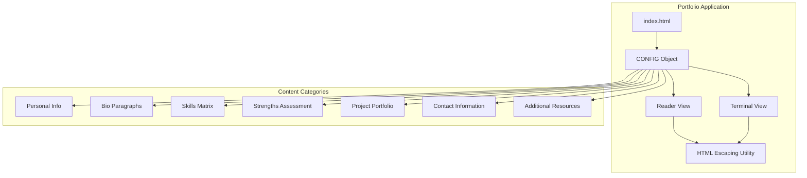
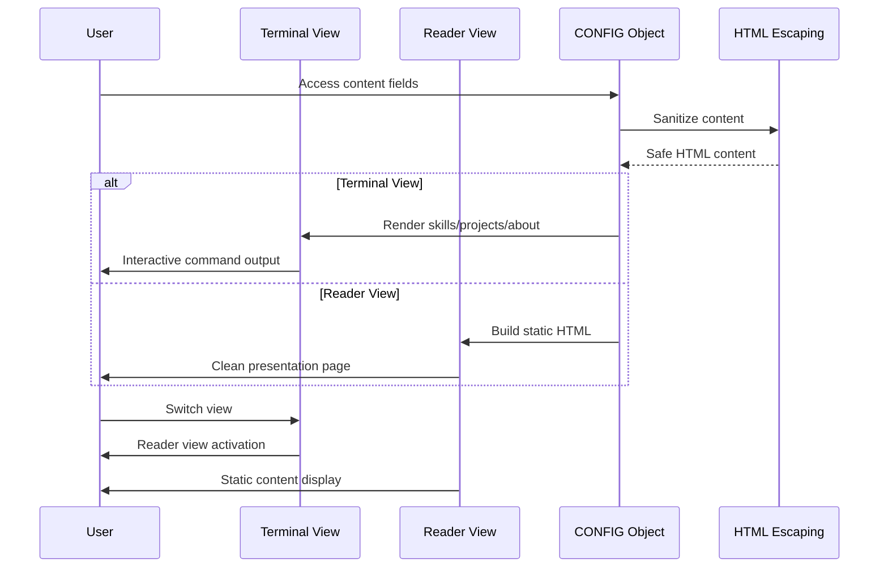
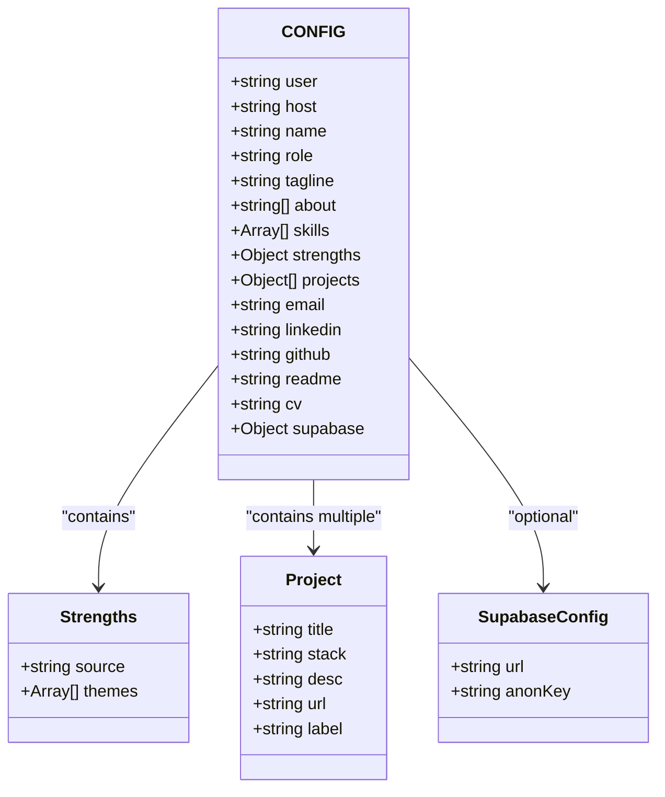
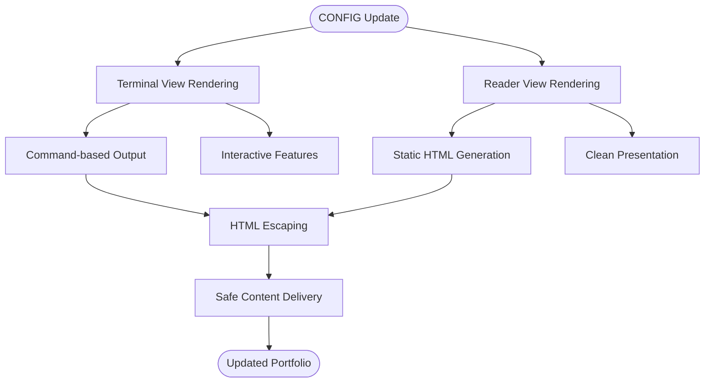
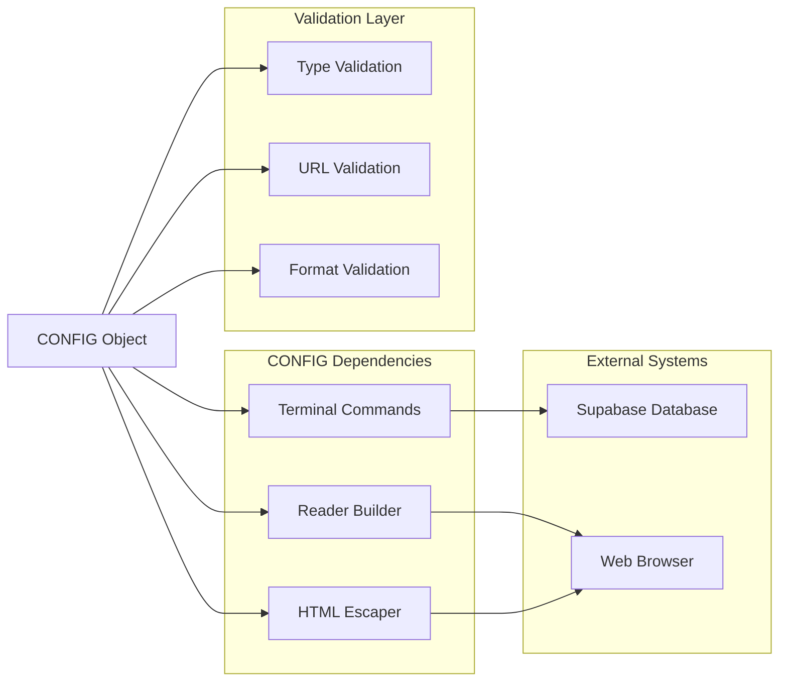

# Content Customization

<cite>
**Referenced Files in This Document**
- [index.html](file://index.html)
- [README.md](file://README.md)
</cite>

## Table of Contents
1. [Introduction](#introduction)
2. [Project Structure](#project-structure)
3. [Core Components](#core-components)
4. [Architecture Overview](#architecture-overview)
5. [Detailed Component Analysis](#detailed-component-analysis)
6. [Dependency Analysis](#dependency-analysis)
7. [Performance Considerations](#performance-considerations)
8. [Troubleshooting Guide](#troubleshooting-guide)
9. [Conclusion](#conclusion)

## Introduction
This document provides comprehensive guidance for customizing portfolio content through the CONFIG object. The portfolio is a dual-view web application that serves as both an interactive terminal and a reader-friendly presentation page. All content customization occurs through a single CONFIG object located in the HTML file.

The CONFIG object controls:
- Personal information (name, role, tagline)
- Professional biography (about section)
- Technical skills matrix
- Strengths assessment
- Project portfolio
- Contact information
- Additional resources (CV, README)

## Project Structure
The portfolio consists of a single HTML file with embedded JavaScript and CSS. The structure follows a modular approach where the CONFIG object serves as the central data source for both views.



**Diagram sources**
- [index.html:448-520](file://index.html#L448-L520)
- [index.html:591-655](file://index.html#L591-L655)

**Section sources**
- [index.html:1-50](file://index.html#L1-L50)
- [README.md:1-59](file://README.md#L1-L59)

## Core Components

### CONFIG Object Structure
The CONFIG object is the central data repository containing all portfolio content. It follows a hierarchical structure with specific field requirements and formatting guidelines.

**Section sources**
- [index.html:453-520](file://index.html#L453-L520)

### Personal Information Section
The personal information section defines the primary identification elements displayed in both views.

**Fields:**
- `name`: Full professional name (string)
- `role`: Current or most relevant professional title (string)
- `tagline`: Brief professional summary or value proposition (string)

**Formatting Requirements:**
- Plain text only (no HTML tags)
- Keep concise for optimal terminal display
- Use professional language appropriate for your field

**Section sources**
- [index.html:456-458](file://index.html#L456-L458)
- [index.html:597-604](file://index.html#L597-L604)

### About Section
The about section presents a multi-paragraph professional biography using an array of strings.

**Structure:**
```javascript
about: [
  "First paragraph of your biography",
  "Second paragraph with additional details",
  "Third paragraph covering specific expertise"
]
```

**Formatting Guidelines:**
- Array of strings (each string becomes a separate paragraph)
- No HTML formatting within individual strings
- Focus on professional achievements and expertise
- Keep paragraphs focused and scannable

**Section sources**
- [index.html:459-463](file://index.html#L459-L463)
- [index.html:609](file://index.html#L609)

### Skills Matrix
The skills section organizes technical competencies in a categorized matrix format.

**Structure:**
```javascript
skills: [
  ["Category Name", "Description of skills in this category"],
  ["Another Category", "Skills and expertise details"]
]
```

**Implementation Details:**
- Each skill entry is an array with exactly 2 elements
- First element: Category name (left column)
- Second element: Skill descriptions (right column)
- Automatically rendered as a two-column layout in reader view

**Best Practices:**
- Use 1-2 word categories for clarity
- Keep descriptions concise and action-oriented
- Group related skills within categories
- Prioritize skills most relevant to your target audience

**Section sources**
- [index.html:464-471](file://index.html#L464-L471)
- [index.html:614](file://index.html#L614)

### Strengths Assessment
The strengths section displays competency assessments with source attribution.

**Structure:**
```javascript
strengths: {
  source: "Assessment Tool Name",
  themes: [
    ["Strength Name", "Brief description of this strength"],
    ["Another Strength", "Explanation of impact"]
  ]
}
```

**Configuration Options:**
- `source`: Attribution for the assessment tool
- `themes`: Array of [strength, description] pairs
- Automatically numbered in reader view

**Section sources**
- [index.html:472-481](file://index.html#L472-L481)
- [index.html:634-636](file://index.html#L634-L636)

### Projects Portfolio
The projects section showcases individual portfolio items with metadata and links.

**Individual Project Structure:**
```javascript
{
  title: "Project Title",
  stack: "Technology/Tool stack used",
  desc: "Brief description of the project",
  url: "https://example.com/project",
  label: "Link Text"
}
```

**Required Fields:**
- `title`: Project name (string)
- `stack`: Technologies or tools used (string)
- `desc`: Project description (string)
- `url`: Live demo or repository URL (string)
- `label`: Link text for the URL (string)

**URL Handling:**
- Projects with valid URLs display with external link
- Projects with placeholder URLs show "coming soon" indicator
- URL validation prevents broken links

**Section sources**
- [index.html:485-507](file://index.html#L485-L507)
- [index.html:620-629](file://index.html#L620-L629)

### Contact Information
The contact section provides professional connection points with proper formatting.

**Available Fields:**
- `email`: Professional email address
- `linkedin`: LinkedIn profile URL
- `github`: GitHub profile URL
- `readme`: README page URL
- `cv`: Resume/CV URL

**Formatting:**
- Email automatically formatted as mailto link
- Other links use standard HTTP/HTTPS URLs
- All links open in new tabs with security attributes

**Section sources**
- [index.html:509-512](file://index.html#L509-L512)
- [index.html:641-644](file://index.html#L641-L644)

### Additional Resources
The portfolio includes supplementary content areas.

**Available Fields:**
- `cv`: Resume/CV link (renders as prominent call-to-action)
- `readme`: README page link (special link text)
- `supabase`: Database configuration (for interactive features)

**Section sources**
- [index.html:508](file://index.html#L508)
- [index.html:516-519](file://index.html#L516-L519)

## Architecture Overview

The CONFIG object drives both presentation modes through a unified data source:



**Diagram sources**
- [index.html:591-655](file://index.html#L591-L655)
- [index.html:657-670](file://index.html#L657-L670)

The architecture ensures content consistency across both views while maintaining security through HTML escaping.

**Section sources**
- [index.html:591-655](file://index.html#L591-L655)
- [index.html:688](file://index.html#L688)

## Detailed Component Analysis

### CONFIG Object Implementation
The CONFIG object serves as the single source of truth for all portfolio content, with strict validation and formatting requirements.



**Diagram sources**
- [index.html:453-520](file://index.html#L453-L520)

### HTML Escaping Security Mechanism
The portfolio implements comprehensive HTML escaping to prevent XSS attacks while preserving content formatting.

**Escaping Implementation:**
```javascript
function escapeHtml(s) {
  return String(s).replace(/[&<>"]/g, c => ({
    '&': '&amp;',
    '<': '&lt;',
    '>': '&gt;',
    '"': '&quot;'
  }[c]));
}
```

**Security Benefits:**
- Prevents script injection in user-generated content
- Maintains content integrity across both views
- Ensures safe rendering of special characters
- Protects against malicious input in interactive features

**Section sources**
- [index.html:688](file://index.html#L688)
- [index.html:594](file://index.html#L594)

### View Rendering Architecture
The portfolio maintains content consistency through dual rendering mechanisms:



**Diagram sources**
- [index.html:591-655](file://index.html#L591-L655)
- [index.html:688](file://index.html#L688)

**Section sources**
- [index.html:591-655](file://index.html#L591-L655)
- [index.html:688](file://index.html#L688)

## Dependency Analysis

The CONFIG object has minimal external dependencies but creates strong relationships with the rendering systems:



**Diagram sources**
- [index.html:530-544](file://index.html#L530-L544)
- [index.html:591-655](file://index.html#L591-L655)

**Section sources**
- [index.html:530-544](file://index.html#L530-L544)
- [index.html:591-655](file://index.html#L591-L655)

## Performance Considerations

### Content Loading Optimization
The CONFIG object enables efficient content delivery through several mechanisms:

- **Single Source Architecture**: Reduces data duplication and synchronization issues
- **Static Content**: All content is loaded statically, minimizing server requests
- **Minimal Dependencies**: Zero external libraries reduce bundle size and load times
- **Efficient Rendering**: Both views share the same CONFIG object, optimizing memory usage

### Security Performance Benefits
HTML escaping occurs during rendering rather than storage, providing:
- Real-time security validation
- Minimal performance overhead
- Consistent security across both views
- Prevention of runtime security vulnerabilities

## Troubleshooting Guide

### Common Configuration Issues

**Problem: Content not displaying in reader view**
- Verify CONFIG object syntax is valid JavaScript
- Ensure all required fields are present
- Check for missing commas or extra commas in arrays
- Validate that strings are properly quoted

**Problem: Special characters appearing incorrectly**
- Confirm HTML escaping is functioning
- Check that content doesn't contain unescaped HTML tags
- Verify character encoding is UTF-8

**Problem: Links not working**
- Validate URL format (must include protocol)
- Ensure URLs are properly quoted
- Check for trailing whitespace in URLs
- Verify URLs are accessible from target browsers

### Validation Best Practices

**Content Validation Checklist:**
- [ ] All arrays have correct structure
- [ ] Strings are properly quoted
- [ ] URLs include complete protocols
- [ ] Arrays don't have trailing commas
- [ ] Objects use proper property names
- [ ] HTML escaping is applied consistently

**Section sources**
- [index.html:688](file://index.html#L688)
- [index.html:591-655](file://index.html#L591-L655)

## Conclusion

The CONFIG object provides a powerful yet straightforward mechanism for customizing portfolio content. Its design emphasizes simplicity, security, and consistency across both presentation modes. By following the structured approach outlined in this documentation, you can effectively customize every aspect of your portfolio while maintaining optimal performance and security.

The dual-view architecture ensures your content reaches audiences regardless of their preferred interaction method, while the centralized CONFIG object simplifies maintenance and updates. The comprehensive HTML escaping implementation provides robust security against potential threats, making this portfolio suitable for professional deployment.

Key benefits of this approach:
- Single source of truth for all content
- Automatic security through HTML escaping
- Consistent presentation across both views
- Minimal performance overhead
- Easy maintenance and updates
- Professional appearance in both terminal and reader modes