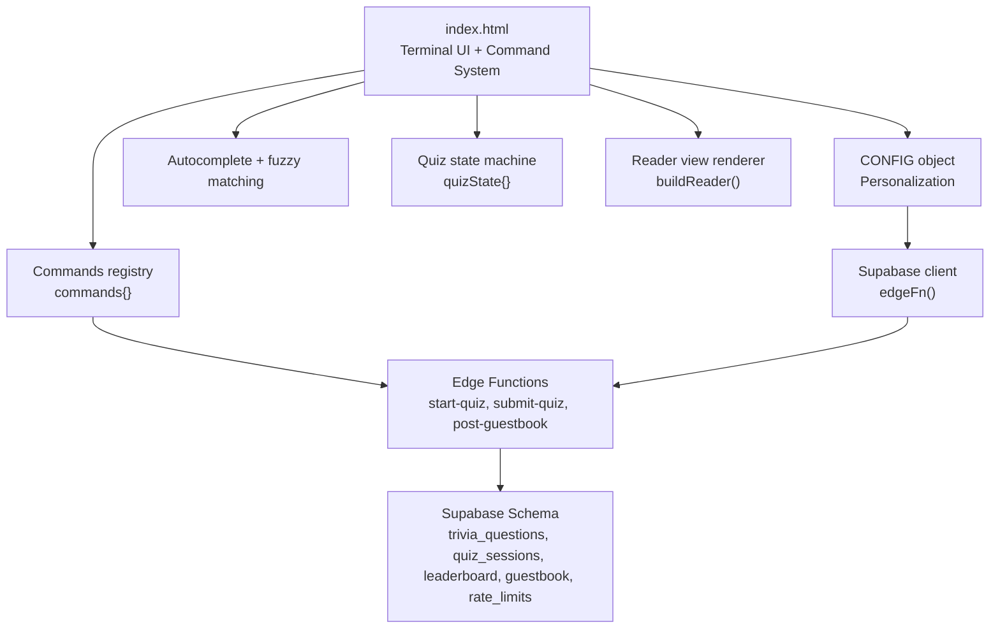
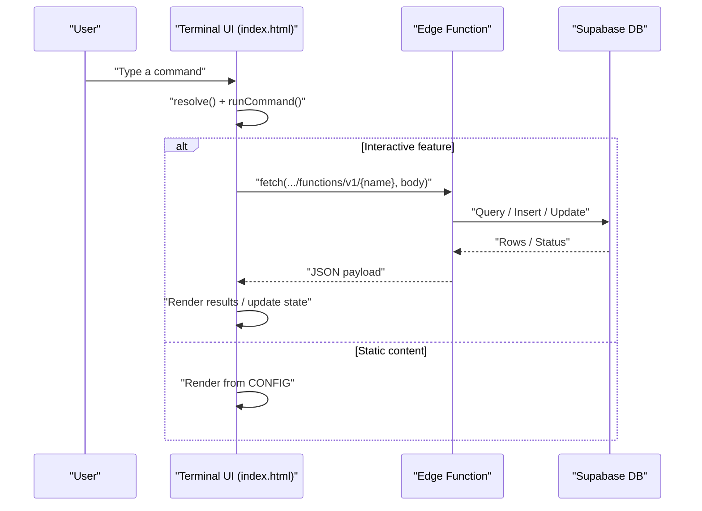
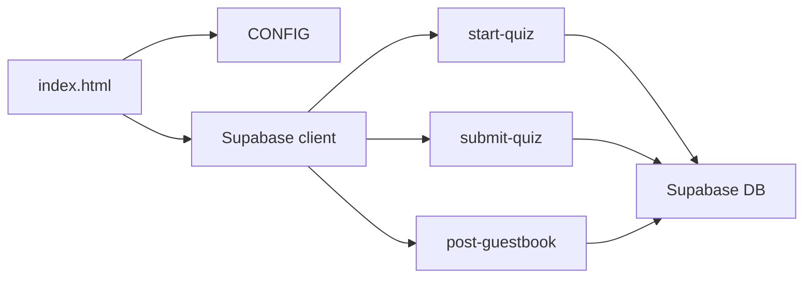
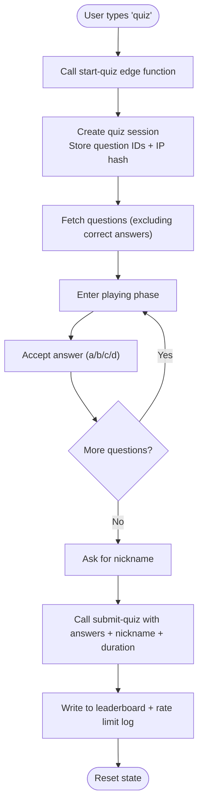
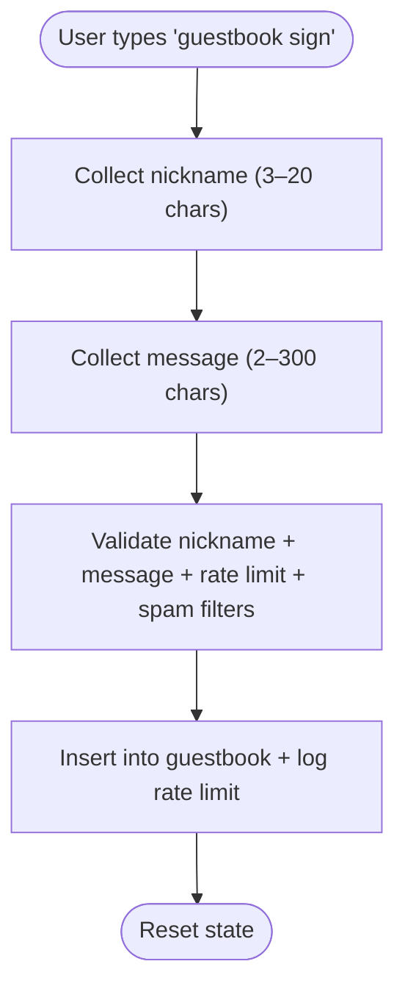

# Customization and Extension

<cite>
**Referenced Files in This Document**
- [README.md](file://README.md)
- [index.html](file://index.html)
- [start-quiz/index.ts](file://supabase/functions/start-quiz/index.ts)
- [submit-quiz/index.ts](file://supabase/functions/submit-quiz/index.ts)
- [post-guestbook/index.ts](file://supabase/functions/post-guestbook/index.ts)
- [20240101000000_init.sql](file://supabase/migrations/20240101000000_init.sql)
- [20240101000001_seed_questions.sql](file://supabase/migrations/20240101000001_seed_questions.sql)
</cite>

## Table of Contents
1. [Introduction](#introduction)
2. [Project Structure](#project-structure)
3. [Core Components](#core-components)
4. [Architecture Overview](#architecture-overview)
5. [Detailed Component Analysis](#detailed-component-analysis)
6. [Dependency Analysis](#dependency-analysis)
7. [Performance Considerations](#performance-considerations)
8. [Troubleshooting Guide](#troubleshooting-guide)
9. [Conclusion](#conclusion)
10. [Appendices](#appendices)

## Introduction
This document explains how to customize and extend the portfolio’s interactive terminal and content. It covers:
- Adding new commands to the command system, including parsing logic and UI integration
- Extending the quiz system with new question categories and difficulty levels
- Styling, theming, and visual presentation customization
- Adding new content sections and integrating external resources
- Maintaining backward compatibility when making modifications
- Extension points and guidelines for custom interactive features
- How configuration changes relate to code modifications for advanced customizations

## Project Structure
The portfolio is a single-file static site with embedded JavaScript and CSS. The terminal command system is implemented in the HTML file, while interactive features (quiz, guestbook, leaderboard) integrate with Supabase Edge Functions and a relational schema.

**Diagram sources**
- [index.html](file://index.html)
- [start-quiz/index.ts](file://supabase/functions/start-quiz/index.ts)
- [submit-quiz/index.ts](file://supabase/functions/submit-quiz/index.ts)
- [post-guestbook/index.ts](file://supabase/functions/post-guestbook/index.ts)
- [20240101000000_init.sql](file://supabase/migrations/20240101000000_init.sql)

**Section sources**
- [README.md](file://README.md)
- [index.html](file://index.html)

## Core Components
- CONFIG object: Central place to customize name, role, tagline, about, skills, strengths, projects, and contact links. Also holds Supabase credentials for interactive features.
- Commands registry: A map of command names to functions that render terminal output and drive interactive flows.
- Autocomplete and fuzzy matching: Intelligent command suggestions and correction logic.
- Quiz system: Session lifecycle, question fetching, scoring, and leaderboard submission.
- Reader view: Renders the same CONFIG content in a clean, scrollable layout.
- Styling and theming: CSS variables define two terminal color schemes and responsive styles.

**Section sources**
- [README.md](file://README.md)
- [index.html](file://index.html)

## Architecture Overview
The terminal UI runs entirely in the browser. Interactive features (quiz, guestbook) communicate with Supabase Edge Functions via a helper that calls the functions endpoint with the Supabase anonymous key. The functions enforce validation, rate limits, and write results to the database.

**Diagram sources**
- [index.html](file://index.html)
- [start-quiz/index.ts](file://supabase/functions/start-quiz/index.ts)
- [submit-quiz/index.ts](file://supabase/functions/submit-quiz/index.ts)
- [post-guestbook/index.ts](file://supabase/functions/post-guestbook/index.ts)

## Detailed Component Analysis

### Command System: Adding New Commands
- Command registry: Extend the commands object with a new function. The function receives arguments parsed from the command line and prints output to the terminal.
- Parsing logic:
  - resolve() resolves multi-word easter eggs first, then exact matches, then first-word matches, then fuzzy matches.
  - runCommand() prints the echoed prompt, resolves the command, and invokes the function with extracted arguments.
  - Autocomplete uses fuzzyScore(), getMatches(), and inline ghost hints.
- UI integration:
  - help() dynamically generates clickable chips for commands.
  - Output helpers (el(), print(), printPromptEcho()) standardize terminal rendering.

Steps to add a new command:
1. Define a new function in the commands object.
2. Optionally add it to the help chips list.
3. If the command requires argument parsing, handle it inside the function.
4. Use print() and related helpers to render output consistently.

Best practices:
- Keep command functions pure and deterministic for readability.
- Escape user-provided content to prevent XSS.
- Use the existing CONFIG-driven rendering patterns for consistency.

**Section sources**
- [index.html](file://index.html)

### Quiz System: Extending Categories and Difficulty Levels
The quiz system consists of:
- Frontend state machine (quizState) and helper functions (showQuizQuestion, submitQuizAnswer, finishQuiz).
- Edge functions:
  - start-quiz: fetches questions, shuffles, creates a session, and returns a subset to the client.
  - submit-quiz: validates answers, computes score, writes leaderboard, applies rate limits.
- Database schema:
  - trivia_questions includes category and difficulty fields.
  - quiz_sessions stores session metadata and answers.
  - leaderboard persists scores and durations.
  - rate_limits enforces throttling.

Extending categories and difficulty:
- Add new rows to trivia_questions with desired category and difficulty values.
- start-quiz filters by category via query parameter and selects fields excluding correct_answer.
- submit-quiz determines category from the session’s questions and writes to leaderboard.

Notes:
- The quiz UI reads category and difficulty from questions; ensure your new rows include these fields.
- start-quiz returns only non-sensitive fields to the client; correct answers remain server-side.

**Section sources**
- [index.html](file://index.html)
- [start-quiz/index.ts](file://supabase/functions/start-quiz/index.ts)
- [submit-quiz/index.ts](file://supabase/functions/submit-quiz/index.ts)
- [20240101000000_init.sql](file://supabase/migrations/20240101000000_init.sql)
- [20240101000001_seed_questions.sql](file://supabase/migrations/20240101000001_seed_questions.sql)

### Styling, Theming, and Visual Presentation
- Themes: Two CSS variable sets define dark and light palettes. Switching toggles the data-theme attribute and persists the choice in localStorage.
- Responsive design: Fluid layouts, media queries, and viewport-aware adjustments for mobile.
- Reader view: A separate renderer builds the same content in a clean, scrollable layout.

Customization tips:
- Edit CSS variables in the root selector to change colors globally.
- Add new color classes or adjust existing ones for consistent theming.
- Keep the reader view in sync with CONFIG updates to avoid duplication.

**Section sources**
- [index.html](file://index.html)

### Adding New Content Sections and Integrating External Resources
- Reader view: buildReader() renders CONFIG content into a structured page. To add a new section, extend the template with new headings and lists.
- Static content: Modify CONFIG to include new arrays or objects (e.g., new sections in the reader).
- External resources: Link to external URLs in CONFIG; ensure they are safe and accessible.

Guidelines:
- Mirror changes in both CONFIG and the reader renderer to keep content consistent.
- Validate external links and accessibility attributes.

**Section sources**
- [index.html](file://index.html)

### Best Practices for Backward Compatibility
- Preserve the CONFIG shape and keys to avoid breaking the reader view and command outputs.
- When renaming or removing commands, keep aliases or fallbacks to prevent user confusion.
- Keep the commands object interface stable; avoid changing argument shapes unless necessary.
- Maintain the quiz schema and function contracts; introduce new columns with defaults and handle missing values gracefully.

**Section sources**
- [index.html](file://index.html)
- [20240101000000_init.sql](file://supabase/migrations/20240101000000_init.sql)

### Extension Points and Guidelines for Custom Interactive Features
Extension points in the codebase:
- commands object: Add new interactive commands with minimal boilerplate.
- quizState: Introduce new phases or flows for multi-step interactions.
- CONFIG: Add new fields for content and links; update reader view accordingly.
- edgeFn(): Centralized helper for calling Supabase functions; reuse for new features.

Guidelines:
- Encapsulate new flows in state machines similar to quizState.
- Use CONFIG for all user-facing content to simplify maintenance.
- Apply rate limiting and validation at the edge function layer for robustness.
- Keep frontend logic declarative and reusable.

**Section sources**
- [index.html](file://index.html)

### Relationship Between Configuration Changes and Code Modifications
- CONFIG drives both the terminal and reader views. Updating CONFIG requires no code changes to content rendering.
- Interactive features require corresponding database schema updates and edge function logic.
- Theme and layout changes are purely CSS-based and do not require code modifications.

**Section sources**
- [README.md](file://README.md)
- [index.html](file://index.html)
- [20240101000000_init.sql](file://supabase/migrations/20240101000000_init.sql)

## Dependency Analysis
The terminal UI depends on:
- CONFIG for content
- Supabase client for interactive features
- Edge functions for quiz and guestbook operations
- Database schema for persistent state

**Diagram sources**
- [index.html](file://index.html)
- [start-quiz/index.ts](file://supabase/functions/start-quiz/index.ts)
- [submit-quiz/index.ts](file://supabase/functions/submit-quiz/index.ts)
- [post-guestbook/index.ts](file://supabase/functions/post-guestbook/index.ts)
- [20240101000000_init.sql](file://supabase/migrations/20240101000000_init.sql)

**Section sources**
- [index.html](file://index.html)
- [20240101000000_init.sql](file://supabase/migrations/20240101000000_init.sql)

## Performance Considerations
- The terminal is zero-dependency and statically served, minimizing latency.
- Autocomplete uses lightweight fuzzy matching; keep the command list manageable.
- Quiz and guestbook rely on database queries; ensure indexes are present for performance.
- Mobile viewport handling avoids unnecessary reflows by sizing the window to the visual viewport.

[No sources needed since this section provides general guidance]

## Troubleshooting Guide
Common issues and resolutions:
- Supabase not configured: Interactive commands will warn to set the anon key in CONFIG.
- Quiz errors: start-quiz returns an error payload; inspect the message and verify database connectivity and function deployment.
- Submit errors: submit-quiz validates nickname, duration, and answer count; ensure the client sends the correct payload.
- Guestbook errors: post-guestbook enforces rate limits and spam filters; adjust content to meet criteria.

**Section sources**
- [index.html](file://index.html)
- [submit-quiz/index.ts](file://supabase/functions/submit-quiz/index.ts)
- [post-guestbook/index.ts](file://supabase/functions/post-guestbook/index.ts)

## Conclusion
The portfolio offers a flexible foundation for customization:
- Add commands by extending the commands object and leveraging the existing parsing and UI helpers.
- Expand the quiz system by adding new rows to trivia_questions and updating edge functions if needed.
- Customize styling and themes through CSS variables and responsive design.
- Integrate new content by updating CONFIG and the reader renderer.
- Maintain backward compatibility by preserving CONFIG shapes and command interfaces.
- Use Supabase Edge Functions and schema as extension points for robust, scalable features.

[No sources needed since this section summarizes without analyzing specific files]

## Appendices

### Appendix A: Quiz Flow

**Diagram sources**
- [index.html](file://index.html)
- [start-quiz/index.ts](file://supabase/functions/start-quiz/index.ts)
- [submit-quiz/index.ts](file://supabase/functions/submit-quiz/index.ts)

### Appendix B: Guestbook Flow

**Diagram sources**
- [index.html](file://index.html)
- [post-guestbook/index.ts](file://supabase/functions/post-guestbook/index.ts)