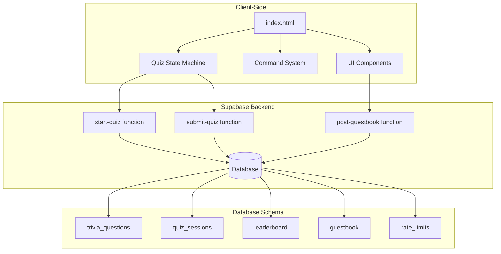
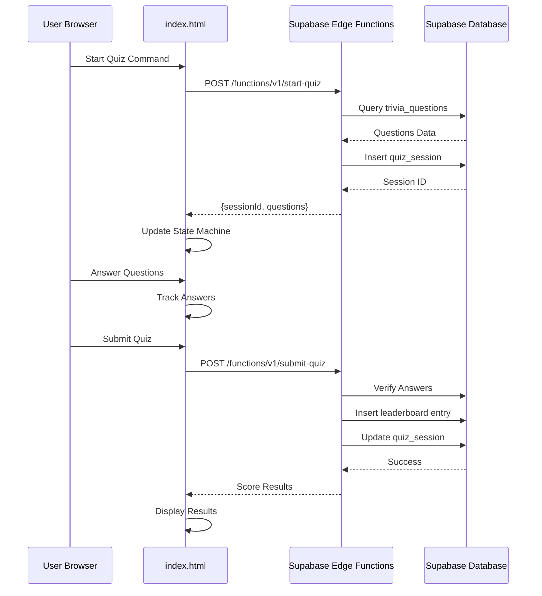
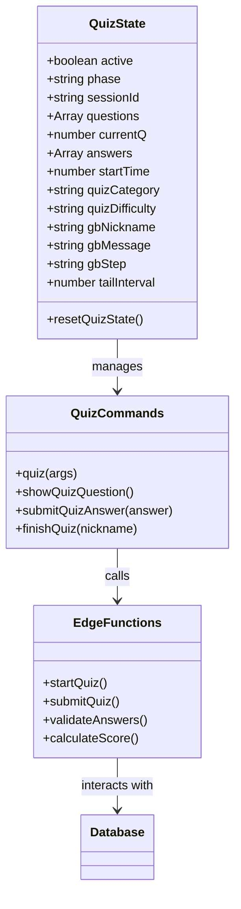
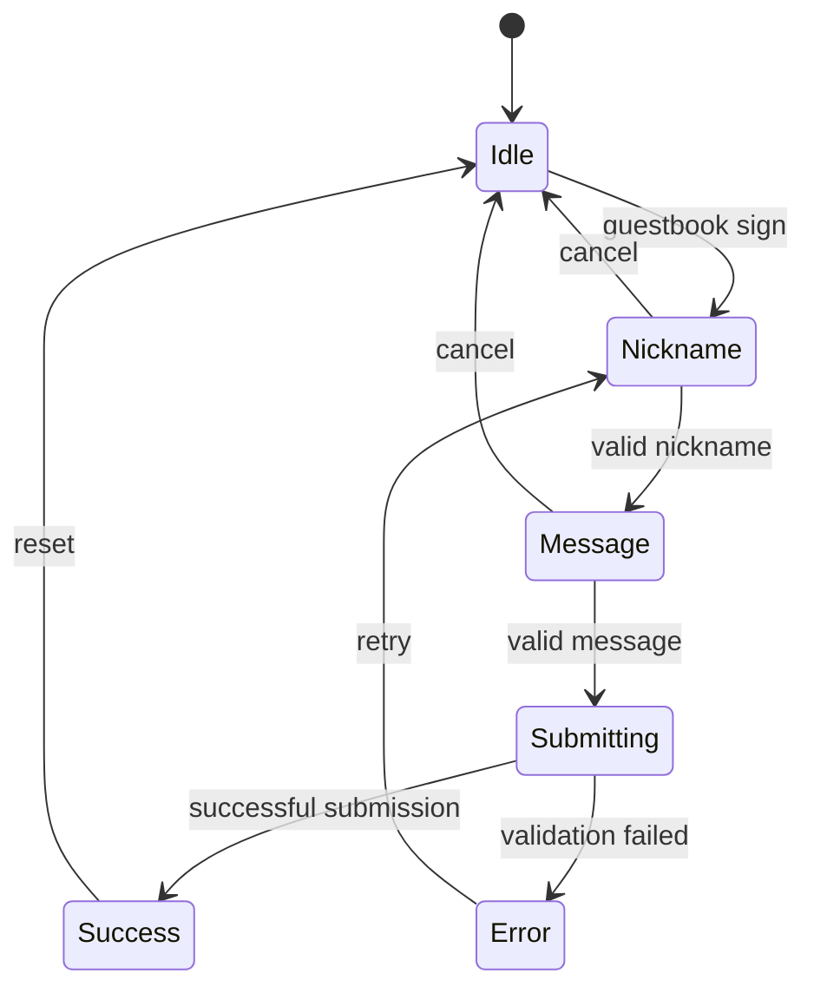
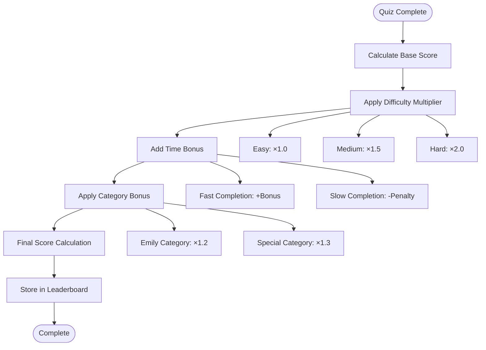
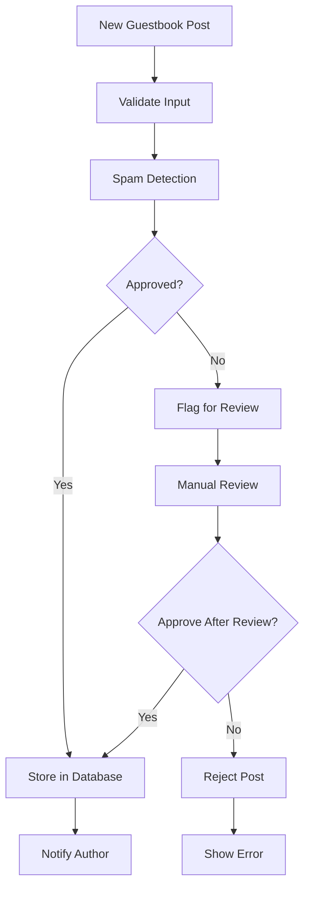
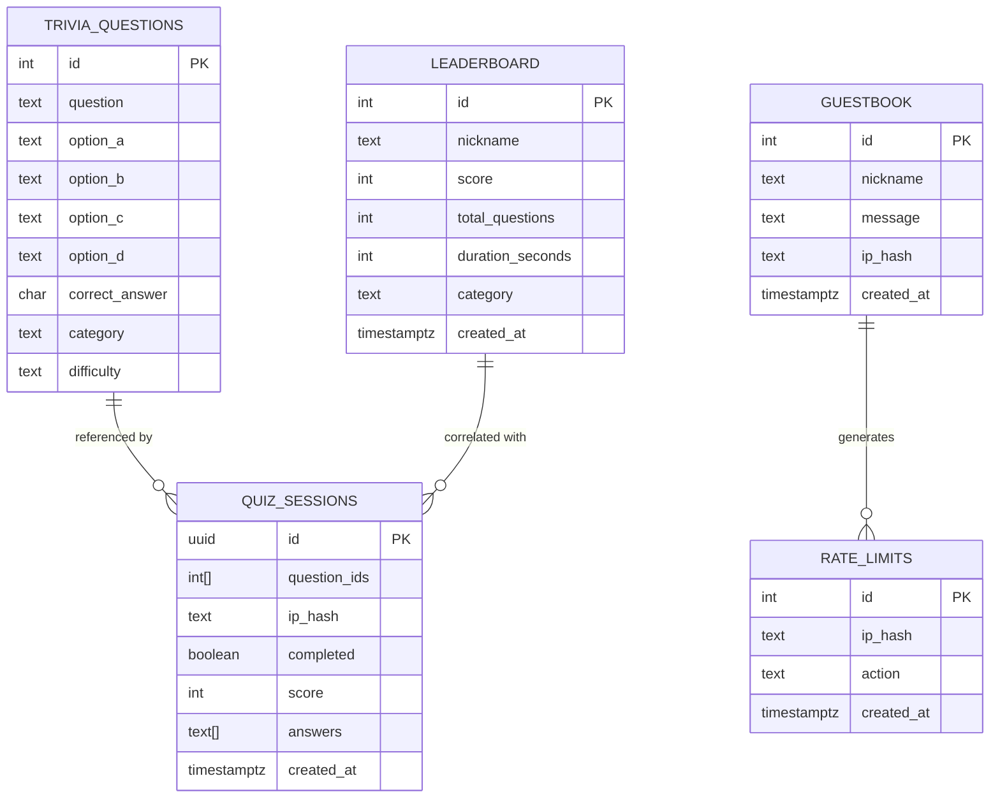

# Feature Enhancement

<cite>
**Referenced Files in This Document**
- [index.html](file://index.html)
- [start-quiz/index.ts](file://supabase/functions/start-quiz/index.ts)
- [submit-quiz/index.ts](file://supabase/functions/submit-quiz/index.ts)
- [post-guestbook/index.ts](file://supabase/functions/post-guestbook/index.ts)
- [init.sql](file://supabase/migrations/20240101000000_init.sql)
- [seed_questions.sql](file://supabase/migrations/20240101000001_seed_questions.sql)
</cite>

## Table of Contents
1. [Introduction](#introduction)
2. [Project Structure](#project-structure)
3. [Core Components](#core-components)
4. [Architecture Overview](#architecture-overview)
5. [Detailed Component Analysis](#detailed-component-analysis)
6. [Enhancement Guidelines](#enhancement-guidelines)
7. [New Question Categories Implementation](#new-question-categories-implementation)
8. [Difficulty Levels Enhancement](#difficulty-levels-enhancement)
9. [Scoring Mechanisms Extension](#scoring-mechanisms-extension)
10. [Guestbook Enhancement Possibilities](#guestbook-enhancement-possibilities)
11. [State Machine Pattern Implementation](#state-machine-pattern-implementation)
12. [Supabase Integration](#supabase-integration)
13. [Database Schema Modifications](#database-schema-modifications)
14. [Backward Compatibility](#backward-compatibility)
15. [Performance Considerations](#performance-considerations)
16. [Troubleshooting Guide](#troubleshooting-guide)
17. [Conclusion](#conclusion)

## Introduction

This document provides comprehensive guidelines for enhancing the existing interactive portfolio features. The portfolio currently includes a trivia quiz system with leaderboards and a guestbook functionality, all powered by Supabase edge functions and a sophisticated state machine pattern. This guide focuses on extending these features while maintaining backward compatibility and user experience consistency.

The enhancement areas include expanding question categories, implementing new difficulty levels, developing advanced scoring mechanisms, and enhancing guestbook capabilities with moderation, filtering, and display customization options.

## Project Structure

The project follows a modern web architecture with client-side interactivity and serverless backend functions:



**Diagram sources**
- [index.html:546-563](file://index.html#L546-L563)
- [start-quiz/index.ts:15-69](file://supabase/functions/start-quiz/index.ts#L15-L69)
- [submit-quiz/index.ts:18-119](file://supabase/functions/submit-quiz/index.ts#L18-L119)
- [post-guestbook/index.ts:17-82](file://supabase/functions/post-guestbook/index.ts#L17-L82)

**Section sources**
- [index.html:1-1803](file://index.html#L1-L1803)
- [start-quiz/index.ts:1-75](file://supabase/functions/start-quiz/index.ts#L1-L75)
- [submit-quiz/index.ts:1-131](file://supabase/functions/submit-quiz/index.ts#L1-L131)
- [post-guestbook/index.ts:1-94](file://supabase/functions/post-guestbook/index.ts#L1-L94)

## Core Components

### Quiz State Machine
The quiz system implements a sophisticated finite state machine with the following phases:
- **idle**: Initial state before quiz starts
- **playing**: Active quiz phase with question answering
- **nickname**: Post-quiz phase for leaderboard submission
- **message**: Guestbook signing flow
- **done**: Final state after completion

### Command System
The terminal interface provides a comprehensive command system with:
- Interactive commands for quiz, leaderboard, and guestbook
- Auto-completion and fuzzy matching
- Easter egg commands for enhanced user experience
- Mobile-responsive design with visual viewport handling

### Edge Functions Architecture
Three serverless functions handle backend operations:
- **start-quiz**: Initializes quiz sessions and loads questions
- **submit-quiz**: Processes quiz submissions and updates leaderboards
- **post-guestbook**: Manages guestbook entries with spam protection

**Section sources**
- [index.html:546-563](file://index.html#L546-L563)
- [index.html:942-1096](file://index.html#L942-L1096)
- [index.html:1388-1488](file://index.html#L1388-L1488)

## Architecture Overview

The system follows a client-server architecture with serverless functions:



**Diagram sources**
- [index.html:942-1056](file://index.html#L942-L1056)
- [start-quiz/index.ts:15-69](file://supabase/functions/start-quiz/index.ts#L15-L69)
- [submit-quiz/index.ts:18-119](file://supabase/functions/submit-quiz/index.ts#L18-L119)

## Detailed Component Analysis

### Quiz System Architecture

The quiz system demonstrates excellent separation of concerns with clear state management:



**Diagram sources**
- [index.html:546-575](file://index.html#L546-L575)
- [index.html:942-1461](file://index.html#L942-L1461)
- [start-quiz/index.ts:15-69](file://supabase/functions/start-quiz/index.ts#L15-L69)

### Guestbook System Analysis

The guestbook implements a multi-step state machine for message submission:



**Diagram sources**
- [index.html:1058-1096](file://index.html#L1058-L1096)
- [index.html:1463-1488](file://index.html#L1463-L1488)
- [post-guestbook/index.ts:17-82](file://supabase/functions/post-guestbook/index.ts#L17-L82)

**Section sources**
- [index.html:1058-1488](file://index.html#L1058-L1488)
- [post-guestbook/index.ts:17-82](file://supabase/functions/post-guestbook/index.ts#L17-L82)

## Enhancement Guidelines

### State Machine Pattern Extension

When implementing new interactive features, follow the established state machine pattern:

1. **Define Clear States**: Each feature should have distinct states with clear transitions
2. **Maintain Backward Compatibility**: New states should not break existing functionality
3. **Consistent State Management**: Use the existing `quizState` object pattern
4. **Error Handling**: Implement robust error states and recovery mechanisms

### User Experience Consistency

Ensure new features maintain the terminal-style interface:
- Preserve the command-line aesthetic
- Maintain responsive design for mobile devices
- Keep consistent color schemes and typography
- Follow the existing input/output patterns

### Security Considerations

Implement comprehensive validation and rate limiting:
- Input sanitization and validation
- Rate limiting for all external API calls
- Spam detection for user-generated content
- Proper error handling without exposing sensitive information

## New Question Categories Implementation

### Current Category Support

The system currently supports:
- **postgresql**: Database-related questions
- **linux**: System administration questions  
- **gitlab**: DevOps and CI/CD questions
- **emily**: Personal trivia about the creator
- **mixed**: Default category combining all topics

### Adding New Categories

To implement new question categories:

1. **Database Schema Changes**:
   ```sql
   -- Add new category to seed data
   INSERT INTO trivia_questions (question, option_a, option_b, option_c, option_d, correct_answer, category, difficulty) VALUES
   ('New question text', 'Option A', 'Option B', 'Option C', 'Option D', 'a', 'new-category', 'easy');
   ```

2. **Client-Side Integration**:
   ```javascript
   // Extend quiz command parsing
   if (sub === 'new-category') {
     category = 'new-category';
     label = 'New Category';
   }
   ```

3. **Edge Function Updates**:
   Modify the start-quiz function to handle new categories:
   ```typescript
   if (category && category !== 'mixed') {
     query = query.eq("category", category);
   }
   ```

**Section sources**
- [seed_questions.sql:7-61](file://supabase/migrations/20240101000001_seed_questions.sql#L7-L61)
- [index.html:942-999](file://index.html#L942-L999)
- [start-quiz/index.ts:23-35](file://supabase/functions/start-quiz/index.ts#L23-L35)

## Difficulty Levels Enhancement

### Current Difficulty Support

The system supports three difficulty levels:
- **easy**: 10 questions with 30-second base time bonus
- **medium**: 10 questions with 20-second base time bonus  
- **hard**: 10 questions with 10-second base time bonus
- **mixed**: Default difficulty combining all levels

### Advanced Scoring System

Implement a tiered scoring mechanism:



**Diagram sources**
- [submit-quiz/index.ts:83-106](file://supabase/functions/submit-quiz/index.ts#L83-L106)
- [index.html:1427-1461](file://index.html#L1427-L1461)

### Implementation Steps

1. **Database Schema Enhancement**:
   ```sql
   -- Add scoring columns to leaderboard
   ALTER TABLE leaderboard ADD COLUMN difficulty_bonus INTEGER DEFAULT 0;
   ALTER TABLE leaderboard ADD COLUMN time_bonus INTEGER DEFAULT 0;
   ALTER TABLE leaderboard ADD COLUMN category_bonus INTEGER DEFAULT 0;
   ```

2. **Edge Function Updates**:
   ```typescript
   // Enhanced scoring calculation
   let difficultyMultiplier = 1.0;
   switch(difficulty) {
     case 'easy': difficultyMultiplier = 1.0; break;
     case 'medium': difficultyMultiplier = 1.5; break;
     case 'hard': difficultyMultiplier = 2.0; break;
   }
   
   const timeBonus = Math.max(0, 60 - duration) * 0.5;
   const categoryBonus = category === 'emily' ? score * 0.2 : 0;
   const finalScore = Math.round((score + timeBonus + categoryBonus) * difficultyMultiplier);
   ```

3. **Client-Side Display**:
   Update the leaderboard command to show breakdown:
   ```javascript
   print(`  ${rank}  ${nick}${sc}${dur}${diff}${cat}`);
   print(`    Base: ${score} | Diff: +${difficultyBonus} | Time: +${timeBonus} | Cat: +${categoryBonus}`);
   ```

**Section sources**
- [submit-quiz/index.ts:83-119](file://supabase/functions/submit-quiz/index.ts#L83-L119)
- [index.html:1001-1056](file://index.html#L1001-L1056)

## Scoring Mechanisms Extension

### Current Scoring System

The existing scoring system calculates:
- **Raw Score**: Correct answers out of total questions
- **Percentage**: Rounded percentage accuracy
- **Emoji Feedback**: Based on performance thresholds

### Advanced Scoring Features

Implement comprehensive scoring analytics:

1. **Category-Specific Scores**:
   ```sql
   -- Add category breakdown to leaderboard
   ALTER TABLE leaderboard ADD COLUMN category_scores JSONB DEFAULT '{}';
   ```

2. **Streak Bonuses**:
   - Perfect streak: +10% bonus
   - 5-in-a-row: +5 seconds bonus
   - Daily participation: +2 points

3. **Knowledge Domain Tracking**:
   ```javascript
   // Track category performance
   const categoryScores = {};
   questions.forEach((q, i) => {
     const cat = q.category;
     if (!categoryScores[cat]) categoryScores[cat] = { correct: 0, total: 0 };
     categoryScores[cat].total++;
     if (answers[i] === q.correct_answer) {
       categoryScores[cat].correct++;
     }
   });
   ```

4. **Leaderboard Ranking Enhancements**:
   ```sql
   -- Multi-factor ranking
   CREATE INDEX idx_leaderboard_composite ON leaderboard (score DESC, duration_seconds ASC, created_at DESC);
   ```

**Section sources**
- [index.html:1427-1461](file://index.html#L1427-L1461)
- [init.sql:28-37](file://supabase/migrations/20240101000000_init.sql#L28-L37)

## Guestbook Enhancement Possibilities

### Current Guestbook Features

The guestbook includes:
- **Spam Protection**: Regex-based filtering for URLs and keywords
- **Rate Limiting**: 5 posts per hour per IP address
- **Validation**: Nickname and message length constraints
- **Display**: Recent entries with timestamps

### Moderation System Implementation



**Diagram sources**
- [post-guestbook/index.ts:17-82](file://supabase/functions/post-guestbook/index.ts#L17-L82)

### Filtering and Display Customization

1. **Advanced Filtering Options**:
   ```javascript
   // Enhanced guestbook command with filters
   async guestbook(args){
     const filters = parseFilters(args);
     let query = sb.from('guestbook');
     
     if (filters.moderation) {
       query = query.eq('status', filters.moderation);
     }
     if (filters.category) {
       query = query.eq('category', filters.category);
     }
     if (filters.dateRange) {
       query = query.gte('created_at', filters.dateRange.start)
                .lte('created_at', filters.dateRange.end);
     }
   }
   ```

2. **Display Customization**:
   - **Grid View**: Alternative layout for mobile
   - **Color Coding**: Different colors for different categories
   - **Pagination**: Load more functionality
   - **Search**: Real-time search within guestbook entries

3. **User Preferences**:
   ```sql
   -- Add user preferences table
   CREATE TABLE guestbook_preferences (
     user_id UUID PRIMARY KEY,
     theme TEXT DEFAULT 'default',
     sort_order TEXT DEFAULT 'newest',
     notifications BOOLEAN DEFAULT TRUE,
     created_at TIMESTAMPTZ DEFAULT now()
   );
   ```

**Section sources**
- [post-guestbook/index.ts:17-82](file://supabase/functions/post-guestbook/index.ts#L17-L82)
- [index.html:1058-1096](file://index.html#L1058-L1096)

## State Machine Pattern Implementation

### Extending the Existing Pattern

To implement new interactive features following the established pattern:

1. **State Definition**:
   ```javascript
   const newState = {
     active: false,
     phase: 'idle', // idle | playing | nickname | message | done
     sessionId: null,
     data: {}, // feature-specific data
     startTime: 0,
     // ... other state properties
   };
   ```

2. **Command Integration**:
   ```javascript
   async newFeature(args) {
     if (newState.active) {
       print('<span class="yellow">Feature already in progress!</span>');
       return;
     }
     
     newState.active = true;
     newState.phase = 'playing';
     // Initialize feature-specific logic
   }
   ```

3. **Input Handling**:
   ```javascript
   if (newState.phase === 'playing') {
     const input = v.trim().toLowerCase();
     if (['a','b','c','d'].includes(input)) {
       handleFeatureAnswer(input);
     } else if (input === 'quit') {
       resetNewState();
     }
   }
   ```

4. **State Reset**:
   ```javascript
   function resetNewState() {
     newState.active = false;
     newState.phase = 'idle';
     newState.sessionId = null;
     newState.data = {};
     newState.startTime = 0;
   }
   ```

### Best Practices

- **Consistent Naming**: Use descriptive names for states and phases
- **Error Recovery**: Always provide clear error states and recovery options
- **Progress Indication**: Show clear feedback for long-running operations
- **Graceful Degradation**: Handle edge cases and partial failures gracefully

**Section sources**
- [index.html:546-575](file://index.html#L546-L575)
- [index.html:1635-1692](file://index.html#L1635-L1692)

## Supabase Integration

### Edge Function Architecture

Each feature is implemented as a separate edge function with clear responsibilities:

```mermaid
graph LR
subgraph "Client"
A[index.html)
end
subgraph "Supabase Edge Functions"
B[start-quiz]
C[submit-quiz]
D[post-guestbook]
E[Additional Features]
end
subgraph "Database"
F[trivia_questions]
G[quiz_sessions]
H[leaderboard]
I[guestbook]
J[rate_limits]
end
A --> B
A --> C
A --> D
B --> F
B --> G
C --> G
C --> H
C --> J
D --> I
D --> J
E --> F
E --> G
E --> H
E --> I
E --> J
```

**Diagram sources**
- [index.html:538-544](file://index.html#L538-L544)
- [start-quiz/index.ts:15-69](file://supabase/functions/start-quiz/index.ts#L15-L69)
- [submit-quiz/index.ts:18-119](file://supabase/functions/submit-quiz/index.ts#L18-L119)
- [post-guestbook/index.ts:17-82](file://supabase/functions/post-guestbook/index.ts#L17-L82)

### Function Deployment and Management

1. **Deployment Process**:
   ```bash
   # Deploy individual functions
   supabase functions deploy start-quiz
   supabase functions deploy submit-quiz
   supabase functions deploy post-guestbook
   
   # Create new function
   mkdir supabase/functions/new-feature
   # Add index.ts file
   supabase functions deploy new-feature
   ```

2. **Environment Configuration**:
   ```typescript
   const supabase = createClient(
     Deno.env.get("SUPABASE_URL")!,
     Deno.env.get("SUPABASE_SERVICE_ROLE_KEY")!,
   );
   ```

3. **CORS Configuration**:
   ```typescript
   const CORS = {
     "Access-Control-Allow-Origin": "*",
     "Access-Control-Allow-Headers": "authorization, x-client-info, apikey, content-type",
   };
   ```

**Section sources**
- [start-quiz/index.ts:10-13](file://supabase/functions/start-quiz/index.ts#L10-L13)
- [submit-quiz/index.ts:10-13](file://supabase/functions/submit-quiz/index.ts#L10-L13)
- [post-guestbook/index.ts:7-10](file://supabase/functions/post-guestbook/index.ts#L7-L10)

## Database Schema Modifications

### Current Schema Overview

The database follows a normalized design with clear relationships:



**Diagram sources**
- [init.sql:4-54](file://supabase/migrations/20240101000000_init.sql#L4-L54)

### Recommended Schema Extensions

1. **Enhanced Leaderboard**:
   ```sql
   -- Add performance metrics
   ALTER TABLE leaderboard ADD COLUMN category_breakdown JSONB DEFAULT '{}';
   ALTER TABLE leaderboard ADD COLUMN streak_count INTEGER DEFAULT 0;
   ALTER TABLE leaderboard ADD COLUMN first_attempt BOOLEAN DEFAULT FALSE;
   ALTER TABLE leaderboard ADD COLUMN completion_time INTEGER;
   ```

2. **Guestbook Enhancements**:
   ```sql
   -- Add moderation fields
   ALTER TABLE guestbook ADD COLUMN status TEXT DEFAULT 'approved';
   ALTER TABLE guestbook ADD COLUMN moderation_notes TEXT;
   ALTER TABLE guestbook ADD COLUMN category TEXT DEFAULT 'general';
   ALTER TABLE guestbook ADD COLUMN flagged BOOLEAN DEFAULT FALSE;
   
   -- Add user preferences
   CREATE TABLE guestbook_user_preferences (
     user_id UUID PRIMARY KEY,
     theme TEXT DEFAULT 'default',
     sort_order TEXT DEFAULT 'newest',
     notifications BOOLEAN DEFAULT TRUE,
     created_at TIMESTAMPTZ DEFAULT now()
   );
   ```

3. **Quiz Analytics**:
   ```sql
   -- Add quiz performance tracking
   CREATE TABLE quiz_performance (
     id SERIAL PRIMARY KEY,
     session_id UUID,
     question_id INTEGER,
     answer TEXT,
     is_correct BOOLEAN,
     response_time INTEGER,
     category TEXT,
     difficulty TEXT,
     created_at TIMESTAMPTZ DEFAULT now()
   );
   
   CREATE INDEX idx_quiz_performance_session ON quiz_performance(session_id);
   CREATE INDEX idx_quiz_performance_question ON quiz_performance(question_id);
   ```

4. **Rate Limiting Improvements**:
   ```sql
   -- More granular rate limiting
   ALTER TABLE rate_limits ADD COLUMN action_type TEXT DEFAULT 'general';
   ALTER TABLE rate_limits ADD COLUMN ip_address TEXT;
   
   -- Create composite index for better performance
   DROP INDEX idx_rate_limits_lookup;
   CREATE INDEX idx_rate_limits_composite ON rate_limits (ip_hash, action, action_type, created_at);
   ```

**Section sources**
- [init.sql:48-87](file://supabase/migrations/20240101000000_init.sql#L48-L87)
- [seed_questions.sql:7-61](file://supabase/migrations/20240101000001_seed_questions.sql#L7-L61)

## Backward Compatibility

### Maintaining Compatibility

When extending features, ensure backward compatibility:

1. **API Versioning**: Use versioned endpoints for major changes
2. **Default Values**: Always provide sensible defaults for new fields
3. **Graceful Degradation**: Handle missing data gracefully
4. **Schema Evolution**: Use ALTER TABLE statements for database changes

### Migration Strategies

1. **Zero-Downtime Deployments**: Use Supabase's built-in migration system
2. **Data Validation**: Implement validation in both client and server code
3. **Fallback Logic**: Provide fallback behavior for older clients
4. **Testing**: Thoroughly test with existing data and configurations

### Example Compatibility Implementation

```javascript
// Backward compatible quiz command
async quiz(args) {
  // Parse subcommand with fallback
  const sub = (args || '').trim().toLowerCase();
  let category = null;
  let difficulty = null;
  
  // Support legacy commands
  if (sub === 'easy' || sub === 'medium' || sub === 'hard') {
    difficulty = sub;
  } else if (sub === 'emily') {
    category = 'emily';
  } else if (sub && sub !== '') {
    // Treat unknown as category (legacy behavior)
    category = sub;
  }
  
  // Continue with existing logic...
}
```

**Section sources**
- [index.html:942-999](file://index.html#L942-L999)

## Performance Considerations

### Client-Side Optimization

1. **State Management**: Minimize DOM manipulation by batching updates
2. **Event Handling**: Use event delegation for dynamic content
3. **Memory Management**: Clear intervals and timeouts when components unmount
4. **Responsive Design**: Optimize for mobile devices with reduced bandwidth

### Server-Side Optimization

1. **Database Queries**: Use appropriate indexes and limit result sets
2. **Edge Function Caching**: Cache frequently accessed data where appropriate
3. **Rate Limiting**: Implement efficient rate limiting to prevent abuse
4. **Error Handling**: Return meaningful errors without exposing sensitive information

### Monitoring and Metrics

1. **Performance Tracking**: Monitor function execution times and error rates
2. **User Analytics**: Track feature adoption and engagement metrics
3. **Database Performance**: Monitor query performance and optimize slow queries
4. **Cost Optimization**: Monitor Supabase resource usage and optimize costs

## Troubleshooting Guide

### Common Issues and Solutions

1. **Quiz Session Errors**:
   - **Symptom**: "Session not found" or "Session already submitted"
   - **Solution**: Verify session ID validity and check quiz_sessions table
   - **Prevention**: Implement session validation and cleanup procedures

2. **Guestbook Submission Failures**:
   - **Symptom**: "Rate limit reached" or spam detection errors
   - **Solution**: Check rate_limits table and adjust thresholds
   - **Prevention**: Implement user-friendly rate limit messaging

3. **Database Connection Issues**:
   - **Symptom**: "Could not load questions" or "Could not save message"
   - **Solution**: Verify Supabase credentials and connection settings
   - **Prevention**: Implement connection retry logic and health checks

4. **Edge Function Deployment Problems**:
   - **Symptom**: "Function not found" or deployment failures
   - **Solution**: Check function names and deployment logs
   - **Prevention**: Use consistent naming conventions and automated deployment

### Debugging Tools

1. **Browser Developer Tools**: Inspect network requests and console errors
2. **Supabase Dashboard**: Monitor function execution and database performance
3. **Logging**: Implement structured logging for better debugging
4. **Error Tracking**: Set up error reporting for production issues

**Section sources**
- [submit-quiz/index.ts:51-57](file://supabase/functions/submit-quiz/index.ts#L51-L57)
- [post-guestbook/index.ts:63-65](file://supabase/functions/post-guestbook/index.ts#L63-L65)

## Conclusion

This comprehensive enhancement guide provides a roadmap for extending the interactive portfolio features while maintaining the existing architecture and user experience. The key principles include:

- **Consistency**: Follow the established state machine pattern and command system
- **Compatibility**: Ensure backward compatibility with existing features and data
- **Security**: Implement robust validation, rate limiting, and spam protection
- **Performance**: Optimize both client and server-side operations
- **Extensibility**: Design systems that can accommodate future feature additions

The proposed enhancements to question categories, difficulty levels, scoring mechanisms, and guestbook capabilities will significantly improve the user experience while preserving the technical excellence of the existing implementation. The modular architecture ensures that new features can be developed and deployed independently, allowing for continuous improvement without disrupting existing functionality.

By following these guidelines and maintaining the established patterns, the portfolio will continue to evolve as an innovative showcase of interactive web development while serving as a functional platform for engaging visitors.