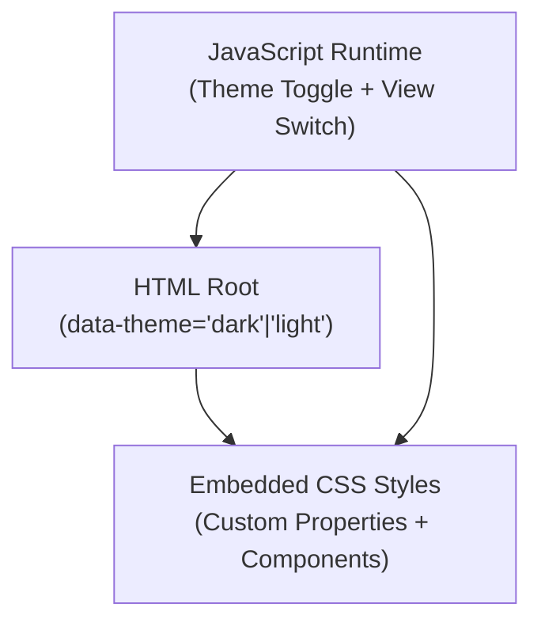
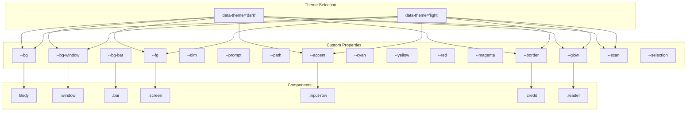
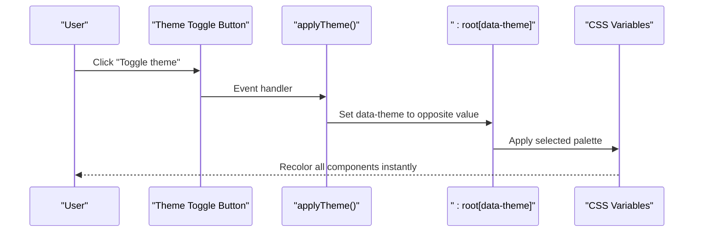
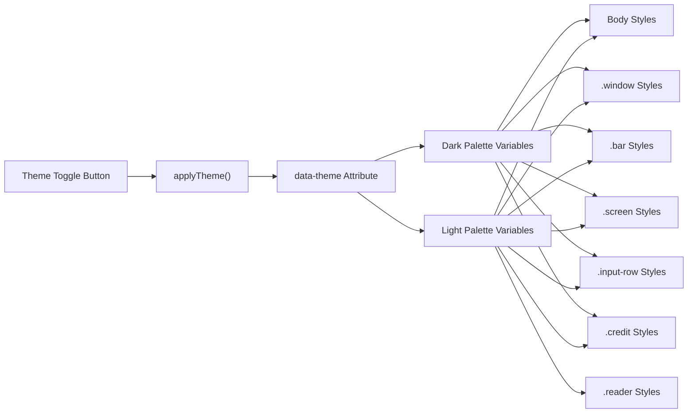

# Styling and Theming

<cite>
**Referenced Files in This Document**
- [index.html](file://index.html)
- [README.md](file://README.md)
</cite>

## Table of Contents
1. [Introduction](#introduction)
2. [Project Structure](#project-structure)
3. [Core Components](#core-components)
4. [Architecture Overview](#architecture-overview)
5. [Detailed Component Analysis](#detailed-component-analysis)
6. [Dependency Analysis](#dependency-analysis)
7. [Performance Considerations](#performance-considerations)
8. [Troubleshooting Guide](#troubleshooting-guide)
9. [Conclusion](#conclusion)

## Introduction
This document explains the styling and theming system for the portfolio website. It focuses on the CSS custom properties architecture, dark and light theme palettes, terminal color scheme variables, responsive design with media queries, typography using JetBrains Mono, window styling and animations, and visual effects like scanlines and grid backgrounds. It also provides guidelines for creating custom themes while maintaining visual consistency across components.

## Project Structure
The styling and theming system is implemented entirely within a single HTML file. The CSS is embedded in a `<style>` block and uses CSS custom properties (variables) scoped to the root element with a data-theme attribute. JavaScript toggles the theme and view modes and persists preferences in localStorage.

**Diagram sources**
- [index.html:2](file://index.html#L2)
- [index.html:11-425](file://index.html#L11-L425)
- [index.html:577-589](file://index.html#L577-L589)

**Section sources**
- [index.html:2](file://index.html#L2)
- [index.html:11-425](file://index.html#L11-L425)
- [README.md:14](file://README.md#L14)

## Core Components
- CSS custom properties system: Defines theme variables for background, foreground, borders, accents, and visual effects.
- Terminal color scheme: Uses dedicated variables for prompt, path, and accent colors to simulate a terminal interface.
- Typography: JetBrains Mono is the primary monospace font with fallbacks.
- Window and overlay styling: Title bar, traffic-light dots, animated boot-in effect, and scanline/grain overlays.
- Responsive design: Media queries optimize spacing, typography, and interactive targets for mobile devices.
- Reader view: Alternative presentation mode with distinct layout and typography.

**Section sources**
- [index.html:15-50](file://index.html#L15-L50)
- [index.html:55-76](file://index.html#L55-L76)
- [index.html:78-94](file://index.html#L78-L94)
- [index.html:137-147](file://index.html#L137-L147)
- [index.html:350-403](file://index.html#L350-L403)
- [index.html:266-337](file://index.html#L266-L337)

## Architecture Overview
The styling architecture centers on CSS custom properties defined at the root level and consumed by all components. Theme switching updates the root’s data-theme attribute, which selects the appropriate property set. Components reference variables consistently to ensure cohesive visuals across the terminal and reader views.

**Diagram sources**
- [index.html:15-50](file://index.html#L15-L50)
- [index.html:55-76](file://index.html#L55-L76)
- [index.html:78-94](file://index.html#L78-L94)
- [index.html:97-135](file://index.html#L97-L135)
- [index.html:149-158](file://index.html#L149-L158)
- [index.html:201-208](file://index.html#L201-L208)
- [index.html:251-261](file://index.html#L251-L261)
- [index.html:266-337](file://index.html#L266-L337)

## Detailed Component Analysis

### CSS Custom Properties System
- Purpose: Centralized theming via CSS variables scoped to the root element.
- Mechanism: The root element carries a data-theme attribute that switches between dark and light palettes.
- Persistence: Theme selection is stored in localStorage and restored on load.

Key variables and their roles:
- Background and window: --bg, --bg-window, --bg-bar
- Foreground and dim text: --fg, --dim
- Terminal prompt and path: --prompt, --path
- Accent and brand colors: --accent, --cyan, --yellow, --red, --magenta
- Borders and glow: --border, --glow
- Selection and scanline effects: --selection, --scan

**Section sources**
- [index.html:15-50](file://index.html#L15-L50)
- [index.html:577-589](file://index.html#L577-L589)

### Terminal Color Scheme Variables
- Background colors: --bg-window for the main window, --bg-bar for the title bar.
- Text colors: --fg for general text, --dim for muted text, --prompt for the shell prompt segment, --path for the current directory segment.
- Accent colors: --accent for interactive elements and highlights, with --cyan, --yellow, --red, --magenta for semantic emphasis.
- Border colors: --border for borders and separators.
- Effects: --glow for subtle background glows, --scan for CRT scanline overlay, --selection for text selection highlight.

These variables are applied consistently across components like the title bar, input row, and interactive chips.

**Section sources**
- [index.html:78-94](file://index.html#L78-L94)
- [index.html:97-135](file://index.html#L97-L135)
- [index.html:137-147](file://index.html#L137-L147)
- [index.html:163-172](file://index.html#L163-L172)

### Typography System
- Font family: JetBrains Mono with fallbacks to system monospace fonts.
- Base font sizes and line heights: Defined for the body and screen content.
- Semantic text classes: .prompt, .path, .cmd, .dim, .accent, .cyan, .yellow, .red, .magenta, .b (bold weight).
- Reader view typography: Separate styles for headings, lists, links, and content blocks.

**Section sources**
- [index.html:58](file://index.html#L58)
- [index.html:163-172](file://index.html#L163-L172)
- [index.html:280-337](file://index.html#L280-L337)

### Window Styling, Animation Effects, and Visual Elements
- Window container: .window defines sizing, border radius, shadow, and overflow behavior.
- Title bar: .bar includes traffic-light dot indicators and a title area with hoverable buttons.
- Animations: bootIn keyframe animates the window entrance; cursor blinks during typing; fade-in appears for new lines.
- Scanlines and grid: A pseudo-element overlay creates a CRT scanline effect; the body background includes a radial glow and a grid pattern using --border and --glow.

**Section sources**
- [index.html:78-94](file://index.html#L78-L94)
- [index.html:97-135](file://index.html#L97-L135)
- [index.html:137-147](file://index.html#L137-L147)
- [index.html:137-147](file://index.html#L137-L147)
- [index.html:358-369](file://index.html#L358-L369)

### Responsive Design System and Media Queries
- Breakpoint: max-width: 600px drives mobile optimizations.
- Full-screen behavior: On small screens, the window becomes full-viewport sized with reduced border radius and shadow.
- Touch-friendly adjustments: Larger tap targets for buttons, increased font sizes for input and content, and removal of hints to save space.
- Safe areas: Uses env(safe-area-inset-bottom) to prevent overlap with on-screen controls.
- Reader view tweaks: Adjusts padding and typography for compact screens.

**Section sources**
- [index.html:350-403](file://index.html#L350-L403)
- [index.html:418-424](file://index.html#L418-L424)

### Reader View Styling
- Layout: A separate .reader container with distinct padding and scrollbar styling.
- Typography: Dedicated classes for headings, sections, lists, links, and content blocks.
- Interactive elements: Buttons and links styled with theme variables for consistency.

**Section sources**
- [index.html:266-337](file://index.html#L266-L337)

### Creating Custom Themes Beyond Dark/Light
To create a new theme:
1. Define a new palette block under :root with a unique data-theme value.
2. Assign values to all required variables (--bg, --bg-window, --bg-bar, --fg, --dim, --prompt, --path, --accent, --cyan, --yellow, --red, --magenta, --border, --glow, --scan, --selection).
3. Optionally adjust component-level variables (e.g., border radius, shadows) if you want to change the window or overlay appearance.
4. Update the JavaScript theme toggle to include the new theme option and persist it in localStorage.

Guidelines for visual consistency:
- Maintain contrast ratios for accessibility using --fg against --bg and --border.
- Use --accent for primary interactive states and highlights.
- Keep --glow subtle to avoid competing with content.
- Ensure --scan and --selection remain readable in both themes.
- Test responsive breakpoints and adjust font sizes and spacing as needed.

**Section sources**
- [index.html:15-50](file://index.html#L15-L50)
- [index.html:577-589](file://index.html#L577-L589)

## Architecture Overview

**Diagram sources**
- [index.html:577-589](file://index.html#L577-L589)
- [index.html:15-50](file://index.html#L15-L50)

## Detailed Component Analysis

### Theme Palette Definition
- Dark theme variables define a dark-on-dark terminal aesthetic with vibrant accents.
- Light theme variables define a light-on-light aesthetic with muted accents.
- Both palettes include variables for background, window, bar, text, prompts, paths, accents, borders, glow, scan, and selection.

**Section sources**
- [index.html:15-50](file://index.html#L15-L50)

### Component-Level Variable Usage
- Body: background and color use --bg and --fg; selection uses --selection.
- Window: background uses --bg-window; border uses --border; shadow uses --border and alpha blending.
- Title bar: background uses --bg-bar; border uses --border; text uses --dim and --accent.
- Input row: prompt uses --prompt; path uses --path; caret uses --accent.
- Chips: border and hover states use --border and --accent; background uses --glow.
- Reader view: headings use --accent; borders use --border; links use --cyan and --accent.

**Section sources**
- [index.html:55-76](file://index.html#L55-L76)
- [index.html:78-94](file://index.html#L78-L94)
- [index.html:97-135](file://index.html#L97-L135)
- [index.html:163-172](file://index.html#L163-L172)
- [index.html:186-198](file://index.html#L186-L198)
- [index.html:266-337](file://index.html#L266-L337)

### Responsive Behavior
- At 600px and below:
  - Full viewport height and no padding on body.
  - Window fills the screen with zero border radius and shadow.
  - Increased font sizes for readability and larger tap targets.
  - Removal of hints and adjustments to safe areas.

**Section sources**
- [index.html:350-403](file://index.html#L350-L403)

### Typography and Text Classes
- Base: JetBrains Mono with fallbacks ensures consistent monospace rendering.
- Semantic classes: Provide consistent color and weight semantics across components.
- Reader view: Dedicated typography classes for headings, lists, and content improve readability.

**Section sources**
- [index.html:58](file://index.html#L58)
- [index.html:163-172](file://index.html#L163-L172)
- [index.html:280-337](file://index.html#L280-L337)

### Visual Effects: Scanlines and Grid Backgrounds
- Scanlines: A repeating-linear-gradient overlay simulates CRT scanlines using --scan.
- Grid background: Radial glow and grid patterns use --glow and --border for depth and atmosphere.

**Section sources**
- [index.html:137-147](file://index.html#L137-L147)
- [index.html:64-76](file://index.html#L64-L76)

## Dependency Analysis

**Diagram sources**
- [index.html:577-589](file://index.html#L577-L589)
- [index.html:15-50](file://index.html#L15-L50)
- [index.html:55-76](file://index.html#L55-L76)
- [index.html:78-94](file://index.html#L78-L94)
- [index.html:97-135](file://index.html#L97-L135)
- [index.html:149-158](file://index.html#L149-L158)
- [index.html:201-208](file://index.html#L201-L208)
- [index.html:251-261](file://index.html#L251-L261)
- [index.html:266-337](file://index.html#L266-L337)

**Section sources**
- [index.html:577-589](file://index.html#L577-L589)
- [index.html:15-50](file://index.html#L15-L50)

## Performance Considerations
- CSS variables minimize duplication and enable instant theme switching without recalculating styles.
- Embedded CSS avoids network requests, reducing latency.
- Minimal JavaScript for theme persistence reduces runtime overhead.
- Media queries are scoped to a single breakpoint, keeping calculations lightweight.

[No sources needed since this section provides general guidance]

## Troubleshooting Guide
- Theme not persisting: Verify localStorage availability and that applyTheme() is invoked on load.
- Colors look incorrect: Ensure all required variables are defined in the selected palette block.
- Mobile layout issues: Confirm media query breakpoints and that env(safe-area-inset-bottom) is respected.
- Typography not applied: Check that JetBrains Mono is accessible and fallbacks are present.

**Section sources**
- [index.html:577-589](file://index.html#L577-L589)
- [index.html:350-403](file://index.html#L350-L403)
- [index.html:58](file://index.html#L58)

## Conclusion
The styling and theming system leverages CSS custom properties to deliver a cohesive, accessible, and visually consistent experience across terminal and reader views. By centralizing theme variables and applying them consistently across components, it enables easy customization and robust responsive behavior. Following the guidelines outlined here allows you to extend the palette with new themes while preserving visual coherence and usability.