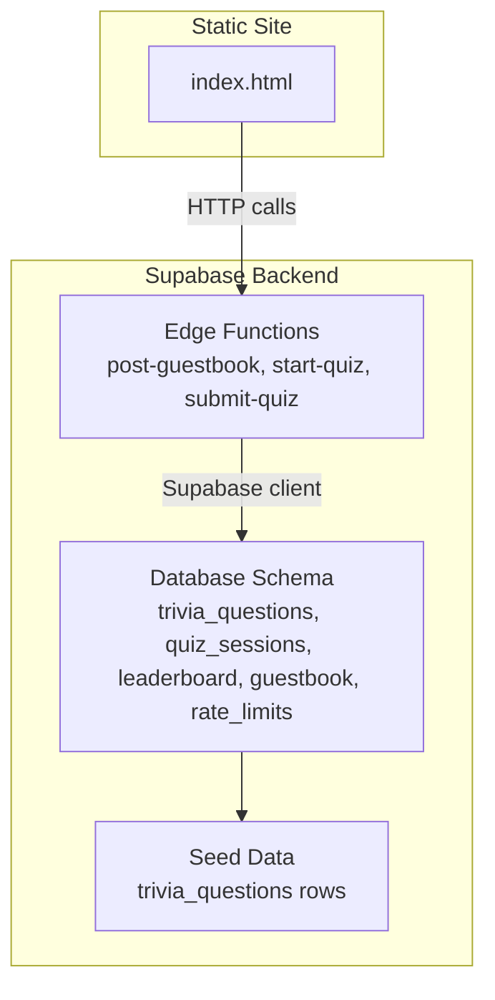
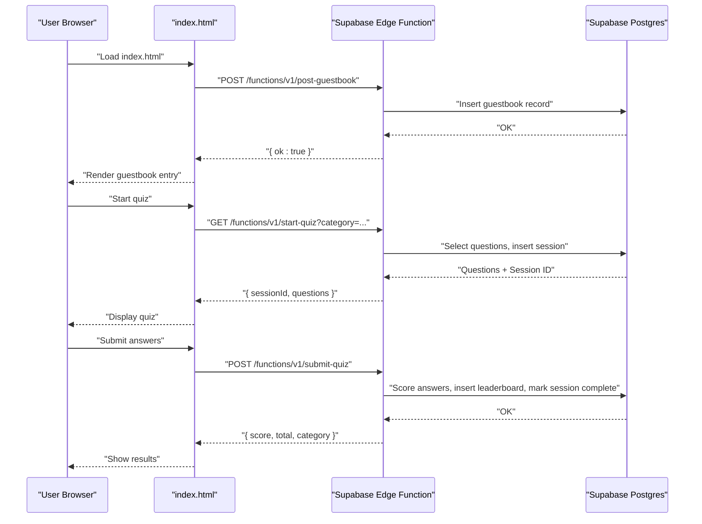
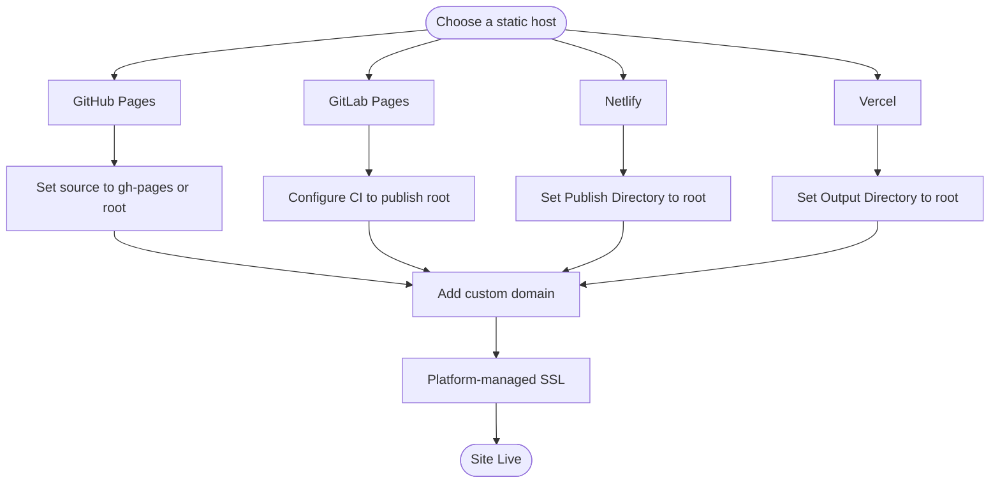
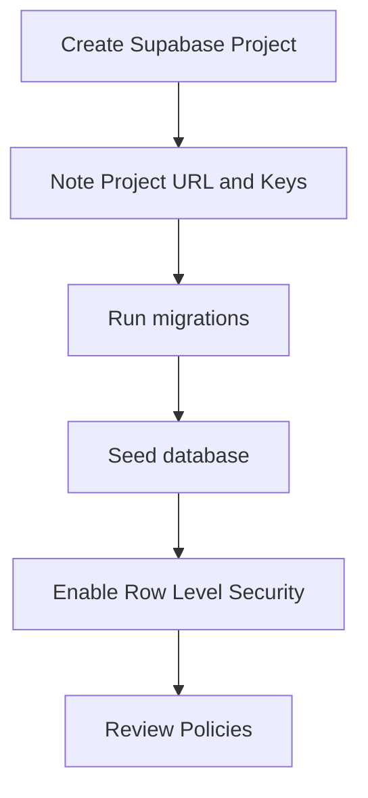
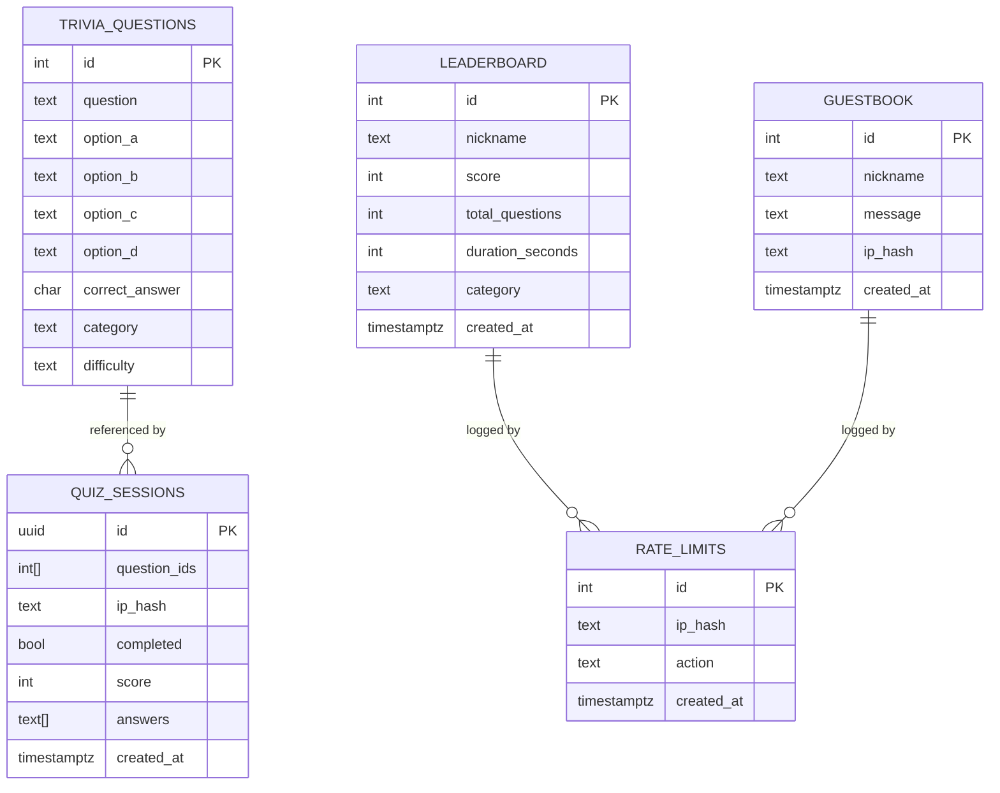
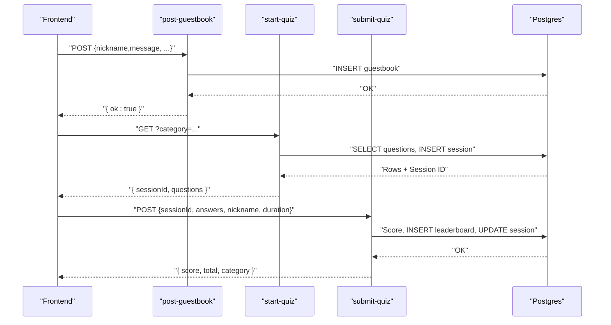
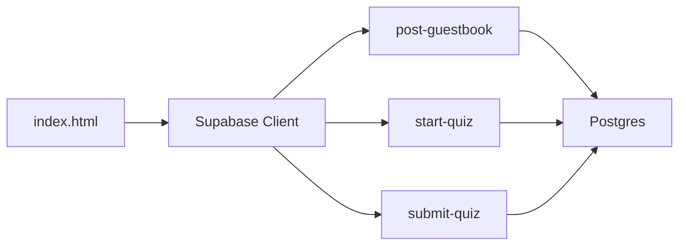

# Deployment and Hosting

<cite>
**Referenced Files in This Document**
- [README.md](file://README.md)
- [index.html](file://index.html)
- [post-guestbook/index.ts](file://supabase/functions/post-guestbook/index.ts)
- [start-quiz/index.ts](file://supabase/functions/start-quiz/index.ts)
- [submit-quiz/index.ts](file://supabase/functions/submit-quiz/index.ts)
- [20240101000000_init.sql](file://supabase/migrations/20240101000000_init.sql)
- [20240101000001_seed_questions.sql](file://supabase/migrations/20240101000001_seed_questions.sql)
</cite>

## Table of Contents
1. [Introduction](#introduction)
2. [Project Structure](#project-structure)
3. [Core Components](#core-components)
4. [Architecture Overview](#architecture-overview)
5. [Detailed Component Analysis](#detailed-component-analysis)
6. [Dependency Analysis](#dependency-analysis)
7. [Performance Considerations](#performance-considerations)
8. [Troubleshooting Guide](#troubleshooting-guide)
9. [Conclusion](#conclusion)
10. [Appendices](#appendices)

## Introduction
This document provides a complete guide to deploying and hosting the portfolio as a static website while configuring the Supabase backend for interactive features such as a guestbook and a quiz with leaderboards. It covers static hosting options, Supabase project setup, database schema and seeding, edge function deployment, environment variable management, domain and SSL configuration, performance optimization, and operational best practices.

## Project Structure
The repository consists of:
- A single static HTML file that serves as the frontend.
- A Supabase project containing:
  - Edge functions for guestbook posting, quiz session creation, and quiz submission scoring.
  - Database migrations defining schema and indexes.
  - Seeding SQL to populate trivia questions.

**Diagram sources**
- [index.html](file://index.html)
- [post-guestbook/index.ts](file://supabase/functions/post-guestbook/index.ts)
- [start-quiz/index.ts](file://supabase/functions/start-quiz/index.ts)
- [submit-quiz/index.ts](file://supabase/functions/submit-quiz/index.ts)
- [20240101000000_init.sql](file://supabase/migrations/20240101000000_init.sql)
- [20240101000001_seed_questions.sql](file://supabase/migrations/20240101000001_seed_questions.sql)

**Section sources**
- [README.md](file://README.md)
- [index.html](file://index.html)

## Core Components
- Static site: A single HTML file with embedded JavaScript and CSS. It initializes a Supabase client using a public/anon key and calls Supabase edge functions for interactive features.
- Supabase edge functions:
  - Guestbook posting with validation, rate limiting, and spam filtering.
  - Quiz session creation with randomized questions and IP hashing.
  - Quiz submission scoring, nickname validation, rate limiting, and leaderboard insertion.
- Database schema and seeding:
  - Tables for trivia, sessions, leaderboard, guestbook, and rate limits.
  - Row Level Security policies enabling controlled access.
  - Seed data for trivia questions across categories.

**Section sources**
- [index.html](file://index.html)
- [post-guestbook/index.ts](file://supabase/functions/post-guestbook/index.ts)
- [start-quiz/index.ts](file://supabase/functions/start-quiz/index.ts)
- [submit-quiz/index.ts](file://supabase/functions/submit-quiz/index.ts)
- [20240101000000_init.sql](file://supabase/migrations/20240101000000_init.sql)
- [20240101000001_seed_questions.sql](file://supabase/migrations/20240101000001_seed_questions.sql)

## Architecture Overview
The frontend communicates with Supabase edge functions over HTTPS. Edge functions connect to the Supabase database using a service-role key and enforce rate limits and validations.

**Diagram sources**
- [index.html](file://index.html)
- [post-guestbook/index.ts](file://supabase/functions/post-guestbook/index.ts)
- [start-quiz/index.ts](file://supabase/functions/start-quiz/index.ts)
- [submit-quiz/index.ts](file://supabase/functions/submit-quiz/index.ts)

## Detailed Component Analysis

### Static Site Deployment
- Requirements:
  - Host the index.html file on any static web host.
  - No build step is required; assets are self-contained.
- Platform-specific deployment:
  - GitHub Pages: Push index.html to gh-pages branch or deploy from root folder.
  - GitLab Pages: Configure CI to publish the root directory artifact.
  - Netlify/Vercel: Import repository and set publish directory to repository root.
- Domain and SSL:
  - Configure custom domain at the platform provider.
  - SSL is managed by the platform; ensure DNS CNAME/A records point to the provider’s endpoint.

**Section sources**
- [README.md](file://README.md)
- [index.html](file://index.html)

### Supabase Project Setup
- Create a new Supabase project and note the project URL and keys.
- Apply migrations to define schema and indexes.
- Seed the database with trivia questions.

**Diagram sources**
- [20240101000000_init.sql](file://supabase/migrations/20240101000000_init.sql)
- [20240101000001_seed_questions.sql](file://supabase/migrations/20240101000001_seed_questions.sql)

**Section sources**
- [20240101000000_init.sql](file://supabase/migrations/20240101000000_init.sql)
- [20240101000001_seed_questions.sql](file://supabase/migrations/20240101000001_seed_questions.sql)

### Database Configuration
- Tables:
  - trivia_questions: stores quiz items with categories and difficulty.
  - quiz_sessions: tracks active quiz sessions with hashed IPs.
  - leaderboard: stores scores and metadata.
  - guestbook: stores visitor messages with hashed IPs.
  - rate_limits: logs actions for rate limiting.
- Indexes:
  - Composite indexes for efficient lookups and ranking.
- Row Level Security:
  - Public select policies for read-only access.
  - Service-role-only write operations for sensitive tables.

**Diagram sources**
- [20240101000000_init.sql](file://supabase/migrations/20240101000000_init.sql)

**Section sources**
- [20240101000000_init.sql](file://supabase/migrations/20240101000000_init.sql)

### Edge Function Deployment
- Functions:
  - post-guestbook: Validates inputs, applies rate limits, inserts into guestbook, and logs rate limit entries.
  - start-quiz: Selects randomized questions, creates a session, and returns session ID plus questions.
  - submit-quiz: Scores answers, enforces rate limits, writes leaderboard, updates session, and returns results.
- Environment variables:
  - SUPABASE_URL: Supabase project URL.
  - SUPABASE_SERVICE_ROLE_KEY: Secret service role key for privileged operations.
- CORS:
  - Functions respond with appropriate CORS headers for cross-origin requests.

**Diagram sources**
- [post-guestbook/index.ts](file://supabase/functions/post-guestbook/index.ts)
- [start-quiz/index.ts](file://supabase/functions/start-quiz/index.ts)
- [submit-quiz/index.ts](file://supabase/functions/submit-quiz/index.ts)

**Section sources**
- [post-guestbook/index.ts](file://supabase/functions/post-guestbook/index.ts)
- [start-quiz/index.ts](file://supabase/functions/start-quiz/index.ts)
- [submit-quiz/index.ts](file://supabase/functions/submit-quiz/index.ts)

### Environment Variable Management
- Frontend:
  - Supabase URL and anon key are embedded in the CONFIG object within index.html.
  - Replace placeholder values with your Supabase project URL and anon key.
- Edge Functions:
  - SUPABASE_URL and SUPABASE_SERVICE_ROLE_KEY must be set in the Supabase project environment.
  - These are accessed via Deno.env.get inside functions.

**Section sources**
- [index.html](file://index.html)
- [post-guestbook/index.ts](file://supabase/functions/post-guestbook/index.ts)
- [start-quiz/index.ts](file://supabase/functions/start-quiz/index.ts)
- [submit-quiz/index.ts](file://supabase/functions/submit-quiz/index.ts)

### Domain Configuration and SSL
- Static hosts:
  - Add a custom domain and configure DNS to point to the provider’s endpoint.
  - Enable HTTPS; most providers offer automatic SSL provisioning.
- Supabase:
  - Configure a custom domain in the Supabase dashboard.
  - Provision SSL certificates through Supabase; ensure DNS records are propagated.

**Section sources**
- [README.md](file://README.md)

## Dependency Analysis
- Frontend depends on:
  - Supabase client library loaded from CDN.
  - Supabase edge functions for dynamic features.
- Edge functions depend on:
  - Supabase client initialized with service role key.
  - Database tables defined by migrations.
- Database depends on:
  - Row Level Security policies and indexes for performance and access control.

**Diagram sources**
- [index.html](file://index.html)
- [post-guestbook/index.ts](file://supabase/functions/post-guestbook/index.ts)
- [start-quiz/index.ts](file://supabase/functions/start-quiz/index.ts)
- [submit-quiz/index.ts](file://supabase/functions/submit-quiz/index.ts)
- [20240101000000_init.sql](file://supabase/migrations/20240101000000_init.sql)

**Section sources**
- [index.html](file://index.html)
- [20240101000000_init.sql](file://supabase/migrations/20240101000000_init.sql)

## Performance Considerations
- Static hosting:
  - Choose a global CDN-backed host (Netlify/Vercel/GitLab Pages) for low-latency delivery.
  - Enable brotli/gzip compression at the platform level.
- Assets:
  - Keep index.html self-contained; avoid external heavy resources.
  - Preconnect to external fonts to reduce render-blocking.
- Edge functions:
  - Minimize database round-trips; fetch only required fields.
  - Use indexes for rate-limit lookups and leaderboard sorting.
- Caching:
  - Leverage browser cache headers for immutable assets.
  - Use short cache times for dynamic content served by edge functions.

[No sources needed since this section provides general guidance]

## Troubleshooting Guide
- Static site not loading:
  - Verify custom domain DNS propagation and correct CNAME/A records.
  - Confirm HTTPS is enabled and not blocked by mixed content warnings.
- Supabase connectivity:
  - Ensure Supabase URL and anon key are correctly set in CONFIG.
  - Check that edge functions have SUPABASE_URL and SUPABASE_SERVICE_ROLE_KEY configured.
- Edge function errors:
  - Review function logs for CORS mismatches or invalid JSON payloads.
  - Validate rate-limit thresholds and IP hashing behavior.
- Database issues:
  - Confirm migrations applied successfully and indexes exist.
  - Check RLS policies if reads appear blocked unexpectedly.
- Quiz/Guestbook not working:
  - Verify function endpoints are reachable and CORS allows origin.
  - Ensure seed data exists for trivia questions.

**Section sources**
- [index.html](file://index.html)
- [post-guestbook/index.ts](file://supabase/functions/post-guestbook/index.ts)
- [start-quiz/index.ts](file://supabase/functions/start-quiz/index.ts)
- [submit-quiz/index.ts](file://supabase/functions/submit-quiz/index.ts)
- [20240101000000_init.sql](file://supabase/migrations/20240101000000_init.sql)

## Conclusion
This portfolio combines a minimal, static frontend with a Supabase-powered backend for interactive features. By following the deployment steps for your chosen static host, setting up Supabase with proper migrations and environment variables, and configuring domains and SSL, you can achieve a fast, secure, and scalable online presence.

[No sources needed since this section summarizes without analyzing specific files]

## Appendices

### A. Static Hosting Quick Checklist
- Upload index.html to your static host.
- Configure custom domain and SSL.
- Test guestbook and quiz flows.

**Section sources**
- [README.md](file://README.md)

### B. Supabase Environment Variables
- Frontend: CONFIG.supabase.url, CONFIG.supabase.anonKey
- Edge Functions: SUPABASE_URL, SUPABASE_SERVICE_ROLE_KEY

**Section sources**
- [index.html](file://index.html)
- [post-guestbook/index.ts](file://supabase/functions/post-guestbook/index.ts)
- [start-quiz/index.ts](file://supabase/functions/start-quiz/index.ts)
- [submit-quiz/index.ts](file://supabase/functions/submit-quiz/index.ts)