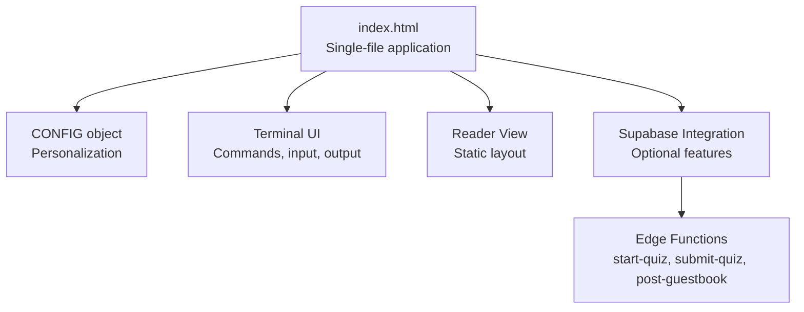
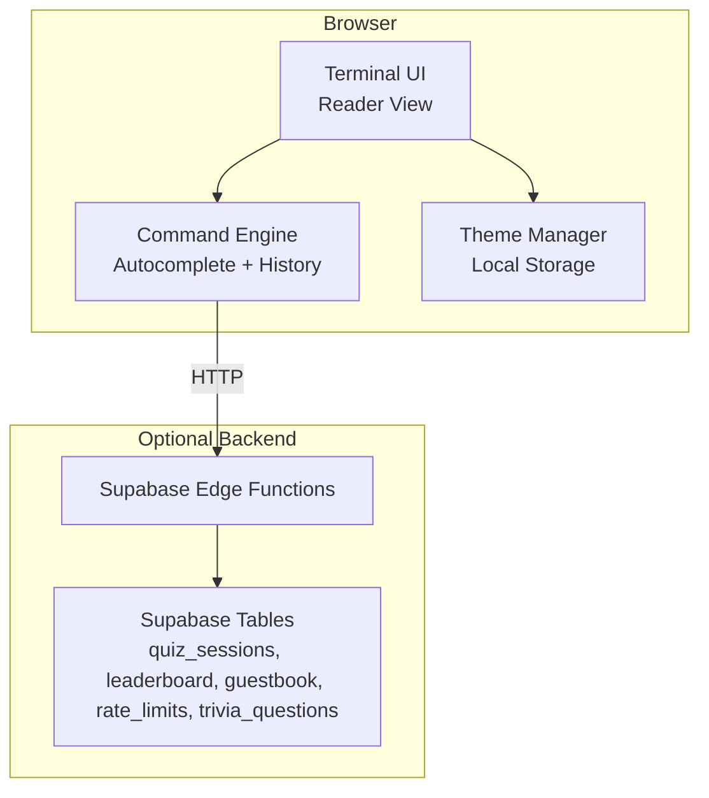
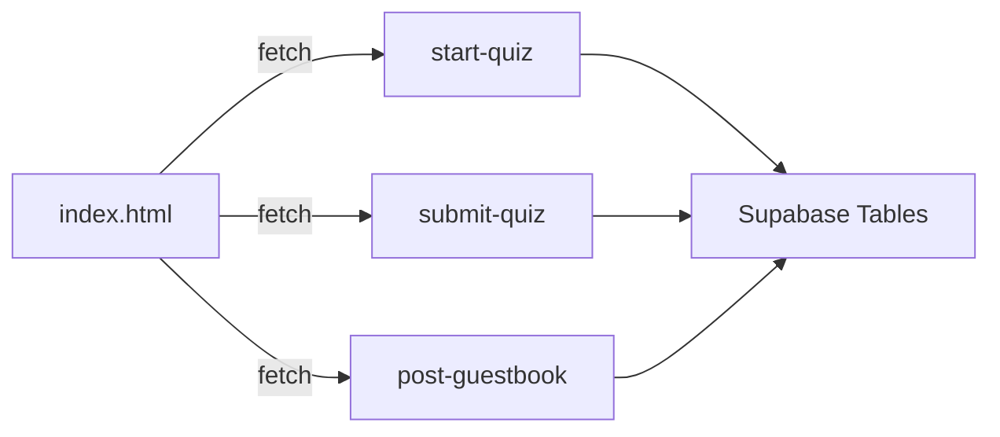

# Getting Started

<cite>
**Referenced Files in This Document**
- [index.html](file://index.html)
- [README.md](file://README.md)
- [post-guestbook/index.ts](file://supabase/functions/post-guestbook/index.ts)
- [start-quiz/index.ts](file://supabase/functions/start-quiz/index.ts)
- [submit-quiz/index.ts](file://supabase/functions/submit-quiz/index.ts)
</cite>

## Table of Contents
1. [Introduction](#introduction)
2. [Project Structure](#project-structure)
3. [Core Components](#core-components)
4. [Architecture Overview](#architecture-overview)
5. [Detailed Component Analysis](#detailed-component-analysis)
6. [Dependency Analysis](#dependency-analysis)
7. [Performance Considerations](#performance-considerations)
8. [Troubleshooting Guide](#troubleshooting-guide)
9. [Conclusion](#conclusion)
10. [Appendices](#appendices)

## Introduction
This portfolio is a dual-mode, self-contained web application that works as both a static document and an interactive terminal. It requires only a single HTML file deployment and runs entirely in the browser with zero external runtime dependencies. You can host it on any static hosting platform (GitHub Pages, Netlify, GitLab Pages, etc.) without a backend server.

Key benefits:
- Zero-dependency, static-first design
- Dual view modes: terminal and reader
- Interactive command-line experience with autocomplete and fuzzy matching
- Built-in themes and responsive layout
- Optional Supabase-backed features (quiz, leaderboard, guestbook) with serverless functions

## Project Structure
The entire application lives in a single HTML file with embedded CSS and JavaScript. There is no build step or bundler required.

**Diagram sources**
- [index.html:448-1624](file://index.html#L448-L1624)

**Section sources**
- [index.html:1-100](file://index.html#L1-L100)
- [README.md:18-23](file://README.md#L18-L23)

## Core Components
- CONFIG object: Centralized customization for your profile, projects, and Supabase credentials.
- Terminal UI: Interactive command-line interface with command history, autocomplete, and fuzzy matching.
- Reader View: Clean, scrollable presentation of your content.
- Supabase integration: Optional serverless functions for interactive features (quiz, leaderboard, guestbook).

What you can do immediately:
- Host index.html on any static host.
- Customize CONFIG to reflect your identity and content.
- Switch between terminal and reader views.
- Explore commands like help, about, skills, projects, contact, and more.

**Section sources**
- [index.html:448-520](file://index.html#L448-L520)
- [README.md:24-36](file://README.md#L24-L36)

## Architecture Overview
The application is a static HTML page with embedded CSS and JavaScript. Optional Supabase features are accessed via lightweight edge functions.

**Diagram sources**
- [index.html:530-544](file://index.html#L530-L544)
- [start-quiz/index.ts:15-66](file://supabase/functions/start-quiz/index.ts#L15-L66)
- [submit-quiz/index.ts:18-113](file://supabase/functions/submit-quiz/index.ts#L18-L113)
- [post-guestbook/index.ts:17-81](file://supabase/functions/post-guestbook/index.ts#L17-L81)

## Detailed Component Analysis

### Installation and Deployment
- Deploy the single HTML file to any static hosting platform (GitHub Pages, Netlify, GitLab Pages).
- No build step, no backend server required.
- The terminal boots automatically and displays a welcome sequence; you can skip it by pressing a key or clicking.

What to expect:
- Static hosting friendly: no database or backend server needed.
- Optional Supabase features require configuring your Supabase project and deploying the edge functions.

**Section sources**
- [README.md:52-54](file://README.md#L52-L54)
- [index.html:1590-1621](file://index.html#L1590-L1621)

### Accessing the Terminal Interface
- The terminal prompt appears after the boot sequence completes.
- Click anywhere in the terminal area to focus the input field.
- On mobile devices, the input remains visible and the window adapts to the visual viewport when the keyboard opens.

Keyboard shortcuts:
- Enter: Submit command.
- Tab: Autocomplete command.
- Arrow keys: Navigate command history.
- Right arrow at end of line: Accept inline ghost suggestion.

**Section sources**
- [index.html:1527-1560](file://index.html#L1527-L1560)
- [index.html:1430-1525](file://index.html#L1430-L1525)

### Navigating Between View Modes
- Toggle between terminal and reader views using the top-right button.
- The selected view persists locally in the browser.

Reader view:
- Plain, scrollable layout of your content.
- Ideal for sharing or printing.

**Section sources**
- [index.html:649-662](file://index.html#L649-L662)
- [index.html:275-279](file://index.html#L275-L279)

### Basic Command Usage
Common commands:
- help: List available commands.
- about: Show your professional summary.
- skills: List your technical stack.
- projects: Display your portfolio highlights.
- contact: Show contact links.
- cv: Open your CV in a new tab.
- theme: Toggle between dark and light mode.
- clear: Clear the terminal screen.

Fuzzy matching and autocomplete:
- Typos are handled gracefully.
- Tab completion cycles through suggestions.
- Inline ghost text suggests completions.

**Section sources**
- [index.html:684-762](file://index.html#L684-L762)
- [index.html:1315-1396](file://index.html#L1315-L1396)

### Browser Compatibility and Performance
- Vanilla JavaScript, CSS3, and HTML5 only.
- No build step or bundler required.
- Lightning-fast loading and zero dependencies.
- Responsive design that works on desktop and mobile.

**Section sources**
- [README.md:16](file://README.md#L16)
- [README.md:20-22](file://README.md#L20-L22)

### Immediate Customization Options
Customize everything via the CONFIG object:
- Personal identity: name, role, tagline.
- Bio paragraphs: about array.
- Skills: nested array of category and description.
- Projects: array of objects with title, stack, description, and URL.
- Contact links: email, LinkedIn, GitHub, README, CV.
- Supabase: URL and publishable/anon key for optional features.

How to customize:
- Open index.html and locate the CONFIG object.
- Replace placeholder values with your information.
- Save and redeploy.

**Section sources**
- [index.html:453-520](file://index.html#L453-L520)
- [README.md:24-36](file://README.md#L24-L36)

### Optional Supabase Features
The terminal includes interactive features powered by Supabase edge functions. These are optional and require:
- A Supabase project.
- Deployed edge functions: start-quiz, submit-quiz, post-guestbook.
- Correctly configured Supabase URL and publishable/anon key in CONFIG.

Features:
- quiz: Start a trivia quiz with randomized questions.
- leaderboard: View top scores.
- guestbook: Leave a signed message.

Edge functions:
- start-quiz: Creates a quiz session and returns questions.
- submit-quiz: Scores answers, writes leaderboard, enforces rate limits.
- post-guestbook: Validates and stores guestbook entries with rate limiting and spam filters.

**Section sources**
- [index.html:817-918](file://index.html#L817-L918)
- [start-quiz/index.ts:15-66](file://supabase/functions/start-quiz/index.ts#L15-L66)
- [submit-quiz/index.ts:18-113](file://supabase/functions/submit-quiz/index.ts#L18-L113)
- [post-guestbook/index.ts:17-81](file://supabase/functions/post-guestbook/index.ts#L17-L81)

## Dependency Analysis
- Frontend: Pure HTML/CSS/JavaScript with no external libraries.
- Optional backend: Supabase edge functions for interactive features.
- Edge function dependencies: Supabase client and Deno standard library.

**Diagram sources**
- [index.html:539-544](file://index.html#L539-L544)
- [start-quiz/index.ts:18-21](file://supabase/functions/start-quiz/index.ts#L18-L21)
- [submit-quiz/index.ts:21-24](file://supabase/functions/submit-quiz/index.ts#L21-L24)
- [post-guestbook/index.ts:20-23](file://supabase/functions/post-guestbook/index.ts#L20-L23)

**Section sources**
- [index.html:530-544](file://index.html#L530-L544)
- [README.md:18-22](file://README.md#L18-L22)

## Performance Considerations
- Static hosting: No server-side rendering or dynamic computation.
- Minimal DOM manipulation: Output is appended efficiently.
- Lightweight animations: Typewriter boot and subtle transitions.
- Mobile-first viewport handling: Adapts to keyboard and orientation changes.

[No sources needed since this section provides general guidance]

## Troubleshooting Guide
- Terminal does not appear:
  - Ensure the page loaded fully; the terminal reveals itself after the boot sequence.
  - Try clicking the screen to focus the input.
- Commands not recognized:
  - Use Tab to autocomplete or type help to see available commands.
  - Fuzzy matching allows minor typos.
- Supabase features disabled:
  - Verify CONFIG contains a valid Supabase URL and publishable/anon key.
  - Confirm edge functions are deployed and reachable.
- Guestbook or quiz errors:
  - Check rate limits and spam filters.
  - Ensure nickname and message lengths meet requirements.

**Section sources**
- [index.html:1590-1621](file://index.html#L1590-L1621)
- [index.html:1377-1428](file://index.html#L1377-L1428)
- [post-guestbook/index.ts:33-49](file://supabase/functions/post-guestbook/index.ts#L33-L49)
- [submit-quiz/index.ts:34-42](file://supabase/functions/submit-quiz/index.ts#L34-L42)

## Conclusion
You can deploy this portfolio instantly with a single HTML file and immediately begin customizing it to reflect your identity and projects. The terminal experience is intuitive, and the reader view offers a clean alternative. Optional Supabase features enhance interactivity but are not required for a successful deployment.

[No sources needed since this section summarizes without analyzing specific files]

## Appendices

### Quick Setup Checklist
- Host index.html on your preferred static host.
- Customize CONFIG with your details.
- Optionally configure Supabase and deploy edge functions.
- Test terminal commands and view toggles.

**Section sources**
- [README.md:24-36](file://README.md#L24-L36)
- [README.md:52-54](file://README.md#L52-L54)