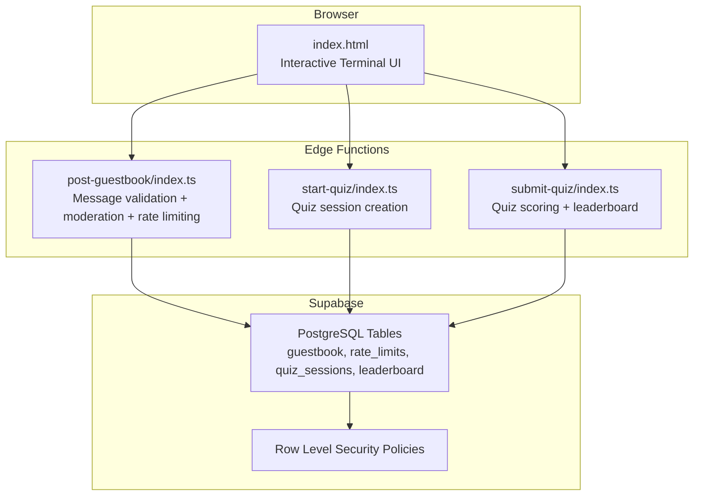
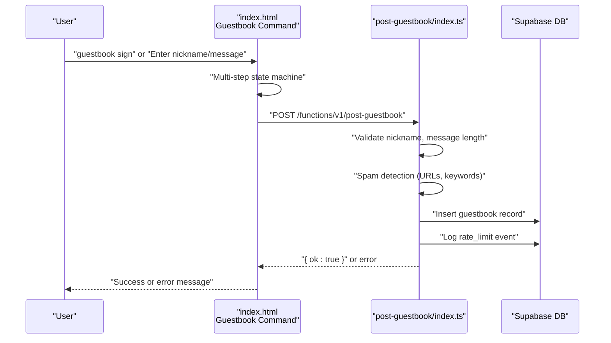
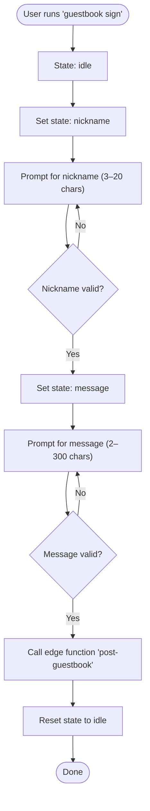
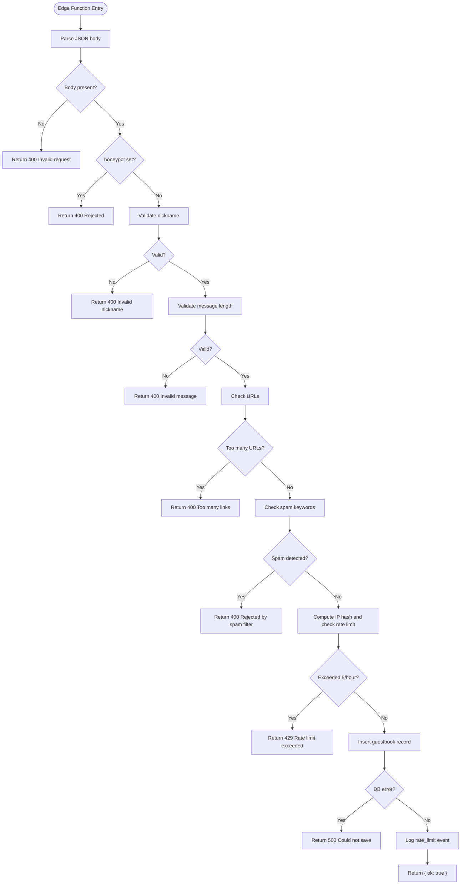
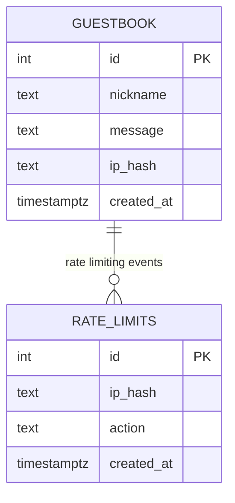
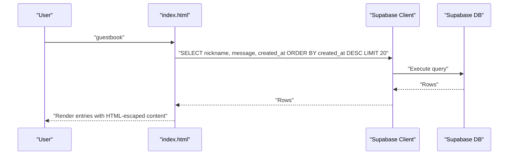
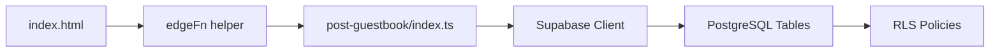

# Guestbook

<cite>
**Referenced Files in This Document**
- [index.html](file://index.html)
- [post-guestbook/index.ts](file://supabase/functions/post-guestbook/index.ts)
- [start-quiz/index.ts](file://supabase/functions/start-quiz/index.ts)
- [submit-quiz/index.ts](file://supabase/functions/submit-quiz/index.ts)
- [20240101000000_init.sql](file://supabase/migrations/20240101000000_init.sql)
</cite>

## Table of Contents
1. [Introduction](#introduction)
2. [Project Structure](#project-structure)
3. [Core Components](#core-components)
4. [Architecture Overview](#architecture-overview)
5. [Detailed Component Analysis](#detailed-component-analysis)
6. [Dependency Analysis](#dependency-analysis)
7. [Performance Considerations](#performance-considerations)
8. [Troubleshooting Guide](#troubleshooting-guide)
9. [Conclusion](#conclusion)

## Introduction
This document describes the guestbook system integrated into the interactive portfolio. It focuses on the message posting workflow, moderation pipeline, edge function implementation, message display, security measures, state management for multi-step signing, and operational guidance. The guestbook is part of a broader interactive terminal experience where users can sign the guestbook via a guided multi-step process.

## Project Structure
The guestbook spans a static frontend and Supabase edge functions:
- Frontend: index.html contains the interactive terminal UI, guestbook command handlers, and the multi-step signing flow.
- Edge Functions: Supabase Edge Functions implement message validation, moderation, rate limiting, and database integration.
- Database: Supabase schema defines guestbook, rate_limits, and related tables with Row Level Security policies.

**Diagram sources**
- [index.html](file://index.html)
- [post-guestbook/index.ts](file://supabase/functions/post-guestbook/index.ts)
- [start-quiz/index.ts](file://supabase/functions/start-quiz/index.ts)
- [submit-quiz/index.ts](file://supabase/functions/submit-quiz/index.ts)
- [20240101000000_init.sql](file://supabase/migrations/20240101000000_init.sql)

**Section sources**
- [index.html](file://index.html)
- [post-guestbook/index.ts](file://supabase/functions/post-guestbook/index.ts)
- [start-quiz/index.ts](file://supabase/functions/start-quiz/index.ts)
- [submit-quiz/index.ts](file://supabase/functions/submit-quiz/index.ts)
- [20240101000000_init.sql](file://supabase/migrations/20240101000000_init.sql)

## Core Components
- Guestbook command handler: Implements the “guestbook” command and the multi-step signing flow (nickname → message).
- Edge function post-guestbook: Validates inputs, applies moderation rules, enforces rate limits, and inserts messages.
- Database schema: Defines guestbook entries, rate limits, and indexes supporting reads and moderation.
- Security: Input sanitization via HTML escaping, XSS prevention, and abuse protections (spam filters, rate limits).

**Section sources**
- [index.html](file://index.html)
- [post-guestbook/index.ts](file://supabase/functions/post-guestbook/index.ts)
- [20240101000000_init.sql](file://supabase/migrations/20240101000000_init.sql)

## Architecture Overview
The guestbook posting flow is a client-server interaction:
- The browser invokes an edge function via a helper that constructs the function endpoint URL and sends a JSON payload.
- The edge function performs validation and moderation, then writes to the database and logs rate-limit events.

**Diagram sources**
- [index.html](file://index.html)
- [post-guestbook/index.ts](file://supabase/functions/post-guestbook/index.ts)

## Detailed Component Analysis

### Guestbook Command and Multi-Step Signing Flow
- Command: “guestbook” displays recent entries and supports “guestbook sign” to initiate signing.
- State Machine: Maintains guestbook signing state (idle → nickname → message) and collects inputs locally before submission.
- Validation: Enforces nickname and message constraints before invoking the edge function.
- Submission: Calls the edge function with nickname and message; resets state on completion.

**Diagram sources**
- [index.html](file://index.html)

**Section sources**
- [index.html](file://index.html)

### Edge Function: post-guestbook
Responsibilities:
- Request parsing and basic validation.
- Input sanitization and validation rules:
  - Nickname: length and character set.
  - Message: required, trimmed, length bounds.
  - URL spam: limit number of URLs.
  - Keyword spam: reject known spam phrases.
  - Honeypot field: rejects bot submissions.
- Rate limiting: 5 posts per hour per IP using hashed IP and a dedicated rate_limits table.
- Database integration: inserts into guestbook and logs rate_limit events.

**Diagram sources**
- [post-guestbook/index.ts](file://supabase/functions/post-guestbook/index.ts)

**Section sources**
- [post-guestbook/index.ts](file://supabase/functions/post-guestbook/index.ts)

### Database Schema and Moderation Pipeline
- Tables:
  - guestbook: stores nickname, message, optional ip_hash, created_at.
  - rate_limits: tracks per-IP actions and timestamps.
- Indexes:
  - idx_rate_limits_lookup: supports efficient rate-limit queries by ip_hash, action, created_at.
  - idx_guestbook_recent: supports reverse chronological listing.
- Row Level Security:
  - guestbook: select allowed for anonymous and authenticated users.
  - quiz_sessions and rate_limits: restricted to service role (no public select).
- Moderation pipeline:
  - Edge function enforces validation and spam filters.
  - Rate limits stored in rate_limits table for enforcement.

**Diagram sources**
- [20240101000000_init.sql](file://supabase/migrations/20240101000000_init.sql)

**Section sources**
- [20240101000000_init.sql](file://supabase/migrations/20240101000000_init.sql)

### Message Display System
- Command: “guestbook” lists recent entries (default limit 20) ordered by created_at descending.
- Rendering: Uses HTML escaping to prevent XSS; prints nickname and formatted date with message content.
- Pagination: Implemented via limit in the Supabase query; no explicit pagination controls are exposed in the terminal UI.

**Diagram sources**
- [index.html](file://index.html)

**Section sources**
- [index.html](file://index.html)

### Security Measures
- Input sanitization:
  - HTML escaping for all dynamic content rendered to the terminal.
  - Edge function validates and trims inputs before insertion.
- XSS prevention:
  - All user-generated content is escaped when printed to the DOM.
- Abuse protection:
  - Spam filters detect URLs and keyword patterns.
  - Rate limiting restricts posting frequency per IP.
  - Honeypot field blocks automated submissions.

**Section sources**
- [index.html](file://index.html)
- [post-guestbook/index.ts](file://supabase/functions/post-guestbook/index.ts)

### Guestbook State Management and Real-Time Updates
- State machine:
  - Tracks gbStep, gbNickname, gbMessage.
  - Transitions between idle → nickname → message during signing.
- Real-time updates:
  - The guestbook listing refreshes by re-querying the database on subsequent “guestbook” commands.
  - There is no WebSocket or streaming mechanism for live updates.

**Section sources**
- [index.html](file://index.html)

## Dependency Analysis
- Frontend depends on Supabase client initialization and the edge function helper to call functions.
- Edge functions depend on Supabase client and environment variables for credentials.
- Database depends on RLS policies and indexes to enforce access and performance.

**Diagram sources**
- [index.html](file://index.html)
- [post-guestbook/index.ts](file://supabase/functions/post-guestbook/index.ts)
- [20240101000000_init.sql](file://supabase/migrations/20240101000000_init.sql)

**Section sources**
- [index.html](file://index.html)
- [post-guestbook/index.ts](file://supabase/functions/post-guestbook/index.ts)
- [20240101000000_init.sql](file://supabase/migrations/20240101000000_init.sql)

## Performance Considerations
- Index usage:
  - idx_guestbook_recent optimizes reverse chronological listing.
  - idx_rate_limits_lookup optimizes rate-limit queries by ip_hash, action, and time window.
- Query limits:
  - Listing uses a fixed limit (20) to bound response size.
- Caching:
  - No explicit caching layer is implemented; the system relies on database indexes and client-side rendering.
- Recommendations:
  - Consider adding a CDN or caching layer for guestbook listing if traffic increases.
  - Monitor rate_limit table growth and periodically archive old entries if needed.

**Section sources**
- [20240101000000_init.sql](file://supabase/migrations/20240101000000_init.sql)
- [index.html](file://index.html)

## Troubleshooting Guide
Common issues and resolutions:
- Rate limit exceeded (429):
  - Cause: More than 5 posts per hour per IP.
  - Resolution: Wait until the next hour; verify IP hashing is consistent across requests.
- Invalid nickname or message (400):
  - Cause: Nickname length/characters or message length constraints violated.
  - Resolution: Ensure nickname is 3–20 characters with allowed characters and message is 2–300 characters.
- Too many links or spam detected (400):
  - Cause: Excessive URLs or spam keywords found in message.
  - Resolution: Reduce URLs to ≤2 and avoid spam-related keywords.
- Database write failure (500):
  - Cause: Internal database error during insertion.
  - Resolution: Retry submission; check Supabase logs for errors.
- Edge function misconfiguration:
  - Cause: Missing SUPABASE_URL or SUPABASE_SERVICE_ROLE_KEY.
  - Resolution: Verify environment variables and redeploy function.

Operational checks:
- Confirm Supabase client is initialized and anon key is configured.
- Verify edge function is deployed and reachable at the expected endpoint.
- Ensure database tables and indexes exist and RLS policies are enabled.

**Section sources**
- [post-guestbook/index.ts](file://supabase/functions/post-guestbook/index.ts)
- [index.html](file://index.html)
- [20240101000000_init.sql](file://supabase/migrations/20240101000000_init.sql)

## Conclusion
The guestbook system integrates a guided multi-step signing flow with robust validation, moderation, and rate limiting enforced by an edge function and database-backed rate limits. The frontend ensures safety via HTML escaping and provides a responsive terminal interface. The schema and indexes support efficient reads and moderation. With the troubleshooting guidance and performance recommendations, the system is ready for production use with minimal maintenance.