# Interactive Features

<cite>
**Referenced Files in This Document**
- [index.html](file://index.html)
- [start-quiz/index.ts](file://supabase/functions/start-quiz/index.ts)
- [submit-quiz/index.ts](file://supabase/functions/submit-quiz/index.ts)
- [post-guestbook/index.ts](file://supabase/functions/post-guestbook/index.ts)
- [init.sql](file://supabase/migrations/20240101000000_init.sql)
- [seed_questions.sql](file://supabase/migrations/20240101000001_seed_questions.sql)
</cite>

## Table of Contents
1. [Introduction](#introduction)
2. [Project Structure](#project-structure)
3. [Core Components](#core-components)
4. [Architecture Overview](#architecture-overview)
5. [Detailed Component Analysis](#detailed-component-analysis)
6. [Edge Function Implementation](#edge-function-implementation)
7. [Database Schema and Security](#database-schema-and-security)
8. [Real-time Data Synchronization](#real-time-data-synchronization)
9. [Performance Considerations](#performance-considerations)
10. [Security Implementation](#security-implementation)
11. [State Management](#state-management)
12. [Troubleshooting Guide](#troubleshooting-guide)
13. [Conclusion](#conclusion)

## Introduction

The Interactive Features system powers two primary gamification elements in the portfolio website: a trivia quiz game and a guestbook functionality. Both features leverage Supabase backend services to provide persistent, real-time interactions while maintaining security and performance standards.

The system consists of:
- **Quiz Game**: Interactive trivia with session management, scoring algorithms, and leaderboard integration
- **Guestbook**: Message board with moderation and rate limiting capabilities
- **Edge Functions**: Serverless functions handling business logic and data validation
- **Database Layer**: Secure schema with row-level security policies

## Project Structure

The interactive features are organized across three main areas:

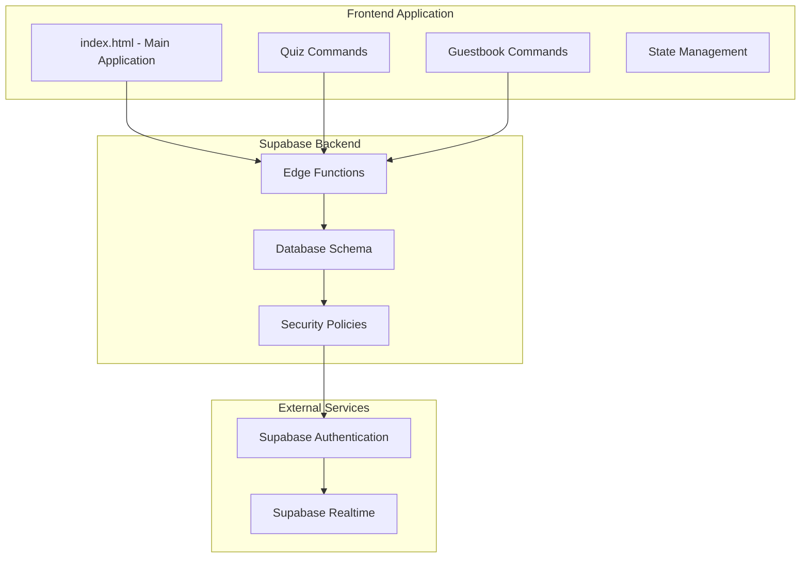

**Diagram sources**
- [index.html:530-545](file://index.html#L530-L545)
- [start-quiz/index.ts:15-67](file://supabase/functions/start-quiz/index.ts#L15-L67)
- [init.sql:4-87](file://supabase/migrations/20240101000000_init.sql#L4-L87)

**Section sources**
- [index.html:530-545](file://index.html#L530-L545)
- [start-quiz/index.ts:15-67](file://supabase/functions/start-quiz/index.ts#L15-L67)
- [init.sql:4-87](file://supabase/migrations/20240101000000_init.sql#L4-L87)

## Core Components

### Quiz System Architecture

The quiz system operates through a sophisticated state machine with multiple phases:

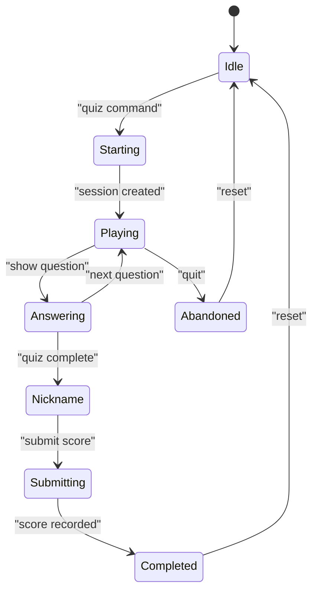

**Diagram sources**
- [index.html:546-571](file://index.html#L546-L571)
- [index.html:1209-1283](file://index.html#L1209-L1283)

### Guestbook Workflow

The guestbook implements a guided signing flow with validation:

```mermaid
flowchart TD
A[User types "guestbook sign"] --> B[Start Signing Flow]
B --> C[Nickname Input]
C --> D[Message Input]
D --> E[Validation Check]
E --> F{Valid?}
F --> |Yes| G[Submit to Edge Function]
F --> |No| H[Show Validation Error]
G --> I[Save to Database]
I --> J[Success Message]
H --> C
J --> K[Reset State]
```

**Diagram sources**
- [index.html:880-918](file://index.html#L880-L918)
- [index.html:1285-1310](file://index.html#L1285-L1310)

**Section sources**
- [index.html:546-571](file://index.html#L546-L571)
- [index.html:880-918](file://index.html#L880-L918)
- [index.html:1209-1310](file://index.html#L1209-L1310)

## Architecture Overview

The interactive features follow a client-server architecture with edge functions as intermediaries:

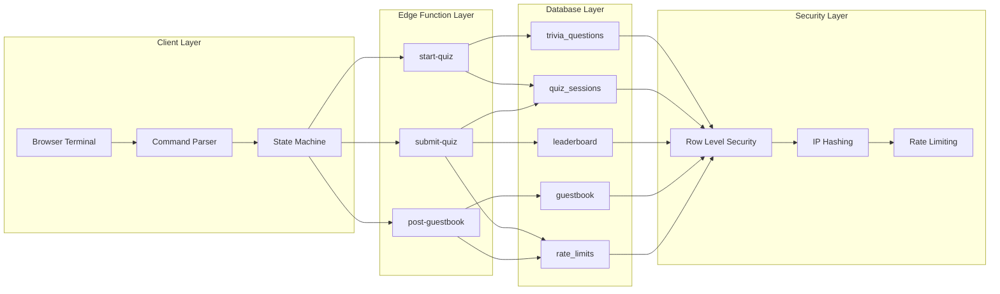

**Diagram sources**
- [index.html:817-918](file://index.html#L817-L918)
- [start-quiz/index.ts:28-67](file://supabase/functions/start-quiz/index.ts#L28-L67)
- [submit-quiz/index.ts:44-114](file://supabase/functions/submit-quiz/index.ts#L44-L114)
- [post-guestbook/index.ts:17-82](file://supabase/functions/post-guestbook/index.ts#L17-L82)
- [init.sql:4-87](file://supabase/migrations/20240101000000_init.sql#L4-L87)

## Detailed Component Analysis

### Quiz Session Management

The quiz system implements robust session management with the following key components:

#### Session Creation Process

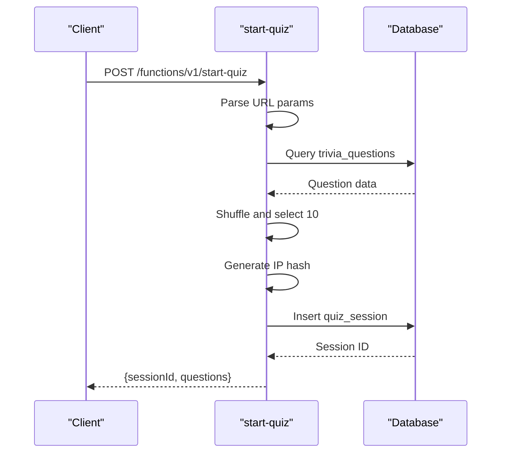

**Diagram sources**
- [start-quiz/index.ts:28-67](file://supabase/functions/start-quiz/index.ts#L28-L67)
- [index.html:824-844](file://index.html#L824-L844)

#### Scoring Algorithm Implementation

The scoring system evaluates user responses against stored correct answers:

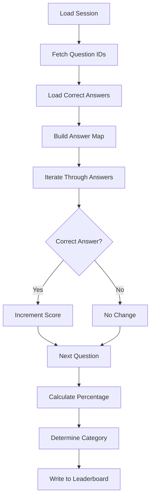

**Diagram sources**
- [submit-quiz/index.ts:75-101](file://supabase/functions/submit-quiz/index.ts#L75-L101)
- [index.html:1249-1283](file://index.html#L1249-L1283)

**Section sources**
- [start-quiz/index.ts:28-67](file://supabase/functions/start-quiz/index.ts#L28-L67)
- [submit-quiz/index.ts:75-101](file://supabase/functions/submit-quiz/index.ts#L75-L101)
- [index.html:824-844](file://index.html#L824-L844)

### Guestbook Moderation System

The guestbook implements comprehensive moderation through multiple validation layers:

#### Content Validation Pipeline

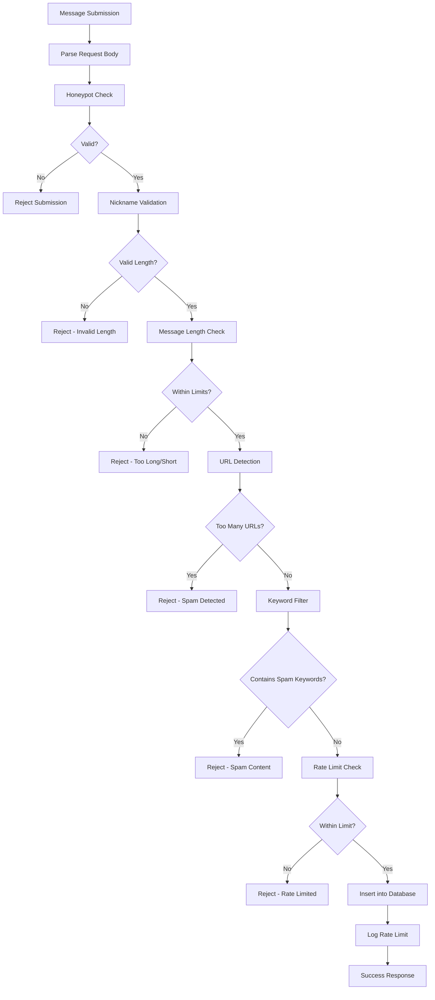

**Diagram sources**
- [post-guestbook/index.ts:25-82](file://supabase/functions/post-guestbook/index.ts#L25-L82)
- [index.html:1285-1310](file://index.html#L1285-L1310)

**Section sources**
- [post-guestbook/index.ts:25-82](file://supabase/functions/post-guestbook/index.ts#L25-L82)
- [index.html:1285-1310](file://index.html#L1285-L1310)

## Edge Function Implementation

### Function Deployment and Configuration

Each edge function follows a standardized pattern for handling HTTP requests and database operations:

#### Common Function Structure

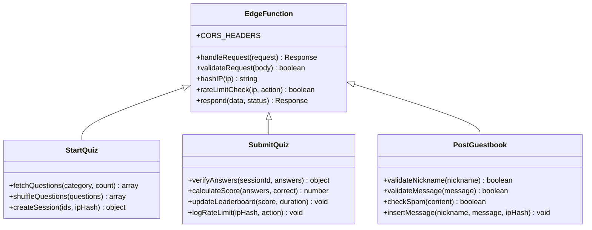

**Diagram sources**
- [start-quiz/index.ts:15-67](file://supabase/functions/start-quiz/index.ts#L15-L67)
- [submit-quiz/index.ts:18-126](file://supabase/functions/submit-quiz/index.ts#L18-L126)
- [post-guestbook/index.ts:17-94](file://supabase/functions/post-guestbook/index.ts#L17-L94)

### Function-Specific Implementations

#### Start Quiz Function

The start-quiz function handles session creation and question delivery:

**Section sources**
- [start-quiz/index.ts:15-67](file://supabase/functions/start-quiz/index.ts#L15-L67)

#### Submit Quiz Function

The submit-quiz function manages scoring, validation, and leaderboard updates:

**Section sources**
- [submit-quiz/index.ts:18-126](file://supabase/functions/submit-quiz/index.ts#L18-L126)

#### Post Guestbook Function

The post-guestbook function implements comprehensive spam protection:

**Section sources**
- [post-guestbook/index.ts:17-94](file://supabase/functions/post-guestbook/index.ts#L17-L94)

## Database Schema and Security

### Database Schema Design

The system uses a normalized schema optimized for the interactive features:

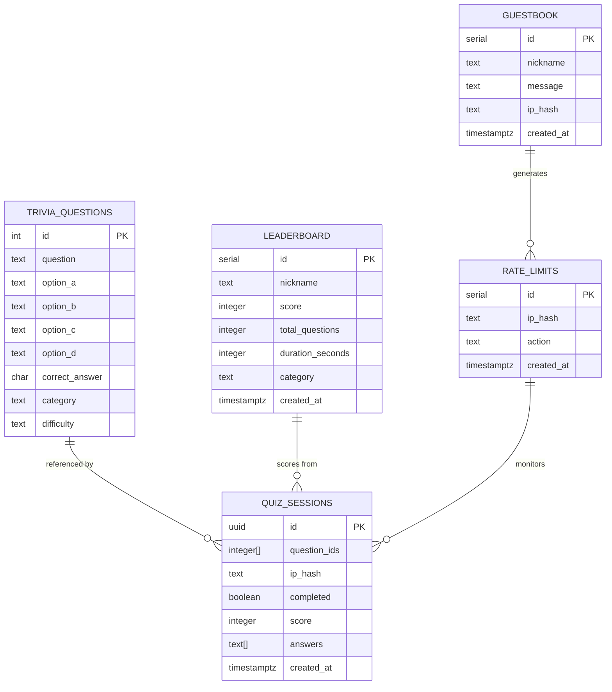

**Diagram sources**
- [init.sql:4-54](file://supabase/migrations/20240101000000_init.sql#L4-L54)

### Row-Level Security Implementation

The database implements comprehensive security policies:

#### Public Access Patterns

| Table | Access Type | Policy | Purpose |
|-------|-------------|---------|---------|
| trivia_questions | SELECT | Anonymous users | Read-only question access |
| leaderboard | SELECT | Anonymous users | Public leaderboard viewing |
| guestbook | SELECT | Anonymous users | Public message viewing |

#### Restricted Access Patterns

| Table | Access Type | Policy | Purpose |
|-------|-------------|---------|---------|
| quiz_sessions | INSERT/UPDATE | Service role only | Session management |
| rate_limits | INSERT | Service role only | Rate limiting logs |
| leaderboard | INSERT | Service role only | Score submission |

**Section sources**
- [init.sql:61-87](file://supabase/migrations/20240101000000_init.sql#L61-L87)

## Real-time Data Synchronization

### Frontend Database Integration

The frontend uses Supabase's real-time capabilities for dynamic content updates:

#### Leaderboard Real-time Updates

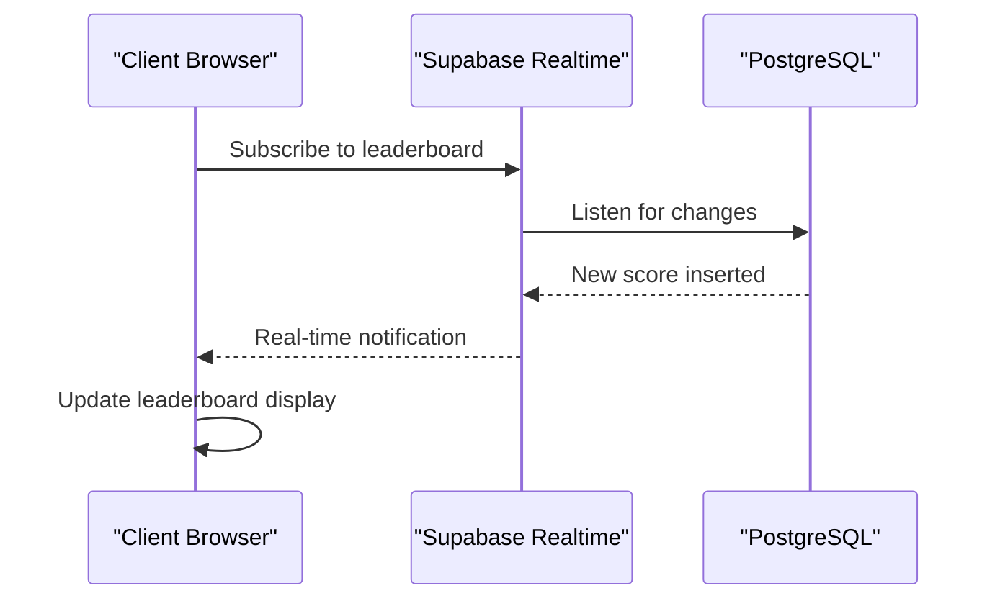

**Diagram sources**
- [index.html:850-878](file://index.html#L850-L878)

#### Guestbook Live Updates

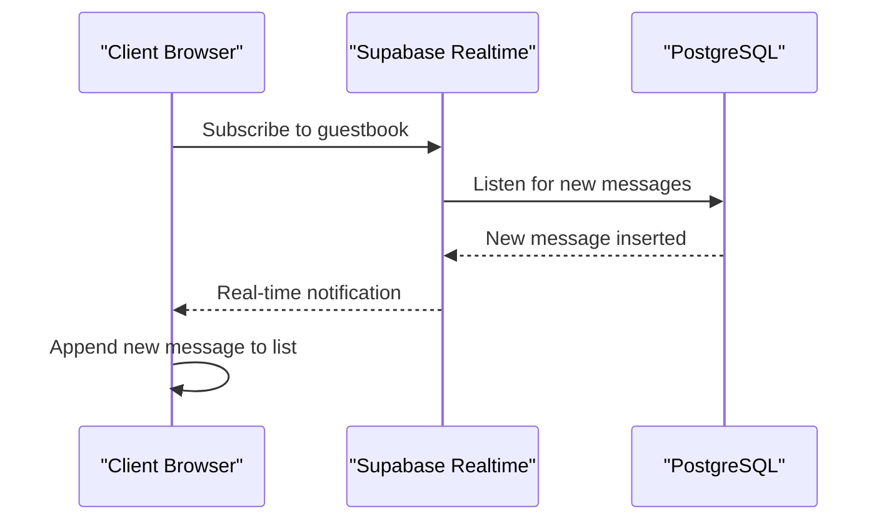

**Diagram sources**
- [index.html:897-918](file://index.html#L897-L918)

**Section sources**
- [index.html:850-878](file://index.html#L850-L878)
- [index.html:897-918](file://index.html#L897-L918)

## Performance Considerations

### Database Optimization Strategies

#### Index Strategy

The schema implements strategic indexing for optimal query performance:

| Index | Table | Columns | Purpose |
|-------|-------|---------|---------|
| idx_rate_limits_lookup | rate_limits | ip_hash, action, created_at | Efficient rate limiting queries |
| idx_leaderboard_ranking | leaderboard | score DESC, duration_seconds ASC | Fast leaderboard sorting |
| idx_guestbook_recent | guestbook | created_at DESC | Recent message retrieval |

#### Query Optimization

The system employs several optimization techniques:

1. **Selective Field Retrieval**: Edge functions only fetch necessary fields
2. **Pagination**: Frontend limits results to prevent large payloads
3. **Index Utilization**: Strategic indexes for frequent queries
4. **Connection Pooling**: Supabase-managed connection optimization

### Frontend Performance

#### State Management Efficiency

The client-side state machine minimizes unnecessary re-renders:

1. **Immutable State Updates**: New state objects replace old ones
2. **Selective DOM Updates**: Only changed elements are re-rendered
3. **Event Delegation**: Efficient event handling for large datasets
4. **Lazy Loading**: Content loaded on-demand rather than pre-loaded

**Section sources**
- [init.sql:56-59](file://supabase/migrations/20240101000000_init.sql#L56-L59)
- [index.html:546-571](file://index.html#L546-L571)

## Security Implementation

### Input Validation and Sanitization

#### Comprehensive Validation Layers

The system implements multi-layered validation:

1. **Frontend Validation**: Immediate user feedback
2. **Edge Function Validation**: Server-side verification
3. **Database Constraints**: Column-level validation
4. **Row Level Security**: Access control enforcement

#### Anti-Spam Measures

The guestbook implements sophisticated spam detection:

| Protection Mechanism | Implementation | Threshold |
|---------------------|----------------|-----------|
| Honeypot Fields | Hidden form field | Must remain empty |
| Content Length | 2-300 characters | Prevents abuse |
| URL Detection | Regex pattern matching | Maximum 2 URLs |
| Keyword Filtering | Blacklisted phrases | Automatic rejection |
| Rate Limiting | IP-based quotas | 5/hour for guestbook |
| IP Hashing | SHA-256 hashing | Privacy-preserving |

#### Security Headers and CORS

Edge functions implement strict CORS policies:

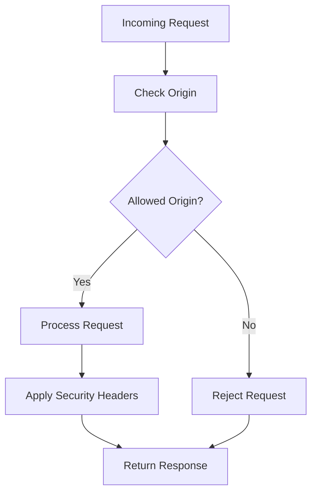

**Diagram sources**
- [start-quiz/index.ts:10-13](file://supabase/functions/start-quiz/index.ts#L10-L13)
- [submit-quiz/index.ts:10-13](file://supabase/functions/submit-quiz/index.ts#L10-L13)
- [post-guestbook/index.ts:7-10](file://supabase/functions/post-guestbook/index.ts#L7-L10)

**Section sources**
- [start-quiz/index.ts:10-13](file://supabase/functions/start-quiz/index.ts#L10-L13)
- [submit-quiz/index.ts:10-13](file://supabase/functions/submit-quiz/index.ts#L10-L13)
- [post-guestbook/index.ts:7-10](file://supabase/functions/post-guestbook/index.ts#L7-L10)

## State Management

### Client-Side State Coordination

The frontend implements a sophisticated state management system:

#### Quiz State Machine

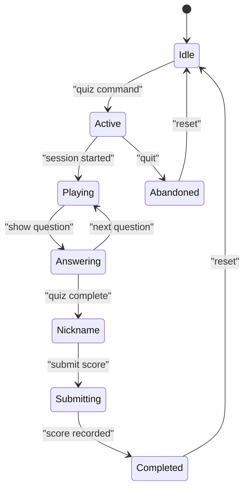

**Diagram sources**
- [index.html:546-571](file://index.html#L546-L571)
- [index.html:1209-1283](file://index.html#L1209-L1283)

#### Guestbook State Flow

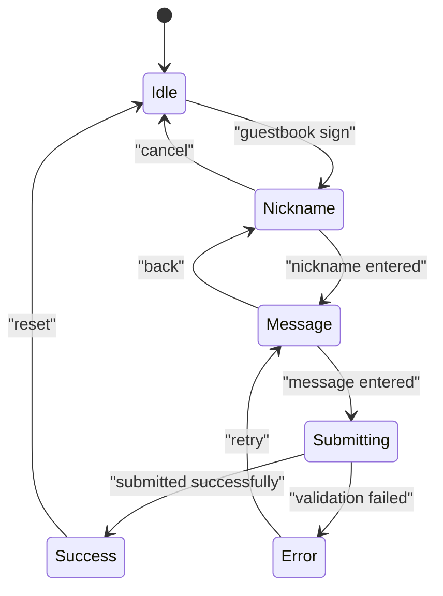

**Diagram sources**
- [index.html:555-561](file://index.html#L555-L561)
- [index.html:1487-1515](file://index.html#L1487-L1515)

### Backend State Coordination

#### Session Persistence

The backend maintains state through database records:

1. **Session Records**: Store question order and user answers
2. **Completion Tracking**: Prevent duplicate submissions
3. **Score Storage**: Persist final quiz results
4. **Rate Limit Logs**: Track user activity patterns

**Section sources**
- [index.html:546-571](file://index.html#L546-L571)
- [index.html:1487-1515](file://index.html#L1487-L1515)

## Troubleshooting Guide

### Common Issues and Solutions

#### Quiz System Issues

| Issue | Symptoms | Solution |
|-------|----------|----------|
| Session Not Found | "Session not found" error | Verify sessionId parameter |
| Duplicate Submissions | "Session already submitted" | Check completion flag |
| Answer Count Mismatch | "Answer count mismatch" | Ensure all questions answered |
| Rate Limit Exceeded | "Rate limit reached" | Wait 24 hours for quiz submissions |

#### Guestbook Issues

| Issue | Symptoms | Solution |
|-------|----------|----------|
| Spam Rejection | "Message rejected by spam filter" | Remove suspicious content |
| Rate Limit Reached | "Rate limit reached" | Wait 1 hour for new posts |
| Invalid Nickname | "Nickname must be 3–20 chars" | Use allowed characters only |
| Message Too Long | "Message too long (max 300 chars)" | Shorten message content |

#### Database Connection Issues

| Issue | Symptoms | Solution |
|-------|----------|----------|
| CORS Errors | "Access to fetch at" errors | Check Supabase URL and keys |
| Authentication Failure | "Unauthorized" responses | Verify service role key |
| Network Timeout | "Failed to fetch" errors | Check internet connectivity |

**Section sources**
- [submit-quiz/index.ts:51-57](file://supabase/functions/submit-quiz/index.ts#L51-L57)
- [post-guestbook/index.ts:48-49](file://supabase/functions/post-guestbook/index.ts#L48-L49)

## Conclusion

The Interactive Features system demonstrates a comprehensive approach to building secure, performant, and engaging web applications. The combination of edge functions, database security, and client-side state management creates a robust foundation for interactive experiences.

Key strengths of the implementation include:

1. **Security-First Design**: Multi-layered validation and row-level security
2. **Performance Optimization**: Strategic indexing and selective data fetching
3. **User Experience**: Responsive state management and real-time updates
4. **Scalability**: Edge functions handle business logic efficiently
5. **Maintainability**: Clear separation of concerns and modular architecture

The system serves as an excellent example of modern web development practices, combining traditional web technologies with contemporary backend-as-a-service patterns to deliver engaging user experiences while maintaining security and performance standards.