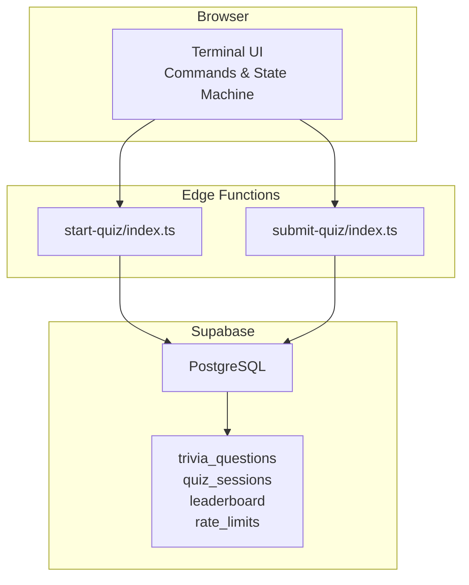
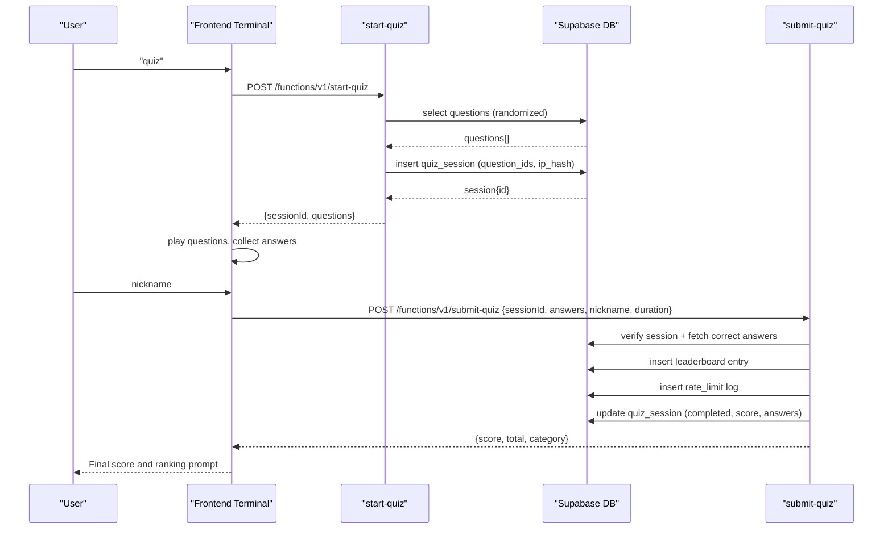
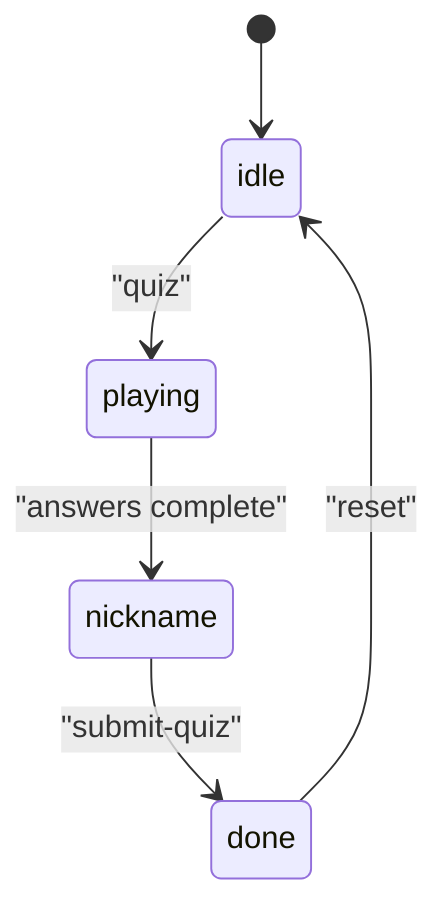
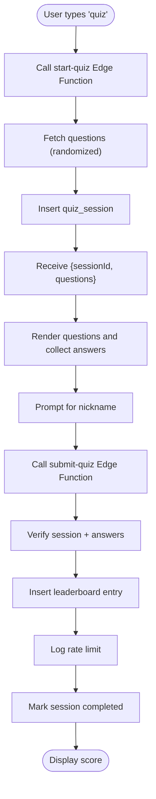
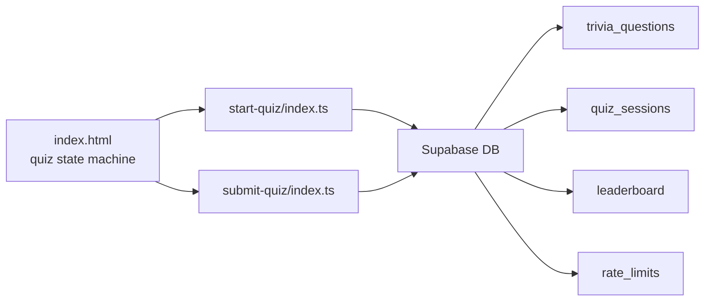

# Quiz System

<cite>
**Referenced Files in This Document**
- [index.html](file://index.html)
- [start-quiz/index.ts](file://supabase/functions/start-quiz/index.ts)
- [submit-quiz/index.ts](file://supabase/functions/submit-quiz/index.ts)
- [20240101000000_init.sql](file://supabase/migrations/20240101000000_init.sql)
- [20240101000001_seed_questions.sql](file://supabase/migrations/20240101000001_seed_questions.sql)
</cite>

## Table of Contents
1. [Introduction](#introduction)
2. [Project Structure](#project-structure)
3. [Core Components](#core-components)
4. [Architecture Overview](#architecture-overview)
5. [Detailed Component Analysis](#detailed-component-analysis)
6. [Dependency Analysis](#dependency-analysis)
7. [Performance Considerations](#performance-considerations)
8. [Troubleshooting Guide](#troubleshooting-guide)
9. [Conclusion](#conclusion)

## Introduction
This document describes the interactive trivia quiz system integrated into the portfolio website. The quiz is implemented as a terminal-style command within the frontend and backed by two Supabase Edge Functions: one to start a quiz session and another to submit answers and record leaderboard entries. The system manages quiz state in the browser, delivers randomized questions, validates inputs, enforces rate limits, and computes scores server-side to prevent tampering.

## Project Structure
The quiz system spans three primary areas:
- Frontend terminal interface and quiz state machine
- Supabase Edge Functions for quiz lifecycle orchestration
- Supabase database schema and seed data for questions and leaderboards

**Diagram sources**
- [index.html](file://index.html)
- [start-quiz/index.ts](file://supabase/functions/start-quiz/index.ts)
- [submit-quiz/index.ts](file://supabase/functions/submit-quiz/index.ts)
- [20240101000000_init.sql](file://supabase/migrations/20240101000000_init.sql)

**Section sources**
- [index.html](file://index.html)
- [start-quiz/index.ts](file://supabase/functions/start-quiz/index.ts)
- [submit-quiz/index.ts](file://supabase/functions/submit-quiz/index.ts)
- [20240101000000_init.sql](file://supabase/migrations/20240101000000_init.sql)
- [20240101000001_seed_questions.sql](file://supabase/migrations/20240101000001_seed_questions.sql)

## Core Components
- Terminal quiz command and state machine: orchestrates quiz phases, collects answers, and submits results.
- Edge function “start-quiz”: creates a session, selects randomized questions, and returns them to the client.
- Edge function “submit-quiz”: validates inputs, verifies answers server-side, writes leaderboard, enforces rate limits, and marks session complete.
- Database schema: defines tables for questions, sessions, leaderboard, and rate limiting with Row Level Security policies.

**Section sources**
- [index.html](file://index.html)
- [start-quiz/index.ts](file://supabase/functions/start-quiz/index.ts)
- [submit-quiz/index.ts](file://supabase/functions/submit-quiz/index.ts)
- [20240101000000_init.sql](file://supabase/migrations/20240101000000_init.sql)

## Architecture Overview
The quiz lifecycle is driven by the frontend state machine and two Edge Functions. The frontend runs a terminal-style command loop, while the Edge Functions handle secure, server-side operations.

**Diagram sources**
- [index.html](file://index.html)
- [start-quiz/index.ts](file://supabase/functions/start-quiz/index.ts)
- [submit-quiz/index.ts](file://supabase/functions/submit-quiz/index.ts)
- [20240101000000_init.sql](file://supabase/migrations/20240101000000_init.sql)

## Detailed Component Analysis

### Frontend Quiz State Machine
The quiz state machine maintains:
- Active flag and phase: idle, playing, nickname, message, done
- Session ID and question set
- Current question index and collected answers
- Start time for duration calculation
- Guestbook signing flow state

Key behaviors:
- Start a quiz by invoking the “start-quiz” Edge Function and initializing state
- Render questions one-by-one with category and difficulty metadata
- Collect answers until the last question, then prompt for nickname
- Submit answers to “submit-quiz” with computed duration
- Reset state after submission

**Diagram sources**
- [index.html](file://index.html)

**Section sources**
- [index.html](file://index.html)

### Edge Function: start-quiz
Responsibilities:
- Parse optional category query parameter
- Fetch a larger batch of questions and randomly shuffle to mitigate predictability
- Strip correct answers before sending to client
- Compute IP hash for session and rate-limiting
- Insert a new quiz session with selected question IDs
- Return session ID and questions to the client

Request/Response:
- Method: POST
- Path: /functions/v1/start-quiz
- Query parameters:
  - category: optional text (filters questions by category)
- Response fields:
  - sessionId: UUID
  - questions: array of question objects (without correct_answer)

Error handling:
- Returns 500 with JSON error payload if question fetch fails

Security considerations:
- Correct answers are excluded from client-visible payload
- IP address is hashed before storing

**Section sources**
- [start-quiz/index.ts](file://supabase/functions/start-quiz/index.ts)

### Edge Function: submit-quiz
Responsibilities:
- Validate request body and required fields
- Enforce anti-cheat measures:
  - Honeypot field must be absent
  - Nickname format validated (3–20 chars, alphanumeric, spaces, underscore, hyphen)
  - Duration sanity-checked (5–3600 seconds)
- Load session and enforce uniqueness constraints:
  - Session must exist
  - Session must not be marked completed
  - Answer count must match question count
- Verify answers server-side using stored correct answers
- Compute score and category label
- Insert leaderboard entry with score, total, duration, and category
- Log rate-limit entry for leaderboard actions
- Mark session completed and persist answers and score
- Return computed score and total

Request/Response:
- Method: POST
- Path: /functions/v1/submit-quiz
- Request body fields:
  - sessionId: UUID
  - answers: array of answer keys (a–d)
  - nickname: string (validated)
  - duration: number (seconds)
  - honeypot: optional (must be absent)
- Response fields:
  - score: integer
  - total: integer
  - category: string

Error handling:
- Returns 400 for invalid request, nickname, or duration
- Returns 404 if session not found
- Returns 409 if session already submitted
- Returns 429 if rate limit exceeded (20 submissions per day per IP)
- Returns 500 if verification fails

Security considerations:
- Answers are scored server-side
- IP hash used for rate limiting and session integrity
- RLS policies restrict access to sensitive tables

**Section sources**
- [submit-quiz/index.ts](file://supabase/functions/submit-quiz/index.ts)

### Database Schema and Data
Tables and indexes:
- trivia_questions: stores questions, options, correct answer, category, difficulty
- quiz_sessions: stores session metadata, question IDs, IP hash, completion flag, score, answers, timestamps
- leaderboard: stores nickname, score, total questions, duration, category, timestamps
- rate_limits: logs IP hashes and actions for rate limiting

Indexes:
- idx_rate_limits_lookup: composite index for IP/action/time filtering
- idx_leaderboard_ranking: composite index for score and duration ordering

RLS policies:
- trivia_questions: public SELECT (correct_answer excluded by Edge Function)
- leaderboard: public SELECT; inserts via service role only
- quiz_sessions, rate_limits: service role only (no anonymous policy)

Seed data:
- Multiple categories (e.g., postgresql, linux, gitlab, emily) with varying difficulties

**Section sources**
- [20240101000000_init.sql](file://supabase/migrations/20240101000000_init.sql)
- [20240101000001_seed_questions.sql](file://supabase/migrations/20240101000001_seed_questions.sql)

### Quiz Lifecycle: From Initiation to Completion
- User types “quiz” in terminal
- Frontend calls start-quiz Edge Function
- Backend returns session ID and randomized questions
- Frontend displays questions one-by-one and collects answers
- After last question, frontend prompts for nickname
- Frontend calls submit-quiz Edge Function with answers and nickname
- Backend verifies session, scores answers, writes leaderboard, logs rate limit, and marks session complete
- Frontend displays final score and ranking prompt

**Diagram sources**
- [index.html](file://index.html)
- [start-quiz/index.ts](file://supabase/functions/start-quiz/index.ts)
- [submit-quiz/index.ts](file://supabase/functions/submit-quiz/index.ts)

## Dependency Analysis
- Frontend depends on Supabase client and Edge Function invocation
- Edge Functions depend on Supabase client and database tables
- Database schema defines relationships and constraints among tables
- Rate limiting relies on hashing of client IP addresses

**Diagram sources**
- [index.html](file://index.html)
- [start-quiz/index.ts](file://supabase/functions/start-quiz/index.ts)
- [submit-quiz/index.ts](file://supabase/functions/submit-quiz/index.ts)
- [20240101000000_init.sql](file://supabase/migrations/20240101000000_init.sql)

**Section sources**
- [index.html](file://index.html)
- [start-quiz/index.ts](file://supabase/functions/start-quiz/index.ts)
- [submit-quiz/index.ts](file://supabase/functions/submit-quiz/index.ts)
- [20240101000000_init.sql](file://supabase/migrations/20240101000000_init.sql)

## Performance Considerations
- Question selection: The start-quiz function fetches a larger batch and shuffles client-side to reduce repeated queries and improve randomness. Consider increasing the multiplier if question pools grow substantially.
- Randomization: Shuffling occurs in the Edge Function; ensure the batch size is sufficient to avoid bias when slicing to the final count.
- Rate limiting: The submit-quiz function performs a count query filtered by IP hash and action. The composite index on rate_limits supports efficient daily counting.
- Leaderboard queries: The frontend sorts by score descending and duration ascending; the leaderboard index supports this ordering efficiently.
- Network latency: Minimizing round trips by batching question retrieval and submission reduces perceived latency.

[No sources needed since this section provides general guidance]

## Troubleshooting Guide
Common issues and resolutions:
- Session not found or already submitted:
  - Ensure the correct sessionId is used and that the quiz has not been completed.
  - Check that the session exists and is not marked completed.
- Answer count mismatch:
  - Verify that the number of answers equals the number of questions in the session.
- Invalid nickname or duration:
  - Confirm nickname length and allowed characters; confirm duration is within bounds.
- Rate limit exceeded:
  - Users are limited to a fixed number of leaderboard submissions per day per IP; wait until the next day or use a different IP.
- Questions not loading:
  - Confirm category parameter is valid and that the database contains seeded questions for that category.
- Score not appearing on leaderboard:
  - Ensure the submit-quiz function completes successfully and that the leaderboard insert succeeds.

**Section sources**
- [submit-quiz/index.ts](file://supabase/functions/submit-quiz/index.ts)
- [start-quiz/index.ts](file://supabase/functions/start-quiz/index.ts)
- [20240101000000_init.sql](file://supabase/migrations/20240101000000_init.sql)

## Conclusion
The quiz system combines a robust frontend state machine with secure server-side Edge Functions and a well-designed database schema. It ensures fairness through randomized question delivery, server-side scoring, and rate limiting. The architecture is straightforward to deploy and maintain, with clear separation of concerns between client UX and backend validation.

[No sources needed since this section summarizes without analyzing specific files]