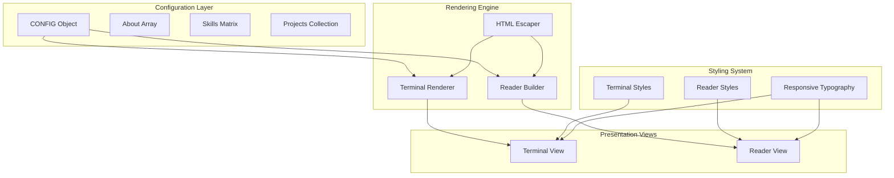
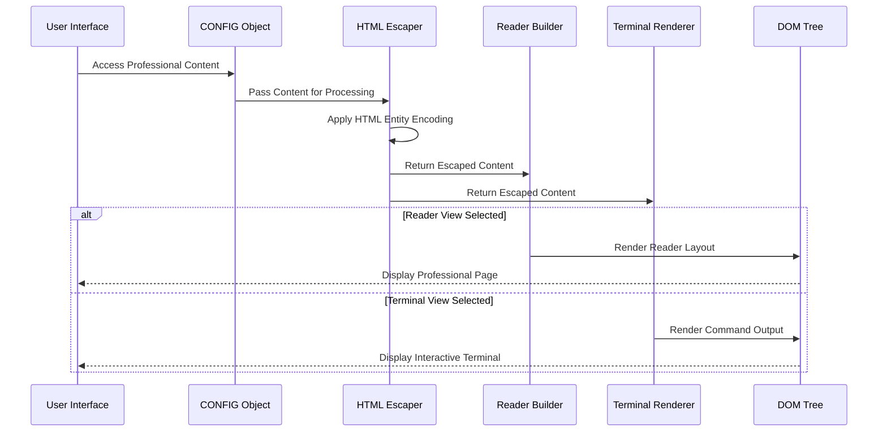
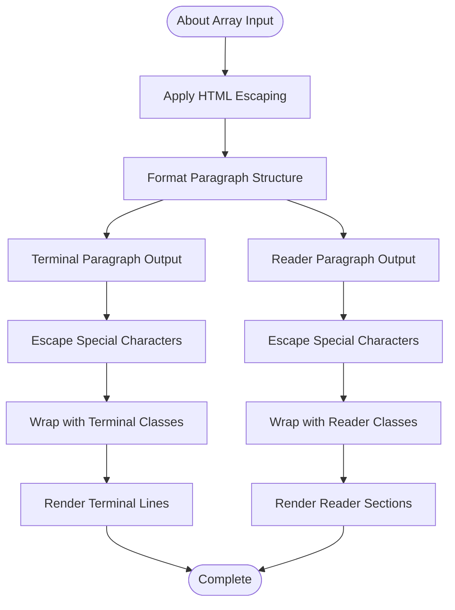
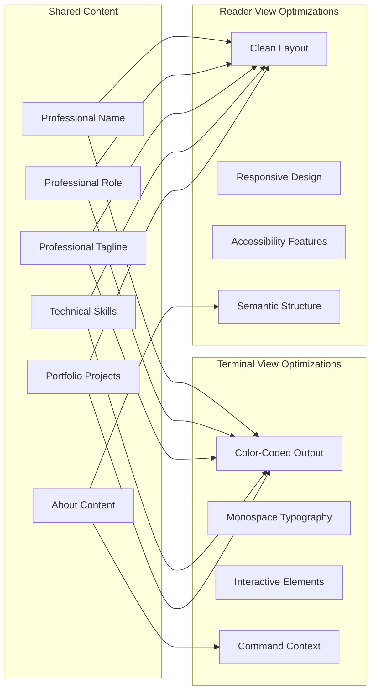
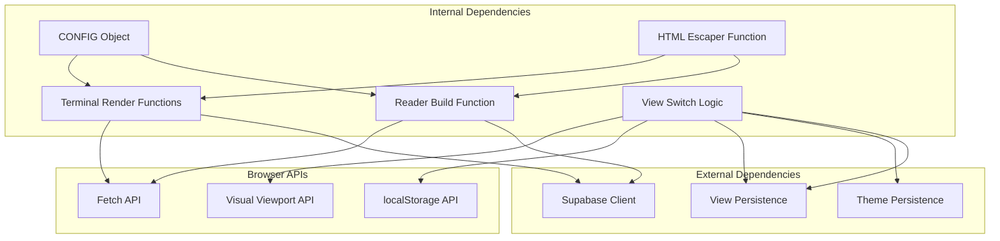

# About Section

<cite>
**Referenced Files in This Document**
- [index.html](file://index.html)
- [README.md](file://README.md)
</cite>

## Table of Contents
1. [Introduction](#introduction)
2. [Project Structure](#project-structure)
3. [Core Components](#core-components)
4. [Architecture Overview](#architecture-overview)
5. [Detailed Component Analysis](#detailed-component-analysis)
6. [Dependency Analysis](#dependency-analysis)
7. [Performance Considerations](#performance-considerations)
8. [Troubleshooting Guide](#troubleshooting-guide)
9. [Conclusion](#conclusion)

## Introduction

The About section content display system is a dual-mode presentation framework that showcases professional biographical information across two distinct viewing contexts: an interactive terminal interface and a reader-friendly web layout. This system demonstrates sophisticated content management while maintaining security through proper HTML escaping and providing responsive typography scaling for optimal readability across devices.

The implementation centers around a unified content configuration that powers both presentation modes, ensuring consistency in professional messaging while adapting the visual presentation to match each context's affordances and user expectations.

## Project Structure

The About section system is implemented within a single HTML file that serves as both a static document and an interactive terminal application. The structure follows a modular approach with clear separation between configuration, rendering logic, and presentation styles.

**Diagram sources**
- [index.html:448-520](file://index.html#L448-L520)
- [index.html:587-651](file://index.html#L587-L651)

**Section sources**
- [index.html:448-520](file://index.html#L448-L520)
- [README.md:1-59](file://README.md#L1-L59)

## Core Components

### Configuration Management

The About section relies on a centralized `CONFIG` object that defines all professional content elements. The configuration system supports multiple content types including biographical information, technical skills, project portfolios, and contact details.

**Professional Content Structure:**
- **Name and Role**: Primary identification with professional title
- **Tagline**: Concise professional positioning statement
- **About Array**: Multi-paragraph biographical content
- **Skills Matrix**: Categorized technical competencies
- **Projects Collection**: Portfolio highlights with descriptions
- **Contact Information**: Professional networking links

**Section sources**
- [index.html:453-520](file://index.html#L453-L520)

### Dual-View Rendering System

The system implements a sophisticated rendering engine that generates identical content for two distinct presentation modes:

**Terminal View Rendering:**
- Command-line interface with styled output
- Monospace typography optimized for technical reading
- Color-coded elements for enhanced readability
- Interactive command execution context

**Reader View Rendering:**
- Clean, accessible web layout
- Responsive typography with fluid scaling
- Professional section organization
- Semantic HTML structure for accessibility

**Section sources**
- [index.html:587-651](file://index.html#L587-L651)
- [index.html:684-710](file://index.html#L684-L710)

### Security Implementation

The system employs comprehensive HTML escaping to prevent cross-site scripting attacks while maintaining content integrity. The escaping mechanism ensures that all dynamic content is safely rendered regardless of its source or user input context.

**Security Measures:**
- Universal HTML entity encoding for all dynamic content
- Context-aware escaping for URLs and attributes
- Prevention of script injection in all content areas
- Safe rendering of user-generated content

**Section sources**
- [index.html:684](file://index.html#L684)
- [index.html:588-651](file://index.html#L588-L651)

## Architecture Overview

The About section system operates through a layered architecture that separates concerns between content definition, security processing, and presentation rendering.

**Diagram sources**
- [index.html:448-520](file://index.html#L448-L520)
- [index.html:587-651](file://index.html#L587-L651)
- [index.html:684](file://index.html#L684)

The architecture ensures content consistency across both presentation modes while maintaining security and performance standards.

**Section sources**
- [index.html:448-520](file://index.html#L448-L520)
- [index.html:587-651](file://index.html#L587-L651)

## Detailed Component Analysis

### About Array Processing

The multi-paragraph About array undergoes a sophisticated transformation process that maintains paragraph structure while ensuring security and optimal presentation.

**Diagram sources**
- [index.html:459-463](file://index.html#L459-L463)
- [index.html:605](file://index.html#L605)
- [index.html:707](file://index.html#L707)

**Section sources**
- [index.html:459-463](file://index.html#L459-L463)
- [index.html:605](file://index.html#L605)
- [index.html:707](file://index.html#L707)

### HTML Escaping Implementation

The HTML escaping system provides comprehensive protection against malicious content while preserving formatting and special characters essential for professional communication.

**Escaping Mechanism:**
- Character-by-character entity conversion
- Context-appropriate encoding for different content types
- Preservation of essential formatting characters
- Prevention of script execution in all contexts

**Section sources**
- [index.html:684](file://index.html#L684)
- [index.html:588-651](file://index.html#L588-L651)

### Responsive Typography System

The typography system implements fluid scaling that adapts content sizing across different viewport sizes while maintaining readability and professional appearance.

**Typography Features:**
- Fluid font sizing using CSS clamp() function
- Responsive line heights for optimal readability
- Adaptive spacing based on viewport constraints
- Consistent visual hierarchy across devices

**Section sources**
- [index.html:269](file://index.html#L269)
- [index.html:281](file://index.html#L281)
- [index.html:350-355](file://index.html#L350-L355)

### Terminal vs Reader Integration

The dual-view system ensures identical content presentation while optimizing for each platform's capabilities and user expectations.

**Diagram sources**
- [index.html:587-651](file://index.html#L587-L651)
- [index.html:684-710](file://index.html#L684-L710)

**Section sources**
- [index.html:587-651](file://index.html#L587-L651)
- [index.html:684-710](file://index.html#L684-L710)

## Dependency Analysis

The About section system exhibits minimal external dependencies while maintaining comprehensive functionality through internal orchestration.

**Diagram sources**
- [index.html:448-520](file://index.html#L448-L520)
- [index.html:530-544](file://index.html#L530-L544)
- [index.html:573-586](file://index.html#L573-L586)
- [index.html:653-667](file://index.html#L653-L667)

**Section sources**
- [index.html:448-520](file://index.html#L448-L520)
- [index.html:530-544](file://index.html#L530-L544)

## Performance Considerations

The About section system prioritizes performance through several optimization strategies:

**Memory Efficiency:**
- Single CONFIG object reduces memory footprint
- Minimal DOM manipulation during rendering
- Efficient event delegation for interactive elements

**Loading Performance:**
- Zero external dependencies minimize load time
- Inline CSS eliminates additional stylesheet requests
- Self-contained JavaScript reduces network overhead

**Runtime Performance:**
- Optimized rendering loops for content generation
- Debounced viewport handling for mobile devices
- Efficient command resolution and execution

## Troubleshooting Guide

Common issues and their resolutions for the About section system:

**Content Not Displaying:**
- Verify CONFIG object has valid content
- Check HTML escaping function availability
- Ensure DOM elements exist before rendering

**View Mode Issues:**
- Confirm data-view attribute is properly set
- Verify CSS selectors match view elements
- Check localStorage persistence for view preferences

**Security Concerns:**
- Validate HTML escaping implementation
- Test content with special characters
- Review URL encoding for external links

**Mobile Responsiveness:**
- Verify viewport meta tag configuration
- Test responsive typography scaling
- Check touch target sizing for interactive elements

**Section sources**
- [index.html:573-586](file://index.html#L573-L586)
- [index.html:653-667](file://index.html#L653-L667)
- [index.html:684](file://index.html#L684)

## Conclusion

The About section content display system exemplifies modern web development practices through its dual-view architecture, comprehensive security measures, and responsive design implementation. The system successfully bridges the gap between technical presentation and professional communication, providing a versatile platform for showcasing biographical content across diverse user contexts.

The implementation demonstrates best practices in content management, security engineering, and user experience design, making it an excellent foundation for professional portfolio websites and technical profiles. The modular architecture ensures maintainability and extensibility while the unified content approach guarantees consistency across all presentation modes.