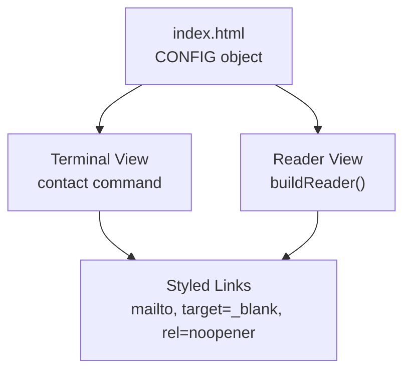
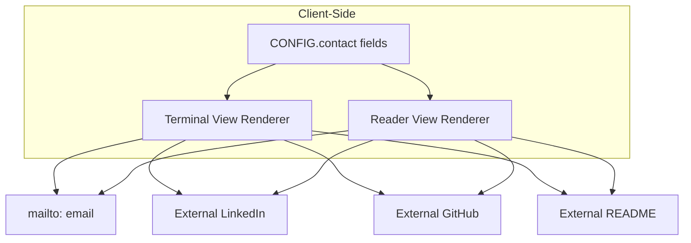
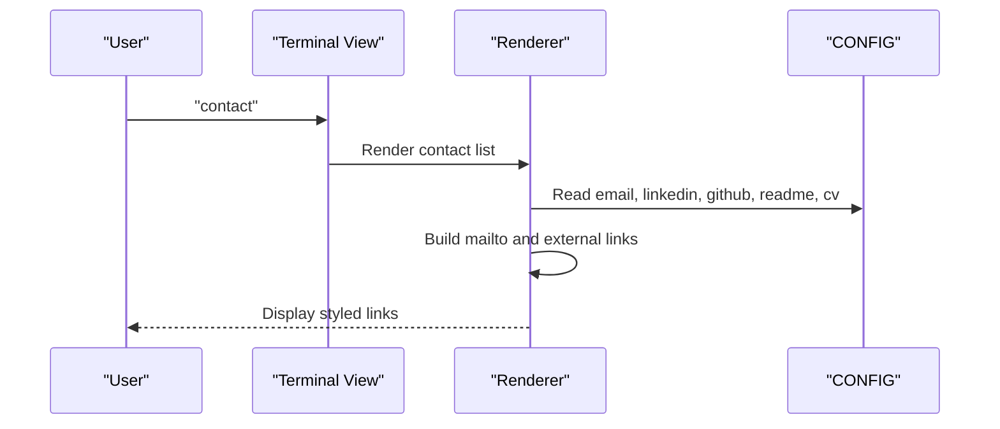
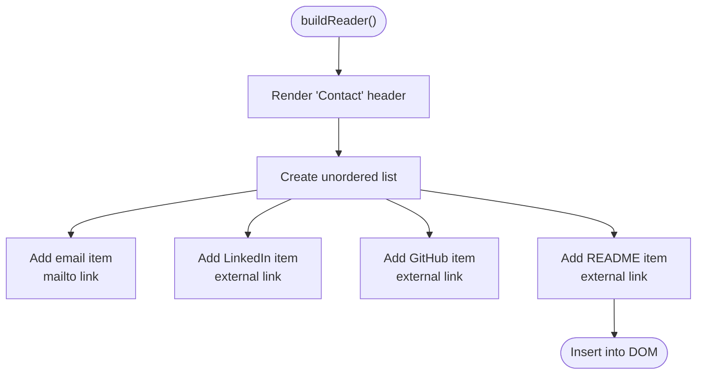
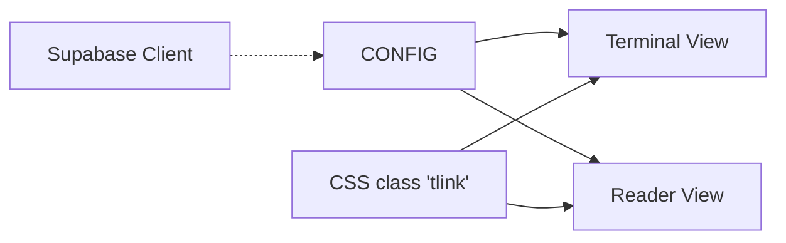

# Contact Information

<cite>
**Referenced Files in This Document**
- [index.html](file://index.html)
- [README.md](file://README.md)
- [post-guestbook/index.ts](file://supabase/functions/post-guestbook/index.ts)
- [start-quiz/index.ts](file://supabase/functions/start-quiz/index.ts)
- [submit-quiz/index.ts](file://supabase/functions/submit-quiz/index.ts)
- [20240101000000_init.sql](file://supabase/migrations/20240101000000_init.sql)
- [20240101000001_seed_questions.sql](file://supabase/migrations/20240101000001_seed_questions.sql)
</cite>

## Table of Contents
1. [Introduction](#introduction)
2. [Project Structure](#project-structure)
3. [Core Components](#core-components)
4. [Architecture Overview](#architecture-overview)
5. [Detailed Component Analysis](#detailed-component-analysis)
6. [Dependency Analysis](#dependency-analysis)
7. [Performance Considerations](#performance-considerations)
8. [Troubleshooting Guide](#troubleshooting-guide)
9. [Conclusion](#conclusion)
10. [Appendices](#appendices)

## Introduction
This document explains the Contact Information display system used in the portfolio. It covers how contact methods are organized (email, LinkedIn, GitHub, README links), how mailto links are generated, how external links are handled with security attributes, the contact data structure, link validation patterns, and integration with both terminal and reader view presentations. It also provides best practices for managing professional contact information, privacy considerations for email exposure, and strategies for keeping contact details current across platforms.

## Project Structure
The contact information is defined centrally in a configuration object and rendered in two presentation modes:
- Terminal view: interactive command output with styled links
- Reader view: static, accessible layout with consistent link styling

**Diagram sources**
- [index.html](file://index.html)

**Section sources**
- [index.html](file://index.html)

## Core Components
- Contact data structure: The CONFIG object holds contact fields including email, LinkedIn profile, GitHub profile, README page, and CV link.
- Terminal view renderer: The contact command prints contact entries with styled links.
- Reader view renderer: The buildReader function generates a structured list of contact links.
- Link generation patterns: Uses mailto for email, and external URLs with target="_blank" and rel="noopener".

Key implementation references:
- CONFIG contact fields: [index.html](file://index.html)
- Terminal contact command: [index.html](file://index.html)
- Reader contact section: [index.html](file://index.html)

**Section sources**
- [index.html](file://index.html)

## Architecture Overview
The contact system is purely client-side. The CONFIG object supplies contact data, and both views render the same information consistently.

**Diagram sources**
- [index.html](file://index.html)

## Detailed Component Analysis

### Contact Data Structure
The contact information is part of the CONFIG object and includes:
- email: primary contact email address
- linkedin: LinkedIn profile URL
- github: GitHub profile URL
- readme: README page URL
- cv: CV/resume link

These fields are referenced directly by both terminal and reader view renderers.

Implementation references:
- CONFIG definition: [index.html](file://index.html)
- Terminal contact command usage: [index.html](file://index.html)
- Reader contact section usage: [index.html](file://index.html)

**Section sources**
- [index.html](file://index.html)

### Terminal View Contact Rendering
The terminal view’s contact command prints contact entries with styled links. Each entry uses:
- mailto: for email
- target="_blank" and rel="noopener" for external links
- Consistent color and underline styling via CSS class "tlink"

Sequence of operations:
1. The contact command is invoked.
2. The renderer prints a header and lists each contact method.
3. Each link is constructed from CONFIG fields and styled appropriately.

**Diagram sources**
- [index.html](file://index.html)

**Section sources**
- [index.html](file://index.html)

### Reader View Contact Rendering
The reader view builds a dedicated section for contact information. It:
- Prints a header “Contact”
- Renders a list with four items: Email, LinkedIn, GitHub, README
- Uses the same security attributes for external links
- Uses mailto for the email link

**Diagram sources**
- [index.html](file://index.html)

**Section sources**
- [index.html](file://index.html)

### Mailto Link Generation
The email link is generated using the mailto scheme with the email address from CONFIG.email. This enables users to open their default email client directly from the page.

Implementation references:
- Terminal contact command: [index.html](file://index.html)
- Reader contact section: [index.html](file://index.html)

Best practice:
- Always use mailto for email addresses to improve usability.

**Section sources**
- [index.html](file://index.html)

### External Link Handling and Security Attributes
All external links (LinkedIn, GitHub, README, CV) are opened in a new tab with rel="noopener". This mitigates potential security risks associated with window.opener and improves performance by isolating the new browsing context.

Implementation references:
- Terminal contact command: [index.html](file://index.html)
- Reader contact section: [index.html](file://index.html)

Security considerations:
- target="_blank" alone is insufficient; rel="noopener" is essential.
- Consider adding rel="noreferrer" for additional privacy protection.

**Section sources**
- [index.html](file://index.html)

### Link Validation Patterns
While the contact links themselves are not validated in the client code, the portfolio demonstrates robust validation patterns in its backend functions. These patterns can inform best practices for validating and sanitizing user-provided links elsewhere in the system.

Examples of validation patterns present in the backend:
- Input sanitization and length limits
- Regular expressions for allowed characters
- Rate limiting and spam detection
- URL pattern matching and filtering

Implementation references:
- Guestbook message validation: [post-guestbook/index.ts](file://supabase/functions/post-guestbook/index.ts)
- Quiz submission validation: [submit-quiz/index.ts](file://supabase/functions/submit-quiz/index.ts)

**Section sources**
- [post-guestbook/index.ts](file://supabase/functions/post-guestbook/index.ts)
- [submit-quiz/index.ts](file://supabase/functions/submit-quiz/index.ts)

### Integration with Terminal and Reader Views
Both views share the same CONFIG contact fields and render them consistently:
- Terminal view: command output with styled links
- Reader view: static layout with styled links

This ensures uniformity and reduces maintenance overhead.

Implementation references:
- Terminal contact command: [index.html](file://index.html)
- Reader contact section: [index.html](file://index.html)

**Section sources**
- [index.html](file://index.html)

## Dependency Analysis
The contact system depends on:
- CONFIG object for data
- CSS class "tlink" for consistent styling
- Supabase client initialization (not used for contact, but present in the file)

**Diagram sources**
- [index.html](file://index.html)

**Section sources**
- [index.html](file://index.html)

## Performance Considerations
- Client-side rendering: No server round-trips for contact data.
- Minimal DOM updates: Reader view replaces the entire reader section when switching views.
- Lightweight: No external libraries; relies on native APIs.

[No sources needed since this section provides general guidance]

## Troubleshooting Guide
Common issues and resolutions:
- Broken mailto link: Verify CONFIG.email is a valid email address.
- External links not opening: Confirm URLs in CONFIG fields are complete and reachable.
- Styling inconsistencies: Ensure CSS class "tlink" is applied to all contact links.
- Privacy concerns with external links: Confirm rel="noopener" is present on all external links.

Implementation references:
- CONFIG contact fields: [index.html](file://index.html)
- Terminal contact command: [index.html](file://index.html)
- Reader contact section: [index.html](file://index.html)

**Section sources**
- [index.html](file://index.html)

## Conclusion
The Contact Information display system is intentionally simple and robust. It centralizes contact data in CONFIG, renders it consistently across terminal and reader views, and applies secure link practices. By following the outlined best practices—validating inputs, using mailto for emails, applying security attributes to external links, and keeping CONFIG current—you can maintain professional, secure, and accessible contact information across platforms.

[No sources needed since this section summarizes without analyzing specific files]

## Appendices

### Best Practices for Professional Contact Information Management
- Keep CONFIG.email current and verified.
- Use complete, canonical URLs for LinkedIn, GitHub, README, and CV.
- Test links regularly to ensure they remain valid.
- Consider privacy: minimize exposure of personal email where appropriate; use a professional alias if needed.
- Maintain consistency across platforms by mirroring CONFIG values.

[No sources needed since this section provides general guidance]

### Privacy Considerations for Email Exposure
- Prefer a professional email alias for public profiles.
- Use mailto links to reduce direct email scraping.
- Monitor email traffic and consider filters for automated messages.
- Remove outdated or unused contact methods periodically.

[No sources needed since this section provides general guidance]

### Maintaining Current Contact Details Across Platforms
- Centralize updates in CONFIG.
- Mirror CONFIG values to platform bios and profiles.
- Use automated scripts or CI to validate links and notify on changes.
- Periodic audits to confirm link validity and account accessibility.

[No sources needed since this section provides general guidance]