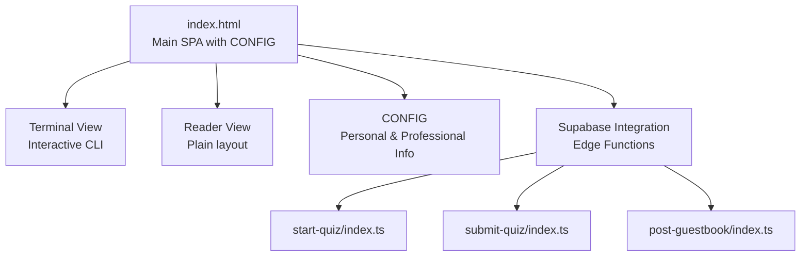
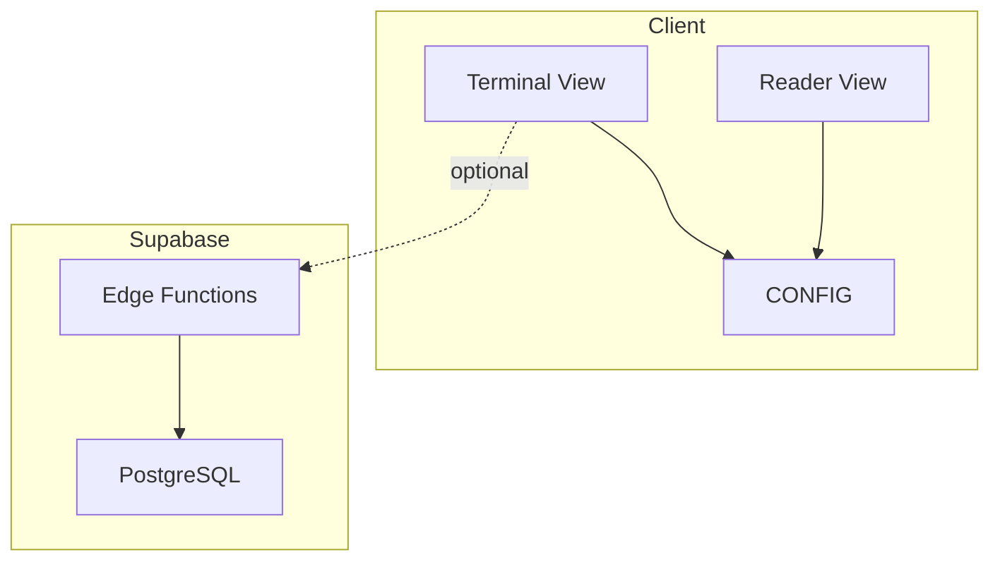
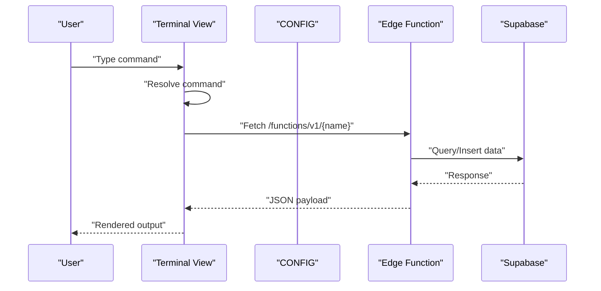
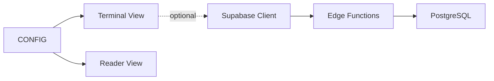

# Professional Content Display

<cite>
**Referenced Files in This Document**
- [README.md](file://README.md)
- [index.html](file://index.html)
- [post-guestbook/index.ts](file://supabase/functions/post-guestbook/index.ts)
- [start-quiz/index.ts](file://supabase/functions/start-quiz/index.ts)
- [submit-quiz/index.ts](file://supabase/functions/submit-quiz/index.ts)
</cite>

## Table of Contents
1. [Introduction](#introduction)
2. [Project Structure](#project-structure)
3. [Core Components](#core-components)
4. [Architecture Overview](#architecture-overview)
5. [Detailed Component Analysis](#detailed-component-analysis)
6. [Dependency Analysis](#dependency-analysis)
7. [Performance Considerations](#performance-considerations)
8. [Troubleshooting Guide](#troubleshooting-guide)
9. [Conclusion](#conclusion)
10. [Appendices](#appendices)

## Introduction
This professional portfolio presents personal and professional information in two complementary view modes:
- Terminal view: an interactive command-line interface with command history, autocomplete, fuzzy matching, and themed output.
- Reader view: a clean, accessible, and readable layout for standard web navigation.

The system is built with vanilla JavaScript, CSS3, and HTML5, with zero dependencies and static hosting friendly. It includes a CONFIG object for centralized customization of all content, including biographical information, skills matrix, projects showcase, strengths, and contact details. Responsive design ensures optimal presentation across desktop terminals and mobile devices.

## Project Structure
The repository is minimal and focused:
- Root-level index.html serves as the single-page application containing all HTML, CSS, and JavaScript.
- supabase/ directory contains Supabase Edge Functions for interactive features (guestbook and quiz).
- README.md documents features, tech stack, customization, and commands reference.

**Diagram sources**
- [index.html:448-1625](file://index.html#L448-L1625)
- [post-guestbook/index.ts:1-94](file://supabase/functions/post-guestbook/index.ts#L1-L94)
- [start-quiz/index.ts:1-73](file://supabase/functions/start-quiz/index.ts#L1-L73)
- [submit-quiz/index.ts:1-126](file://supabase/functions/submit-quiz/index.ts#L1-L126)

**Section sources**
- [README.md:1-59](file://README.md#L1-L59)
- [index.html:1-1625](file://index.html#L1-L1625)

## Core Components
- CONFIG object: Centralized configuration for name, role, tagline, about paragraphs, skills matrix, strengths, projects, and contact links. Also includes Supabase credentials for optional interactive features.
- Terminal view: Interactive command shell with command parsing, autocomplete, fuzzy matching, history navigation, and dynamic output rendering.
- Reader view: Plain, scrollable page that renders the same CONFIG content in a structured, accessible layout.
- Responsive design: Fluid layouts, viewport-aware adjustments, and mobile touch targets for seamless experience across devices.
- Formatting standards: Consistent color scheme, typography, spacing, and link handling with accessibility and readability in mind.
- Relationship between terminal and reader views: Both views render identical content from CONFIG, ensuring consistency across presentation modes.

**Section sources**
- [index.html:453-520](file://index.html#L453-L520)
- [index.html:587-647](file://index.html#L587-L647)
- [index.html:684-761](file://index.html#L684-L761)
- [index.html:263-425](file://index.html#L263-L425)

## Architecture Overview
The system architecture centers on a single HTML file with embedded CSS and JavaScript. The CONFIG object supplies all content. Terminal and Reader views share the same CONFIG data, while interactive features integrate with Supabase Edge Functions via fetch requests.

**Diagram sources**
- [index.html:448-1625](file://index.html#L448-L1625)
- [post-guestbook/index.ts:17-82](file://supabase/functions/post-guestbook/index.ts#L17-L82)
- [start-quiz/index.ts:15-66](file://supabase/functions/start-quiz/index.ts#L15-L66)
- [submit-quiz/index.ts:18-113](file://supabase/functions/submit-quiz/index.ts#L18-L113)

## Detailed Component Analysis

### About Section
- Purpose: Present biographical content and professional tagline.
- Terminal view: Displays formatted name, role, tagline, and about paragraphs with a contextual prompt.
- Reader view: Renders a clean header with name, role, and tagline, followed by a paragraph-based about section.

Implementation highlights:
- Terminal output uses colored spans for emphasis and structure.
- Reader view uses semantic headings and paragraphs for accessibility and readability.

**Section sources**
- [index.html:699-706](file://index.html#L699-L706)
- [index.html:604-606](file://index.html#L604-L606)

### Skills Matrix
- Purpose: Showcase categorized expertise with concise descriptions.
- Terminal view: Prints a tabular-style list with category headers and descriptions.
- Reader view: Uses a two-column layout with category labels and descriptions.

Implementation highlights:
- Skills are stored as arrays of category-description pairs in CONFIG.
- Reader view applies consistent typography and spacing for readability.

**Section sources**
- [index.html:707-712](file://index.html#L707-L712)
- [index.html:609-612](file://index.html#L609-L612)

### Projects Showcase
- Purpose: Display portfolio highlights with technology stacks and descriptions.
- Terminal view: Iterates through projects, printing titles, stacks, descriptions, and links (with fallback messaging for pending URLs).
- Reader view: Presents projects as a styled list with titles, stacks, descriptions, and clickable links.

Implementation highlights:
- Projects are objects with title, stack, desc, and url fields.
- Links are sanitized and opened in new tabs with security attributes.

**Section sources**
- [index.html:713-727](file://index.html#L713-L727)
- [index.html:614-626](file://index.html#L614-L626)

### Strengths
- Purpose: Highlight personal strengths with source attribution.
- Terminal view: Prints a numbered list with strength themes and descriptions.
- Reader view: Uses a counter-based numbering system for visual emphasis.

Implementation highlights:
- Strengths include a source field and a list of theme-description pairs.
- Reader view adds a subtitle for the source attribution.

**Section sources**
- [index.html:728-734](file://index.html#L728-L734)
- [index.html:627-633](file://index.html#L627-L633)

### Contact Information
- Purpose: Provide multiple communication channels.
- Terminal view: Lists email, LinkedIn, GitHub, README, and CV links.
- Reader view: Formats contact entries with labels and links.

Implementation highlights:
- Email links use mailto URIs.
- External links open in new tabs with security attributes.

**Section sources**
- [index.html:735-742](file://index.html#L735-L742)
- [index.html:634-642](file://index.html#L634-L642)

### Responsive Design
- Viewport and fluid layouts: CSS clamp and min/max units adapt content to screen sizes.
- Terminal view: Full-screen app-like experience on mobile with adjusted font sizes, touch targets, and safe-area insets.
- Reader view: Flexible padding and typography ensure readability across devices.

Implementation highlights:
- Media queries adjust styles for smaller screens.
- Visual viewport handling ensures input visibility on mobile keyboards.

**Section sources**
- [index.html:263-425](file://index.html#L263-L425)
- [index.html:350-403](file://index.html#L350-L403)
- [index.html:1539-1555](file://index.html#L1539-L1555)

### Content Formatting Standards
- Typography: JetBrains Mono for terminal aesthetics; clamp-based sizing for headings and body text.
- Color scheme: CSS variables define dark and light themes with consistent accents.
- Link handling: Uniform styling for terminal and reader links; external links use target="_blank" and rel="noopener".
- Accessibility: Semantic headings, readable line heights, and contrast-preserving themes.

**Section sources**
- [index.html:11-50](file://index.html#L11-L50)
- [index.html:263-425](file://index.html#L263-L425)

### Terminal Commands and Reader View Consistency
- Both views render identical CONFIG content, ensuring consistency across presentation modes.
- Terminal commands echo user input and present structured output; Reader view provides a plain, navigable layout.
- The CONFIG object centralizes all content, minimizing duplication and simplifying updates.

**Section sources**
- [index.html:587-647](file://index.html#L587-L647)
- [index.html:684-761](file://index.html#L684-L761)

### Interactive Features and External Resource Integration
- Supabase Edge Functions: start-quiz, submit-quiz, and post-guestbook enable dynamic features.
- Edge function invocation: The client constructs function URLs and sends JSON payloads with Authorization headers.
- Security: Functions enforce validation, rate limits, and sanitization.

**Diagram sources**
- [index.html:539-544](file://index.html#L539-L544)
- [start-quiz/index.ts:15-66](file://supabase/functions/start-quiz/index.ts#L15-L66)
- [submit-quiz/index.ts:18-113](file://supabase/functions/submit-quiz/index.ts#L18-L113)
- [post-guestbook/index.ts:17-82](file://supabase/functions/post-guestbook/index.ts#L17-L82)

## Dependency Analysis
- Internal dependencies:
  - CONFIG supplies all content for both views.
  - Terminal commands depend on CONFIG for rendering.
  - Reader view depends on CONFIG for content generation.
- External dependencies:
  - Supabase client library for optional interactive features.
  - CDN-hosted fonts for typography.
  - Edge Functions for dynamic content and leaderboards.

**Diagram sources**
- [index.html:453-520](file://index.html#L453-L520)
- [index.html:530-537](file://index.html#L530-L537)
- [post-guestbook/index.ts:20-23](file://supabase/functions/post-guestbook/index.ts#L20-L23)
- [start-quiz/index.ts:18-21](file://supabase/functions/start-quiz/index.ts#L18-L21)
- [submit-quiz/index.ts:21-24](file://supabase/functions/submit-quiz/index.ts#L21-L24)

**Section sources**
- [index.html:453-520](file://index.html#L453-L520)
- [index.html:530-537](file://index.html#L530-L537)

## Performance Considerations
- Zero dependencies and minimal DOM manipulation ensure fast loading and smooth interactions.
- CSS clamp and modern units reduce layout thrashing on resize.
- Mobile viewport handling avoids unnecessary reflows and improves input usability.
- Sanitized output and controlled link rendering prevent XSS and improve stability.

[No sources needed since this section provides general guidance]

## Troubleshooting Guide
- Supabase initialization:
  - Verify CONFIG.supabase.url and CONFIG.supabase.anonKey are set correctly.
  - Confirm Edge Functions are deployed and reachable.
- Command not found:
  - Use help to list available commands; fuzzy matching tolerates typos.
  - Tab completion helps select commands; Arrow keys navigate history.
- Mobile keyboard issues:
  - Visual viewport listeners adjust window height; ensure orientationchange handlers fire.
- Reader view not updating:
  - Ensure buildReader is invoked after CONFIG changes.
- External links:
  - All external links open in new tabs with rel="noopener"; verify URLs are valid.

**Section sources**
- [index.html:530-537](file://index.html#L530-L537)
- [index.html:684-761](file://index.html#L684-L761)
- [index.html:1539-1555](file://index.html#L1539-L1555)

## Conclusion
This professional content display system offers a cohesive, dual-mode presentation of personal and professional information. Its reliance on a single CONFIG object ensures consistency across terminal and reader views, while responsive design and formatting standards deliver an accessible, readable experience. Optional interactive features integrate seamlessly via Supabase Edge Functions, extending engagement without compromising performance or security.

[No sources needed since this section summarizes without analyzing specific files]

## Appendices

### Best Practices for Maintaining Professional Content Quality
- Keep CONFIG updated regularly to reflect current roles, projects, and contact details.
- Use concise, jargon-free descriptions in the about section and skills matrix.
- Prioritize recent and impactful projects in the showcase; include technology stacks and outcomes.
- Maintain consistent formatting and link hygiene across both views.
- Test responsiveness on various devices and browsers to ensure accessibility.

[No sources needed since this section provides general guidance]