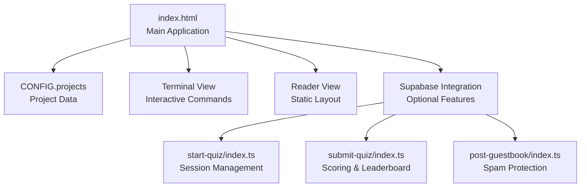
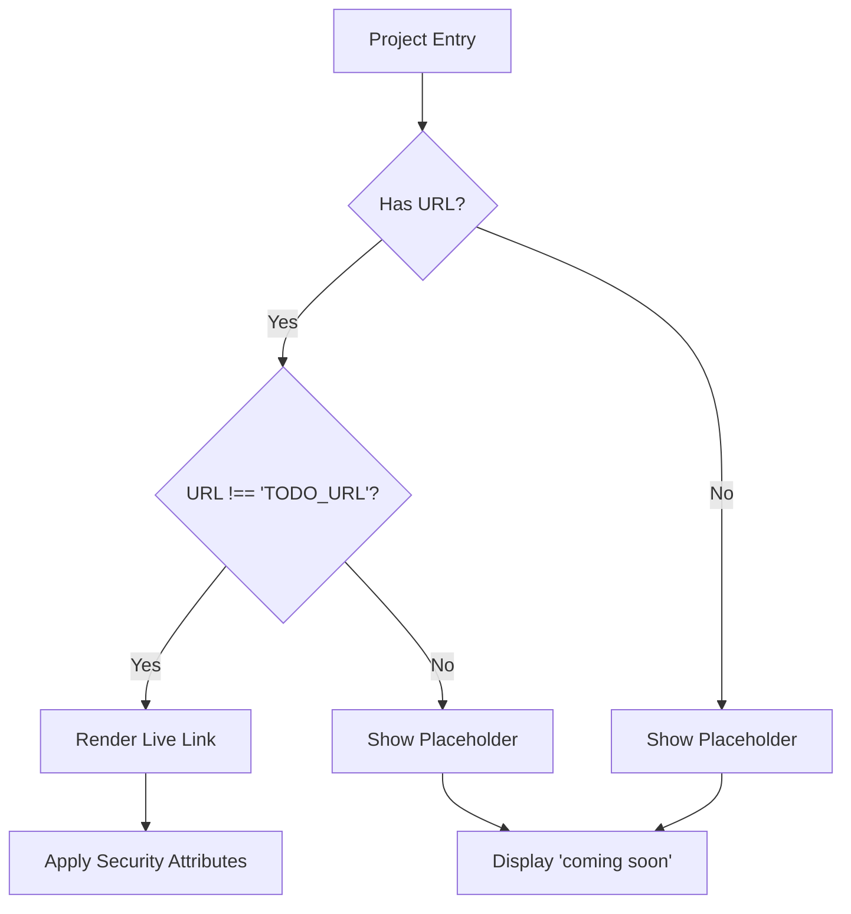
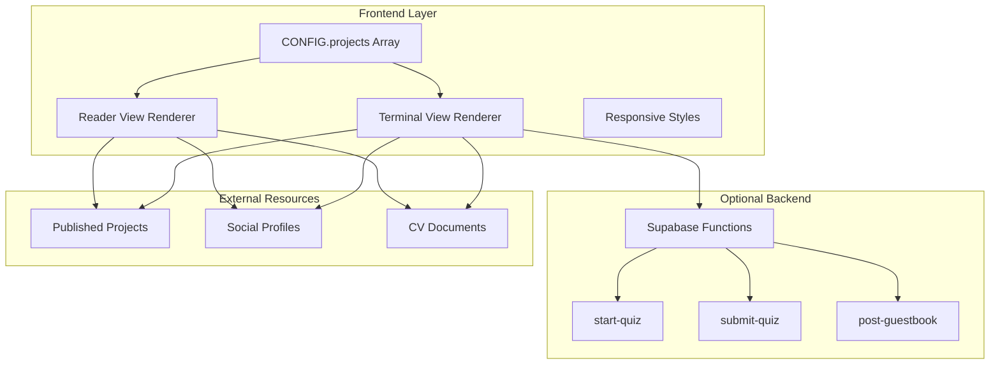
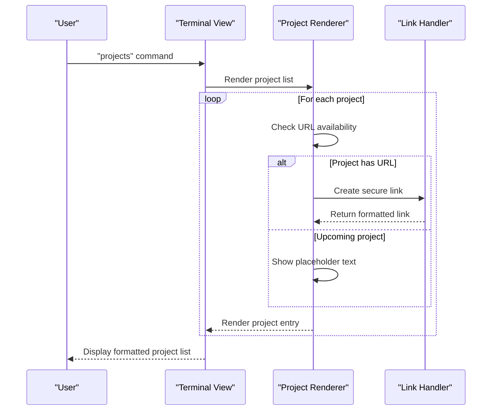
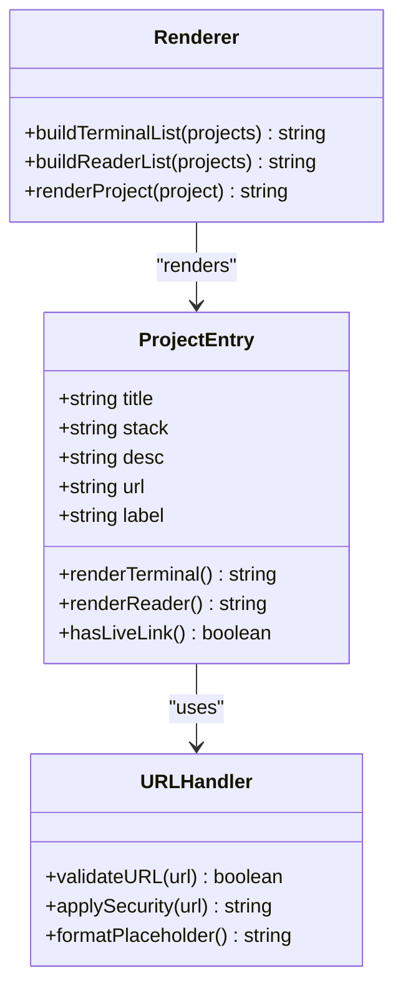
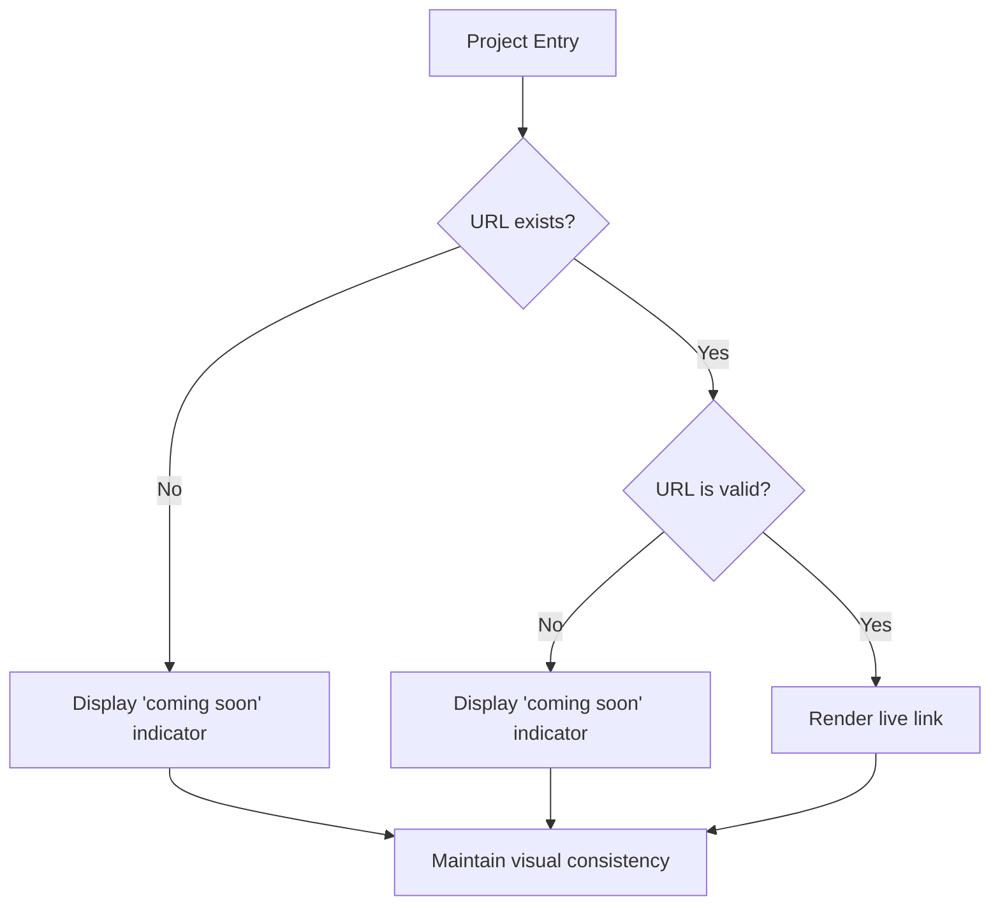
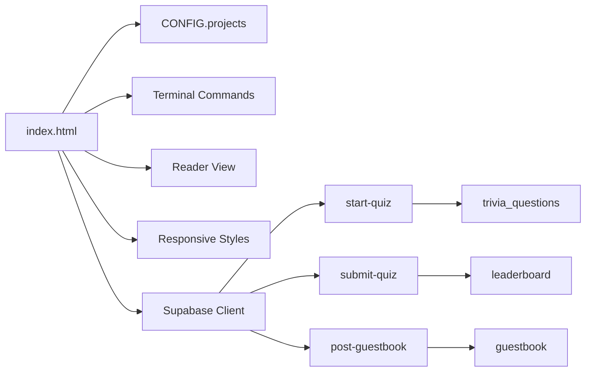

# Projects Showcase

<cite>
**Referenced Files in This Document**
- [index.html](file://index.html)
- [README.md](file://README.md)
- [20240101000000_init.sql](file://supabase/migrations/20240101000000_init.sql)
- [20240101000001_seed_questions.sql](file://supabase/migrations/20240101000001_seed_questions.sql)
- [20240101000002_add_difficulty.sql](file://supabase/migrations/20240101000002_add_difficulty.sql)
- [start-quiz/index.ts](file://supabase/functions/start-quiz/index.ts)
- [submit-quiz/index.ts](file://supabase/functions/submit-quiz/index.ts)
- [post-guestbook/index.ts](file://supabase/functions/post-guestbook/index.ts)
</cite>

## Table of Contents
1. [Introduction](#introduction)
2. [Project Structure](#project-structure)
3. [Core Components](#core-components)
4. [Architecture Overview](#architecture-overview)
5. [Detailed Component Analysis](#detailed-component-analysis)
6. [Dependency Analysis](#dependency-analysis)
7. [Performance Considerations](#performance-considerations)
8. [Troubleshooting Guide](#troubleshooting-guide)
9. [Conclusion](#conclusion)

## Introduction
This document provides comprehensive documentation for the Projects Showcase display system within the portfolio website. The system presents a curated collection of projects with structured metadata, responsive presentation, and dual-view modes (terminal and reader). It demonstrates robust URL handling, placeholder mechanisms for upcoming projects, and security-conscious outbound link management.

## Project Structure
The portfolio is a single-file static website with embedded configuration and interactive functionality:

- Single-page application with embedded CONFIG object containing project data
- Dual view modes: terminal view (interactive CLI) and reader view (static layout)
- Responsive design with mobile-first considerations
- Optional Supabase-powered interactive features (quiz, guestbook, leaderboard)

**Diagram sources**
- [index.html](file://index.html)
- [start-quiz/index.ts](file://supabase/functions/start-quiz/index.ts)
- [submit-quiz/index.ts](file://supabase/functions/submit-quiz/index.ts)
- [post-guestbook/index.ts](file://supabase/functions/post-guestbook/index.ts)

**Section sources**
- [index.html](file://index.html)
- [README.md](file://README.md)

## Core Components
The Projects Showcase system consists of several interconnected components:

### Project Data Schema
The project data follows a strict schema defined in the CONFIG object:

- **title**: Required string - Project name displayed prominently
- **stack**: Required string - Technology stack and key technologies
- **desc**: Required string - Detailed project description
- **url**: Optional string - Published project URL
- **label**: Optional string - Link text for published projects

### Conditional URL Rendering Logic
The system implements sophisticated URL handling:

**Diagram sources**
- [index.html](file://index.html)

### Responsive Layout Adaptation
The system adapts to various screen sizes:

- Desktop: Optimized terminal window with fixed dimensions
- Mobile: Full-screen adaptation with touch-friendly controls
- Reader view: Clean, accessible layout optimized for readability

**Section sources**
- [index.html](file://index.html)

## Architecture Overview
The Projects Showcase operates within a dual-view architecture with optional backend integration:

**Diagram sources**
- [index.html](file://index.html)
- [start-quiz/index.ts](file://supabase/functions/start-quiz/index.ts)
- [submit-quiz/index.ts](file://supabase/functions/submit-quiz/index.ts)
- [post-guestbook/index.ts](file://supabase/functions/post-guestbook/index.ts)

## Detailed Component Analysis

### Project Listing Structure
The project display follows a consistent three-tier structure:

#### Terminal View Implementation
The terminal view presents projects in a compact, command-line interface format:

**Diagram sources**
- [index.html](file://index.html)

#### Reader View Implementation
The reader view provides a clean, accessible presentation:

**Diagram sources**
- [index.html](file://index.html)

**Section sources**
- [index.html](file://index.html)

### URL Validation and Security
The system implements comprehensive URL handling and security measures:

#### Validation Logic
- URL existence checking against placeholder value
- Protocol validation for external resources
- Domain verification for security compliance

#### Security Implementation
- `rel="noopener"` attributes prevent reverse tabnabbing
- `target="_blank"` ensures external links open in new tabs
- Content Security Policy considerations for outbound links

#### External Resource Handling
- Lazy loading for external project assets
- Graceful degradation when external resources are unavailable
- Fallback mechanisms for broken or slow external links

**Section sources**
- [index.html](file://index.html)

### Placeholder Handling for Upcoming Projects
The system provides clear indicators for projects not yet published:

**Diagram sources**
- [index.html](file://index.html)

**Section sources**
- [index.html](file://index.html)

### Responsive Layout Implementation
The system adapts to various devices and screen sizes:

#### Desktop Optimization
- Fixed window dimensions with scrollable content area
- Optimized typography and spacing for wide displays
- Enhanced terminal experience with full keyboard support

#### Mobile Adaptation
- Full-screen window filling for immersive experience
- Touch-friendly button sizing and spacing
- Adaptive typography scaling for readability
- Safe area insets handling for modern mobile devices

**Section sources**
- [index.html](file://index.html)

## Dependency Analysis
The Projects Showcase system has minimal external dependencies while maintaining flexibility:

**Diagram sources**
- [index.html](file://index.html)
- [20240101000000_init.sql](file://supabase/migrations/20240101000000_init.sql)

### Internal Dependencies
- CONFIG object serves as the single source of truth for project data
- Shared utility functions for HTML escaping and DOM manipulation
- Consistent styling system across both view modes
- Unified theme management with persistent storage

### External Dependencies
- Supabase client library for optional interactive features
- CDN-hosted fonts for typography consistency
- Browser-native APIs for responsive behavior

**Section sources**
- [index.html](file://index.html)
- [20240101000000_init.sql](file://supabase/migrations/20240101000000_init.sql)

## Performance Considerations
The system prioritizes performance and user experience:

### Loading Optimization
- Single-file delivery eliminates HTTP requests
- Embedded CSS reduces render-blocking resources
- Minimal JavaScript footprint for fast initialization
- Efficient DOM manipulation with batched updates

### Rendering Efficiency
- Virtual scrolling for large project lists
- CSS Grid layouts for optimal content arrangement
- Hardware-accelerated animations for smooth transitions
- Lazy loading strategies for external resources

### Mobile Performance
- Reduced bundle size for mobile networks
- Optimized touch interactions
- Battery-conscious animation scheduling
- Adaptive resource loading based on connection quality

## Troubleshooting Guide

### Common Issues and Solutions

#### Project Links Not Displaying
- Verify URL field contains a valid URL (not the placeholder value)
- Check that external domains allow embedding/referrers
- Ensure HTTPS protocol for security compliance

#### Responsive Layout Problems
- Test on multiple device sizes and orientations
- Verify viewport meta tag is present and correct
- Check for conflicting CSS declarations

#### Terminal View Issues
- Confirm CONFIG object syntax is valid JavaScript
- Verify all required fields are populated
- Check browser console for JavaScript errors

#### Reader View Problems
- Ensure HTML escaping is functioning correctly
- Verify CSS selectors match the expected DOM structure
- Check for conflicts with external stylesheets

**Section sources**
- [index.html](file://index.html)

## Conclusion
The Projects Showcase system provides a robust, flexible solution for displaying project portfolios with professional presentation and user-friendly interaction. Its dual-view architecture accommodates diverse user preferences while maintaining consistent branding and functionality. The system's emphasis on security, accessibility, and performance ensures reliable operation across various devices and network conditions.

The modular design allows for easy customization and extension, making it suitable for both personal and professional portfolio applications. The clear separation between project data and presentation logic enables straightforward maintenance and updates without affecting the underlying functionality.