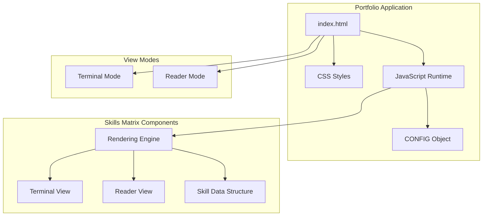
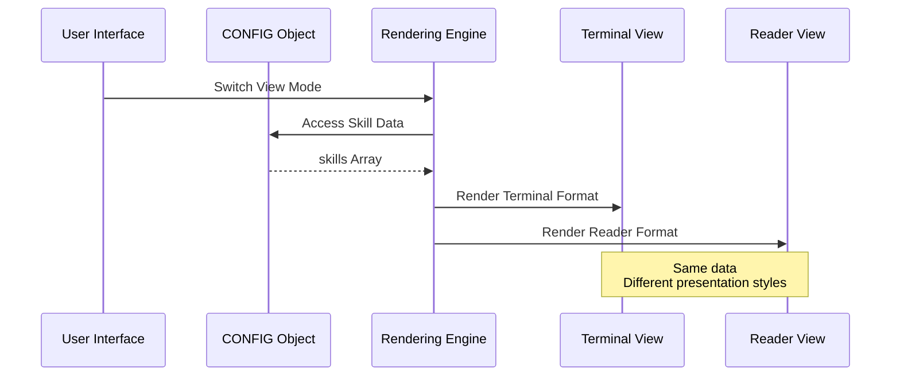
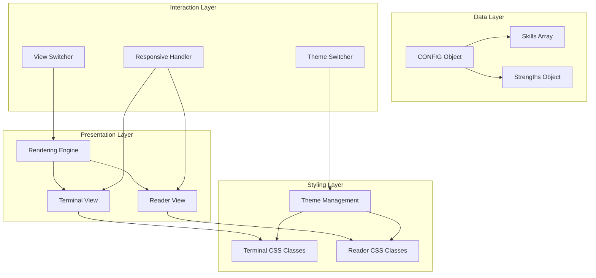
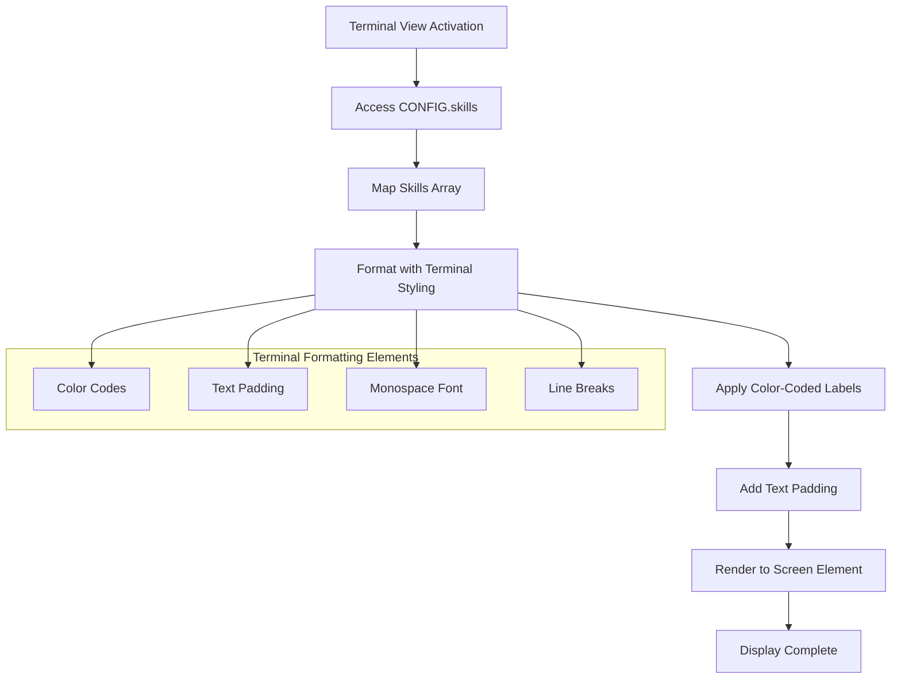
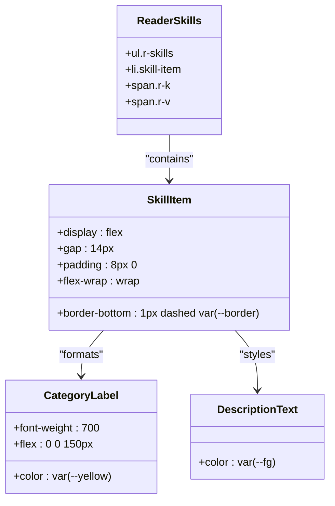
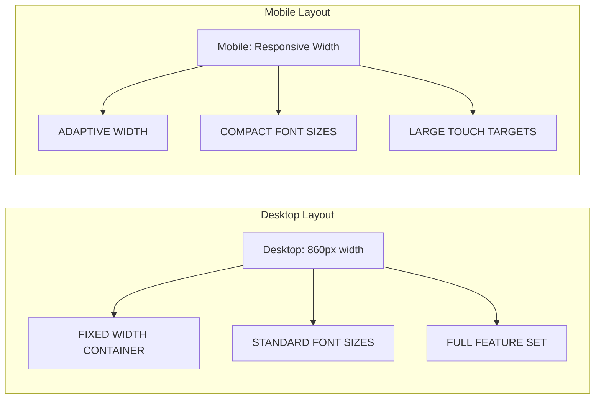
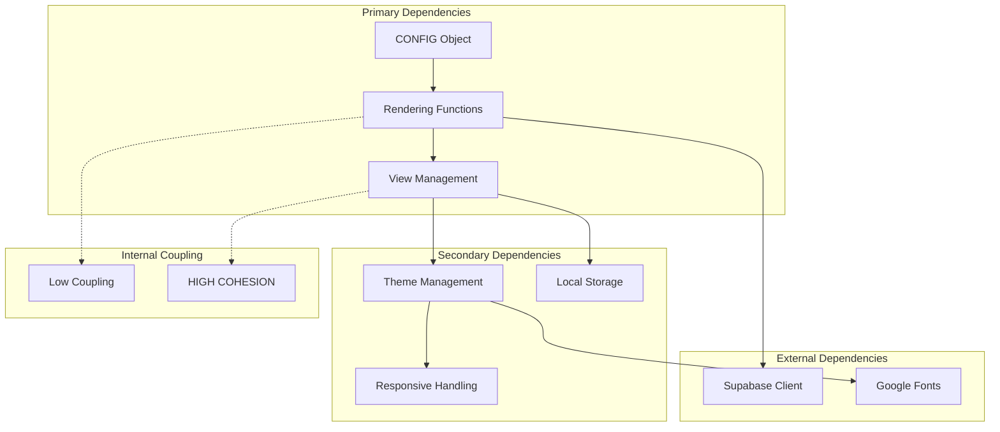

# Skills Matrix

<cite>
**Referenced Files in This Document**
- [index.html](file://index.html)
- [README.md](file://README.md)
</cite>

## Table of Contents
1. [Introduction](#introduction)
2. [Project Structure](#project-structure)
3. [Core Components](#core-components)
4. [Architecture Overview](#architecture-overview)
5. [Detailed Component Analysis](#detailed-component-analysis)
6. [Dependency Analysis](#dependency-analysis)
7. [Performance Considerations](#performance-considerations)
8. [Troubleshooting Guide](#troubleshooting-guide)
9. [Conclusion](#conclusion)

## Introduction

The Skills Matrix display system is a dual-view portfolio component that presents technical competencies in two distinct formats: a terminal-style monospace presentation and a reader-style styled presentation. This system serves as a central hub for showcasing professional skills while maintaining flexibility for different user preferences and contexts.

The Skills Matrix operates within a larger portfolio framework that includes interactive terminal commands, responsive design capabilities, and theme switching functionality. It demonstrates sophisticated front-end architecture with data-driven content rendering and adaptive presentation layers.

## Project Structure

The Skills Matrix implementation is embedded within a comprehensive portfolio application with the following key structural elements:



**Diagram sources**
- [index.html:427-446](file://index.html#L427-L446)
- [index.html:591-655](file://index.html#L591-L655)

The system consists of:
- **Single HTML file architecture** containing all assets and logic
- **Dual view modes** with automatic switching capability
- **Configurable skill data** stored in a centralized configuration object
- **Responsive design** adapting to various screen sizes
- **Theme support** with persistent user preferences

**Section sources**
- [index.html:1-800](file://index.html#L1-L800)
- [README.md:1-59](file://README.md#L1-L59)

## Core Components

### Skill Data Structure

The Skills Matrix utilizes a structured data format that enables flexible categorization and presentation:

```mermaid
classDiagram
class SkillsData {
+Array[] skills
+Object strengths
+String name
+String role
+String[] about
+Project[] projects
+String email
+String linkedin
+String github
+String cv
}
class SkillEntry {
+String category
+String description
}
class Strengths {
+String source
+Array[] themes
}
class Project {
+String title
+String stack
+String desc
+String url
+String label
}
SkillsData --> SkillEntry : "contains"
SkillsData --> Strengths : "includes"
SkillsData --> Project : "references"
SkillEntry --> "Category" : "categorizes"
SkillEntry --> "Description" : "describes"
```

**Diagram sources**
- [index.html:453-520](file://index.html#L453-L520)

The primary skill data structure follows this format:
- **Category**: A descriptive heading for the skill grouping
- **Description**: Comma-separated technical competencies within that category
- **Format**: Nested arrays where each element is `[Category, Description]`

### Dual Presentation Architecture

The system implements a sophisticated dual-view architecture that maintains identical content across different presentation formats:



**Diagram sources**
- [index.html:591-655](file://index.html#L591-L655)
- [index.html:692-720](file://index.html#L692-L720)

**Section sources**
- [index.html:464-471](file://index.html#L464-L471)
- [index.html:591-655](file://index.html#L591-L655)

## Architecture Overview

The Skills Matrix employs a modular architecture that separates concerns between data management, view rendering, and presentation logic:



**Diagram sources**
- [index.html:448-520](file://index.html#L448-L520)
- [index.html:591-655](file://index.html#L591-L655)

The architecture ensures:
- **Separation of concerns** between data and presentation
- **Consistent data access** across different view modes
- **Flexible styling** through CSS class-based approach
- **Responsive behavior** through media queries and dynamic sizing

## Detailed Component Analysis

### Terminal View Implementation

The terminal view presents skills in a monospace, command-line inspired format that mimics traditional Unix systems:



**Diagram sources**
- [index.html:715-720](file://index.html#L715-L720)
- [index.html:11-172](file://index.html#L11-L172)

Key terminal formatting characteristics:
- **Monospace typography** using JetBrains Mono font
- **Color-coded categories** with yellow bold text for headings
- **Text padding** using `padEnd()` for alignment
- **Terminal-style prompts** with `$` prefix
- **Dimmed descriptions** for contextual information

### Reader View Implementation

The reader view transforms the same skill data into a modern, accessible web presentation:



**Diagram sources**
- [index.html:612-616](file://index.html#L612-L616)
- [index.html:301-308](file://index.html#L301-L308)

Reader view features:
- **Flexbox layout** with controlled spacing and wrapping
- **Two-column design** with fixed category widths
- **Responsive adjustments** for mobile devices
- **Clean typography** with accessible color contrasts
- **Dashed borders** for visual separation between items

### Responsive Design Implementation

The system adapts its presentation based on screen size and device capabilities:



**Diagram sources**
- [index.html:350-403](file://index.html#L350-L403)

Responsive adaptations include:
- **Fluid container sizing** using `min()` function
- **Reduced font sizes** on smaller screens
- **Touch-friendly interface elements** with larger tap targets
- **Adaptive column layouts** for skill presentations
- **Safe area insets** for mobile device compatibility

**Section sources**
- [index.html:715-720](file://index.html#L715-L720)
- [index.html:612-616](file://index.html#L612-L616)
- [index.html:350-403](file://index.html#L350-L403)

## Dependency Analysis

The Skills Matrix system exhibits well-managed dependencies with clear separation between components:



**Diagram sources**
- [index.html:448-520](file://index.html#L448-L520)
- [index.html:577-589](file://index.html#L577-L589)

Dependency characteristics:
- **Minimal external dependencies** (only Google Fonts and Supabase client)
- **Self-contained rendering logic** within single HTML file
- **Persistent state management** through localStorage
- **Theme independence** from external libraries
- **Configurable data structure** enabling easy customization

**Section sources**
- [index.html:530-544](file://index.html#L530-L544)
- [index.html:577-589](file://index.html#L577-L589)

## Performance Considerations

The Skills Matrix implementation prioritizes performance through several optimization strategies:

### Rendering Efficiency
- **Single DOM manipulation** per view switch operation
- **Efficient string concatenation** for HTML generation
- **Minimal reflows** through batched DOM updates
- **Lazy initialization** of interactive elements

### Memory Management
- **No persistent state** for static content
- **Event listener cleanup** through proper lifecycle management
- **Efficient array mapping** for skill data processing
- **CSS variable usage** for reduced style recalculation

### Loading Optimization
- **Inline asset embedding** eliminating network requests
- **Critical path rendering** prioritizing visible content
- **Progressive enhancement** for non-essential features
- **Minimal JavaScript bundle** (single HTML file)

## Troubleshooting Guide

### Common Issues and Solutions

**Issue: Skills not displaying in terminal view**
- Verify CONFIG.skills array format: `[["Category","Description"]]`
- Check browser console for JavaScript errors
- Ensure CONFIG object is properly defined before script execution

**Issue: Reader view shows incorrect styling**
- Confirm CSS class names match HTML structure
- Verify theme variables are properly set
- Check for conflicting CSS rules

**Issue: Mobile responsiveness problems**
- Test with actual mobile devices (simulator limitations)
- Verify viewport meta tag is present
- Check media query breakpoints

**Issue: View switching not working**
- Ensure localStorage is enabled in browser
- Verify event listeners are attached correctly
- Check for JavaScript execution errors

### Debugging Strategies

1. **Console Inspection**: Use browser developer tools to inspect rendered HTML
2. **Network Monitoring**: Verify font and asset loading
3. **Performance Profiling**: Monitor rendering performance
4. **Cross-browser Testing**: Validate behavior across different browsers

**Section sources**
- [index.html:591-655](file://index.html#L591-L655)
- [index.html:657-670](file://index.html#L657-L670)

## Conclusion

The Skills Matrix display system represents a sophisticated implementation of dual-view content presentation with excellent separation of concerns and responsive design capabilities. The system successfully balances technical functionality with aesthetic appeal while maintaining accessibility and performance standards.

Key achievements include:
- **Flexible data structure** enabling easy customization
- **Dual presentation modes** serving diverse user preferences
- **Responsive design** adapting to various screen sizes
- **Theme support** with persistent user preferences
- **Performance optimization** through efficient rendering

The implementation demonstrates best practices in modern web development while providing a foundation for further enhancement and customization. The modular architecture ensures maintainability and extensibility for future requirements.