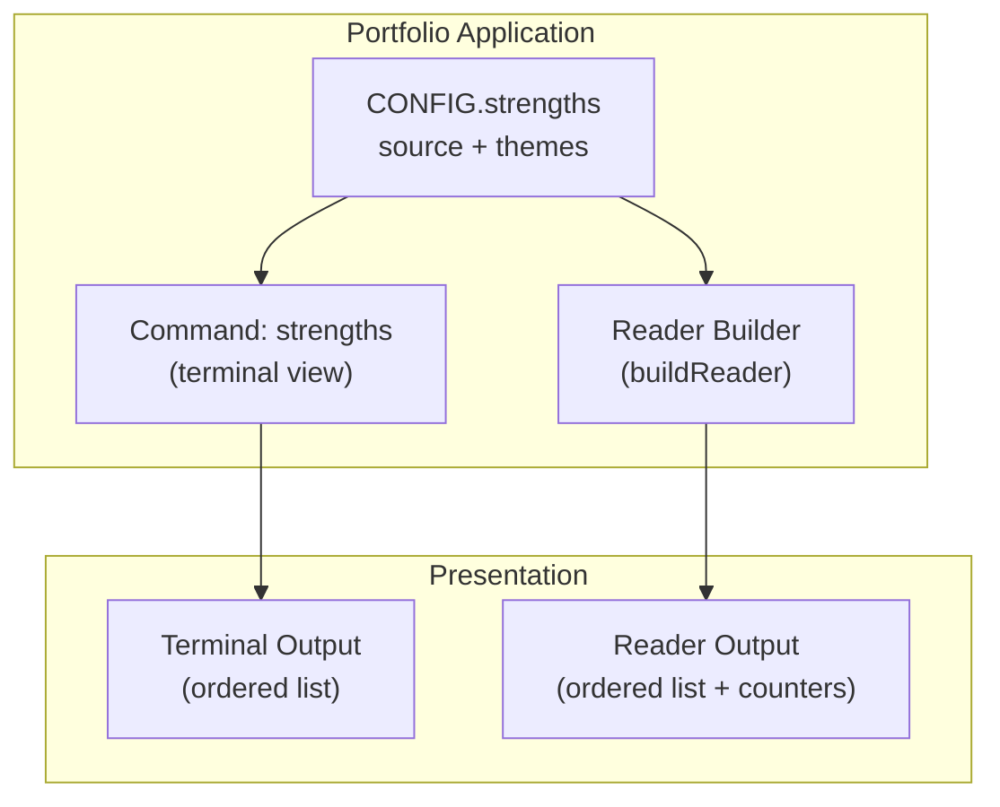
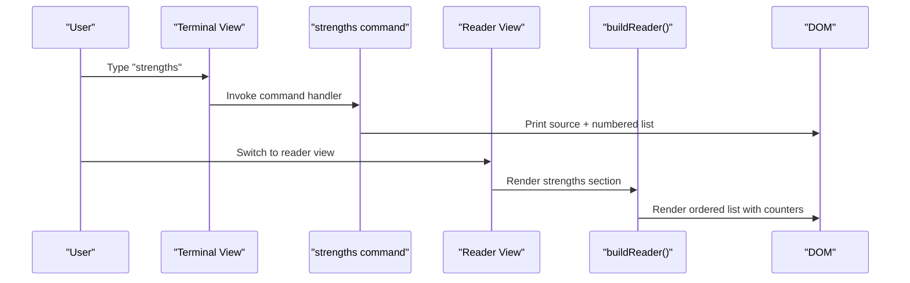
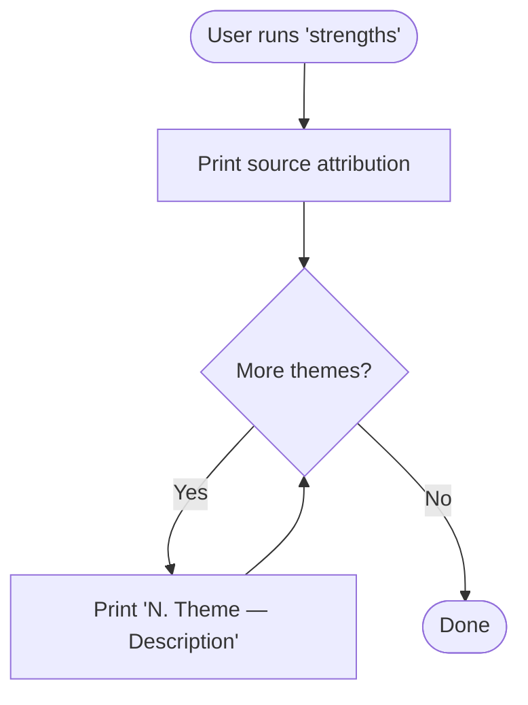
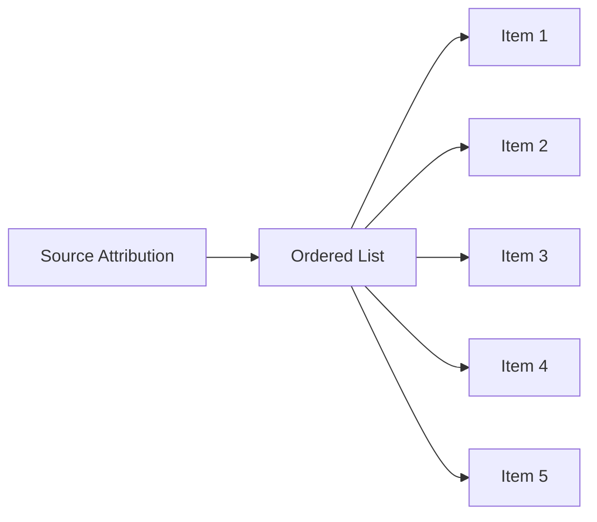
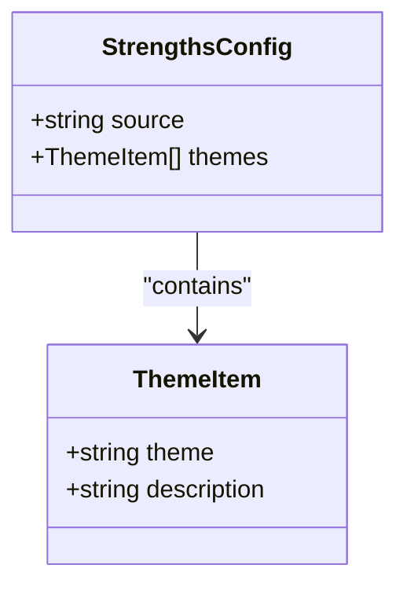
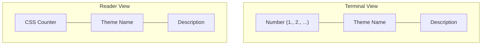
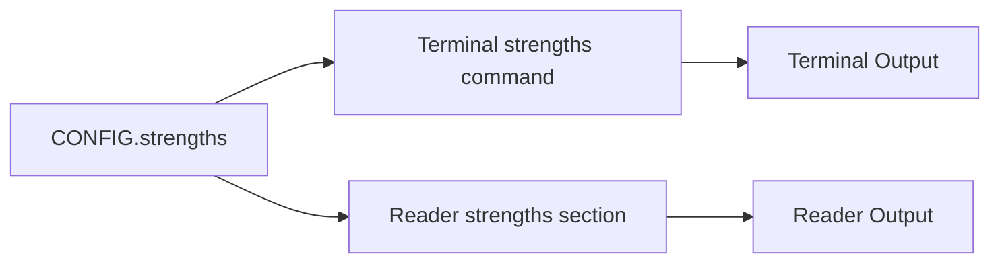

# Strengths Display

<cite>
**Referenced Files in This Document**
- [README.md](file://README.md)
- [index.html](file://index.html)
- [20240101000000_init.sql](file://supabase/migrations/20240101000000_init.sql)
- [20240101000001_seed_questions.sql](file://supabase/migrations/20240101000001_seed_questions.sql)
- [start-quiz/index.ts](file://supabase/functions/start-quiz/index.ts)
- [submit-quiz/index.ts](file://supabase/functions/submit-quiz/index.ts)
- [post-guestbook/index.ts](file://supabase/functions/post-guestbook/index.ts)
</cite>

## Table of Contents
1. [Introduction](#introduction)
2. [Project Structure](#project-structure)
3. [Core Components](#core-components)
4. [Architecture Overview](#architecture-overview)
5. [Detailed Component Analysis](#detailed-component-analysis)
6. [Dependency Analysis](#dependency-analysis)
7. [Performance Considerations](#performance-considerations)
8. [Troubleshooting Guide](#troubleshooting-guide)
9. [Conclusion](#conclusion)
10. [Appendices](#appendices)

## Introduction
This document explains the Strengths display system integrated into the portfolio’s dual-view interface. It focuses on how CliftonStrengths data is presented in both terminal and reader views, including source attribution, ordered list formatting, descriptive text presentation, and the underlying data structure. It also provides guidance on interpreting and presenting personality assessments professionally, with emphasis on aligning strengths with target roles and industries.

## Project Structure
The Strengths display spans two primary presentation modes:
- Terminal view: a command-line interface that prints strengths as a numbered list with descriptive text.
- Reader view: a static, accessible page that renders strengths as an ordered list with custom counters and descriptive formatting.

**Diagram sources**
- [index.html:472-481](file://index.html#L472-L481)
- [index.html:736-742](file://index.html#L736-L742)
- [index.html:631-637](file://index.html#L631-L637)

**Section sources**
- [README.md:62-88](file://README.md#L62-L88)
- [index.html:472-481](file://index.html#L472-L481)
- [index.html:631-637](file://index.html#L631-L637)
- [index.html:736-742](file://index.html#L736-L742)

## Core Components
- CONFIG.strengths: Holds the source attribution and the ordered list of strengths with themes and descriptions.
- Terminal command: The strengths command prints the source and iterates through themes to produce a numbered list with descriptive text.
- Reader builder: Renders the same data into an ordered list with custom counters and descriptive formatting.

Key characteristics:
- Source attribution: A human-readable label indicating the assessment source.
- Ordered list: Terminal view uses numeric prefixes; Reader view uses CSS counters.
- Descriptive formatting: Themes and descriptions are styled distinctly for readability.

**Section sources**
- [index.html:472-481](file://index.html#L472-L481)
- [index.html:736-742](file://index.html#L736-L742)
- [index.html:631-637](file://index.html#L631-L637)

## Architecture Overview
The Strengths display is part of the portfolio’s unified data model and rendering pipeline. The CONFIG object centralizes all content, including strengths. Terminal and Reader views consume this data through dedicated handlers.

**Diagram sources**
- [index.html:736-742](file://index.html#L736-L742)
- [index.html:631-637](file://index.html#L631-L637)

## Detailed Component Analysis

### Terminal View: strengths Command
The terminal view implements a straightforward, text-based presentation:
- Prints the source attribution line.
- Iterates over the themes array and prints each item with a leading number and descriptive text.

Implementation highlights:
- Uses zero-based indexing internally but prints 1-based numbering.
- Applies distinct styles for the number, theme, and description.

**Diagram sources**
- [index.html:736-742](file://index.html#L736-L742)

**Section sources**
- [index.html:736-742](file://index.html#L736-L742)

### Reader View: Strengths Section
The reader view presents strengths as an ordered list with custom counters:
- A paragraph displays the source attribution.
- An ordered list renders each theme and description.
- CSS counters automatically number items; the design emphasizes visual distinction between theme and description.

**Diagram sources**
- [index.html:631-637](file://index.html#L631-L637)

**Section sources**
- [index.html:631-637](file://index.html#L631-L637)

### Data Structure Requirements
The CONFIG.strengths object requires:
- source: A string describing the assessment source (e.g., “CliftonStrengths — Top 5”).
- themes: An array of arrays, where each inner array contains:
  - theme: A string representing the strength theme.
  - description: A string describing the theme’s practical application.

**Diagram sources**
- [index.html:472-481](file://index.html#L472-L481)

**Section sources**
- [index.html:472-481](file://index.html#L472-L481)

### Numbering System and Visual Presentation
- Terminal view: Uses explicit numeric prefixes (1., 2., …) printed alongside each theme.
- Reader view: Relies on CSS counters to number items automatically, with a custom counter reset and increment mechanism.

Visual differences:
- Terminal view: Monospace typography, minimal styling, focused on readability in a CLI context.
- Reader view: Uses CSS counters for automatic numbering, with distinct styling for theme and description text.

**Section sources**
- [index.html:736-742](file://index.html#L736-L742)
- [index.html:631-637](file://index.html#L631-L637)

### Descriptive Formatting
Both views emphasize clarity:
- Terminal view: Uses color-coded classes to distinguish the number, theme, and description.
- Reader view: Uses CSS counters and distinct classes for theme and description text.

**Diagram sources**
- [index.html:736-742](file://index.html#L736-L742)
- [index.html:631-637](file://index.html#L631-L637)

**Section sources**
- [index.html:736-742](file://index.html#L736-L742)
- [index.html:631-637](file://index.html#L631-L637)

### Professional Interpretation and Presentation Guidance
When presenting personality assessments:
- Focus on actionable applications aligned with the target role and industry.
- Emphasize strengths that demonstrate collaboration, problem-solving, adaptability, and leadership potential.
- Frame descriptions in terms of outcomes and behaviors rather than traits alone.
- Use the source attribution to establish credibility and context.

[No sources needed since this section provides general guidance]

## Dependency Analysis
The strengths display depends on:
- CONFIG.strengths for data.
- Terminal command handler for terminal rendering.
- Reader builder for reader rendering.

**Diagram sources**
- [index.html:472-481](file://index.html#L472-L481)
- [index.html:736-742](file://index.html#L736-L742)
- [index.html:631-637](file://index.html#L631-L637)

**Section sources**
- [index.html:472-481](file://index.html#L472-L481)
- [index.html:736-742](file://index.html#L736-L742)
- [index.html:631-637](file://index.html#L631-L637)

## Performance Considerations
- Rendering is lightweight and occurs client-side.
- Terminal view prints items sequentially; performance is negligible for typical lists.
- Reader view relies on CSS counters; modern browsers render efficiently.

[No sources needed since this section provides general guidance]

## Troubleshooting Guide
Common issues and resolutions:
- Missing or malformed CONFIG.strengths:
  - Ensure source and themes are defined as strings and arrays respectively.
  - Verify each theme item contains two strings: theme and description.
- Terminal output not appearing:
  - Confirm the strengths command is invoked and CONFIG.strengths is populated.
- Reader view not updating:
  - Ensure buildReader is called and the DOM is updated after CONFIG changes.

**Section sources**
- [index.html:472-481](file://index.html#L472-L481)
- [index.html:631-637](file://index.html#L631-L637)
- [index.html:736-742](file://index.html#L736-L742)

## Conclusion
The Strengths display system integrates seamlessly with the portfolio’s dual-view design. It preserves the assessment source, presents strengths as ordered lists, and applies distinct formatting for clarity. The terminal view emphasizes concise, CLI-friendly output, while the reader view leverages CSS counters for a polished, accessible presentation. By structuring data consistently and aligning strength descriptions with target roles, the system supports professional and compelling self-presentation.

[No sources needed since this section summarizes without analyzing specific files]

## Appendices

### Appendix A: Data Model Reference
- CONFIG.strengths.source: Human-readable attribution string.
- CONFIG.strengths.themes: Array of [theme, description] pairs.

**Section sources**
- [index.html:472-481](file://index.html#L472-L481)

### Appendix B: Command Reference
- strengths: Displays strengths in terminal view.

**Section sources**
- [README.md:72-72](file://README.md#L72-L72)
- [index.html:736-742](file://index.html#L736-L742)