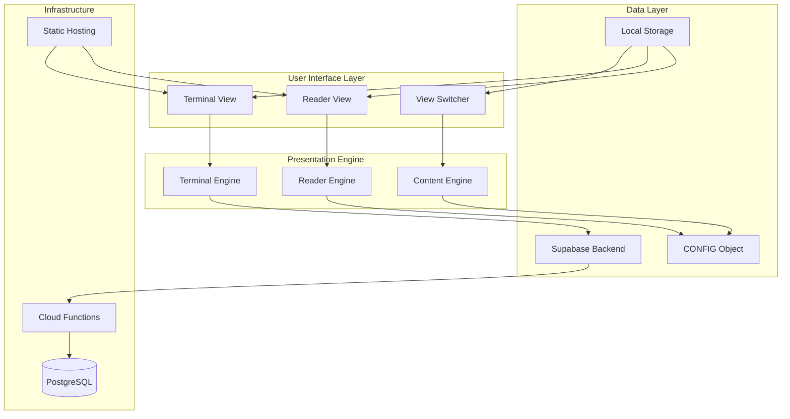
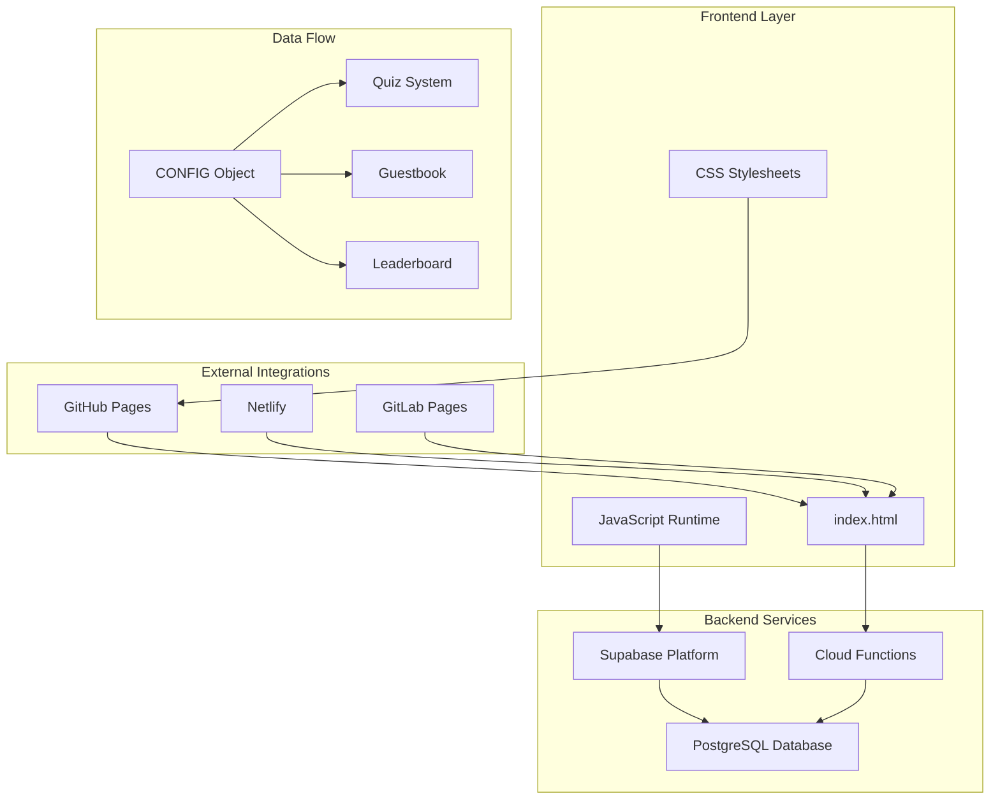

# Project Overview

<cite>
**Referenced Files in This Document**
- [README.md](file://README.md)
- [index.html](file://index.html)
- [post-guestbook/index.ts](file://supabase/functions/post-guestbook/index.ts)
- [start-quiz/index.ts](file://supabase/functions/start-quiz/index.ts)
- [submit-quiz/index.ts](file://supabase/functions/submit-quiz/index.ts)
- [init.sql](file://supabase/migrations/20240101000000_init.sql)
- [seed_questions.sql](file://supabase/migrations/20240101000001_seed_questions.sql)
</cite>

## Table of Contents
1. [Introduction](#introduction)
2. [Project Purpose](#project-purpose)
3. [Dual-Mode Architecture](#dual-mode-architecture)
4. [Key Value Propositions](#key-value-propositions)
5. [Target Audience](#target-audience)
6. [Educational Goals](#educational-goals)
7. [Technical Innovation](#technical-innovation)
8. [Infrastructure Overview](#infrastructure-overview)
9. [Design Philosophy](#design-philosophy)
10. [Conclusion](#conclusion)

## Introduction

This unique dual-mode professional portfolio represents a paradigm shift in personal branding, seamlessly blending traditional web presentation with interactive command-line functionality. Unlike conventional static websites, this portfolio offers users an immersive experience that adapts to their preferred interaction style while maintaining professional credibility and technical sophistication.

The project demonstrates how modern web technologies can be reimagined to create memorable, engaging experiences that showcase technical versatility without compromising accessibility or performance. By combining retro-inspired aesthetics with contemporary web standards, it establishes a distinctive digital presence that communicates both personality and competence.

## Project Purpose

This portfolio serves as a comprehensive professional showcase that transcends traditional limitations of static web presentations. Its primary objectives include:

**Professional Presentation**: Delivering a polished, accessible representation of technical expertise and career achievements through multiple interaction paradigms.

**Interactive Demonstration**: Proving technical capabilities through hands-on command-line experiences that engage visitors and demonstrate practical skills.

**Performance Excellence**: Establishing benchmarks for lightweight, efficient web delivery that loads instantly without external dependencies.

**Educational Showcase**: Demonstrating modern web development practices, responsive design principles, and backend integration patterns.

The portfolio positions itself as both a professional document and an interactive demonstration, appealing to diverse audiences while maintaining technical integrity and aesthetic appeal.

## Dual-Mode Architecture

The portfolio implements a sophisticated dual-view system that intelligently adapts between two distinct presentation modes:

**Terminal View**: A fully functional command-line interface featuring interactive commands, autocomplete functionality, fuzzy matching, and persistent session state. This mode transforms the portfolio into an engaging terminal experience while maintaining professional content delivery.

**Reader View**: A clean, accessible presentation mode optimized for traditional web browsing. Content is rendered in a structured, readable format suitable for recruiters, hiring managers, and casual visitors seeking straightforward information access.

**Seamless Integration**: Both views share identical content through a centralized configuration system, ensuring consistency while providing optimal user experience for each interaction style.

**Section sources**
- [index.html:427-446](file://index.html#L427-L446)
- [index.html:587-647](file://index.html#L587-L647)

## Key Value Propositions

### Zero-Dependency Design
The portfolio achieves remarkable simplicity through its dependency-free architecture, utilizing only vanilla JavaScript, CSS3, and HTML5. This approach delivers several strategic advantages:

**Lightning-Fast Loading**: Elimination of external dependencies ensures instant page loads regardless of network conditions or CDN availability.

**Reliability**: Reduced attack surface and simplified maintenance requirements minimize potential failure points and ongoing operational overhead.

**Portability**: Universal compatibility across hosting platforms without requiring specialized build processes or runtime environments.

**Cost Efficiency**: No third-party service dependencies translate to reduced operational costs and simplified deployment logistics.

### Retro-Inspired Aesthetics
The design embraces nostalgic terminal aesthetics while maintaining modern functionality:

**Authentic Terminal Experience**: CRT-style scanlines, authentic color schemes, and classic typography create immediate familiarity for tech-savvy users.

**Customizable Themes**: Dynamic dark/light mode switching with persistent user preferences stored locally.

**Responsive Design**: Adaptive layouts that optimize the terminal experience for mobile devices while preserving desktop functionality.

**Visual Consistency**: Cohesive design language that bridges the gap between retro aesthetics and contemporary web standards.

### Dual-View Capabilities
The innovative dual-view system provides unprecedented flexibility in content consumption:

**Context-Aware Interaction**: Automatic adaptation between terminal commands and traditional web navigation based on user preferences and use cases.

**Content Parity**: Identical information delivered through different interfaces, ensuring no compromise in professional communication effectiveness.

**Accessibility**: Multiple pathways for accessing the same professional information, accommodating diverse user needs and preferences.

**Engagement**: Interactive elements that encourage exploration and discovery while maintaining professional presentation standards.

**Section sources**
- [README.md:5-16](file://README.md#L5-L16)
- [index.html:11-425](file://index.html#L11-L425)

## Target Audience

The portfolio's dual-mode design strategically addresses multiple stakeholder groups:

### Recruiters and Hiring Managers
**Quick Information Access**: Traditional web navigation enables rapid scanning of qualifications, experience, and contact information essential for initial screening processes.

**Professional Credibility**: Clean presentation format establishes trust and competence without overwhelming technical details.

**Efficient Evaluation**: Structured content layout facilitates comparison across candidates during recruitment phases.

### Tech Enthusiasts and Peers
**Interactive Exploration**: Command-line interface provides engaging way to discover technical depth, project contributions, and specialized knowledge areas.

**Skill Demonstration**: Live command execution showcases practical technical abilities and problem-solving approaches.

**Modern Web Practices**: Implementation details reveal contemporary development methodologies and architectural decisions.

### General Visitors
**Flexible Engagement**: Choice between traditional browsing and interactive exploration accommodates varying comfort levels with technology.

**Professional Presentation**: Consistent quality across both modes maintains professional standards regardless of user preference.

**Accessible Information**: Clear categorization and presentation formats ensure relevant information is discoverable across different user types.

## Educational Goals

Beyond professional presentation, the portfolio serves as a comprehensive learning resource:

### Technical Versatility Showcase
Demonstrates proficiency across multiple domains including frontend development, backend integration, database design, and cloud infrastructure management.

**Frontend Mastery**: Advanced DOM manipulation, event handling, and responsive design implementation using pure JavaScript and CSS.

**Backend Integration**: Real-world examples of API consumption, serverless function interaction, and database connectivity patterns.

**Database Design**: Practical implementation of relational schemas, indexing strategies, and data modeling for interactive applications.

**Cloud Architecture**: Deployment patterns, security considerations, and scalability approaches using modern cloud services.

### Best Practices Demonstration
**Performance Optimization**: Zero-dependency architecture as a model for lightweight, efficient web delivery.

**User Experience Design**: Multi-modal interface design that accommodates diverse user needs and preferences.

**Security Implementation**: Practical examples of rate limiting, input validation, and data protection measures.

**Accessibility Standards**: Responsive design patterns that work across devices and assistive technologies.

## Technical Innovation

The portfolio represents several technical innovations in personal website design:

### Progressive Enhancement Approach
Implementation follows progressive enhancement principles, ensuring core functionality remains intact even with JavaScript disabled or in degraded environments.

### Intelligent Content Management
Centralized configuration system enables easy customization while maintaining consistent presentation across both interface modes.

### Real-Time Data Integration
Live backend integration through Supabase Cloud Functions enables dynamic content updates, interactive features, and persistent user interactions without compromising static hosting benefits.

### Performance Optimization
Advanced caching strategies, lazy loading techniques, and minimal resource requirements establish benchmarks for efficient web delivery.

**Section sources**
- [index.html:448-520](file://index.html#L448-L520)
- [README.md:18-22](file://README.md#L18-L22)

## Infrastructure Overview

The portfolio leverages a modern, serverless architecture that balances performance, scalability, and cost-effectiveness:

**Static Hosting Compatibility**: Designed for deployment on any static hosting platform without requiring server-side processing capabilities.

**Cloud Function Integration**: Serverless functions handle dynamic content, user interactions, and data persistence while maintaining static delivery benefits.

**Database Abstraction**: Supabase provides managed database services with automatic scaling and security features.

**Real-Time Capabilities**: WebSocket connections enable live updates and interactive features without traditional server overhead.

**Section sources**
- [index.html:530-544](file://index.html#L530-L544)
- [README.md:52-54](file://README.md#L52-L54)

## Design Philosophy

The portfolio embodies a philosophy that prioritizes user experience, technical excellence, and professional presentation:

### User-Centric Design
Interface modes adapt to user preferences and contexts, ensuring optimal experience regardless of technical comfort level or use case.

### Professional Integrity
Maintains serious, credible presentation standards while incorporating playful elements that reflect personality and expertise.

### Technical Transparency
Demonstrates competence through implementation choices, performance characteristics, and architectural decisions that speak to technical capability.

### Accessibility First
Multiple interaction paradigms ensure content remains accessible to diverse audiences with varying abilities and preferences.

## Conclusion

This dual-mode professional portfolio represents a sophisticated approach to personal branding that successfully bridges the gap between traditional web presentation and interactive command-line experiences. By combining zero-dependency design principles with retro-inspired aesthetics and modern backend integration, it establishes a unique digital presence that effectively serves multiple audiences while demonstrating comprehensive technical capabilities.

The project's innovative architecture, educational value, and professional presentation establish it as both a functional portfolio tool and a showcase of modern web development practices. Its success lies not merely in its technical implementation, but in its ability to communicate professional competence through multiple interaction paradigms while maintaining accessibility, performance, and aesthetic appeal.

This approach to personal branding offers valuable insights for professionals seeking to differentiate themselves through technical innovation while maintaining professional credibility and broad accessibility.