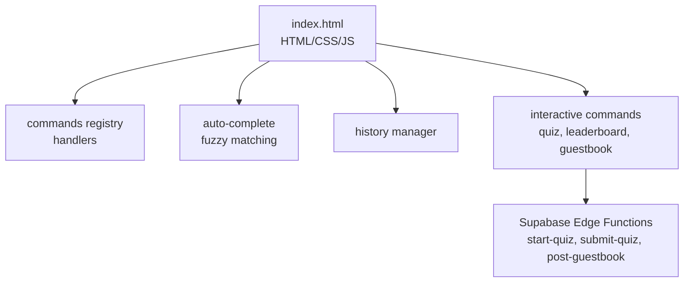
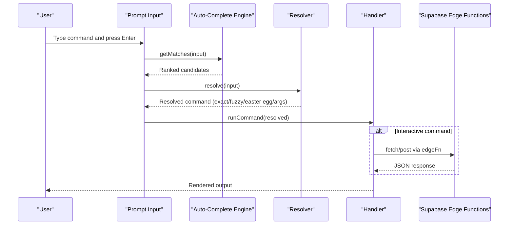
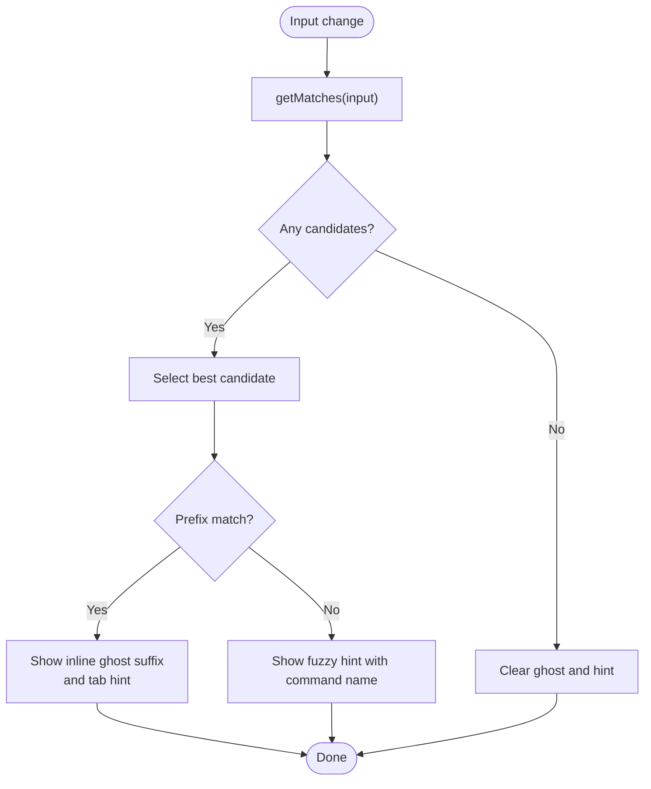
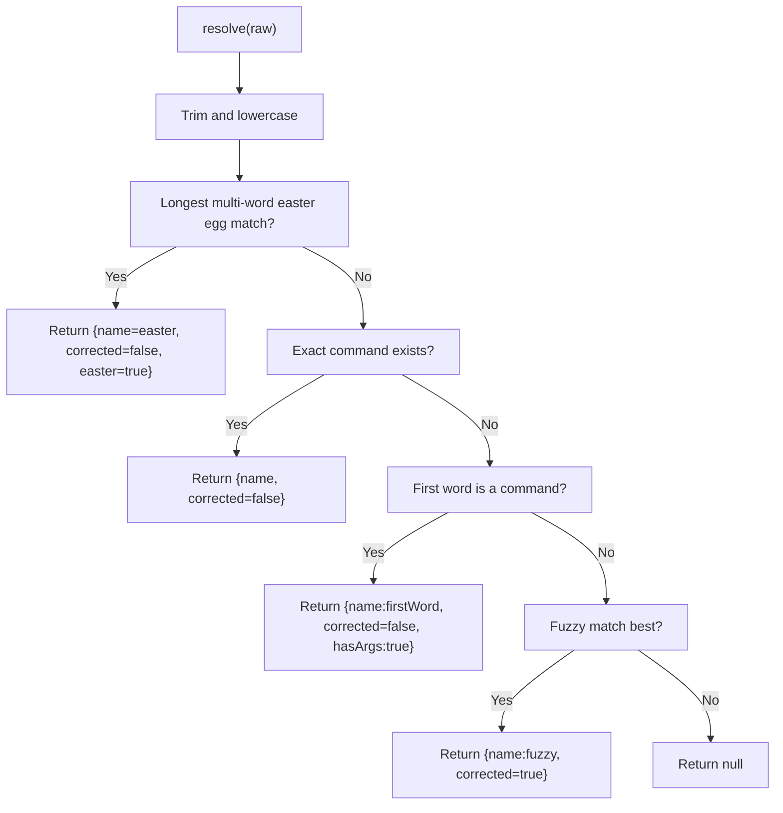
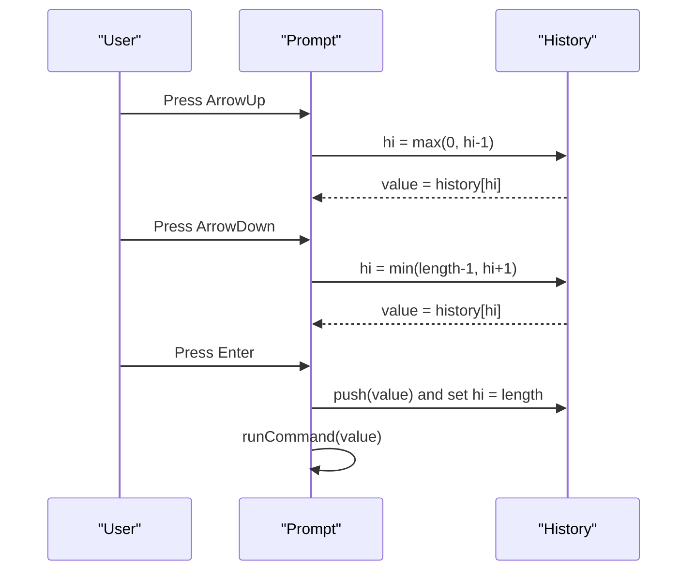
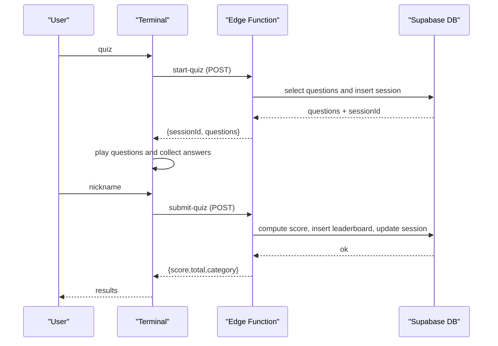
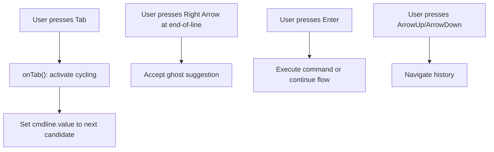
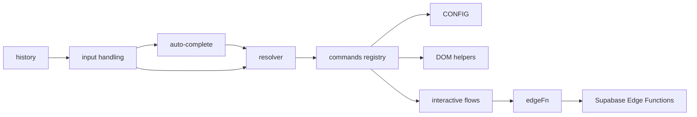

# Command System

<cite>
**Referenced Files in This Document**
- [index.html](file://index.html)
- [README.md](file://README.md)
- [start-quiz/index.ts](file://supabase/functions/start-quiz/index.ts)
- [submit-quiz/index.ts](file://supabase/functions/submit-quiz/index.ts)
- [post-guestbook/index.ts](file://supabase/functions/post-guestbook/index.ts)
</cite>

## Table of Contents
1. [Introduction](#introduction)
2. [Project Structure](#project-structure)
3. [Core Components](#core-components)
4. [Architecture Overview](#architecture-overview)
5. [Detailed Component Analysis](#detailed-component-analysis)
6. [Dependency Analysis](#dependency-analysis)
7. [Performance Considerations](#performance-considerations)
8. [Troubleshooting Guide](#troubleshooting-guide)
9. [Conclusion](#conclusion)
10. [Appendices](#appendices)

## Introduction
This document describes the command parsing and execution system of the interactive portfolio. It covers the command registry, auto-completion with fuzzy matching, command history, handler architecture, parameter parsing, error handling, and the command chip interface. It also documents the 30+ available commands, keyboard shortcuts, accessibility features, and extensibility for adding new commands.

## Project Structure
The command system is implemented entirely in a single HTML file with embedded JavaScript. The frontend defines:
- A command registry (object mapping command names to handlers)
- Auto-completion and fuzzy matching logic
- Command history management
- Keyboard shortcuts and input handling
- Interactive commands backed by Supabase Edge Functions
- Reader view rendering of the same content



**Diagram sources**
- [index.html](file://index.html)
- [start-quiz/index.ts](file://supabase/functions/start-quiz/index.ts)
- [submit-quiz/index.ts](file://supabase/functions/submit-quiz/index.ts)
- [post-guestbook/index.ts](file://supabase/functions/post-guestbook/index.ts)

**Section sources**
- [README.md](file://README.md)
- [index.html](file://index.html)

## Core Components
- Command Registry: A map of command names to handler functions. Handlers render formatted output and may trigger interactive flows.
- Auto-completion and Fuzzy Matching: Subsequence-based scoring with prefix prioritization and inline ghost suggestions.
- Command History: Stores previous commands and supports up/down navigation.
- Interactive Commands: Quiz, leaderboard, and guestbook integrate with Supabase Edge Functions.
- Command Chip Interface: Clickable chips render command chips for quick selection.
- Keyboard Shortcuts: Tab for completion, Arrow keys for history, Enter to execute, Right Arrow to accept ghost suggestions.
- Accessibility: Screen reader-friendly labels and ARIA attributes for input and buttons.

**Section sources**
- [index.html](file://index.html)

## Architecture Overview
The system is a single-page terminal emulator with dual views. The terminal view exposes a command-line interface with a prompt, auto-completion, and history. Commands are dispatched to handlers that render styled output. Some commands trigger interactive flows with server-side persistence via Supabase Edge Functions.



**Diagram sources**
- [index.html](file://index.html)
- [start-quiz/index.ts](file://supabase/functions/start-quiz/index.ts)
- [submit-quiz/index.ts](file://supabase/functions/submit-quiz/index.ts)
- [post-guestbook/index.ts](file://supabase/functions/post-guestbook/index.ts)

## Detailed Component Analysis

### Command Registry and Handler Architecture
- The registry is a plain object mapping command names to functions. Each handler:
  - Renders styled output using helper functions
  - May conditionally render chips for quick access
  - Uses CONFIG for content and links
- Example handlers include informational commands (about, skills, projects, strengths, contact, cv, credits), utility commands (theme, clear, help), and interactive commands (quiz, leaderboard, guestbook, neofetch).

```mermaid
classDiagram
class Commands {
+help()
+about()
+skills()
+projects()
+strengths()
+contact()
+cv()
+theme()
+view()
+clear()
+credits()
+whoami()
+neofetch()
+quiz()
+leaderboard()
+guestbook(args)
+resume()
+whyhireme()
+uptime()
+tail-f()
+systemctl-status-emily()
+journalctl()
+git-blame()
+pipeline()
+recruiter-mode()
+references()
+sudo()
+cat-etc-motd()
+ps-aux()
+find()
+rm-rf()
}
class CONFIG {
+user
+host
+name
+role
+tagline
+about[]
+skills[][]
+strengths{}
+projects[]
+cv
+email
+linkedin
+github
+readme
+supabase{url, anonKey}
}
Commands --> CONFIG : "renders content"
```

**Diagram sources**
- [index.html](file://index.html)

**Section sources**
- [index.html](file://index.html)

### Auto-Completion and Fuzzy Matching
- Candidate Generation:
  - Filters registered command names by a subsequence match against the typed input.
  - Prefers prefix matches; otherwise ranks by a custom fuzzy score.
- Scoring:
  - Subsequence match yields positive score; non-match yields -1.
  - Bonus for first-character matches and consecutive character runs.
  - Penalty for longer target names to favor tighter matches.
- Inline Ghost Suggestion:
  - When a prefix match exists, shows the remainder in a ghost element and a hint icon.
  - When a non-prefix fuzzy match exists, shows a right-arrow hint with the suggested command.
- Tab Cycling:
  - Pressing Tab cycles through all candidates in order (prefix-first).
- Right Arrow Acceptance:
  - At end-of-line, pressing Right Arrow accepts the ghost suggestion.



**Diagram sources**
- [index.html](file://index.html)

**Section sources**
- [index.html](file://index.html)

### Command Resolution and Parameter Parsing
- Resolution Order:
  1) Multi-word easter egg match (longest match wins)
  2) Exact command name
  3) First word as command with remaining text as arguments
  4) Fuzzy match fallback
- Argument Extraction:
  - For commands like “guestbook sign”, the handler receives the substring after the command name.
- Execution:
  - Echoes the original input, resolves the command, optionally informs about corrections, and invokes the handler.



**Diagram sources**
- [index.html](file://index.html)

**Section sources**
- [index.html](file://index.html)

### Command History Management
- Storage:
  - Maintains an array of previous commands and an index for navigation.
- Navigation:
  - Up Arrow moves backward through history.
  - Down Arrow moves forward; reaches empty at end.
- Execution:
  - On Enter, the current input is pushed to history (if non-empty) and executed.



**Diagram sources**
- [index.html](file://index.html)

**Section sources**
- [index.html](file://index.html)

### Interactive Commands and Backend Integration
- Quiz:
  - Starts a session via an Edge Function, loads questions, and manages a state machine for playing and nickname collection.
  - Submits answers and nickname to another Edge Function, which computes score server-side and writes to the leaderboard.
- Leaderboard:
  - Queries the leaderboard table and renders top scores with ranking and metadata.
- Guestbook:
  - Supports a two-step signing flow (nickname then message) validated server-side and rate-limited.
- Edge Functions:
  - start-quiz: creates a session and returns questions.
  - submit-quiz: validates answers, computes score, writes leaderboard, and logs rate limits.
  - post-guestbook: validates nickname/message, applies spam filters, and rate limits.



**Diagram sources**
- [index.html](file://index.html)
- [start-quiz/index.ts](file://supabase/functions/start-quiz/index.ts)
- [submit-quiz/index.ts](file://supabase/functions/submit-quiz/index.ts)

**Section sources**
- [index.html](file://index.html)
- [start-quiz/index.ts](file://supabase/functions/start-quiz/index.ts)
- [submit-quiz/index.ts](file://supabase/functions/submit-quiz/index.ts)
- [post-guestbook/index.ts](file://supabase/functions/post-guestbook/index.ts)

### Command Chip Interface and Keyboard Shortcuts
- Command Chips:
  - Rendered by the help command; clicking a chip executes the corresponding command.
- Keyboard Shortcuts:
  - Tab: cycle through auto-completion candidates
  - Right Arrow: accept inline ghost suggestion at end-of-line
  - Enter: execute command or continue interactive flows
  - ArrowUp/ArrowDown: navigate command history
- Accessibility:
  - Input has an aria-label for screen readers.
  - Buttons and links use accessible styles and hover states.



**Diagram sources**
- [index.html](file://index.html)

**Section sources**
- [index.html](file://index.html)

### Error Handling Mechanisms
- Frontend:
  - Graceful fallbacks for unknown commands, invalid inputs in interactive flows, and suppressed animations when needed.
  - Validation messages for interactive commands (e.g., nickname length, message length).
- Backend:
  - start-quiz: returns structured errors for missing questions or session creation failures.
  - submit-quiz: strict validation for nickname, duration, answer count, rate limiting, and session state; returns errors for malformed requests or rate limit exceeded.
  - post-guestbook: enforces nickname/message constraints, link/spam filtering, and hourly rate limits; returns errors for spam or rate limit violations.

**Section sources**
- [index.html](file://index.html)
- [start-quiz/index.ts](file://supabase/functions/start-quiz/index.ts)
- [submit-quiz/index.ts](file://supabase/functions/submit-quiz/index.ts)
- [post-guestbook/index.ts](file://supabase/functions/post-guestbook/index.ts)

### Available Commands
The system includes 30+ commands across informational, utility, interactive, and easter egg categories. The primary commands are:
- Informational: about, skills, projects, strengths, contact, cv, credits, whoami
- Utility: theme, clear, help, view
- Interactive: quiz, leaderboard, guestbook
- Easter eggs: tail -f, systemctl status emily, journalctl, git blame, pipeline, sudo, cat /etc/motd, ps aux, find, rm -rf, and others

Examples of usage and behavior:
- help: displays command chips and a brief description.
- about: prints name, role, tagline, and bio paragraphs.
- skills: lists categorized skill sets.
- projects: lists projects with titles, stacks, descriptions, and links.
- strengths: lists CliftonStrengths themes.
- contact: lists contact links.
- cv: opens the CV in a new tab.
- theme: toggles between dark and light modes.
- clear: clears the terminal screen.
- view: switches to reader view.
- credits: prints acknowledgments.
- quiz: starts a trivia quiz with questions fetched from the database.
- leaderboard: shows top scores sorted by score and time.
- guestbook: lists entries or initiates signing flow.

**Section sources**
- [index.html](file://index.html)

### Extensibility: Adding New Commands
To add a new command:
1. Define a handler in the commands registry with a unique name.
2. Implement the handler to render output and handle optional arguments.
3. Optionally integrate with Supabase Edge Functions for server-side logic.
4. If the command should appear in help chips, add its name to the help handler’s list.
5. Test auto-completion and fuzzy matching by typing partial names.
6. Validate keyboard shortcuts and history behavior.

Guidelines:
- Keep handlers self-contained and idempotent where possible.
- Use CONFIG for content and links.
- Escape HTML for user-provided content to prevent XSS.
- For interactive commands, implement both frontend state and backend validation.

**Section sources**
- [index.html](file://index.html)

## Dependency Analysis
- Internal Dependencies:
  - commands registry depends on CONFIG for content.
  - Interactive commands depend on edgeFn for HTTP calls to Supabase Edge Functions.
  - Resolver and auto-completion depend on the COMMANDS list derived from the registry.
- External Dependencies:
  - Supabase client initialization and Edge Function calls.
  - DOM APIs for input handling, scrolling, and rendering.



**Diagram sources**
- [index.html](file://index.html)
- [start-quiz/index.ts](file://supabase/functions/start-quiz/index.ts)
- [submit-quiz/index.ts](file://supabase/functions/submit-quiz/index.ts)
- [post-guestbook/index.ts](file://supabase/functions/post-guestbook/index.ts)

**Section sources**
- [index.html](file://index.html)

## Performance Considerations
- Auto-completion:
  - O(N) filtering and sorting over the command list; acceptable for small registries.
  - Fuzzy scoring is linear in target length; keep command names concise for best UX.
- Rendering:
  - Output is appended incrementally; ensure minimal DOM manipulation for long outputs.
- Interactive flows:
  - Debounce or throttle frequent updates (e.g., periodic logs) to reduce reflows.
- Mobile:
  - Visual viewport adjustments keep the input in view; avoid unnecessary reflows on resize.

## Troubleshooting Guide
Common issues and resolutions:
- Unknown command:
  - The resolver returns null; the system prints a “not found” message and suggests help.
- Supabase not configured:
  - Interactive commands check for the client and print a configuration message.
- Quiz/Guestbook errors:
  - Validate inputs (nickname length, message length) and retry after cooldown.
- Auto-completion not working:
  - Ensure the input is focused and not empty; verify COMMANDS list is populated.
- History navigation:
  - Use ArrowUp/ArrowDown; ensure commands are non-empty before pushing to history.

**Section sources**
- [index.html](file://index.html)

## Conclusion
The command system provides a robust, extensible terminal-like experience with intelligent auto-completion, history, and interactive capabilities powered by Supabase Edge Functions. Its modular design allows straightforward addition of new commands while maintaining a consistent UX.

## Appendices

### Command Syntax and Parameter Validation Examples
- quiz: No parameters; triggers interactive quiz flow.
- leaderboard: No parameters; prints top scores.
- guestbook: Optional “sign”; initiates signing flow with nickname and message validation.
- guestbook sign: Requires “sign” argument; extracts and passes to signing flow.
- theme: No parameters; toggles theme.
- clear: No parameters; clears screen.
- help: No parameters; lists available commands.
- view: No parameters; switches to reader view.
- credits: No parameters; prints acknowledgments.
- whoami: No parameters; prints user identity.
- neofetch: No parameters; prints ASCII art and info.
- about/skills/projects/strengths/contact/cv: No parameters; prints content from CONFIG.

Validation examples:
- Nickname must be 3–20 characters, alphanumeric, underscore, hyphen, or space.
- Message must be 2–300 characters for guestbook.
- Quiz answer must be a, b, c, or d; “quit” abandons the quiz.

Response formatting:
- Styled output with color classes and line breaks.
- Interactive prompts guide users through multi-step flows.

**Section sources**
- [index.html](file://index.html)
- [submit-quiz/index.ts](file://supabase/functions/submit-quiz/index.ts)
- [post-guestbook/index.ts](file://supabase/functions/post-guestbook/index.ts)