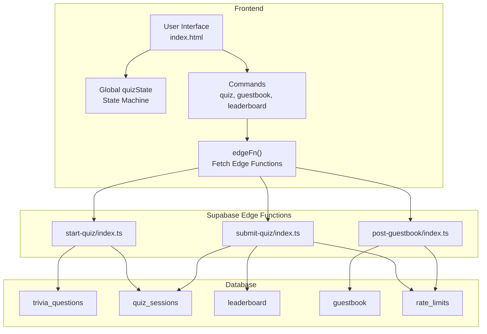
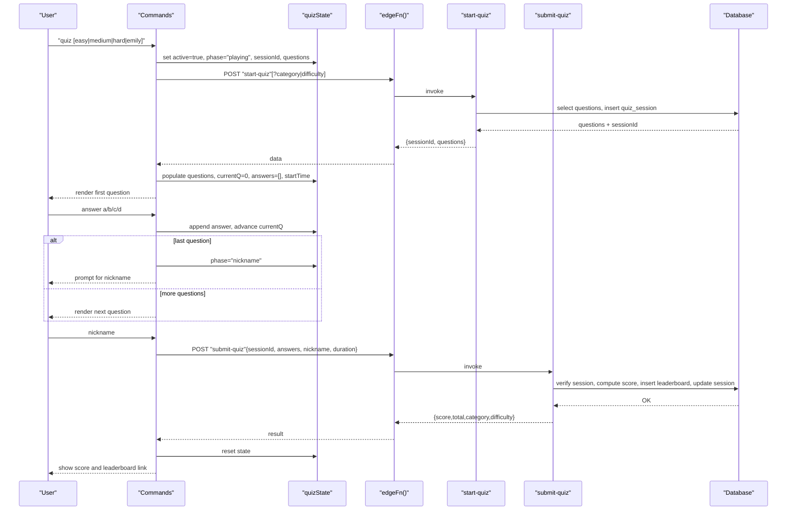
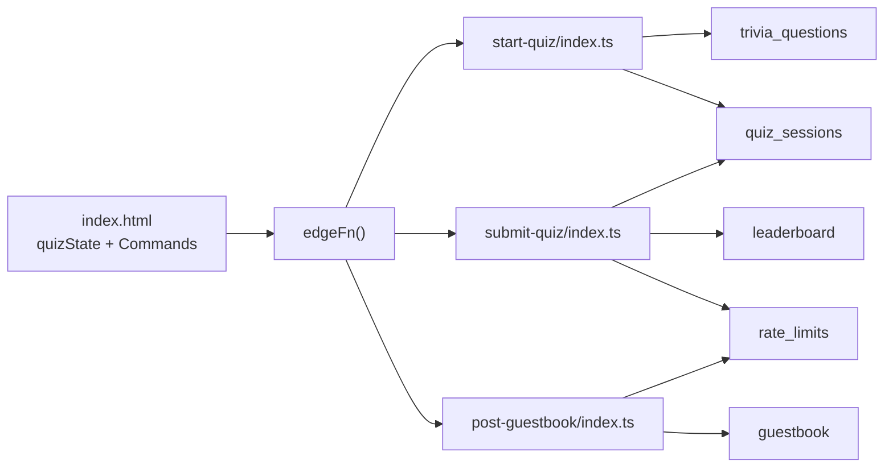

# State Management

<cite>
**Referenced Files in This Document**
- [index.html](file://index.html)
- [start-quiz/index.ts](file://supabase/functions/start-quiz/index.ts)
- [submit-quiz/index.ts](file://supabase/functions/submit-quiz/index.ts)
- [post-guestbook/index.ts](file://supabase/functions/post-guestbook/index.ts)
- [20240101000000_init.sql](file://supabase/migrations/20240101000000_init.sql)
- [20240101000001_seed_questions.sql](file://supabase/migrations/20240101000001_seed_questions.sql)
</cite>

## Table of Contents
1. [Introduction](#introduction)
2. [Project Structure](#project-structure)
3. [Core Components](#core-components)
4. [Architecture Overview](#architecture-overview)
5. [Detailed Component Analysis](#detailed-component-analysis)
6. [Dependency Analysis](#dependency-analysis)
7. [Performance Considerations](#performance-considerations)
8. [Troubleshooting Guide](#troubleshooting-guide)
9. [Conclusion](#conclusion)

## Introduction
This document explains the state management system that powers interactive features in the portfolio, focusing on:
- The quiz state machine with phases (idle, playing, nickname, message, done)
- Session tracking and data persistence
- Guestbook signing state flow, input validation, and step-by-step progression
- The global quizState object structure, state transitions, and cleanup mechanisms
- Tail monitoring system for real-time updates, interval management, and memory optimization
- Examples of state initialization, mutation patterns, and error recovery
- The relationship between state management and user interface updates, including reactive rendering and user feedback mechanisms

## Project Structure
The state management spans the frontend (HTML/JS) and Supabase Edge Functions:
- Frontend state is centralized in a global quizState object and orchestrates command-driven flows.
- Edge functions handle quiz session creation, quiz submission, and guestbook posting with robust validation and rate limiting.
- Database schema defines tables for trivia questions, quiz sessions, leaderboard, guestbook, and rate limits.

**Diagram sources**
- [index.html](file://index.html)
- [start-quiz/index.ts](file://supabase/functions/start-quiz/index.ts)
- [submit-quiz/index.ts](file://supabase/functions/submit-quiz/index.ts)
- [post-guestbook/index.ts](file://supabase/functions/post-guestbook/index.ts)
- [20240101000000_init.sql](file://supabase/migrations/20240101000000_init.sql)

**Section sources**
- [index.html](file://index.html)
- [20240101000000_init.sql](file://supabase/migrations/20240101000000_init.sql)

## Core Components
- Global quizState: Central state object controlling quiz and guestbook flows, including active flag, phase, session identifiers, questions, answers, timing, and guestbook step.
- Command handlers: quiz, guestbook, leaderboard, and others that mutate quizState and render UI updates.
- Edge function orchestration: edgeFn() wraps Supabase Edge Function calls for quiz start, quiz submit, and guestbook post.
- Tail monitoring: periodic logging simulation with interval management and cleanup.

Key responsibilities:
- Initialize quizState on start and reset on completion or error.
- Enforce input validation and enforce constraints for quiz answers and guestbook entries.
- Persist quiz sessions and leaderboard entries server-side while keeping correct answers private until scoring.
- Provide real-time-like feedback via periodic logs and responsive UI updates.

**Section sources**
- [index.html](file://index.html)

## Architecture Overview
The state machine is driven by user commands and asynchronous edge function responses. The UI reacts to state changes and renders prompts, questions, and results.

**Diagram sources**
- [index.html](file://index.html)
- [start-quiz/index.ts](file://supabase/functions/start-quiz/index.ts)
- [submit-quiz/index.ts](file://supabase/functions/submit-quiz/index.ts)
- [20240101000000_init.sql](file://supabase/migrations/20240101000000_init.sql)

## Detailed Component Analysis

### Global quizState Object
Structure and semantics:
- active: boolean indicating if a quiz is currently in progress.
- phase: string among idle, playing, nickname, message, done.
- sessionId: UUID string for the active quiz session.
- questions: array of question objects fetched from the database.
- currentQ: integer index of the current question.
- answers: array of selected answers for the current session.
- startTime: timestamp when the quiz started.
- quizCategory, quizDifficulty: labels derived from filters or defaults.
- gbNickname, gbMessage: temporary inputs for guestbook signing.
- gbStep: string among idle, nickname, message.
- tailInterval: timer handle for periodic log simulation.

Initialization and reset:
- resetQuizState() sets active=false, phase="idle", clears session identifiers, questions, answers, resets timing, and clears guestbook fields.

Cleanup mechanisms:
- On quiz completion or error, state is reset to idle.
- On guestbook submission, gbStep is reset to idle and inputs cleared.
- Tail monitoring intervals are cleared when stopping or switching commands.

**Section sources**
- [index.html](file://index.html)
- [index.html](file://index.html)

### Quiz State Machine
Phases and transitions:
- idle → playing: triggered by quiz command with optional filters; fetches questions and initializes state.
- playing → nickname: occurs after the last question is answered.
- nickname → done: after submitting the nickname and invoking submit-quiz.
- done → idle: reset via resetQuizState().

Processing logic:
- showQuizQuestion(): renders current question and choices.
- submitQuizAnswer(answer): appends answer, advances currentQ; if last question, transitions to nickname phase.
- finishQuiz(nickname): computes duration, invokes submit-quiz, displays score, then resets state.

Validation and error handling:
- Input validation for quiz answers enforces a/b/c/d.
- Input validation for nickname enforces length and character set.
- Error messages are printed and state is reset on failure.

Reactive rendering:
- UI updates occur immediately after state mutations (rendering questions, prompts, and results).

**Section sources**
- [index.html](file://index.html)

### Guestbook Signing State Flow
Steps and validation:
- gbStep idle → nickname: user runs guestbook sign; prompts for nickname with 3–20 characters, alphanumeric, underscore, hyphen, space.
- gbStep nickname → message: on valid nickname, prompts for message with 2–300 characters.
- gbStep message → idle: on valid message, submits via post-guestbook and resets state.

Edge function validation:
- post-guestbook validates nickname, message length, URL spam threshold, keyword spam filter, and rate limit per IP per hour.

Real-time-like feedback:
- tail -f simulates live logs with periodic updates and stops on user input or command switch.

**Section sources**
- [index.html](file://index.html)
- [post-guestbook/index.ts](file://supabase/functions/post-guestbook/index.ts)

### Tail Monitoring System
Behavior:
- Starts a periodic interval printing log entries at fixed cadence.
- Stops automatically when user interacts with the terminal or switches commands.
- Clears interval on subsequent runs to prevent multiple concurrent timers.

Memory optimization:
- Ensures a single interval is active at a time.
- Clears interval on command change to prevent accumulation of timers.

**Section sources**
- [index.html](file://index.html)

### Edge Function Integrations
Quiz lifecycle:
- start-quiz: fetches shuffled questions, creates a quiz session with hashed IP, returns sessionId and questions.
- submit-quiz: validates nickname, duration, session existence and completion status, computes score, inserts leaderboard entry, logs rate limit, marks session complete.

Guestbook lifecycle:
- post-guestbook: validates nickname and message, applies spam filters and rate limit, inserts record and logs rate limit.

Database schema:
- trivia_questions, quiz_sessions, leaderboard, guestbook, rate_limits with indexes and RLS policies.

**Section sources**
- [start-quiz/index.ts](file://supabase/functions/start-quiz/index.ts)
- [submit-quiz/index.ts](file://supabase/functions/submit-quiz/index.ts)
- [post-guestbook/index.ts](file://supabase/functions/post-guestbook/index.ts)
- [20240101000000_init.sql](file://supabase/migrations/20240101000000_init.sql)
- [20240101000001_seed_questions.sql](file://supabase/migrations/20240101000001_seed_questions.sql)

### UI Updates and Reactive Rendering
Patterns:
- After each command execution, the UI appends rendered lines and scrolls to the bottom.
- Inline ghost suggestions and hints improve typing experience.
- Command resolution handles exact matches, easter eggs, and fuzzy matching.

User feedback:
- Color-coded messages for INFO/WARN/ERROR levels in tail -f.
- Emoji reactions based on quiz score percentage.
- Clear error messages and retry prompts.

**Section sources**
- [index.html](file://index.html)

## Dependency Analysis
The frontend depends on:
- Supabase client initialization and edgeFn() for remote calls.
- quizState for all interactive flows.
- Database schema for persisted data.

Edge functions depend on:
- Supabase client with service role key for secure writes.
- Rate limiting and correctness checks before writing to leaderboard/guestbook.

**Diagram sources**
- [index.html](file://index.html)
- [start-quiz/index.ts](file://supabase/functions/start-quiz/index.ts)
- [submit-quiz/index.ts](file://supabase/functions/submit-quiz/index.ts)
- [post-guestbook/index.ts](file://supabase/functions/post-guestbook/index.ts)
- [20240101000000_init.sql](file://supabase/migrations/20240101000000_init.sql)

**Section sources**
- [index.html](file://index.html)
- [20240101000000_init.sql](file://supabase/migrations/20240101000000_init.sql)

## Performance Considerations
- State cleanup: Always reset quizState after completion or error to avoid stale state.
- Interval management: Clear intervals before starting new ones to prevent memory leaks.
- Validation early exit: Reject invalid inputs promptly to reduce unnecessary network calls.
- Batched reads/writes: Use Supabase queries efficiently and avoid redundant reads.
- UI responsiveness: Keep DOM updates minimal and defer heavy computations off the main thread.

## Troubleshooting Guide
Common issues and resolutions:
- Quiz not starting: Verify Supabase configuration and network connectivity; check error messages printed to the terminal.
- Invalid nickname: Ensure length and allowed characters; see validation messages.
- Rate limit exceeded: Wait for cooldown period before submitting quiz or posting guestbook.
- Session errors: Confirm session exists and is not already completed before submission.
- Tail -f not stopping: Ensure user interaction or command switch triggers interval clearing.

Debugging tips:
- Inspect quizState in the browser console to verify current phase and values.
- Monitor network requests to edge functions for request/response payloads.
- Review database entries for quiz_sessions, leaderboard, guestbook, and rate_limits.

**Section sources**
- [index.html](file://index.html)
- [submit-quiz/index.ts](file://supabase/functions/submit-quiz/index.ts)
- [post-guestbook/index.ts](file://supabase/functions/post-guestbook/index.ts)

## Conclusion
The state management system combines a simple, centralized quizState object with robust command handlers and server-backed edge functions. It ensures predictable state transitions, strong input validation, and responsive UI updates. The design balances simplicity with reliability, enabling interactive features like quizzes and guestbook signing while maintaining performance and user experience.