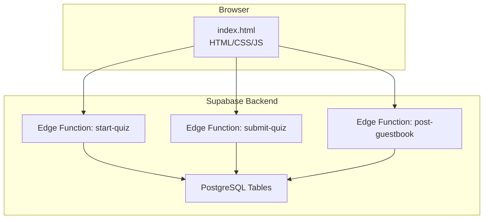
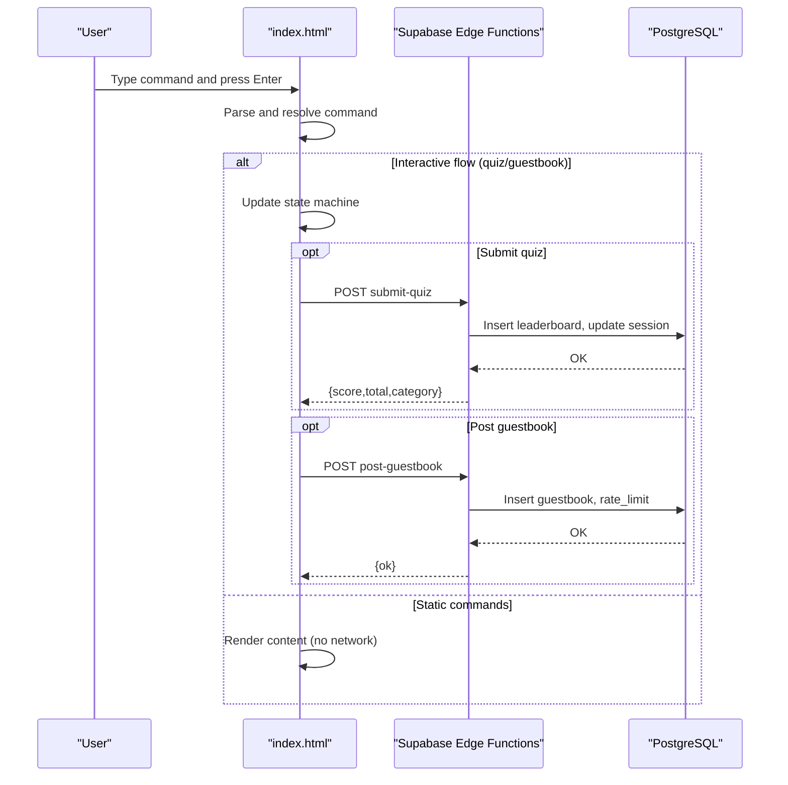
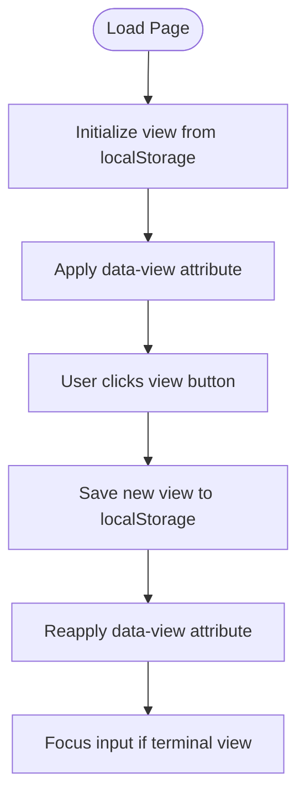
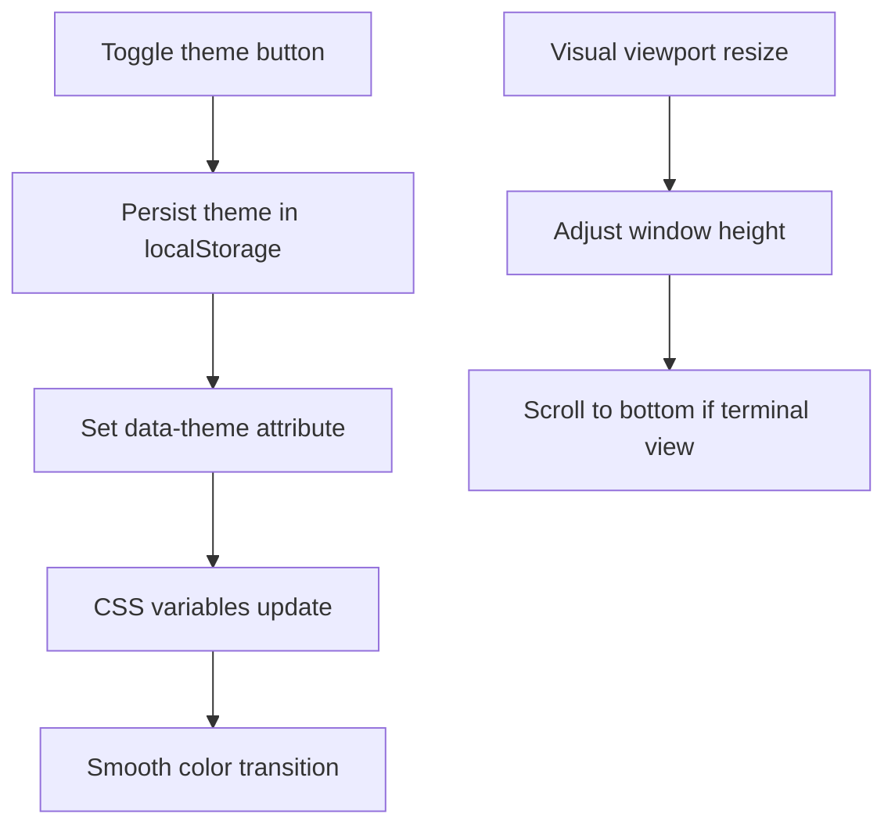
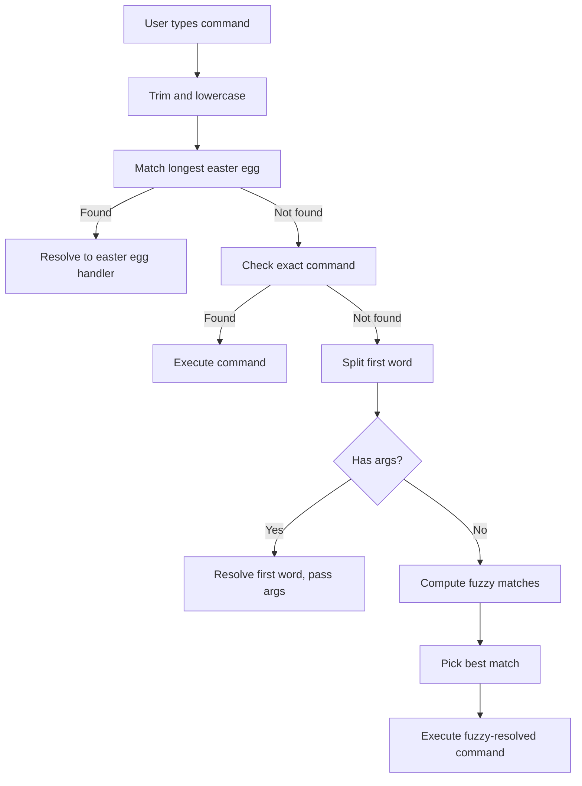
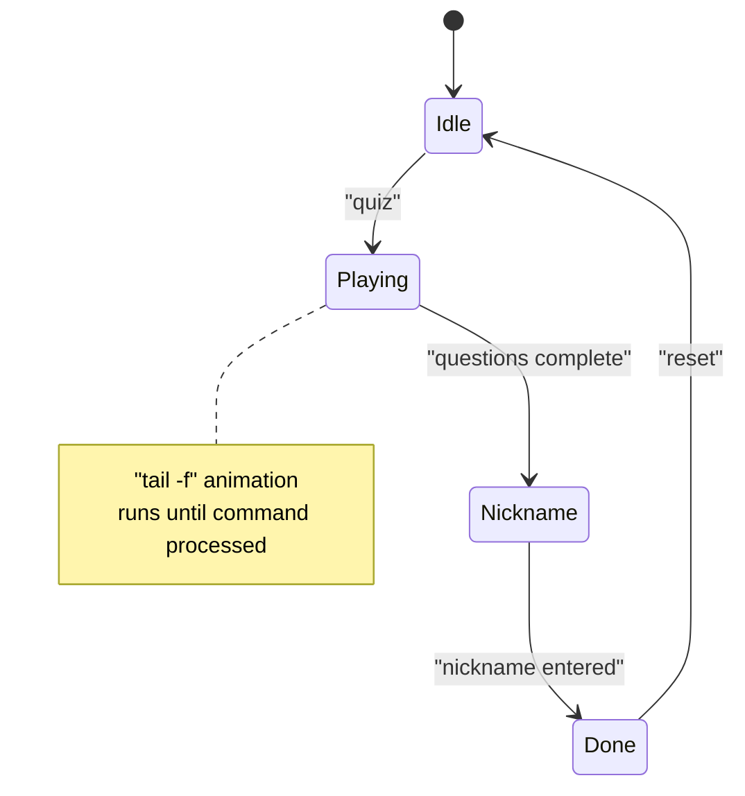
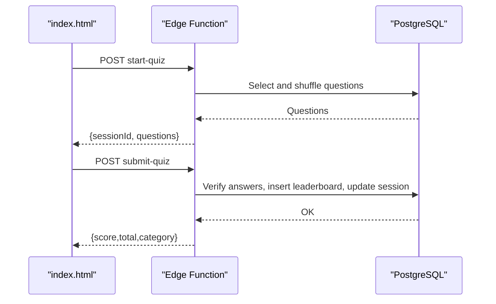
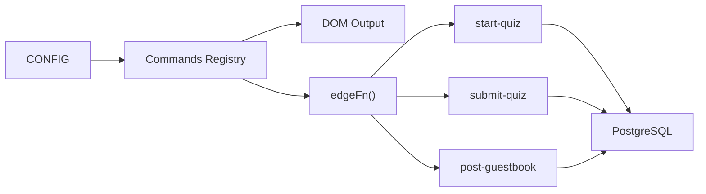

# Terminal Interface

<cite>
**Referenced Files in This Document**
- [index.html](file://index.html)
- [README.md](file://README.md)
- [supabase/functions/start-quiz/index.ts](file://supabase/functions/start-quiz/index.ts)
- [supabase/functions/submit-quiz/index.ts](file://supabase/functions/submit-quiz/index.ts)
- [supabase/functions/post-guestbook/index.ts](file://supabase/functions/post-guestbook/index.ts)
- [supabase/migrations/20240101000000_init.sql](file://supabase/migrations/20240101000000_init.sql)
- [supabase/migrations/20240101000001_seed_questions.sql](file://supabase/migrations/20240101000001_seed_questions.sql)
</cite>

## Table of Contents
1. [Introduction](#introduction)
2. [Project Structure](#project-structure)
3. [Core Components](#core-components)
4. [Architecture Overview](#architecture-overview)
5. [Detailed Component Analysis](#detailed-component-analysis)
6. [Dependency Analysis](#dependency-analysis)
7. [Performance Considerations](#performance-considerations)
8. [Troubleshooting Guide](#troubleshooting-guide)
9. [Conclusion](#conclusion)
10. [Appendices](#appendices)

## Introduction
This document explains the terminal interface system that provides an interactive command-line experience embedded in a single-page application. The system features:
- Dual-view architecture: terminal mode for CLI-like interaction and reader mode for a plain, accessible layout.
- Command parsing with auto-completion, fuzzy matching, and command history.
- Terminal styling, animations, and responsive design tailored for desktop and mobile.
- State management for interactive flows such as quizzes and guestbook.
- Keyboard navigation, accessibility features, and cross-browser compatibility.
- Performance optimizations and memory management for long sessions.
- Integration between terminal commands and Supabase backend services via edge functions and database tables.

## Project Structure
The project centers around a single HTML file that defines the UI, styling, and JavaScript runtime. Supabase-related logic is split into:
- Edge functions for quiz lifecycle and guestbook posting.
- Database schema and seed data for trivia, sessions, leaderboards, guestbook, and rate limits.

**Diagram sources**
- [index.html](file://index.html)
- [supabase/functions/start-quiz/index.ts](file://supabase/functions/start-quiz/index.ts)
- [supabase/functions/submit-quiz/index.ts](file://supabase/functions/submit-quiz/index.ts)
- [supabase/functions/post-guestbook/index.ts](file://supabase/functions/post-guestbook/index.ts)
- [supabase/migrations/20240101000000_init.sql](file://supabase/migrations/20240101000000_init.sql)

**Section sources**
- [README.md](file://README.md)
- [index.html](file://index.html)

## Core Components
- Dual-view system: toggles between terminal and reader views with persistent preferences stored in local storage.
- Command engine: parses user input, resolves commands (including fuzzy matches and multi-word easter eggs), and executes handlers.
- Interactive flows: quiz session management and guestbook signing flow with state machines.
- Auto-completion and fuzzy matching: inline ghost suggestions and tab cycling.
- History navigation: arrow keys to browse previous commands.
- Styling and animations: theme switching, scanlines, glow effects, and a typewriter boot sequence.
- Responsive design: viewport-aware sizing, safe area insets, and touch-friendly controls.
- Supabase integration: edge functions for quiz start/submit and guestbook posting, plus database-backed leaderboards and rate limiting.

**Section sources**
- [index.html](file://index.html)

## Architecture Overview
The terminal UI is a self-contained SPA. It initializes configuration, builds the reader view, runs a boot sequence, and exposes a command prompt. Commands trigger either DOM updates or network calls to Supabase edge functions. Edge functions interact with the database to manage quiz sessions, leaderboard entries, and guestbook posts.

**Diagram sources**
- [index.html](file://index.html)
- [supabase/functions/start-quiz/index.ts](file://supabase/functions/start-quiz/index.ts)
- [supabase/functions/submit-quiz/index.ts](file://supabase/functions/submit-quiz/index.ts)
- [supabase/functions/post-guestbook/index.ts](file://supabase/functions/post-guestbook/index.ts)

## Detailed Component Analysis

### Dual-View Architecture
- View modes: terminal and reader.
- Persistence: preferences saved to local storage and restored on load.
- Switching: title-bar buttons toggle the data attributes on the root element, hiding/showing the appropriate sections.

**Diagram sources**
- [index.html](file://index.html)

**Section sources**
- [index.html](file://index.html)

### Terminal Styling, Animations, and Responsive Design
- Themes: CSS variables define color palettes for dark/light modes with smooth transitions.
- Animations: boot-in effect for the window, blinking cursor during typing, and fade-in for new lines.
- Scanlines and glow overlays for CRT aesthetics.
- Responsive adjustments: fluid layouts, safe area handling on mobile, larger tap targets, and reduced hint text on small screens.

**Diagram sources**
- [index.html](file://index.html)

**Section sources**
- [index.html](file://index.html)

### Command Parsing, Auto-Completion, and History
- Command resolution:
  - Multi-word easter eggs (longest-match precedence).
  - Exact match in commands registry.
  - First-word fallback for commands with arguments.
  - Fuzzy matching with subsequence scoring.
- Auto-completion:
  - Inline ghost suffix for prefix matches.
  - Right-arrow accepts ghost suggestion.
  - Tab cycles through candidates (prefix-first).
- History:
  - Arrow-up/down navigates previous commands.
  - New commands appended to history.

**Diagram sources**
- [index.html](file://index.html)

**Section sources**
- [index.html](file://index.html)

### Interactive State Management: Quiz and Guestbook
- Quiz state machine:
  - Tracks active status, phase, session ID, questions, current index, answers, and timestamps.
  - Phases: idle, playing, nickname, message, done.
  - Tail-follow animation uses intervals; stopped when a command is processed.
- Guestbook signing flow:
  - Stepwise progression: idle → nickname → message → submit.
  - Validates nickname and message lengths and formats.
- Submission:
  - Quiz: calls edge function to compute score and write leaderboard.
  - Guestbook: calls edge function to insert message and enforce rate limits.

**Diagram sources**
- [index.html](file://index.html)

**Section sources**
- [index.html](file://index.html)

### Keyboard Navigation and Accessibility
- Focus management: clicking anywhere focuses the input except when targeting interactive elements.
- Screen reader-friendly labels: aria-labels on input and buttons.
- Accessible hints: inline hints for tab completion and acceptance.
- Reduced motion considerations: transitions and animations can be skipped via user interaction.

**Section sources**
- [index.html](file://index.html)

### Cross-Browser Compatibility
- Uses modern APIs with graceful degradation:
  - localStorage for persistence.
  - CSS variables for theming.
  - Visual viewport API for mobile keyboard handling.
  - Standard fetch for edge function calls.
- Mobile-first responsive design ensures touch-friendly controls and safe areas.

**Section sources**
- [index.html](file://index.html)

### Supabase Integration
- Edge functions:
  - start-quiz: creates a quiz session, shuffles questions, and returns session ID and questions.
  - submit-quiz: validates answers, computes score, writes leaderboard, logs rate limits, and marks session complete.
  - post-guestbook: validates nickname/message, enforces rate limits and spam filters, inserts guestbook entry.
- Database schema:
  - trivia_questions, quiz_sessions, leaderboard, guestbook, rate_limits.
  - Row-level security policies allow public reads for trivia/leaderboard/guestbook; service-role only for sessions/rate limits.
- Frontend integration:
  - Supabase client initialization and edge function helper.
  - Commands call edge functions via fetch with bearer token.

**Diagram sources**
- [index.html](file://index.html)
- [supabase/functions/start-quiz/index.ts](file://supabase/functions/start-quiz/index.ts)
- [supabase/functions/submit-quiz/index.ts](file://supabase/functions/submit-quiz/index.ts)
- [supabase/migrations/20240101000000_init.sql](file://supabase/migrations/20240101000000_init.sql)

**Section sources**
- [index.html](file://index.html)
- [supabase/functions/start-quiz/index.ts](file://supabase/functions/start-quiz/index.ts)
- [supabase/functions/submit-quiz/index.ts](file://supabase/functions/submit-quiz/index.ts)
- [supabase/functions/post-guestbook/index.ts](file://supabase/functions/post-guestbook/index.ts)
- [supabase/migrations/20240101000000_init.sql](file://supabase/migrations/20240101000000_init.sql)
- [supabase/migrations/20240101000001_seed_questions.sql](file://supabase/migrations/20240101000001_seed_questions.sql)

## Dependency Analysis
- Internal dependencies:
  - Commands rely on CONFIG for branding and Supabase client for database operations.
  - Interactive flows depend on quiz state machine and DOM manipulation helpers.
- External dependencies:
  - Supabase client library loaded via CDN.
  - Edge functions accessed via fetch with bearer token.
- Data dependencies:
  - Database tables define the schema for trivia, sessions, leaderboards, guestbook, and rate limits.

**Diagram sources**
- [index.html](file://index.html)
- [supabase/migrations/20240101000000_init.sql](file://supabase/migrations/20240101000000_init.sql)

**Section sources**
- [index.html](file://index.html)
- [supabase/migrations/20240101000000_init.sql](file://supabase/migrations/20240101000000_init.sql)

## Performance Considerations
- Zero dependencies and minimal runtime footprint for fast loading.
- Efficient DOM updates: appending lines with fade-in and scrolling to bottom only when necessary.
- Mobile viewport handling avoids unnecessary reflows by adjusting window height directly.
- Typewriter boot sequence can be skipped by user interaction to reduce perceived latency.
- Long lists (leaderboard, guestbook) are paginated via limits to reduce payload size.
- Fuzzy matching uses lightweight scoring and sorting to keep input responsive.

[No sources needed since this section provides general guidance]

## Troubleshooting Guide
- Supabase not configured:
  - Symptom: Commands report Supabase not configured.
  - Resolution: Set the Supabase URL and anon key in CONFIG.
- Quiz submission errors:
  - Symptom: Error messages when submitting quiz.
  - Resolution: Check edge function logs; ensure session exists and answers match expected count.
- Guestbook validation errors:
  - Symptom: Errors about nickname/message length/format or rate limit.
  - Resolution: Ensure nickname length 3–20, allowed characters; message length 2–300; wait for rate limit window.
- Mobile keyboard overlap:
  - Symptom: Input obscured by keyboard.
  - Resolution: Visual viewport listener adjusts window height; ensure device supports visual viewport API.

**Section sources**
- [index.html](file://index.html)
- [supabase/functions/submit-quiz/index.ts](file://supabase/functions/submit-quiz/index.ts)
- [supabase/functions/post-guestbook/index.ts](file://supabase/functions/post-guestbook/index.ts)

## Conclusion
The terminal interface delivers a polished, accessible, and performant command-line experience embedded in a static site. Its dual-view design accommodates both CLI enthusiasts and readers, while robust auto-completion, fuzzy matching, and history enhance usability. Interactive flows like quizzes and guestbook integrate seamlessly with Supabase edge functions and database tables, enabling dynamic content without server-side rendering. The responsive design and accessibility features ensure a consistent experience across devices and assistive technologies.

[No sources needed since this section summarizes without analyzing specific files]

## Appendices

### Command Reference
- help: List available commands.
- about, skills, projects, strengths, contact, cv: Display content.
- quiz: Start a trivia quiz session.
- leaderboard: Show top scores.
- guestbook: Show guestbook entries; guestbook sign: start signing flow.
- theme: Toggle dark/light mode.
- view: Switch to reader view.
- clear: Clear the terminal.
- credits: Show credits.
- whoami: Print user identity.
- neofetch: ASCII art with profile info.
- Additional easter eggs: multi-word commands and hidden aliases.

**Section sources**
- [index.html](file://index.html)

### Supabase Schema Overview
- trivia_questions: Stores questions, options, correct answers, category, and difficulty.
- quiz_sessions: Stores session metadata, question IDs, completion status, and answers.
- leaderboard: Stores scores, durations, categories, and timestamps.
- guestbook: Stores signed messages and timestamps.
- rate_limits: Tracks rate-limit entries per IP/action.

**Section sources**
- [supabase/migrations/20240101000000_init.sql](file://supabase/migrations/20240101000000_init.sql)
- [supabase/migrations/20240101000001_seed_questions.sql](file://supabase/migrations/20240101000001_seed_questions.sql)