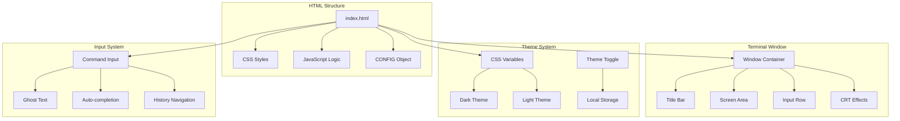
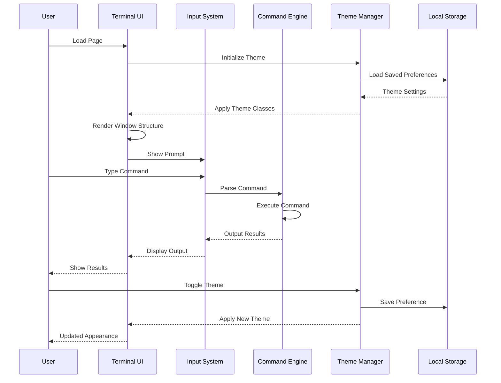
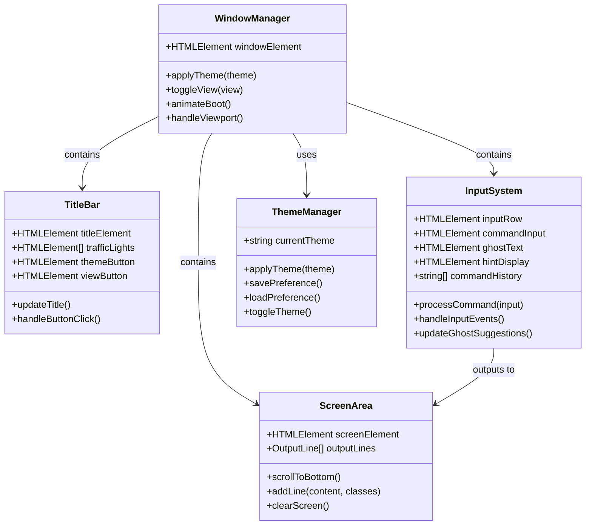
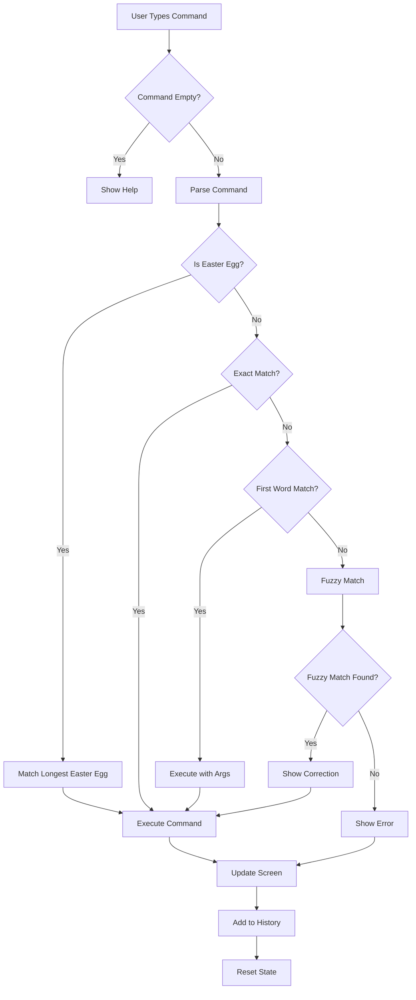
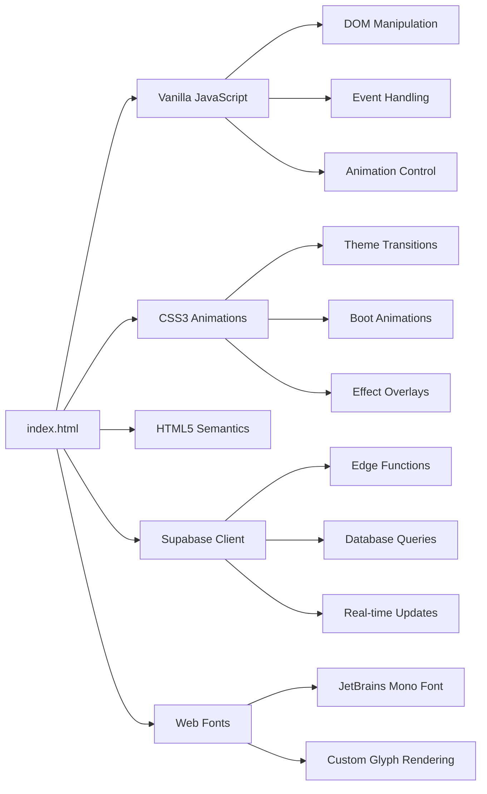

# Terminal UI Components

<cite>
**Referenced Files in This Document**
- [index.html](file://index.html)
- [README.md](file://README.md)
</cite>

## Table of Contents
1. [Introduction](#introduction)
2. [Project Structure](#project-structure)
3. [Core Components](#core-components)
4. [Architecture Overview](#architecture-overview)
5. [Detailed Component Analysis](#detailed-component-analysis)
6. [Dependency Analysis](#dependency-analysis)
7. [Performance Considerations](#performance-considerations)
8. [Troubleshooting Guide](#troubleshooting-guide)
9. [Conclusion](#conclusion)

## Introduction

This portfolio project implements a dual-view personal website that functions as both a static document and an interactive terminal. The terminal interface provides a nostalgic command-line experience with modern web technologies, featuring a complete command interpreter, interactive quizzes, guestbook functionality, and sophisticated styling with CRT aesthetics.

The terminal UI system includes a complete terminal window design with traffic light controls, CRT scanline effects, input system with ghost text and auto-completion, responsive typography, theme switching, and mobile-optimized interactions. All functionality is implemented with vanilla JavaScript, CSS3, and HTML5 without external dependencies.

## Project Structure

The entire terminal UI system is contained within a single HTML file that serves as both the presentation layer and the application logic. The structure follows a component-based approach with distinct sections for styling, configuration, and functionality.

**Diagram sources**
- [index.html:427-447](file://index.html#L427-L447)
- [index.html:11-50](file://index.html#L11-L50)

**Section sources**
- [index.html:1-10](file://index.html#L1-L10)
- [README.md:1-32](file://README.md#L1-L32)

## Core Components

The terminal UI system consists of several interconnected components that work together to create the complete user experience:

### Terminal Window Container
The main window component provides the container for the entire terminal interface with modern glass-morphism styling and responsive behavior.

### Title Bar with Traffic Lights
The title bar displays the system prompt and control buttons with macOS-style traffic light indicators for window management.

### Screen Area
The scrolling output area where all command results, interactive content, and formatted text are displayed with automatic scrolling to the latest content.

### Input Row
The command input area featuring the prompt, command input field, ghost text suggestions, and auto-completion hints.

### CRT Effects System
Visual effects that recreate the authentic CRT monitor appearance with scanlines, phosphor glow, and subtle noise textures.

### Theme Management System
Complete theming solution supporting both dark and light modes with persistent storage and smooth transitions.

**Section sources**
- [index.html:78-121](file://index.html#L78-L121)
- [index.html:137-147](file://index.html#L137-L147)
- [index.html:200-261](file://index.html#L200-L261)

## Architecture Overview

The terminal UI follows a modular architecture with clear separation between presentation, logic, and data management:

**Diagram sources**
- [index.html:577-589](file://index.html#L577-L589)
- [index.html:657-671](file://index.html#L657-L671)
- [index.html:1498-1593](file://index.html#L1498-L1593)

## Detailed Component Analysis

### Terminal Window Design System

The terminal window implements a sophisticated container system with modern design principles and authentic terminal aesthetics:

#### Window Container
The main window uses CSS Grid and Flexbox to create a responsive terminal-like interface with:
- Glass-morphism background with subtle radial gradient
- Rounded corners and soft shadows for depth perception
- Smooth entrance animation for boot sequence
- Responsive sizing with viewport-aware dimensions

#### Title Bar Implementation
The title bar features:
- Three traffic light indicators (red, yellow, green) styled as macOS-style dots
- Centered title text showing user@host prompt
- Control buttons for view switching and theme toggling
- Non-selectable text for better user experience

#### CRT Scanline Effects
Authentic CRT appearance achieved through:
- Repeating linear gradients creating horizontal scanlines
- Overlay blend mode for subtle phosphor glow effect
- Adjustable opacity for different intensity levels
- Performance-optimized CSS animations

**Diagram sources**
- [index.html:427-447](file://index.html#L427-L447)
- [index.html:577-589](file://index.html#L577-L589)
- [index.html:657-671](file://index.html#L657-L671)

**Section sources**
- [index.html:78-147](file://index.html#L78-L147)
- [index.html:427-447](file://index.html#L427-L447)

### Input System Architecture

The input system provides a complete command-line experience with advanced features:

#### Ghost Text System
The ghost text feature provides inline completion suggestions:
- Real-time calculation of command matches using fuzzy matching
- Visual indication of accepted completions
- Automatic suggestion updates on input changes
- Performance-optimized rendering for smooth user experience

#### Auto-completion Engine
Advanced completion system with:
- Subsequence fuzzy matching algorithm
- Prefix-first prioritization for intuitive UX
- Tab cycling through multiple candidates
- Right-arrow acceptance for quick completion
- Multi-word command support for easter eggs

#### Command History Management
Full-featured command history with:
- Arrow key navigation through previous commands
- Persistent history storage
- Intelligent history filtering and management
- Seamless integration with completion system

**Diagram sources**
- [index.html:1444-1496](file://index.html#L1444-L1496)
- [index.html:1405-1429](file://index.html#L1405-L1429)

**Section sources**
- [index.html:1382-1593](file://index.html#L1382-L1593)

### Output Formatting System

The output system provides sophisticated text rendering with:
- Line wrapping with word breaking for readability
- Responsive typography with fluid scaling
- Color-coded output with semantic classes
- Smooth fade-in animations for new content
- Automatic scrolling to latest output

#### Typography System
- JetBrains Mono font for authentic terminal appearance
- Fluid font sizing with clamp() for responsive design
- Caret positioning for cursor animation
- Monospace alignment for code-like presentation

#### Color System
- CSS custom properties for theme-aware colors
- Semantic color classes for different content types
- Selection highlighting with theme-aware colors
- Accent colors for interactive elements

**Section sources**
- [index.html:149-183](file://index.html#L149-L183)
- [index.html:11-50](file://index.html#L11-L50)

### Theme System Implementation

The theme system provides complete dark/light mode support with:
- CSS custom properties for all color values
- Smooth transitions between themes
- Persistent storage via localStorage
- Dynamic theme switching with immediate visual feedback

#### Theme Architecture
- Root-level CSS variables for global theming
- Theme-specific color palettes for different contexts
- Border and glow effects for depth perception
- Selection and accent colors for interactive elements

#### Persistence Mechanism
- Automatic theme loading on page load
- Local storage integration for preference saving
- Graceful fallback to default theme
- Cross-session preference maintenance

**Section sources**
- [index.html:11-50](file://index.html#L11-L50)
- [index.html:577-589](file://index.html#L577-L589)

### Responsive Design System

The responsive design ensures optimal experience across all devices:
- Mobile-first approach with progressive enhancement
- Fluid layouts with viewport-aware calculations
- Touch-friendly interface elements
- Keyboard handling for mobile devices

#### Mobile Optimizations
- Full-screen terminal on small screens
- Larger touch targets for better usability
- Safe area insets for modern mobile devices
- Visual viewport height handling for keyboard visibility

#### Desktop Enhancements
- Traditional floating window appearance
- Enhanced input field sizing
- Optimized spacing and typography
- Full keyboard navigation support

**Section sources**
- [index.html:350-403](file://index.html#L350-L403)
- [index.html:1606-1622](file://index.html#L1606-L1622)

### Animation System

The animation system provides smooth visual feedback:
- Typewriter boot sequence with configurable speed
- Fade-in animations for new content
- Blinking cursor during boot sequence
- Smooth theme transitions
- Performance-optimized CSS animations

#### Boot Sequence Animation
- Staggered command execution timing
- Configurable typing speed
- Skip functionality for impatient users
- Automatic focus management

#### Content Animations
- Fade-in effects for new output lines
- Smooth scrolling to latest content
- Entrance animations for new elements
- Performance-conscious animation scheduling

**Section sources**
- [index.html:357-369](file://index.html#L357-L369)
- [index.html:1633-1689](file://index.html#L1633-L1689)

## Dependency Analysis

The terminal UI system maintains minimal external dependencies while providing comprehensive functionality:

**Diagram sources**
- [index.html:10](file://index.html#L10)
- [index.html:7](file://index.html#L7-L9)

The system relies on:
- **Supabase JavaScript client** for backend functionality
- **Google Fonts** for authentic terminal typography
- **Native browser APIs** for viewport and storage management
- **CSS custom properties** for dynamic theming

**Section sources**
- [index.html:10](file://index.html#L10)
- [index.html:7](file://index.html#L7-L9)

## Performance Considerations

The terminal UI system implements several performance optimizations:

### Rendering Optimizations
- Efficient DOM manipulation through batched updates
- Virtual scrolling for large output content
- CSS transforms for hardware-accelerated animations
- Debounced input handling for smooth typing experience

### Memory Management
- Command history with configurable limits
- Event listener cleanup for removed elements
- Animation frame optimization for smooth scrolling
- Lazy loading of non-critical resources

### Network Performance
- CDN-hosted Supabase client for fast loading
- Preconnected font resources for instant rendering
- Minimal payload with embedded configuration
- Efficient JSON serialization for data transfer

## Troubleshooting Guide

Common issues and their solutions:

### Theme Persistence Issues
- **Problem**: Theme preference not remembered
- **Solution**: Check localStorage availability and permissions
- **Prevention**: Graceful fallback to default theme

### Mobile Keyboard Problems
- **Problem**: Input obscured by keyboard on mobile
- **Solution**: Visual viewport API integration for height adjustment
- **Prevention**: Proper safe-area handling for modern devices

### Animation Performance
- **Problem**: Choppy animations or slow scrolling
- **Solution**: Reduce animation complexity or disable effects
- **Prevention**: Use hardware-accelerated CSS properties

### Command Completion Issues
- **Problem**: Suggestions not appearing or incorrect
- **Solution**: Verify fuzzy matching algorithm and command list
- **Prevention**: Validate input sanitization and case handling

**Section sources**
- [index.html:577-589](file://index.html#L577-L589)
- [index.html:1606-1622](file://index.html#L1606-L1622)

## Conclusion

The terminal UI system represents a sophisticated implementation of a modern web application that recreates the authentic terminal experience while leveraging contemporary web technologies. The system successfully balances nostalgia with functionality, providing users with an engaging interactive experience that works seamlessly across all device types.

Key achievements include:
- Complete terminal emulation with realistic input handling
- Sophisticated theming system with persistent preferences
- Advanced responsive design for mobile and desktop
- Performance-optimized animations and interactions
- Comprehensive accessibility considerations

The modular architecture ensures maintainability and extensibility, while the single-file implementation simplifies deployment and reduces operational complexity. This system serves as an excellent example of how modern web technologies can be combined to create compelling user experiences that honor classic computing aesthetics.