# View Modes

<cite>
**Referenced Files in This Document**
- [index.html](file://index.html)
- [README.md](file://README.md)
</cite>

## Table of Contents
1. [Introduction](#introduction)
2. [Project Structure](#project-structure)
3. [Core Components](#core-components)
4. [Architecture Overview](#architecture-overview)
5. [Detailed Component Analysis](#detailed-component-analysis)
6. [Dependency Analysis](#dependency-analysis)
7. [Performance Considerations](#performance-considerations)
8. [Troubleshooting Guide](#troubleshooting-guide)
9. [Conclusion](#conclusion)

## Introduction

This portfolio project implements a dual-view architecture system that presents content in two distinct modes: a terminal view with interactive command interface and a reader view with static content presentation. The system provides a seamless user experience by allowing visitors to choose between an immersive command-line interface or a traditional web page layout while maintaining a single source of truth through the CONFIG object.

The terminal view offers a fully functional CLI environment with command history, autocomplete, fuzzy matching, and interactive features like quizzes and guestbooks. The reader view provides a clean, accessible, and printable layout optimized for content consumption. Both views share the same underlying data model while offering different interaction paradigms.

## Project Structure

The entire implementation resides in a single HTML file with embedded CSS and JavaScript, making it a self-contained static website that requires no build process or external dependencies.

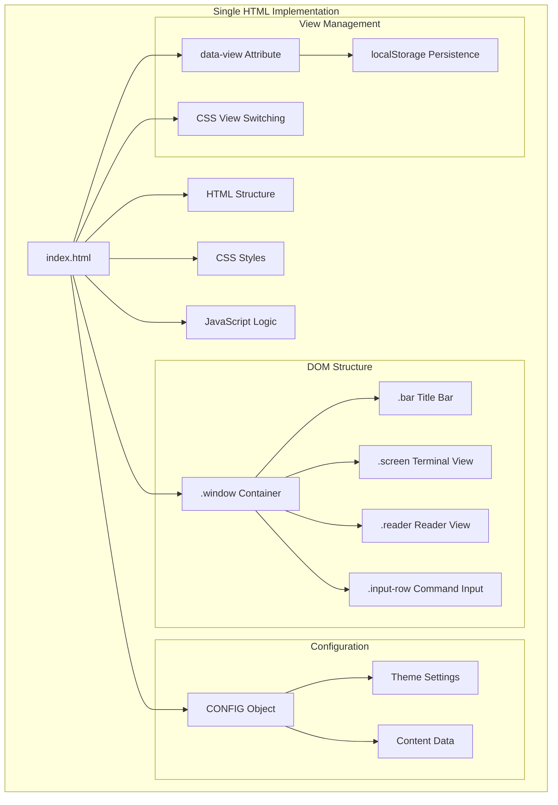

**Diagram sources**
- [index.html:2](file://index.html#L2)
- [index.html:427](file://index.html#L427)
- [index.html:448](file://index.html#L448)

**Section sources**
- [index.html:1-1682](file://index.html#L1-L1682)

## Core Components

### Dual View Architecture

The system implements a sophisticated dual-view architecture controlled by the `data-view` attribute on the root HTML element. This approach provides atomic view switching with CSS-based visibility management and maintains complete separation between terminal and reader content.

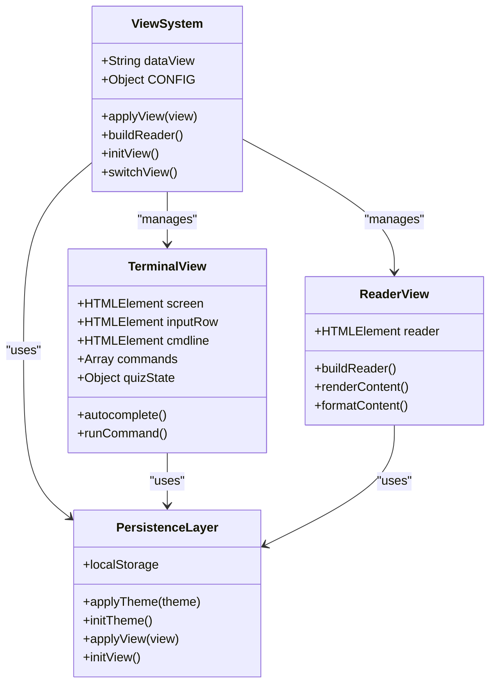

**Diagram sources**
- [index.html:657](file://index.html#L657)
- [index.html:591](file://index.html#L591)
- [index.html:577](file://index.html#L577)

### Data Model and Content Structure

The system uses a centralized CONFIG object that serves as the single source of truth for all content. This object contains structured data that powers both view modes through dedicated rendering functions.

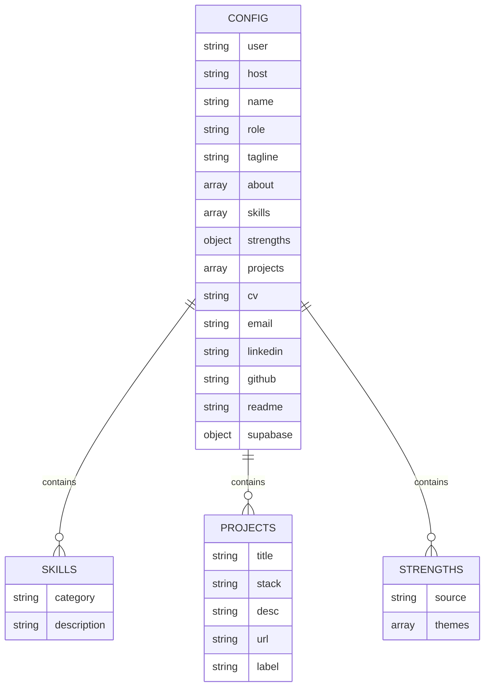

**Diagram sources**
- [index.html:453](file://index.html#L453)
- [index.html:464](file://index.html#L464)
- [index.html:485](file://index.html#L485)
- [index.html:472](file://index.html#L472)

**Section sources**
- [index.html:453-520](file://index.html#L453-L520)

## Architecture Overview

The dual-view architecture employs a data-driven approach where the CONFIG object serves as the central data source, and CSS-based view switching manages the presentation layer.

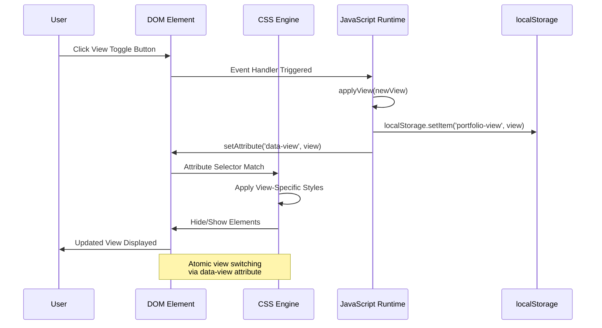

**Diagram sources**
- [index.html:657](file://index.html#L657)
- [index.html:664](file://index.html#L664)
- [index.html:669](file://index.html#L669)

The architecture leverages modern CSS selectors and the `:root` pseudo-class to achieve seamless view transitions without JavaScript DOM manipulation. The `data-view` attribute acts as a single source of truth for the current view state.

**Section sources**
- [index.html:2](file://index.html#L2)
- [index.html:275](file://index.html#L275)
- [index.html:657-671](file://index.html#L657-L671)

## Detailed Component Analysis

### Terminal View Implementation

The terminal view provides a fully interactive command-line interface with advanced features including autocomplete, fuzzy matching, command history, and specialized interactive experiences.

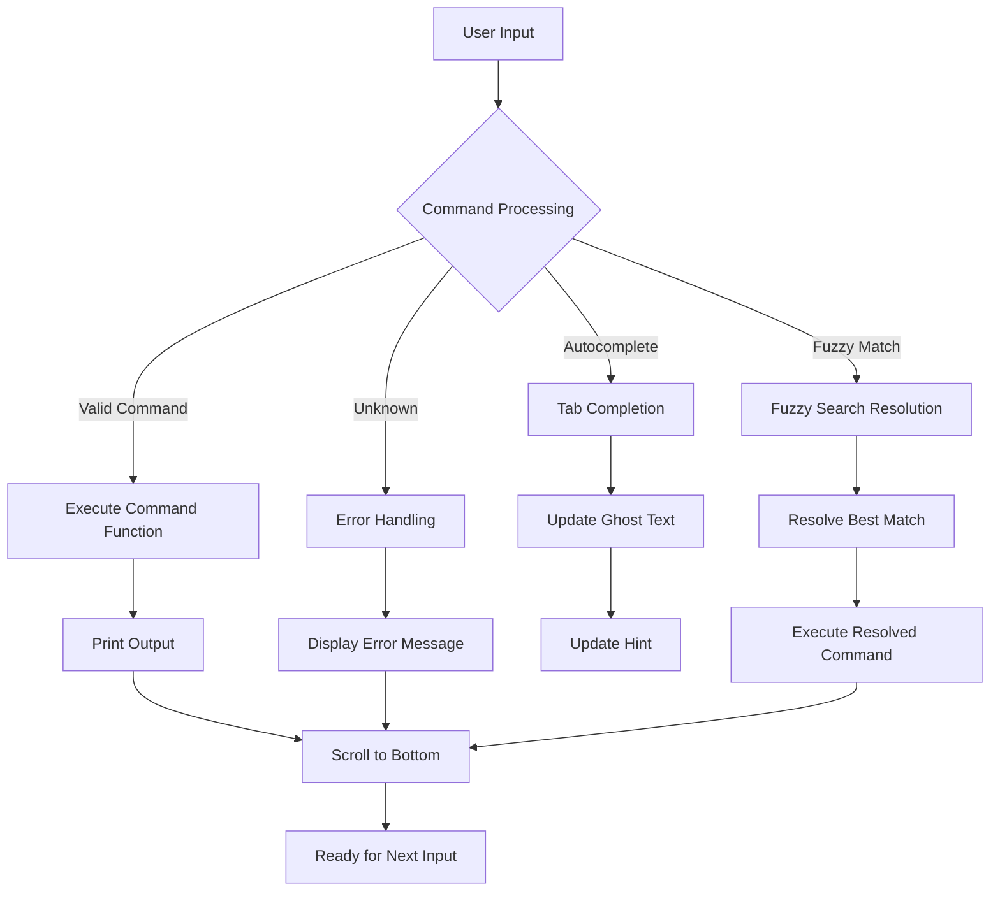

**Diagram sources**
- [index.html:1461](file://index.html#L1461)
- [index.html:1405](file://index.html#L1405)
- [index.html:1434](file://index.html#L1434)

#### Command System Architecture

The terminal implements a command registry pattern with support for both standard commands and easter egg commands. The system includes sophisticated parsing logic for handling multi-word commands and arguments.

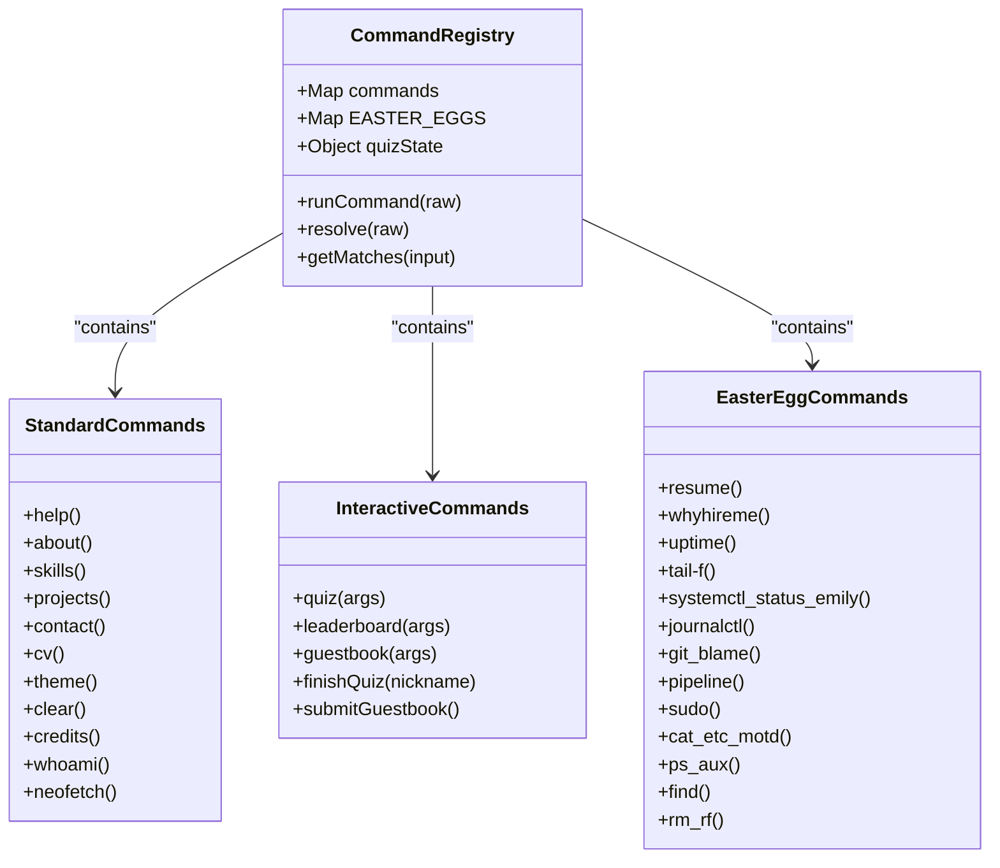

**Diagram sources**
- [index.html:692](file://index.html#L692)
- [index.html:825](file://index.html#L825)
- [index.html:1237](file://index.html#L1237)

#### Autocomplete and Fuzzy Matching System

The terminal includes an advanced autocomplete system with fuzzy matching capabilities that provides intelligent command suggestions based on user input patterns.

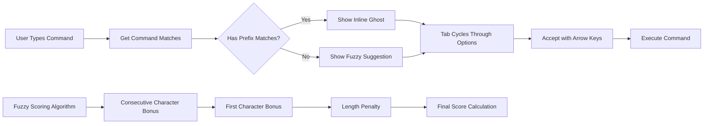

**Diagram sources**
- [index.html:1376](file://index.html#L1376)
- [index.html:1395](file://index.html#L1395)
- [index.html:1421](file://index.html#L1421)

**Section sources**
- [index.html:692-1234](file://index.html#L692-L1234)
- [index.html:1372-1486](file://index.html#L1372-L1486)

### Reader View Implementation

The reader view provides a clean, accessible, and printable layout that presents the same content as the terminal view but in a traditional web page format optimized for content consumption.

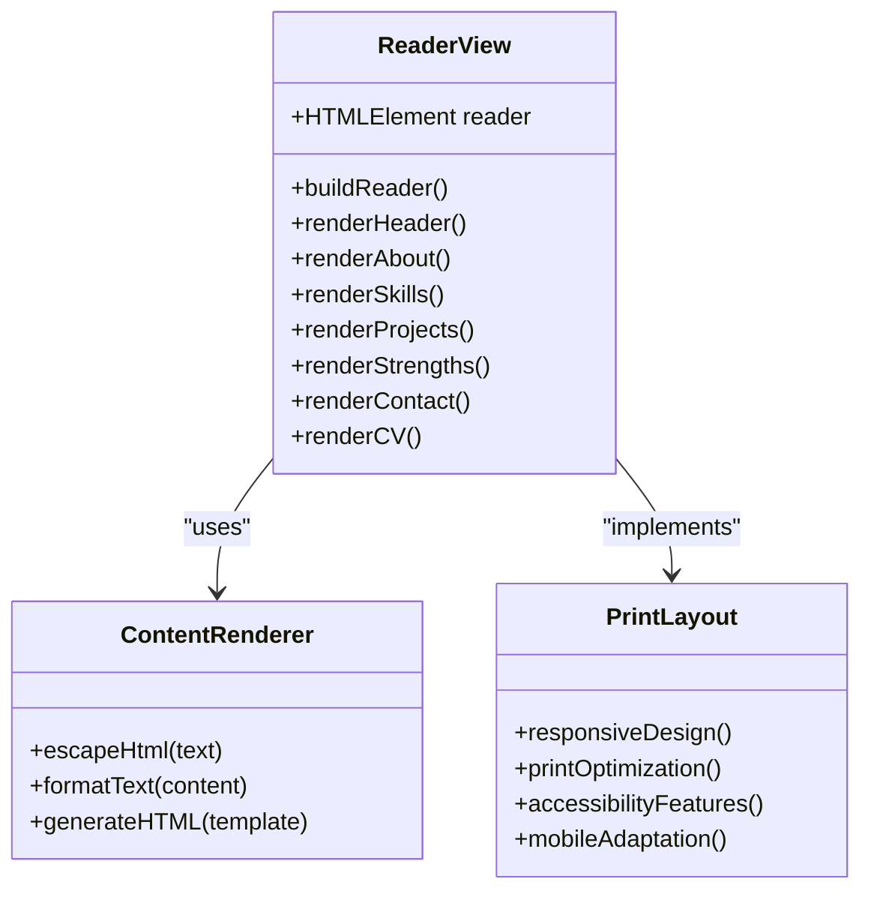

**Diagram sources**
- [index.html:591](file://index.html#L591)
- [index.html:266](file://index.html#L266)

#### Reader View Layout System

The reader view employs a sophisticated CSS layout system that adapts to different screen sizes while maintaining readability and accessibility standards.

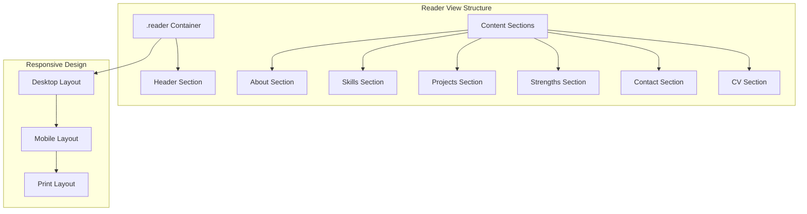

**Diagram sources**
- [index.html:266](file://index.html#L266)
- [index.html:350](file://index.html#L350)

**Section sources**
- [index.html:591-655](file://index.html#L591-L655)
- [index.html:266-425](file://index.html#L266-L425)

### View Switching Mechanism

The view switching system operates through a combination of CSS attribute selectors and JavaScript state management, providing smooth transitions between view modes.

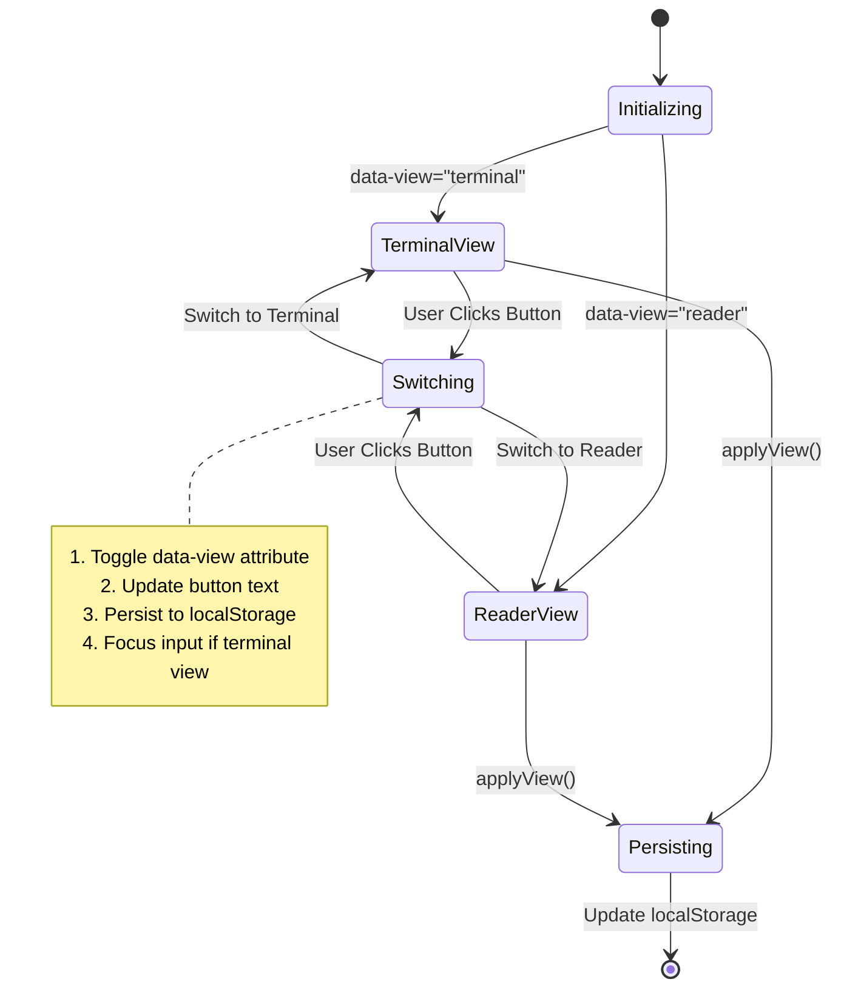

**Diagram sources**
- [index.html:657](file://index.html#L657)
- [index.html:664](file://index.html#L664)
- [index.html:669](file://index.html#L669)

#### CSS-Based View Management

The system uses CSS attribute selectors to control view visibility, eliminating the need for complex JavaScript DOM manipulation and providing atomic view switching.

```css
/* Terminal view shows screen and input, hides reader */
[data-view="terminal"] .reader { display: none; }

/* Reader view hides terminal elements */
[data-view="reader"] .screen,
[data-view="reader"] .input-row { display: none !important; }
```

This approach ensures that view switching occurs atomically and efficiently, with minimal reflow and repaint overhead.

**Section sources**
- [index.html:275-279](file://index.html#L275-L279)
- [index.html:657-671](file://index.html#L657-L671)

### Persistence and State Management

The system implements robust persistence mechanisms using localStorage to maintain user preferences across browser sessions while providing sensible defaults for first-time visitors.

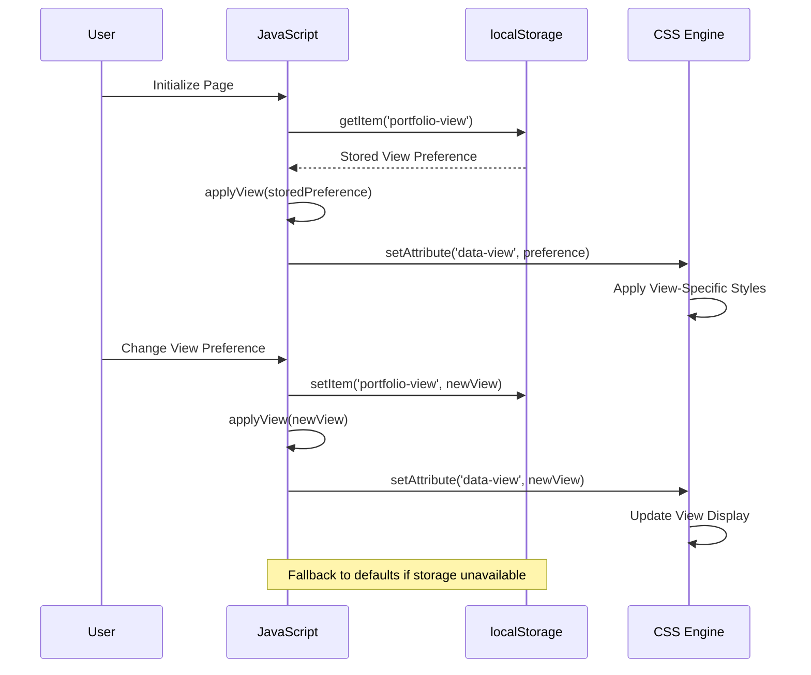

**Diagram sources**
- [index.html:664](file://index.html#L664)
- [index.html:657](file://index.html#L657)

#### Theme Persistence System

The theme system follows the same persistence pattern as the view system, maintaining user preference for dark or light mode across sessions.

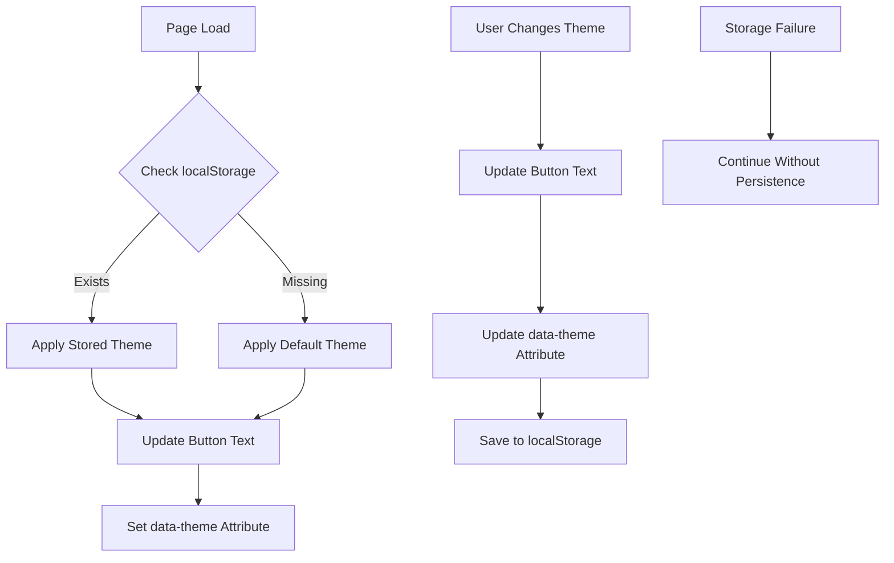

**Diagram sources**
- [index.html:577](file://index.html#L577)
- [index.html:583](file://index.html#L583)

**Section sources**
- [index.html:577-589](file://index.html#L577-L589)
- [index.html:657-671](file://index.html#L657-L671)

### Responsive Behavior and Cross-Browser Compatibility

The system implements comprehensive responsive design patterns that adapt to various screen sizes and device orientations while maintaining accessibility standards.

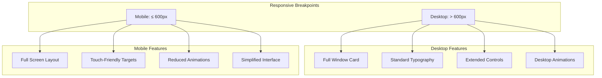

**Diagram sources**
- [index.html:371](file://index.html#L371)
- [index.html:350](file://index.html#L350)

#### Mobile Keyboard Handling

The system includes sophisticated mobile keyboard handling that addresses the challenges of viewport measurement inconsistencies across different browsers and devices.

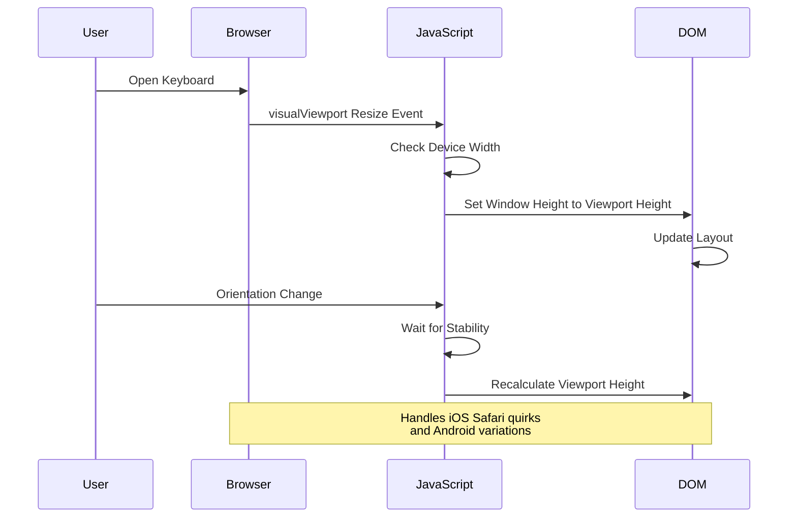

**Diagram sources**
- [index.html:1596](file://index.html#L1596)
- [index.html:1606](file://index.html#L1606)

**Section sources**
- [index.html:350-403](file://index.html#L350-L403)
- [index.html:1596-1617](file://index.html#L1596-L1617)

### Accessibility Considerations

The system incorporates numerous accessibility features to ensure the interface is usable by people with disabilities and meets modern web standards.

#### Semantic HTML Structure

The DOM uses semantic elements and proper labeling to enhance screen reader compatibility and keyboard navigation.

#### Color Contrast and Visual Design

The dual theme system provides sufficient color contrast ratios for both light and dark modes, with careful consideration for text readability and interactive element visibility.

#### Keyboard Navigation

The terminal view supports full keyboard navigation including command history traversal, autocomplete cycling, and form submission without mouse interaction.

#### Screen Reader Support

All interactive elements include appropriate ARIA attributes and labels to provide meaningful context to assistive technologies.

**Section sources**
- [index.html:427-446](file://index.html#L427-L446)
- [index.html:577-589](file://index.html#L577-L589)

## Dependency Analysis

The system maintains minimal external dependencies while leveraging modern browser APIs and standards.

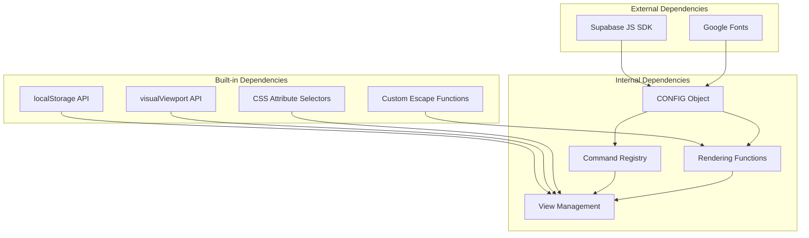

**Diagram sources**
- [index.html:10](file://index.html#L10)
- [index.html:427](file://index.html#L427)

### Data Flow Architecture

The system implements a unidirectional data flow pattern where the CONFIG object serves as the single source of truth, and view-specific rendering functions consume this data.

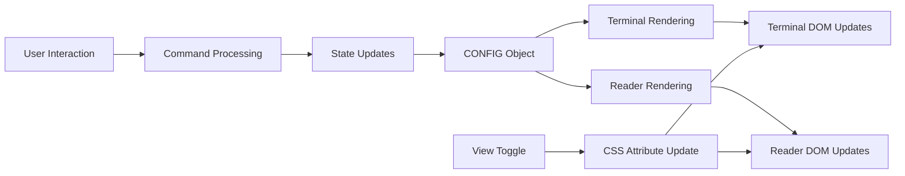

**Diagram sources**
- [index.html:453](file://index.html#L453)
- [index.html:591](file://index.html#L591)
- [index.html:657](file://index.html#L657)

**Section sources**
- [index.html:10](file://index.html#L10)
- [index.html:453-520](file://index.html#L453-L520)

## Performance Considerations

The system is optimized for performance through several key design decisions:

### Minimal Bundle Size
- Single HTML file with embedded CSS and JavaScript
- No build process or transpilation required
- Zero external dependencies except for optional Supabase integration

### Efficient DOM Manipulation
- CSS-based view switching reduces JavaScript DOM operations
- Batched updates for command output
- Optimized scrolling behavior for terminal content

### Memory Management
- Proper cleanup of intervals and event listeners
- Controlled memory usage for command history
- Efficient autocomplete caching

### Network Optimization
- Optional Supabase integration with proper error handling
- Preconnect hints for Google Fonts
- Minimal network requests

## Troubleshooting Guide

### Common Issues and Solutions

#### View Not Switching
- **Symptom**: Clicking the view toggle button has no effect
- **Cause**: localStorage persistence failure or CSS attribute selector issues
- **Solution**: Check browser storage permissions and verify CSS attribute selectors

#### Terminal Not Responding
- **Symptom**: Commands don't execute, input appears disabled
- **Cause**: JavaScript initialization errors or DOM element selection failures
- **Solution**: Verify element IDs exist and JavaScript executes without errors

#### Mobile Keyboard Issues
- **Symptom**: Input field hidden behind keyboard or incorrect viewport sizing
- **Cause**: Browser-specific visualViewport API behavior differences
- **Solution**: Ensure visualViewport API availability and handle fallback scenarios

#### Content Not Loading
- **Symptom**: Reader view appears empty or terminal view shows errors
- **Cause**: CONFIG object modification or Supabase integration issues
- **Solution**: Validate CONFIG structure and Supabase credentials if using interactive features

**Section sources**
- [index.html:530-544](file://index.html#L530-L544)
- [index.html:1596-1617](file://index.html#L1596-L1617)

## Conclusion

The dual-view architecture system successfully demonstrates how to create a versatile, user-friendly portfolio that adapts to different user preferences and contexts. By leveraging modern CSS techniques, the system achieves seamless view switching without compromising performance or accessibility.

The implementation showcases several key architectural patterns:

- **Single Source of Truth**: The CONFIG object maintains content consistency across both view modes
- **Atomic View Switching**: CSS attribute selectors enable efficient, flicker-free transitions
- **Progressive Enhancement**: Core functionality works without JavaScript, with enhancements for capable browsers
- **Accessibility-First Design**: Comprehensive support for assistive technologies and keyboard navigation
- **Mobile-First Approach**: Responsive design patterns that work across all device categories

The system's minimalist approach—single HTML file with embedded assets—provides excellent portability and deployment flexibility while maintaining sophisticated functionality. This architecture serves as an excellent example of how to balance feature richness with simplicity and performance.