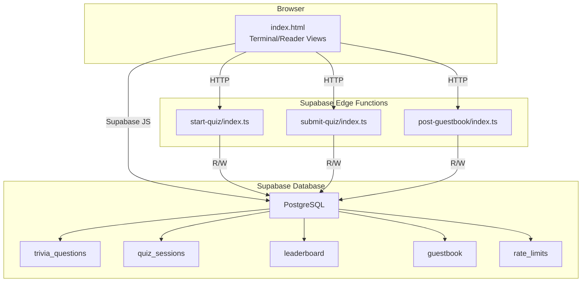
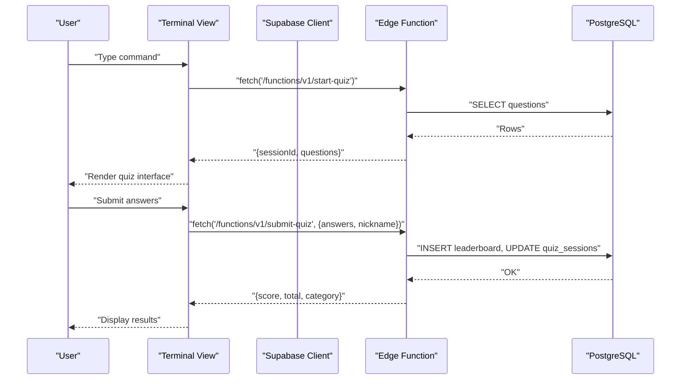
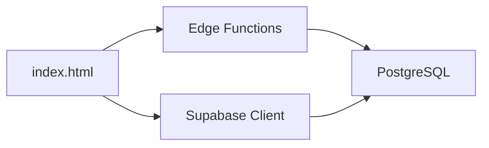

# Troubleshooting

<cite>
**Referenced Files in This Document**
- [index.html](file://index.html)
- [README.md](file://README.md)
- [post-guestbook/index.ts](file://supabase/functions/post-guestbook/index.ts)
- [start-quiz/index.ts](file://supabase/functions/start-quiz/index.ts)
- [submit-quiz/index.ts](file://supabase/functions/submit-quiz/index.ts)
- [20240101000000_init.sql](file://supabase/migrations/20240101000000_init.sql)
- [20240101000001_seed_questions.sql](file://supabase/migrations/20240101000001_seed_questions.sql)
</cite>

## Table of Contents
1. [Introduction](#introduction)
2. [Project Structure](#project-structure)
3. [Core Components](#core-components)
4. [Architecture Overview](#architecture-overview)
5. [Detailed Component Analysis](#detailed-component-analysis)
6. [Dependency Analysis](#dependency-analysis)
7. [Performance Considerations](#performance-considerations)
8. [Troubleshooting Guide](#troubleshooting-guide)
9. [Conclusion](#conclusion)
10. [Appendices](#appendices)

## Introduction
This document provides a comprehensive troubleshooting guide for the portfolio project. It covers browser compatibility issues, JavaScript execution errors, CSS rendering problems, Supabase connectivity issues, edge function failures, database query problems, debugging techniques for command parsing errors, state management issues, interactive feature malfunctions, performance problems, memory leaks, responsiveness issues, configuration errors, deployment failures, integration problems, mobile-specific issues, accessibility problems, cross-platform compatibility challenges, and logging/monitoring strategies for production environments.

## Project Structure
The project is a static HTML page with embedded JavaScript and CSS, plus Supabase edge functions and database migrations. The frontend is a single-page application with two views (terminal and reader), interactive commands, and integrations with Supabase for quizzes, leaderboards, and guestbook.

**Diagram sources**
- [index.html](file://index.html)
- [start-quiz/index.ts](file://supabase/functions/start-quiz/index.ts)
- [submit-quiz/index.ts](file://supabase/functions/submit-quiz/index.ts)
- [post-guestbook/index.ts](file://supabase/functions/post-guestbook/index.ts)
- [20240101000000_init.sql](file://supabase/migrations/20240101000000_init.sql)

**Section sources**
- [index.html](file://index.html)
- [README.md](file://README.md)

## Core Components
- Frontend (index.html): Terminal and reader views, command parser, autocomplete, quiz and guestbook flows, mobile viewport handling, theme switching, and reader view rendering.
- Supabase Edge Functions: start-quiz, submit-quiz, and post-guestbook handlers with validation, rate limiting, and database operations.
- Database Schema: trivia_questions, quiz_sessions, leaderboard, guestbook, and rate_limits with Row Level Security policies.

**Section sources**
- [index.html](file://index.html)
- [start-quiz/index.ts](file://supabase/functions/start-quiz/index.ts)
- [submit-quiz/index.ts](file://supabase/functions/submit-quiz/index.ts)
- [post-guestbook/index.ts](file://supabase/functions/post-guestbook/index.ts)
- [20240101000000_init.sql](file://supabase/migrations/20240101000000_init.sql)

## Architecture Overview
The application uses Supabase’s edge runtime for serverless functions and Supabase JS client for direct database reads/writes. The frontend communicates with edge functions via fetch and with the database via Supabase client. Edge functions enforce validation, rate limits, and write operations to the database.

**Diagram sources**
- [index.html](file://index.html)
- [start-quiz/index.ts](file://supabase/functions/start-quiz/index.ts)
- [submit-quiz/index.ts](file://supabase/functions/submit-quiz/index.ts)
- [20240101000000_init.sql](file://supabase/migrations/20240101000000_init.sql)

## Detailed Component Analysis

### Frontend JavaScript and CSS Troubleshooting
Common issues:
- Supabase initialization failure: Verify the anon key is set and not the placeholder value.
- Edge function calls failing: Check CORS headers and Authorization header.
- Quiz state not resetting: Ensure resetQuizState is invoked after completion or error.
- Mobile viewport issues: Confirm visual viewport listeners and dynamic height adjustments.
- Autocomplete and fuzzy matching: Validate command names and ghost/hint updates.

Diagnostic steps:
- Open browser DevTools and check Console for errors.
- Inspect Network tab for failed fetch requests to edge functions.
- Verify Supabase client creation and availability.
- Test localStorage persistence for theme and view modes.
- Validate CSS variables and media queries for responsive behavior.

**Section sources**
- [index.html](file://index.html)

### Edge Functions Troubleshooting
Common issues:
- Validation failures: Incorrect nickname length/format, invalid answers count, or malformed request bodies.
- Rate limit exceeded: Too many submissions or posts per time window.
- Database errors: Missing tables, missing rows, or permission issues.
- CORS errors: Missing Access-Control-Allow-Origin headers.

Diagnostic steps:
- Review function logs in Supabase Dashboard.
- Validate environment variables (SUPABASE_URL, SUPABASE_SERVICE_ROLE_KEY).
- Check request payloads and headers.
- Confirm database policies and indexes are applied.

**Section sources**
- [post-guestbook/index.ts](file://supabase/functions/post-guestbook/index.ts)
- [start-quiz/index.ts](file://supabase/functions/start-quiz/index.ts)
- [submit-quiz/index.ts](file://supabase/functions/submit-quiz/index.ts)

### Database Schema and Queries Troubleshooting
Common issues:
- Missing tables or policies: Ensure migrations ran successfully.
- Missing seed data: Populate trivia_questions with seed data.
- Indexes missing: Confirm indexes exist for ranking and lookups.
- RLS policies blocking access: Verify policies for public reads and service-role inserts.

Diagnostic steps:
- Run migrations locally and verify schema.
- Seed trivia_questions after schema creation.
- Check leaderboard ordering and rate limit queries.
- Validate quiz_sessions and guestbook queries.

**Section sources**
- [20240101000000_init.sql](file://supabase/migrations/20240101000000_init.sql)
- [20240101000001_seed_questions.sql](file://supabase/migrations/20240101000001_seed_questions.sql)

## Dependency Analysis
- Frontend depends on Supabase JS client and edge functions.
- Edge functions depend on Supabase client and environment variables.
- Database depends on migrations and policies.

**Diagram sources**
- [index.html](file://index.html)
- [start-quiz/index.ts](file://supabase/functions/start-quiz/index.ts)
- [submit-quiz/index.ts](file://supabase/functions/submit-quiz/index.ts)
- [post-guestbook/index.ts](file://supabase/functions/post-guestbook/index.ts)
- [20240101000000_init.sql](file://supabase/migrations/20240101000000_init.sql)

**Section sources**
- [index.html](file://index.html)
- [start-quiz/index.ts](file://supabase/functions/start-quiz/index.ts)
- [submit-quiz/index.ts](file://supabase/functions/submit-quiz/index.ts)
- [post-guestbook/index.ts](file://supabase/functions/post-guestbook/index.ts)
- [20240101000000_init.sql](file://supabase/migrations/20240101000000_init.sql)

## Performance Considerations
- Minimize DOM updates: Batch appends and use requestAnimationFrame for animations.
- Debounce input: Throttle autocomplete updates.
- Optimize CSS: Avoid expensive repaints; prefer transform/opacity for animations.
- Lazy-load images: Defer avatar loading until needed.
- Reduce network requests: Cache edge function responses where appropriate.
- Monitor memory: Avoid retaining references to removed DOM nodes.

[No sources needed since this section provides general guidance]

## Troubleshooting Guide

### Browser Compatibility Issues
Symptoms:
- CSS not rendering correctly on older browsers.
- JavaScript features unsupported (e.g., crypto.subtle.digest, fetch, localStorage).
- Mobile viewport not resizing properly.

Resolutions:
- Polyfill missing APIs (e.g., Web Crypto API) if needed.
- Replace unsupported features with compatible alternatives.
- Ensure viewport meta tag is present and correct.
- Test on target devices and adjust media queries.

**Section sources**
- [index.html](file://index.html)

### JavaScript Execution Errors
Symptoms:
- “Cannot read property of undefined” errors.
- Supabase client creation fails.
- Autocomplete not working.

Resolutions:
- Verify CONFIG.supabase fields are set and valid.
- Check that Supabase client is initialized before use.
- Validate command names and fuzzy matching logic.
- Ensure event listeners are attached after DOMContentLoaded.

**Section sources**
- [index.html](file://index.html)

### CSS Rendering Problems
Symptoms:
- Elements not visible or misplaced.
- Scrollbars not styled.
- Responsive layout breaks on small screens.

Resolutions:
- Validate CSS variables and custom properties.
- Check media queries and breakpoints.
- Ensure scrollbar styles are applied consistently.
- Test with reduced motion and high contrast settings.

**Section sources**
- [index.html](file://index.html)

### Supabase Connectivity Issues
Symptoms:
- Supabase client initialization fails.
- Edge function calls return CORS errors.
- Database queries fail with permission errors.

Resolutions:
- Verify Supabase URL and anon key in CONFIG.
- Confirm edge functions are deployed and reachable.
- Check Supabase project settings and API keys.
- Validate RLS policies and service role key for server-side operations.

**Section sources**
- [index.html](file://index.html)
- [20240101000000_init.sql](file://supabase/migrations/20240101000000_init.sql)

### Edge Function Failures
Symptoms:
- 400 Bad Request for malformed payloads.
- 429 Too Many Requests due to rate limits.
- 500 Internal Server Error for database errors.

Resolutions:
- Validate request body shape and required fields.
- Implement client-side rate limiting awareness.
- Check function logs for stack traces.
- Ensure environment variables are set in Supabase.

**Section sources**
- [post-guestbook/index.ts](file://supabase/functions/post-guestbook/index.ts)
- [start-quiz/index.ts](file://supabase/functions/start-quiz/index.ts)
- [submit-quiz/index.ts](file://supabase/functions/submit-quiz/index.ts)

### Database Query Problems
Symptoms:
- Missing tables or rows.
- Leaderboard sorting incorrect.
- Rate limit queries failing.

Resolutions:
- Apply migrations and seed data.
- Verify indexes exist for ranking and lookups.
- Check RLS policies for public reads.
- Confirm quiz_sessions and guestbook queries return expected data.

**Section sources**
- [20240101000000_init.sql](file://supabase/migrations/20240101000000_init.sql)
- [20240101000001_seed_questions.sql](file://supabase/migrations/20240101000001_seed_questions.sql)

### Debugging Techniques for Command Parsing Errors
Symptoms:
- Typo-tolerant commands not resolving.
- Autocomplete not suggesting commands.
- Tab completion not cycling.

Resolutions:
- Inspect fuzzyScore and getMatches logic.
- Verify COMMANDS list and EASTER_EGGS mapping.
- Check event handlers for keydown and input.
- Use console logs to trace command resolution flow.

**Section sources**
- [index.html](file://index.html)

### State Management Issues
Symptoms:
- Quiz state not resetting after completion.
- Guestbook signing flow stuck.
- Tail -f animation not stopping.

Resolutions:
- Ensure resetQuizState is called after success or error.
- Clear intervals and reset state variables.
- Validate quizState transitions and guards.

**Section sources**
- [index.html](file://index.html)

### Interactive Feature Malfunctions
Symptoms:
- Quiz not starting or not progressing.
- Leaderboard not displaying scores.
- Guestbook not saving entries.

Resolutions:
- Check edge function responses and error handling.
- Validate Supabase client usage for direct queries.
- Confirm Supabase initialization and keys.

**Section sources**
- [index.html](file://index.html)

### Performance Problems, Memory Leaks, and Responsiveness Issues
Symptoms:
- Slow command execution.
- Stuttering animations.
- Memory growth over time.

Resolutions:
- Profile with browser DevTools Performance panel.
- Avoid unnecessary DOM reflows and repaints.
- Cancel intervals and clear timeouts on state changes.
- Debounce heavy operations like autocomplete.

**Section sources**
- [index.html](file://index.html)

### Configuration Errors
Symptoms:
- Placeholder keys shown in UI.
- Edge functions unreachable.
- Reader view not rendering.

Resolutions:
- Replace placeholder keys in CONFIG with real values.
- Verify edge function URLs and CORS headers.
- Check buildReader function and escapeHtml usage.

**Section sources**
- [index.html](file://index.html)

### Deployment Failures and Integration Problems
Symptoms:
- Edge functions not deploying.
- Migrations failing.
- Cross-origin errors.

Resolutions:
- Use Supabase CLI to deploy functions and push DB changes.
- Validate environment variables in Supabase Dashboard.
- Check CORS headers in edge functions.
- Ensure migrations are applied in order.

**Section sources**
- [README.md](file://README.md)
- [start-quiz/index.ts](file://supabase/functions/start-quiz/index.ts)
- [submit-quiz/index.ts](file://supabase/functions/submit-quiz/index.ts)
- [post-guestbook/index.ts](file://supabase/functions/post-guestbook/index.ts)

### Mobile-Specific Issues
Symptoms:
- Keyboard overlaps input field.
- Viewport height incorrect.
- Touch targets too small.

Resolutions:
- Use visual viewport listener to adjust window height.
- Ensure safe-area insets are considered.
- Increase tap target sizes for buttons and chips.

**Section sources**
- [index.html](file://index.html)

### Accessibility Problems
Symptoms:
- Screen reader not announcing content.
- Low contrast text.
- Focus not managed properly.

Resolutions:
- Add ARIA labels and roles where appropriate.
- Ensure sufficient color contrast.
- Manage focus order and trap focus when needed.

**Section sources**
- [index.html](file://index.html)

### Cross-Platform Compatibility Challenges
Symptoms:
- Different behavior on iOS vs Android.
- Variations in viewport units.
- Differences in input behaviors.

Resolutions:
- Test across major browsers and OS versions.
- Use visual viewport API for dynamic sizing.
- Normalize input behaviors with polyfills if needed.

**Section sources**
- [index.html](file://index.html)

### Logging Strategies and Monitoring Approaches
- Frontend: Use console.log and structured logs; capture unhandled errors; instrument Supabase client calls.
- Edge Functions: Log request metadata, validation outcomes, and database operations; handle and return meaningful error responses.
- Database: Monitor slow queries and missing indexes; track rate limit violations.
- Production: Set up Supabase logs and dashboard alerts; use external monitoring for latency and error rates.

**Section sources**
- [index.html](file://index.html)
- [post-guestbook/index.ts](file://supabase/functions/post-guestbook/index.ts)
- [start-quiz/index.ts](file://supabase/functions/start-quiz/index.ts)
- [submit-quiz/index.ts](file://supabase/functions/submit-quiz/index.ts)

## Conclusion
This guide consolidates practical troubleshooting steps for the portfolio project across frontend, backend, and database layers. By systematically validating configurations, checking network and database connectivity, inspecting logs, and applying performance best practices, most issues can be identified and resolved efficiently. Regular monitoring and testing across browsers and devices will help maintain reliability and user experience.

[No sources needed since this section summarizes without analyzing specific files]

## Appendices

### Quick Checklist
- Verify Supabase keys and URLs in CONFIG.
- Confirm edge functions are deployed and reachable.
- Ensure migrations and seed data are applied.
- Test on target browsers and devices.
- Monitor logs and error rates in production.

[No sources needed since this section provides general guidance]